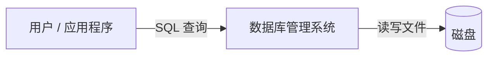
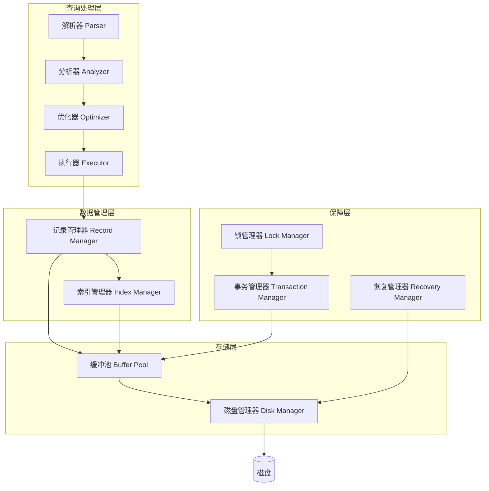

# 01. 什么是数据库管理系统

## 从一个问题出发

假设你需要写一个程序来管理学校所有学生的信息——学号、姓名、年龄、成绩。最简单的做法是什么？

很多人的第一反应是：用文件存。比如一个 CSV 文件 `students.csv`：

```
stu_id,name,age,score
2024001,张三,20,85.5
2024002,李四,21,90.0
2024003,王五,19,78.5
```

程序直接读写这个文件，看似很简单。但随着需求增长，问题会层出不穷：

- **并发问题**：两个管理员同时修改学生信息，文件可能被写坏
- **查询效率**：想找"年龄大于 20 且成绩超过 85 的学生"，每次都要遍历整个文件
- **数据安全**：程序写到一半断电了，文件数据可能丢失或损坏
- **一致性**：学生退学了，需要在多个文件（成绩文件、选课文件、宿舍文件）中同时删除

**数据库管理系统（DBMS，Database Management System）** 就是为解决这些问题而生的。

## DBMS 是什么

简单说：DBMS 是一个帮助你**存储、查询、管理**数据的软件系统。它向上提供简洁的查询接口（比如 SQL），向下管理磁盘上的数据文件，在中间处理并发、安全、恢复等一系列复杂问题。



DBMS 的核心职责可以概括为四个方面：

| 职责 | 说明 | 对应问题 |
|------|------|----------|
| **数据存储** | 高效地在磁盘上组织数据 | 数据怎么存？怎么快速找到？ |
| **查询处理** | 将用户请求（SQL）翻译成实际的数据操作 | 怎么写都能高效执行？ |
| **事务管理** | 保证并发操作下数据的一致性 | 两个人同时改一条记录怎么办？ |
| **故障恢复** | 崩溃后能将数据恢复到一致状态 | 写到一半断电了怎么办？ |

## 关系型 vs 非关系型

DBMS 分为两大类：

- **关系型 DBMS（RDBMS）**：数据以"表"（Table）的形式组织，表之间可以有关联（Relation）。典型代表：MySQL、PostgreSQL。
- **非关系型 DBMS（NoSQL）**：数据以键值对、文档、图等形式组织。典型代表：MongoDB、Redis。

**RMDB 是一个关系型 DBMS**。"RM" 即 Relational Model（关系模型）。

> **关键理解**：在关系型数据库中，"关系"（Relation）本质上就是一张**表**。表中的每一行叫**元组**（Tuple），每一列叫**属性**（Attribute）。这些术语后文中会频繁出现。

## 一个 DBMS 内部长什么样

任何 DBMS，无论大小，内部结构大致如下：



数据流向：查询从上到下穿过各层，最终落到磁盘上。

- **查询处理层**：理解用户要什么
- **数据管理层**：组织数据怎么存
- **存储层**：管理内存和磁盘之间的数据搬运
- **保障层**：确保并发安全和故障恢复

RMDB 严格遵循这套经典架构。下一节就来看看 RMDB 的具体模块划分。

---

## 补充说明

- **什么是元组（Tuple）？** 数据库中一行记录，比如一个学生的完整信息，就是一个元组。在 RMDB 代码中，用 `RmRecord` 类表示。
- **什么是"页"（Page）？** 磁盘和内存之间交换数据的最小单位。通常一页包含多条记录。在 RMDB 中页面大小默认 4KB（4096 字节），定义在 `src/common/config.h:38`。
