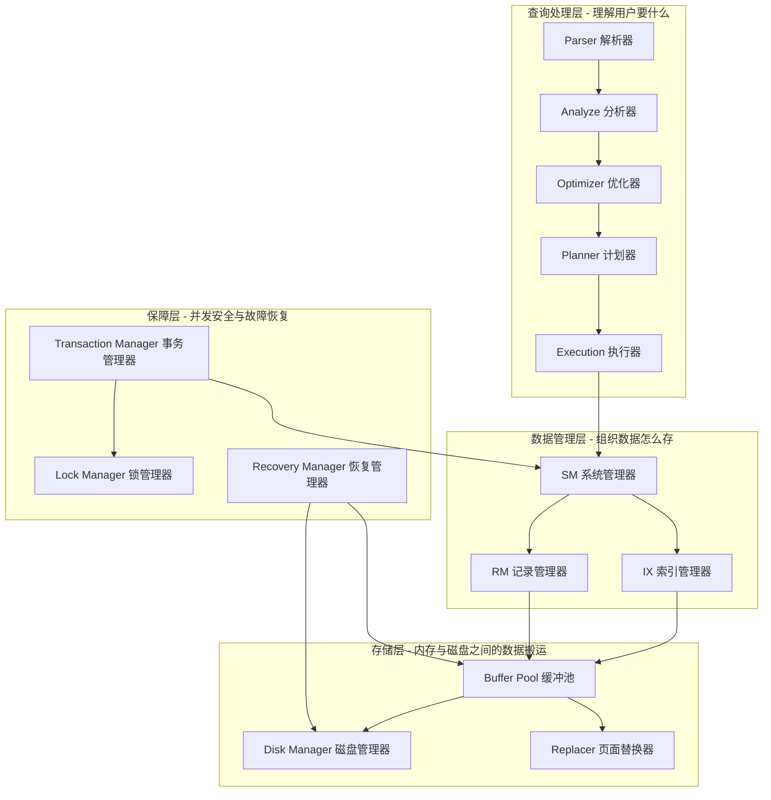
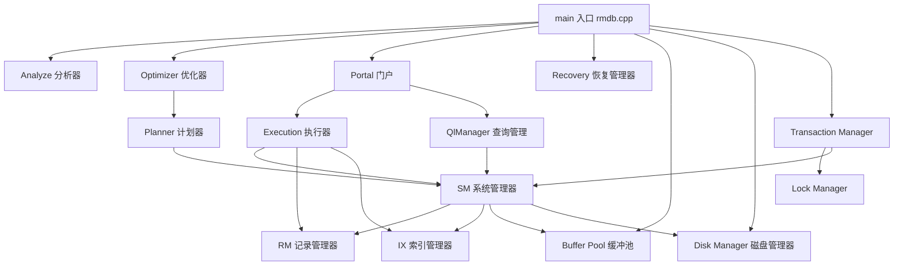

# 02. RMDB 分层架构

## 整体概览

RMDB 采用经典的分层架构，从上到下分为多个模块。每个模块负责独立的职责，模块之间通过明确的接口协作。



## 各模块职责一览

### 查询处理层

| 模块 | 目录 | 职责 | 一句话 |
|------|------|------|--------|
| **Parser**（解析器） | `src/parser/` | 将 SQL 文本转换为抽象语法树（AST） | "读懂 SQL 字符串" |
| **Analyze**（分析器） | `src/analyze/` | 语义分析：检查表名、列名是否存在，类型是否匹配 | "检查 SQL 是否合法有效" |
| **Optimizer**（优化器） | `src/optimizer/` | 接收 Query，判断 SQL 类型，分发到对应处理逻辑 | "SQL 分类调度" |
| **Planner**（计划器） | `src/optimizer/` | 根据 Query 生成查询执行计划（Plan 树） | "制定执行方案" |
| **Execution**（执行器） | `src/execution/` | 按照计划执行具体的数据操作（扫描、连接、排序、聚合等） | "真正干活" |

### 数据管理层

| 模块 | 目录 | 职责 | 一句话 |
|------|------|------|--------|
| **SM**（System Manager，系统管理器） | `src/system/` | 管理数据库和表的元数据（有哪些表、表有哪些列），执行 DDL | "管家：知道所有表在哪" |
| **RM**（Record Manager，记录管理器） | `src/record/` | 管理表中的记录：增删改查单条记录，维护页面内的空闲空间 | "管记录的" |
| **IX**（Index Manager，索引管理器） | `src/index/` | 管理 B+ 树索引：加速数据查找 | "管索引的" |

### 存储层

| 模块 | 目录 | 职责 | 一句话 |
|------|------|------|--------|
| **Disk Manager**（磁盘管理器） | `src/storage/disk_manager.cpp` | 在磁盘上分配和读写数据库文件 | "读写磁盘" |
| **Buffer Pool**（缓冲池） | `src/storage/buffer_pool_*.cpp` | 在内存中缓存磁盘页，减少磁盘 I/O | "内存缓存" |
| **Replacer**（页面替换器） | `src/replacer/` | 当缓冲池满了，决定淘汰哪个页面（LRU 算法） | "淘汰旧页" |

### 保障层

| 模块 | 目录 | 职责 | 一句话 |
|------|------|------|--------|
| **Transaction Manager**（事务管理器） | `src/transaction/` | 管理事务的开启、提交、回滚，保证 ACID | "管事务的" |
| **Lock Manager**（锁管理器） | `src/transaction/concurrency/` | 提供行级、表级锁，控制并发访问 | "管锁的" |
| **Recovery Manager**（恢复管理器） | `src/recovery/` | 崩溃后的数据恢复（日志重放） | "崩溃恢复" |

## 模块之间的依赖关系

理解模块之间的"谁依赖谁"非常关键：



关键依赖关系说明：

- **SM 是核心枢纽**：它持有 `DiskManager`、`BufferPoolManager`、`RmManager`、`IxManager` 的指针，几乎所有上层组件都依赖它
- **Portal 是执行入口**：将 Plan 转换为可执行的算子（Executor）树，然后交给 `QlManager` 运行
- **底层向上层透明**：执行器不需要知道数据具体在磁盘哪个扇区——它通过 RM/IX 操作记录，RM/IX 通过 Buffer Pool 读写页面

## 层间对接

> **第一次阅读提示**：本节信息密集，涉及很多还未学到的模块名和方法名。第一遍只需了解"层与层之间通过构造函数注入指针来对接"这个核心思想即可。学到具体章节时再回头对照,会越来越清晰。

上面用 mermaid 图展示了"谁依赖谁"，但光有箭头不够。下面用具体的源码接口说明层与层之间**到底通过什么成员变量、什么方法调用、传递什么类型的数据**对接在一起。

### 查询处理层 → 数据管理层

**Executor → SM**

Executor（执行器）需要知道表的元数据——表有哪些列、每列什么类型和长度。这个信息通过 `SmManager*` 获取：

```
Executor 构造函数接收 sm_manager 指针
  │
  ├─ sm_manager_->db_.get_table(tab_name_)     → 返回 TabMeta&        (表的列信息)
  │                                              system/sm_meta.h
  ├─ sm_manager_->fhs_.at(tab_name_).get()      → 返回 RmFileHandle*  (表的记录文件句柄)
  │                                              system/sm_manager.h:31
  └─ sm_manager_->ihs_[ix_name].get()           → 返回 IxIndexHandle* (索引文件句柄)
                                                 system/sm_manager.h:33
```

> 源码示例：`executor_seq_scan.h` 的 `SeqScanExecutor` 构造函数中，`sm_manager_->db_.get_table(tab_name_)` 和 `sm_manager_->fhs_.at(tab_name_).get()` 就是典型的对接调用。

**Analyze → SM**

语义分析器在检查"表名是否存在"、"列名是否匹配"时，同样依赖 `SmManager*`：

```
Analyze 持有 SmManager* sm_manager_           ← analyze/analyze.h:64
  │
  └─ sm_manager_->db_.get_table(tab_name)      → 验证表存在性，获取列信息
```

**Planner → SM**

查询计划器在生成 Plan 时需要知道表的元数据（有哪些索引、列类型等）：

```
Planner 持有 SmManager* sm_manager_            ← optimizer/planner.h:36
  │
  ├─ sm_manager_->db_.get_table(...)           → 获取表结构
  └─ sm_manager_->ihs_                         → 遍历索引信息来决定是否走索引扫描
```

### 数据管理层 → 存储层

**RM → Buffer Pool → Disk Manager**

这是整个系统最核心的数据访问链路，三层通过指针串联：

```
RmFileHandle 成员变量（record/rm_file_handle.h:61-62）:
  DiskManager* disk_manager_
  BufferPoolManager* buffer_pool_manager_

RMOerHandle 构造时（rm_file_handle.h:76）:
  disk_manager_->read_page(fd, RM_FILE_HDR_PAGE, ...)  → 直接从磁盘读文件头

RmFileHandle 运行时（rm_file_handle.h:111）:
  fetch_page_handle(page_no)                            → 内部调用 buffer_pool_manager_->fetch_page()
                                                          返回 Page* 指针，封装为 RmPageHandle
```

调用链类型流转：

```
RmFileHandle::fetch_page_handle(int page_no)
  │  输入: page_no (int, 页号)
  │
  ▼
BufferPoolManager::fetch_page(PageId page_id)
  │  输入: PageId{fd, page_no}
  │  查 page_table_ 哈希表，命中则直接返回 Page*
  │  未命中: disk_manager_->read_page(fd, page_no, ...)
  │  输出: Page*  (storage/page.h)
  │
  ▼
DiskManager::read_page(int fd, page_id_t page_no, char* data, int num_bytes)
  │  输入: fd (文件描述符), page_no (页号)
  │  lseek + read 系统调用，从 .db 文件读取 4KB 数据
  │  输出: 数据写入 char* data 缓冲区
```

> 源码示例：`RmFileHandle` 构造函数（`rm_file_handle.h:68-81`）初始化时直接调用 `disk_manager_->read_page()` 读文件头；`fetch_page_handle()` 通过 `buffer_pool_manager_->fetch_page()` 获取页面。

**IX → Buffer Pool → Disk Manager**

索引层的对接与 RM 完全对称：

```
IxIndexHandle 成员变量（index/ix_index_handle.h）:
  DiskManager* disk_manager_
  BufferPoolManager* buffer_pool_manager_

IxIndexHandle::fetch_node(int page_no)
  │  输入: page_no
  │  内部: buffer_pool_manager_->fetch_page({fd, page_no})
  │  输出: 将 Page* 封装为 IxNodeHandle
```

### 保障层 → 数据管理层

**Transaction Manager → SM + Lock Manager**

事务管理器在开启事务时需要访问系统元数据，并协调锁：

```
TransactionManager 成员（transaction/transaction_manager.h）:
  LockManager* lock_manager_       → 加锁/解锁
  SmManager* sm_manager_           → 访问表、索引的元数据

Transaction::begin() → txn_manager->begin()
  │  创建事务对象，分配事务 ID
  │  涉及锁的初始化
  ▼
Transaction::commit() → txn_manager->commit()
  │  释放锁: lock_manager_->unlock_all(txn)
  │  刷写日志: log_manager_->flush_log_to_disk()
  │  释放写集: txn->write_set_.clear()
```

**Recovery → Buffer Pool + Disk Manager + SM**

恢复管理器在启动时重放日志，需要访问所有底层组件：

```
RecoveryManager 成员（recovery/log_recovery.h）:
  DiskManager* disk_manager_
  BufferPoolManager* buffer_pool_manager_
  SmManager* sm_manager_
  LogManager* log_manager_
  TransactionManager* txn_manager_

恢复流程: analyze → redo → undo（每一步都通过上述指针操作底层数据）
```

### 对接全景一览

```
查询处理层
  Analyze ──SmManager*──→ SM
  Planner ──SmManager*──→ SM
  Executor ─SmManager*──→ SM ──RmManager*──→ RM ──BufferPoolManager*──→ BP ──DiskManager*──→ Disk
            \             \                 \                           \
             \             \                 \                           Replacer
              \             \                 IxManager*──→ IX ──BufferPoolManager*──→ BP
               \             \
                \             fhs_[tab].get() → RmFileHandle*  (记录文件句柄)
                 \            ihs_[ix].get()  → IxIndexHandle* (索引文件句柄)
                  \
                   QlManager ──SmManager*──→ SM
                                TransactionManager*──→ TM ──LockManager*

保障层
  TM ──SmManager*──→ SM
  Recovery ──Disk*, BP*, SM*, Log*, TM*──→ 所有底层
```

每一层的对接方式都是**构造函数注入指针**——上层对象在创建时接收下层对象的指针并存为成员变量，运行时通过指针调用下层方法。这就是整个系统的"神经系统"。

## 管理与执行分离

在 `rmdb.cpp:45-67`（`main` 函数中），可以看到所有管理器对象的创建：

| 变量名 | 类型 | 职责 |
|--------|------|------|
| `disk_manager` | `DiskManager` | 管理磁盘文件 |
| `log_manager` | `LogManager` | 管理 WAL 日志 |
| `buffer_pool_manager` | `BufferPoolManager` | 管理缓冲池 |
| `rm_manager` | `RmManager` | 记录管理 |
| `ix_manager` | `IxManager` | 索引管理 |
| `sm_manager` | `SmManager` | 系统管理（元数据中枢） |
| `lock_manager` | `LockManager` | 锁管理 |
| `txn_manager` | `TransactionManager` | 事务管理 |
| `planner` | `Planner` | 查询计划生成 |
| `optimizer` | `Optimizer` | 查询优化 |
| `ql_manager` | `QlManager` | 查询语言执行 |
| `recovery` | `RecoveryManager` | 崩溃恢复 |
| `portal` | `Portal` | 执行门户 |
| `analyze` | `Analyze` | 语义分析 |

> **注意**：`manager` 是持有全局资源的对象（如缓冲池、磁盘连接），而 `planner`/`optimizer`/`portal`/`analyze` 是每次查询都会调用的处理对象。

## 项目源代码目录映射

实际的目录结构如下：

```
src/
├── rmdb.cpp               # 程序入口，初始化所有管理器，启动服务器
├── defs.h                 # 基础类型定义：Rid（记录位置）、ColType（列类型）
├── errors.h               # 异常类型定义
├── portal.h               # Portal：将 Plan 转换为 Executor 树并执行
│
├── parser/                # 解析器：SQL 文本 → AST（使用 flex/bison）
├── analyze/               # 分析器：AST → Query（语义检查）
├── optimizer/             # 优化器 + 计划器：Query → Plan
├── execution/             # 执行器：执行各种算子（扫描、连接、排序、聚合等）
│
├── system/                # SM：元数据管理、DDL 执行
├── record/                # RM：记录增删改查
├── index/                 # IX：B+ 树索引
│
├── storage/               # 缓冲池 + 磁盘管理器 + 页面定义
├── replacer/              # LRU 页面替换算法
│
├── transaction/           # 事务管理 + 锁管理
├── recovery/              # 崩溃恢复（WAL 日志重放）
│
├── common/                # 公共配置（页面大小、缓冲区大小等）
└── tests/                 # 单元测试
```

---

下一节：[03. SQL 执行全流程](./03-sql-execution-flow.md) 将串联所有模块，看一条 SQL 在 RMDB 中的完整旅行。
