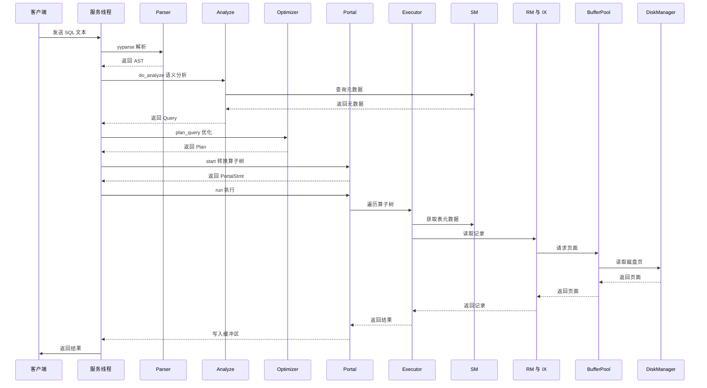
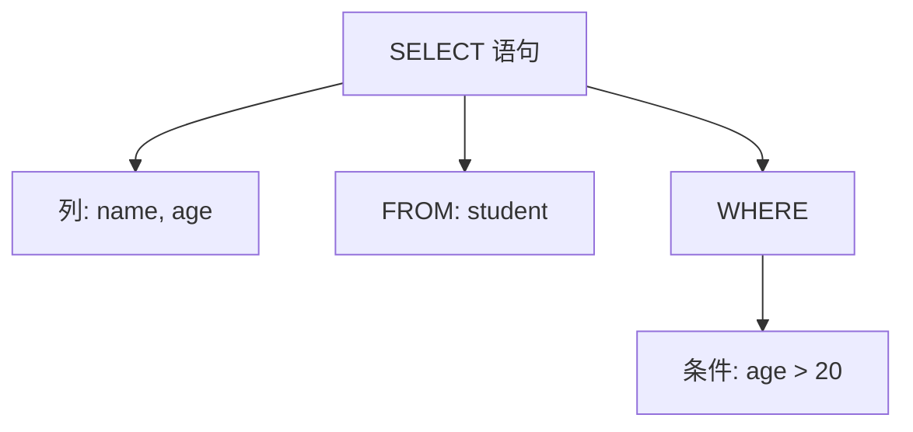
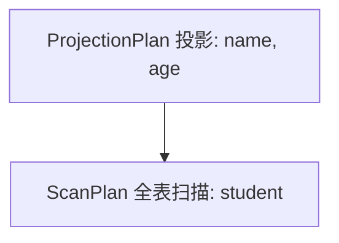
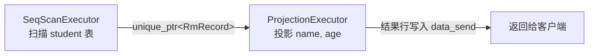

# 03. SQL 执行全流程

## 概述

这是理解 RMDB 最关键的一节：**一条 SQL 语句从输入到返回结果，在系统内部到底经历了什么？**

理解了这个流程，你就把前面学到的所有模块都"串"起来了。

## 数据在各层之间的流转

在深入流程图之前，先从一个更"硬核"的视角看清每层的**输入是什么类型、输出是什么类型**。看完这个再去读源码，你会觉得每行代码都在预期之中。

```
客户端 TCP 字节流
  │
  ▼
char data_recv[BUFFER_LENGTH]          ← recv() 接收的原始字符数组     (rmdb.cpp:144)
  │
  ▼
yy_scan_string(data_recv, scanner)
yyparse(scanner)
  │  输出: ast::parse_tree            ← std::shared_ptr<ast::TreeNode>  (parser/parser.h)
  ▼
Analyze::do_analyze(ast::parse_tree)
  │  输入: std::shared_ptr<ast::TreeNode>
  │  输出: std::shared_ptr<Query>     ← analyze/analyze.h:23           (rmdb.cpp:241-242)
  ▼
Optimizer::plan_query(query, context)
  │  输入: std::shared_ptr<Query>
  │  内部: Planner::do_planner(Query)
  │  输出: std::shared_ptr<Plan>      ← optimizer/plan.h               (rmdb.cpp:256)
  ▼
Portal::start(plan, context)
  │  输入: std::shared_ptr<Plan>
  │  内部: convert_plan_executor()     ← Plan 转 Executor 树           (portal.h:196)
  │  输出: std::shared_ptr<PortalStmt> ← 内含 unique_ptr<AbstractExecutor>
  ▼
Portal::run(portalStmt, ql_manager, ...)
  │  遍历 Executor 树，逐层调用 beginTuple() → nextTuple() → Next()
  │  数据从 RM/IX → Buffer Pool → Disk Manager 访问磁盘
  │  输出: 结果写入 char* data_send                                     (rmdb.cpp:326)
  ▼
send(fd, data_send, offset + 1, 0)
  │
  ▼
客户端收到结果字符串
```

## 全景流程图



## 分步详解

### 第 1 步：接收 SQL

| | 类型 | 说明 |
|------|------|------|
| **输入** | TCP 字节流 | 客户端通过网络发送的原始数据 |
| **输出** | `char data_recv[BUFFER_LENGTH]` | 长度 1500 的字符数组，定义于 `common/config.h:18` |

客户端通过 TCP 连接将 SQL 文本发送到 RMDB 服务端。服务端为每个客户端创建一个独立线程（`client_handler` 函数，位于 `rmdb.cpp:116`）。

```cpp
// rmdb.cpp:144
i_recvBytes = recv(fd, data_recv, BUFFER_LENGTH, 0);
```

SQL 文本被读取到字符数组 `data_recv` 中。

### 第 2 步：解析

| | 类型 | 说明 |
|------|------|------|
| **输入** | `char* data_recv` | 原始 SQL 字符串 |
| **输出** | `ast::parse_tree` | `std::shared_ptr<ast::TreeNode>`，AST 的根节点 |

```cpp
// rmdb.cpp:235-236
YY_BUFFER_STATE buf = yy_scan_string(data_recv, scanner);
if (yyparse(scanner) == 0) {
```

- `yy_scan_string` 将 SQL 文本交给词法分析器（使用 **flex** 工具生成，源码：`src/parser/lex.l`）
- `yyparse` 调用语法分析器（使用 **bison** 工具生成，源码：`src/parser/yacc.y`）
- 解析成功时，结果存到全局变量 `ast::parse_tree`（类型：`std::shared_ptr<ast::TreeNode>`）

**什么是 AST？** 就是把 SQL 文本转成一棵树，树的每个节点代表 SQL 的一个组成部分。

例如，`SELECT name, age FROM student WHERE age > 20;` 会被解析为：



### 第 3 步：语义分析

| | 类型 | 说明 |
|------|------|------|
| **输入** | `std::shared_ptr<ast::TreeNode>` | AST 根节点 |
| **输出** | `std::shared_ptr<Query>` | 结构化查询对象，定义于 `analyze/analyze.h:23` |

```cpp
// rmdb.cpp:241-242
std::shared_ptr<Query> query =
    analyze->do_analyze(std::move(ast::parse_tree));
```

`Analyze::do_analyze()` 做以下检查（源码：`src/analyze/analyze.cpp`）：

- **表名检查**：`student` 表是否存在？（查询 SM 管理器）
- **列名检查**：`name`、`age` 列是否在 `student` 表中？
- **类型检查**：`age > 20` 中，`age` 列是不是数值类型？与 `20` 比较是否合法？

检查通过后，输出一个 `Query` 对象（定义于 `src/analyze/analyze.h:23`），它把 SQL 的各部分结构化存储：

| Query 字段 | 类型 | 作用 | 对应 SQL 片段 |
|------------|------|------|--------------|
| `tables` | `std::vector<std::string>` | 涉及的表名 | `FROM student` |
| `cols` | `std::vector<TabCol>` | 投影列 | `SELECT name, age` |
| `conds` | `std::vector<Condition>` | WHERE 条件 | `WHERE age > 20` |
| `group_bys` | `std::vector<TabCol>` | GROUP BY 列 | `GROUP BY ...` |
| `agg_types` | `std::vector<AggType>` | 聚合类型（COUNT/SUM/AVG 等） | `COUNT(*)` |

### 第 4 步：优化与计划

| | 类型 | 说明 |
|------|------|------|
| **输入** | `std::shared_ptr<Query>` | 结构化查询对象 |
| **输出** | `std::shared_ptr<Plan>` | 查询执行计划树，定义于 `optimizer/plan.h` |

```cpp
// rmdb.cpp:256
std::shared_ptr<Plan> plan = optimizer->plan_query(query, context);
```

`Optimizer::plan_query()`（`src/optimizer/optimizer.h:33`）做两件事：

1. **判断 SQL 类型**：是 `SELECT`？`INSERT`？`CREATE TABLE`？还是 `BEGIN`/`COMMIT` 等事务命令？不同类型的命令走不同的处理路径。

2. **对于 DML 语句**（SELECT/INSERT/UPDATE/DELETE），调用 `Planner::do_planner()` 生成查询执行计划。

计划是一个树形结构（Plan 树），例如一个带条件的查询可能生成：



- **ScanPlan** 表示从 student 表中读取所有记录，过滤 `age > 20`
- **ProjectionPlan** 表示只保留 name 和 age 两列

### 第 5 步：门户转换

| | 类型 | 说明 |
|------|------|------|
| **输入** | `std::shared_ptr<Plan>` | 查询执行计划 |
| **中间产物** | `std::shared_ptr<PortalStmt>` | 包含 `unique_ptr<AbstractExecutor>` 算子树根节点 + 输出列信息 |
| **输出** | 结果写入 `char* data_send` | 字符数组，通过 TCP 发回客户端 |

```cpp
// rmdb.cpp:258-260
std::shared_ptr<PortalStmt> portalStmt =
    portal->start(plan, context);
portal->run(portalStmt, ql_manager.get(), &txn_id, context);
```

Portal 是"门户"的意思，它负责两件事：

**5a. `start()`：将 Plan 树转换成 Executor（算子）树**

这是关键一步。Plan 是"做什么"（逻辑计划），Executor 是"怎么做"（物理执行）。`convert_plan_executor()`（`src/portal.h:196`）完成这个转换：

| Plan 类型 | 转换后的 Executor | 作用 |
|-----------|-------------------|------|
| `ScanPlan` | `SeqScanExecutor` 或 `IndexScanExecutor` | 全表扫描或索引扫描 |
| `ProjectionPlan` | `ProjectionExecutor` | 投影（只保留需要的列） |
| `JoinPlan` | `NestedLoopJoinExecutor` 或 `SortMergeJoinExecutor` | 表连接 |
| `AggregatePlan` | `AggregateExecutor` | 聚合（COUNT/SUM/AVG） |
| `SortPlan` | `SortExecutor` | 排序（ORDER BY） |

**5b. `run()`：执行算子树**

`QlManager` 遍历执行器树，从叶子节点开始，逐层向上传递数据。每个 Executor 都遵循统一的接口（`executor_abstract.h`）：

```
beginTuple() → 初始化，定位到第一条符合条件的记录
nextTuple()  → 移动到下一条符合条件的记录
Next()       → 返回当前记录（unique_ptr<RmRecord>）
is_end()     → 是否已遍历完
```



### 第 6 步：数据访问链路

执行器最终需要数据时，会沿着以下链路访问，每层有明确的类型：

```
Executor (AbstractExecutor)
  │  调用 RmFileHandle::get_record() 或 IxIndexHandle 扫描
  ▼
SM (SmManager)                          ← sm_manager.h:28
  │  返回 RmFileHandle* 或 IxIndexHandle*
  ▼
RM (RmFileHandle) / IX (IxIndexHandle)
  │  调用 BufferPoolManager::fetch_page()
  ▼
Buffer Pool (BufferPoolManager)         ← buffer_pool_manager.h
  │  返回 Page*（内存中的页面指针）
  │  如页面不在内存，委托 DiskManager::read_page()
  ▼
Disk Manager (DiskManager)              ← disk_manager.h
  │  从磁盘文件读取 4KB 页面数据
  ▼
磁盘文件 (*.db)
```

还是用 `SELECT name, age FROM student WHERE age > 20` 为例：

1. **SeqScanExecutor** 向 SM 请求 student 表的文件句柄（`RmFileHandle*`）
2. **SM** 从 `fhs_` 映射（`std::unordered_map<std::string, std::unique_ptr<RmFileHandle>>`）中找到 student 表对应的句柄（`sm_manager.h:31`）
3. **SeqScanExecutor** 调用 `RmFileHandle` 的方法逐页读取记录
4. **RmFileHandle** 需要某个页面时，向 **Buffer Pool** 请求
5. **Buffer Pool** 如果该页面已在内存中，直接返回 `Page*`；否则从 **Disk Manager** 读入内存
6. 数据沿原路返回，逐层处理，最终写入 `data_send` 缓冲区，通过 `send()` 返回给客户端

### 第 7 步：返回结果

| | 类型 | 说明 |
|------|------|------|
| **输入** | `char* data_send` | 已填充结果的字符缓冲区 |
| **输出** | TCP 字节流 | `send()` 系统调用发回客户端 |

```cpp
// rmdb.cpp:326
if (send(fd, data_send, offset + 1, 0) == -1) {
```

结果通过 TCP 连接发回客户端。

## 完整调用链总结

用一行表示就是：

```
SQL 文本 → Parser → AST → Analyze → Query → Optimizer/Planner → Plan → Portal → Executor → SM → RM/IX → Buffer Pool → Disk Manager → 磁盘
```

每一层的职责清晰独立，这也是分层架构的核心优势：每一层可以独立优化和测试，不需要了解其他层的所有细节。

---

## 本章小结

- **第 01 节**：DBMS 是管理数据的软件，解决了文件存储的四大痛点（并发、效率、安全、一致）
- **第 02 节**：RMDB 分四层——查询处理层、数据管理层、存储层、保障层，SM 是核心枢纽
- **第 03 节**：一条 SQL 从客户端到磁盘的完整路径，经过 7 个步骤

下一章起，我们将从最底层开始，逐层深入每个模块的实现细节。首先进入**存储层**——看看数据是如何在磁盘上存储、在内存中缓存的。
