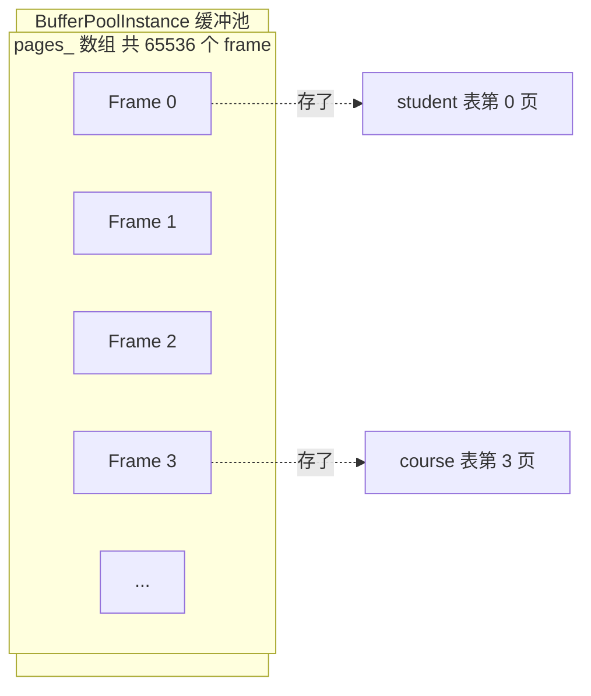
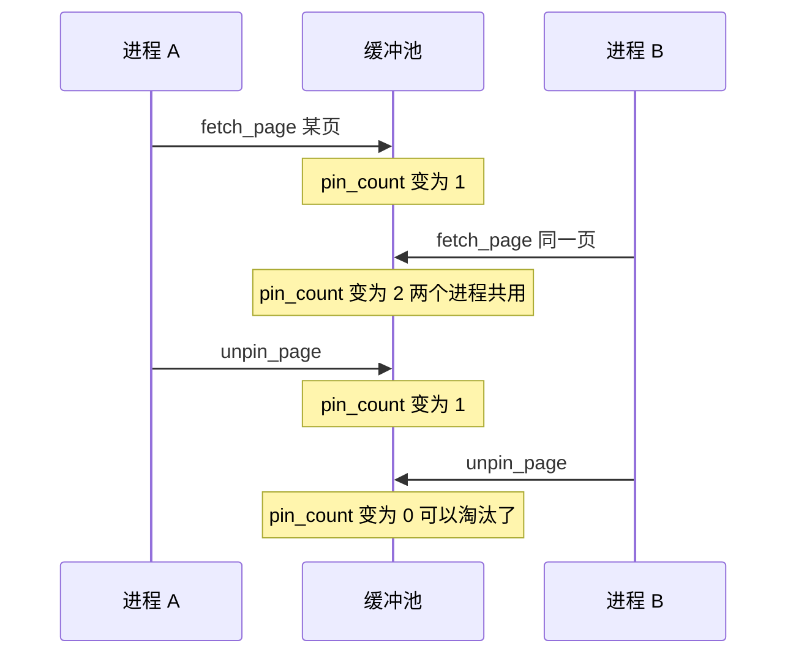
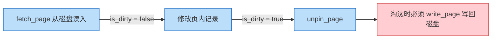
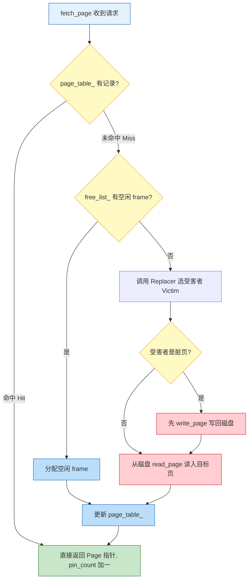
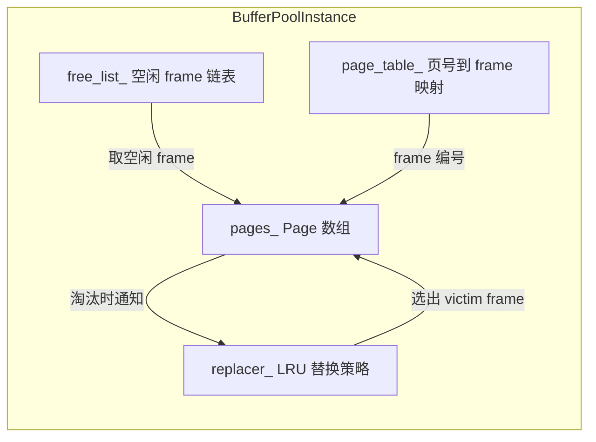
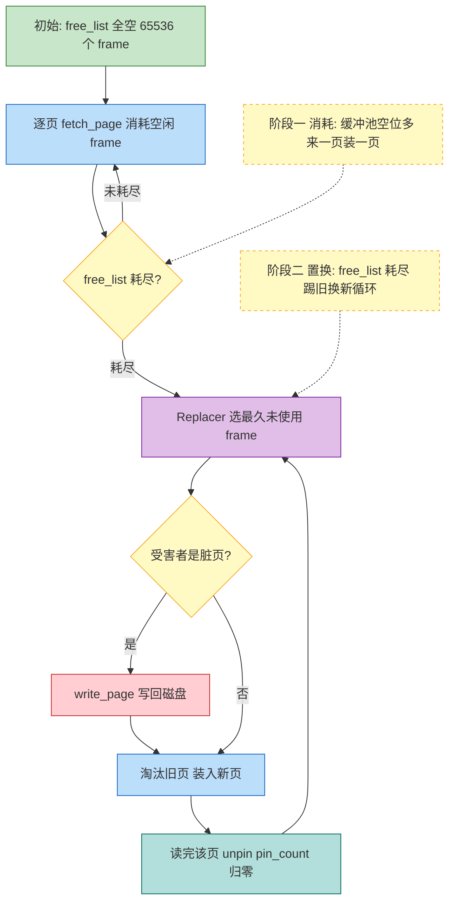

# 04. 缓冲池概述

## 问题：为什么不直接从磁盘读？

假设没有缓冲池，每次需要数据都直接读磁盘：

```
Executor 遍历 student 表 1000 条记录
  → 每条记录都要触发一次 read_page()
    → 每次 read_page() 都要 lseek + read 系统调用
      → 1000 次磁盘 I/O
```

磁盘 I/O 的速度大约是内存访问的 **10万倍** 慢。所以需要一个**缓冲池（Buffer Pool）**——在内存中缓存磁盘页，大部分请求命中内存，少数未命中才走磁盘。

```
无缓冲池:  Executor → Disk (每次都要磁盘 I/O)
有缓冲池:  Executor → Buffer Pool → [大概率命中内存]
                                    [小概率未命中 → Disk]
```

## 核心概念

### 帧（Frame）与页（Page）的关系



- **帧（Frame）**：缓冲池数组的一个槽位，对应内存中一个 Page 对象
- **页（Page）**：逻辑概念，可能当前在某个 Frame 中，也可能只在磁盘上
- `BUFFER_POOL_SIZE = 65536`（`common/config.h:39`），即最多缓存 65536 个页面（约 256MB）

**源码对应：**

```cpp
// src/storage/buffer_pool_instance.h:20-24
Page* pages_;                                      // Frame 数组，每个元素是一个 Page 对象
std::unordered_map<PageId, frame_id_t> page_table_; // 页号 → frame 编号的映射
std::list<frame_id_t> free_list_;                  // 空闲 frame 编号链表

// src/storage/page.h:116-127
class Page {
    PageId id_;            // 该页对应的磁盘页标识
    char data_[PAGE_SIZE]; // 页内实际数据（4KB）
    bool is_dirty_ = false; // 脏页标记
    int pin_count_ = 0;    // 引用计数
};
```

`pages_` 数组就是上图中那行 Frame 的真实实现，每个 `Page` 对象知道自己存的是哪个磁盘页（`id_`）、数据本体在哪（`data_`）、当前是否被 pin（`pin_count_`）、是否脏了（`is_dirty_`）。

### Pin 与 Unpin

"Pin"（钉住）是缓冲池最核心的机制：

- **Pin（`pin_count_++`）**：我正在用这个页面，**不要淘汰它**
- **Unpin（`pin_count_--`）**：我用完了，**可以淘汰了**
- **pin_count 可以大于 1**：多个执行器可能同时在读同一页



**源码对应：**

```cpp
// src/storage/page.h:127
int pin_count_ = 0;  // 引用计数，初值为 0

// fetch_page 中 pin_count++（src/storage/buffer_pool_instance.cpp:112-116）
if (page_table_.find(page_id) != page_table_.end()) {
    // 命中：引用计数 +1
    pages_[frame_id].pin_count_++;
    return &pages_[frame_id];
}
// 未命中：分配 frame 后 pin_count_ = 1

// unpin_page 中 pin_count--（src/storage/buffer_pool_instance.cpp:139-146）
page->pin_count_--;
if (page->pin_count_ == 0) {
    replacer_->unpin(frame_id);  // 计数归零，通知 Replacer 可以淘汰
}
```

`pin_count_` 存储在 `Page` 对象内部，`fetch_page` 负责加一，`unpin_page` 负责减一。减到零时通知 Replacer"这页现在可淘汰了"。

### 脏页（Dirty Page）

如果页面的数据在内存中被修改了，它就和磁盘上的版本不一致了。这种页面叫**脏页**。

- `is_dirty_ = true`：内存中改了，磁盘上还是旧的，**淘汰前必须先写回磁盘**
- `is_dirty_ = false`：内存和磁盘一致，直接丢弃即可



> **图例：** <span style="color:#1565c0">■</span> 内存操作 &nbsp; <span style="color:#c62828">■</span> 磁盘写入

> 边上标注的是页面在此刻的脏/净状态，属于补充说明而非独立步骤。

**源码对应：**

```cpp
// src/storage/page.h:124
bool is_dirty_ = false;  // 脏页标记，初值为 false

// unpin_page 中设置脏标记（src/storage/buffer_pool_instance.cpp:146）
page->is_dirty_ |= is_dirty;  // 调用方传入 true 时置位，传入 false 保持原值

// update_page 中淘汰脏页时写回（src/storage/buffer_pool_instance.cpp:39-43）
if (page->is_dirty_) {
    disk_manager_->write_page(page->id_, page->data_);  // 脏页先写回磁盘
    page->is_dirty_ = false;                             // 写回后恢复干净
}
```

`is_dirty_` 位用 `|=` 置位而不是直接赋值，这样多次修改只要有一次变脏就记为脏，不会因为某次 unpin 传了 `false` 而错误清零。

### 命中与未命中



> **图例：** <span style="color:#1565c0">■</span> 起止 &nbsp; <span style="color:#f9a825">■</span> 判断分支 &nbsp; <span style="color:#2e7d32">■</span> 命中直接返回 &nbsp; <span style="color:#1565c0">■</span> 内存操作 &nbsp; <span style="color:#c62828">■</span> 磁盘 I/O

**源码对应：** 上图直接映射到 `BufferPoolInstance::fetch_page` 的完整实现（`src/storage/buffer_pool_instance.cpp:68-123`），核心骨架如下：

```cpp
Page* BufferPoolInstance::fetch_page(PageId page_id) {
    std::scoped_lock lock{latch_};
    // 1. 查 page_table_ 判断是否命中
    auto it = page_table_.find(page_id);
    if (it != page_table_.end()) {
        frame_id_t frame_id = it->second;
        pages_[frame_id].pin_count_++;    // 命中：pin_count++
        replacer_->pin(frame_id);         // 通知 Replacer 此页被访问
        return &pages_[frame_id];
    }
    // 2. 未命中：找 victim frame
    frame_id_t frame_id;
    find_victim_page(&frame_id);          // 先查 free_list_，空了查 Replacer
    // 3. 淘汰旧页（脏页先写回）
    update_page(&pages_[frame_id], page_id, frame_id);
    // 4. 从磁盘读入目标页
    disk_manager_->read_page(page_id, pages_[frame_id].data_);
    pages_[frame_id].pin_count_ = 1;
    replacer_->pin(frame_id);
    return &pages_[frame_id];
}
```

流程图中每个菱形判断和矩形操作都能在源码中找到一一对应的位置。其中 `find_victim_page` 内部封装了"先查 `free_list_`，空了再查 Replacer"的逻辑（`buffer_pool_instance.cpp:10-21`）。

> **问：极端情况下，一条 SQL 会不会用完缓冲池所有页？所需页数超过缓冲池容量怎么办？**
>
> **答：会，这正是 Replacer 存在的意义。** 一条全表扫描 SQL 可能涉及成百上千页，超过缓冲池容量是完全可能的。处理方式就是流程图右边的分支——`free_list_` 空了之后，Replacer 按 LRU 策略选一个**最久未使用且 pin_count 为 0** 的 frame 作为受害者，踢掉它，腾出位置装新页。
>
> 关键约束在于 **pin_count**：
> - 执行器每读完一页应立即 `unpin_page`，让 pin_count 归零。只要 pin_count 为 0，这页就成为"可淘汰"候选
> - 如果执行器 bug 导致 pin 了不 unpin，这些页永远不会被淘汰。极端情况下所有页都被 pin 住，系统就会无页可用——但这是实现错误，不是正常情况
>
> 所以缓冲池的容量不需要覆盖整条 SQL 涉及的全部页面，只需要覆盖**同一时刻被 pin 住的页面**——这个数量通常很小（一次只 pin 正在操作的那几页）。Replacer 负责把"曾经用过但现在已经 unpin"的旧页换出去，保证新页能进来。

## 缓冲池的核心数据结构

不管单实例还是多实例版本，缓冲池都围绕以下结构：

| 结构 | 类型 | 作用 |
|------|------|------|
| `pages_` | `Page[]` 数组 | 存放所有 Page 对象（Frame 数组） |
| `page_table_` | `unordered_map<PageId, frame_id_t>` | PageId → Frame 编号的映射，用于快速查找 |
| `free_list_` | `list<frame_id_t>` | 空闲 Frame 编号链表 |
| `replacer_` | `Replacer*` | 页面替换策略（LRU），决定淘汰哪个非空闲页 |

四个结构之间的交互关系：



## 实例

以 student 表为例：页面大小 4KB，每条记录约 100 字节，一页大约放 40 条记录。1000 条记录共 25 页（page_no 0 到 24）。



> **图例：** <span style="color:#2e7d32">■</span> 初始空闲 &nbsp; <span style="color:#1565c0">■</span> 消耗/装入 &nbsp; <span style="color:#f9a825">■</span> 判断分支 &nbsp; <span style="color:#7b1fa2">■</span> Replacer 决策 &nbsp; <span style="color:#c62828">■</span> 磁盘 I/O &nbsp; <span style="color:#00695c">■</span> unpin 释放 &nbsp; <span style="border:1px dashed #f9a825;background:#fff9c4">□</span> 备注说明

整个过程分两个阶段（对应图中两个虚线便利贴）：

1. **消耗阶段**（上方便利贴 → 菱形 C）：持续从 `free_list_` 取空闲 frame，缓冲池有大量空位，来一页装一页
2. **置换阶段**（下方便利贴 → 菱形 D）：`free_list_` 耗尽后进入稳态，Replacer 不断踢旧页、换新页，有限 65536 个 frame 可以处理任意多的页面访问

## 小结

| 概念 | 一句话 |
|------|--------|
| 缓冲池 | 内存中缓存磁盘页的大数组，减少磁盘 I/O |
| Pin/Unpin | 引用计数机制，pin_count > 0 时页面受保护 |
| 脏页 | 内存数据与磁盘不一致，淘汰前必须写回 |
| 命中/未命中 | 页面已在/不在缓冲池中 |
| Replacer | 缓冲池满时决定淘汰哪个页面 |

下一节：[05. 单实例缓冲池](./05-buffer-pool-single.md) 将讲解框架给出的基础版本实现。
