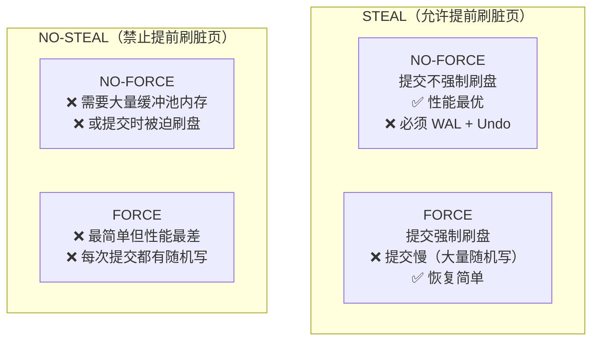

# 缓冲池管理策略：STEAL 与 FORCE

## 为什么需要这个框架

**含义**：STEAL 和 FORCE 是缓冲池管理器的两个独立决策维度，共同决定了数据库在"脏页什么时候可以写回磁盘"和"事务提交时是否必须把脏页写回磁盘"上的策略选择。

**作用**：这个框架解释了 WAL（预写日志）为什么是必要的，以及 RMDB 的缓冲池为什么在写脏页前要先刷日志。

**场景**：理解它之后，`buffer_pool_instance.cpp` 中所有 `#ifdef ENABLE_LOGGING` 条件编译块的逻辑就一目了然了。

## 两个维度

缓冲池中有一个关键问题：**脏页（被修改过但还没写回磁盘的页）什么时候可以刷盘？**

两个维度独立回答这个问题：

| 维度 | 问题 | YES | NO |
|------|------|-----|----|
| **STEAL** | 允许在事务提交前把它的脏页刷到磁盘吗？ | 允许"偷"——脏页可以不等到提交就刷盘 | 不允许偷——脏页必须等到提交后才能刷 |
| **FORCE** | 事务提交时必须把它所有脏页都刷到磁盘吗？ | 必须"强制"——提交时所有脏页立即落盘 | 不强制——提交时可以不刷脏页 |

两个维度组合出四种策略：



## RMDB 的选择：STEAL + NO-FORCE

**这是绝大多数现代 DBMS 的选择**，也是 RMDB 的选择。

### STEAL：允许偷页

RMDB 的缓冲池在**任何时刻**都可能把脏页刷回磁盘——不管这个脏页属于已提交事务还是未提交事务。证据在 `flush_page` 方法：

```cpp
// src/storage/buffer_pool_instance.cpp:175-191
// flush_page 不管 page 属于谁、事务有没有提交，直接写回磁盘
auto& page = pages_[it->second];
#ifdef ENABLE_LOGGING
  if (log_manager_ != nullptr &&
      page.get_page_lsn() > log_manager_->get_persist_lsn()) {
    log_manager_->flush_log_to_disk();
  }
#endif
disk_manager_->write_page(page.id_.fd, page.id_.page_no, page.data_, PAGE_SIZE);
page.is_dirty_ = false;
```

**STEAL 带来的风险**：缓冲池把一个未提交事务的脏页刷到了磁盘。如果事务随后回滚，磁盘上的数据就是"脏"的——怎么办？

答案是用 **Undo 日志**。回滚时通过 Undo 日志把磁盘上被"偷"走的脏页恢复原状。这就是 WAL 中 Undo 日志的必要性——**STEAL 策略要求有 Undo 日志支持**。

### NO-FORCE：提交不强制刷盘

RMDB 的事务提交时，不需要把该事务的所有脏页都刷到磁盘。证据在 `Transaction::commit()` 中——它只写 CommitLogRecord 和释放锁，没有遍历脏页强制刷盘。

**NO-FORCE 带来的风险**：已提交事务的修改只存在于内存（缓冲池）中，还没到磁盘。如果此时崩溃，已提交的修改就丢失了——怎么办？

答案是用 **Redo 日志**。恢复时通过 Redo 日志把已提交但未落盘的修改重新执行一遍。这就是 WAL 中 Redo 日志的必要性——**NO-FORCE 策略要求有 Redo 日志支持**。

### 总结

```
STEAL  → 需要 Undo 日志（回滚未提交事务的脏页）
NO-FORCE → 需要 Redo 日志（重演已提交事务的修改）
STEAL + NO-FORCE → 同时需要 Undo + Redo = 完整的 WAL
```

这就是 RMDB 的恢复系统同时实现了 Redo 和 Undo 两套日志的原因——不是设计者多此一举，而是 STEAL + NO-FORCE 策略的必然要求。

## 源代码中的体现

RMDB 中有三处 `#ifdef ENABLE_LOGGING` 条件编译块，全部位于缓冲池的刷脏页路径上：

**1. flush_page（刷单个页面）**

```cpp
// src/storage/buffer_pool_instance.cpp:181-186
#ifdef ENABLE_LOGGING
  if (log_manager_ != nullptr &&
      page.get_page_lsn() > log_manager_->get_persist_lsn()) {
    log_manager_->flush_log_to_disk();
  }
#endif
```

**2. flush_all_pages（关闭文件时批量刷页）**

```cpp
// src/storage/buffer_pool_instance.cpp:244-249
// 同样的 ENABLE_LOGGING 块
```

**3. new_page 的受害者驱逐路径**

```cpp
// src/storage/buffer_pool_instance.cpp:273-278
// 当缓冲池满、需要踢掉一个脏页来腾空间时，也要先刷日志
```

**逻辑**：在刷任何脏页到磁盘之前，先检查这个页面的 LSN（日志序列号）是否大于已持久化的 LSN。如果大于，说明"这个脏页的修改日志还没刷到磁盘上"，必须**先刷日志，再刷页**。

这正是 WAL 协议的代码落地——**Write-Ahead：日志必须在数据之前到达磁盘**。

### 为什么 checkpoint 时要重置 LSN

```cpp
// src/storage/buffer_pool_instance.cpp:290-303
void BufferPoolInstance::flush_all_pages_for_checkpoint(int fd) {
  for (auto& [pageId, frameId] : page_table_) {
    if (pageId.fd == fd) {
      auto& page = pages_[frameId];
      page.set_page_lsn(INVALID_LSN);  // ← 重置为无效值
      disk_manager_->write_page(...);
    }
  }
}
```

Checkpoint 时，所有脏页被强制刷盘。之后日志文件会被截断——旧的日志记录不再需要，因为磁盘上的数据已经是最新的一致状态。把 LSN 重置为 `INVALID_LSN` 表示"这个页面的当前版本已经安全落盘，不需要再依赖任何日志来恢复"。

### 为什么 delete_all_pages 不需要刷日志

`delete_all_pages` 是关闭文件时的清理操作——把文件的所有页面从缓冲池中移除并归还 frame。它在调用前已经通过 `flush_all_pages` 或 `flush_all_pages_for_checkpoint` 确保了数据安全落盘，所以不需要再检查 WAL。

## 其他三种策略为什么没人用

| 策略 | 为什么大多数 DBMS 不选 |
|------|----------------------|
| NO-STEAL + FORCE | 提交时必须把全部脏页刷盘（FORCE），且提交前不能刷（NO-STEAL）→ 缓冲池必须能装下整个事务的修改，提交时产生大量随机 I/O。性能极差。 |
| STEAL + FORCE | FORCE 要求提交时写回全部脏页，STEAL 的"提前刷页"优势被浪费了。每次提交仍有随机 I/O。 |
| NO-STEAL + NO-FORCE | NO-STEAL 禁止提交前刷脏页，NO-FORCE 不强制提交时刷。那脏页什么时候落盘？要么缓冲池无限大（不现实），要么提交时被迫刷（变相 FORCE）。矛盾。 |

**STEAL + NO-FORCE 是唯一能在"缓冲池有限"和"提交性能高"之间取得平衡的组合**——代价是必须实现完整的 WAL（Redo + Undo）。

## 对框架实现者的意义

当你在 `db2026-x/` 的框架上实现缓冲池时，需要做的决策：

1. **选 STEAL**：缓冲池满时可以踢脏页。但必须在踢之前确保对应的 Undo 日志已经持久化。
2. **选 NO-FORCE**：事务提交时不刷脏页。但必须在提交时确保 Redo 日志（CommitLogRecord）已经持久化。
3. **在每个刷脏页的路径上插入 WAL 检查**：`page.lsn > persist_lsn → flush_log_to_disk()`。

这三个决策直接对应 `src/` 参考实现中的三处 `ENABLE_LOGGING` 块。

上一节：[04d-buffer-pool-lock-basics.md](./04d-buffer-pool-lock-basics.md) | 下一节：[05a-replacer-lru.md](./05a-replacer-lru.md)
