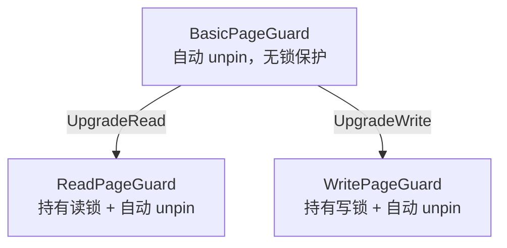

# 06. Page Guard RAII 页面守卫

## 问题

缓冲池要求每个 `fetch_page` 之后必须成对调用 `unpin_page`。如果代码逻辑复杂、有多个提前返回路径或抛出异常，很容易忘记 unpin，导致页面永远无法被淘汰（内存泄漏）。

```cpp
// 危险！如果中间抛异常，unpin_page 永远不会被调用
Page* page = buffer_pool_manager->fetch_page(page_id);
// ... 复杂逻辑，可能抛异常 ...
buffer_pool_manager->unpin_page(page_id, false);  // 可能走不到这行
```

## RAII 解决方案

**RAII（Resource Acquisition Is Initialization，资源获取即初始化）** 是 C++ 的核心惯用法：在构造函数中获取资源，在析构函数中释放资源。Page Guard 正是把这个模式应用到页面管理上。

### 调用方对比

```cpp
// 不用 Guard（手动管理，危险）
Page* page = bpm->fetch_page(page_id);
// ... 用 page ...
bpm->unpin_page(page_id, true);  // 容易忘记

// 用 BasicPageGuard（自动 unpin，安全）
auto guard = bpm->fetch_page(page_id);
// ... 用 guard.GetData() ...
// guard 离开作用域 → 析构函数自动 unpin
```

## 三层 Guard 体系



### BasicPageGuard

```cpp
// src/storage/page_guard.h:14-61
class BasicPageGuard {
  BufferPoolManager* bpm_{nullptr};
  Page* page_{nullptr};
  bool is_dirty_{false};
};
```

析构时自动 unpin（`page_guard.cpp:44`）：

```cpp
BasicPageGuard::~BasicPageGuard() { Drop(); }

void BasicPageGuard::Drop() {
    if (bpm_ && page_) {
        bpm_->unpin_page(page_->get_page_id(), is_dirty_);  // 自动 unpin！
    }
}
```

上层调用者（RM、IX 等）通过 Guard **访问页面数据**：只读场景调用 `GetData()`，修改场景调用 `GetDataMut()`（后者自动标记脏页）：

```cpp
auto GetData() const -> const char* { return page_->get_data(); }

auto GetDataMut() -> char* {
    is_dirty_ = true;                    // 自动标记脏页！
    return page_->get_data();
}
```

### ReadPageGuard

持有页面的**读锁**（共享锁），多个读操作可以同时进行：

```cpp
// 从 BasicPageGuard 升级
auto BasicPageGuard::UpgradeRead() -> ReadPageGuard {
    page_->RLatch();                     // 加读锁
    ReadPageGuard read_guard(bpm_, page_);
    // 转移所有权，BasicPageGuard 不再负责 unpin
    return read_guard;
}

// 析构时先释放读锁，再 unpin
ReadPageGuard::~ReadPageGuard() {
    if (page_) page_->RUnlatch();        // 释放读锁
    guard_.Drop();                       // unpin
}
```

### WritePageGuard

持有页面的**写锁**（排他锁），写操作独占页面：

```cpp
auto BasicPageGuard::UpgradeWrite() -> WritePageGuard {
    page_->WLatch();                     // 加写锁
    WritePageGuard write_guard(bpm_, page_);
    return write_guard;
}

WritePageGuard::~WritePageGuard() {
    if (page_) page_->WUnlatch();        // 释放写锁
    guard_.Drop();                       // unpin
}
```

## 移动语义

### 什么是移动语义

在 C++ 中，把一个变量的值交给另一个变量，默认方式是**拷贝**——源变量保留原值，目标变量得到一份副本：

```cpp
int a = 10;
int b = a;   // 拷贝：a 还是 10，b 也是 10
```

但有些资源"拷贝"是不合理的。比如一个 Guard 持有一个页面的释放责任——如果两个 Guard 各持一份副本，页面就被释放两次。这种情况下需要的是**移动**而不是拷贝：把资源从源对象**转移**给目标对象，源对象被"掏空"，不再持有该资源。

**移动语义就是：不复制内容，而是把"所有权"从一个对象转移到另一个对象。转移后，源对象变空，目标对象接管一切。**

```cpp
// 移动（概念示意）
auto guard1 = fetch_page(...);   // guard1 持有页面，负责 unpin
auto guard2 = std::move(guard1); // guard1 的"页面释放责任"转移给 guard2
// 此后 guard1 是空壳（不会 unpin），guard2 负责 unpin
```

### 为什么这里需要移动语义

一个生活类比——**房产证过户**：

> 你有一套房子的房产证。房产证不允许复印（复印的无效），只允许过户。当你想把房子转给另一个人时，你去房管局把证上的名字改成他——从此房子是他的，你手上什么都没有了。

Page Guard 的处境一模一样：**一个页面在同一时刻只应该有一个 Guard 负责释放**。如果允许"拷贝"Guard，就会出现两个 Guard 持有同一个页面，两个析构函数都会去 unpin，后果是：
- 第一个析构正常 unpin
- 第二个析构对已经释放的页面再 unpin 一次——**重复释放**，逻辑错误

所以 Guard 的设计是：**禁止拷贝，只允许移动**。

#### 拷贝 vs 移动

```
拷贝构造:                   移动构造:
                         
   guard1 ──→ [页面A]        guard1 ──→ (空壳)
      │                        
      ├──→ [页面A] 副本       guard2 ──→ [页面A]
   guard2 ──→ [页面A]                      
                         
 两个 Guard 指向同一页面！     只有一个 Guard 持有页面。
 析构时 unpin 两次 → bug     析构时 unpin 一次 → 正确。
```

对应的源码：

```cpp
BasicPageGuard(const BasicPageGuard&) = delete;           // 禁止拷贝
BasicPageGuard(BasicPageGuard&& that) noexcept;            // 允许移动

auto guard1 = bpm->fetch_page(page_id);  // guard1 拥有页面
auto guard2 = std::move(guard1);         // 所有权转移给 guard2
// guard1 现在是空的，不会 unpin
// guard2 离开作用域时会自动 unpin
```

### 三个关键语法

**`= delete` —— 禁止拷贝**

```cpp
BasicPageGuard(const BasicPageGuard&) = delete;  // 不允许拷贝构造
```
编译器一旦看到 `guard2 = guard1` 这种拷贝行为，直接报错。

**`&&` —— 右值引用，代表"移动源"**

```cpp
BasicPageGuard(BasicPageGuard&& that) noexcept;   // 移动构造函数
```
参数 `that` 前的 `&&` 表示：这个参数是"即将被掏空的对象"。函数体内把 `that` 的内部资源（`page_`、`bpm_`）转移给 `this`，然后把 `that` 的指针置空。

**`std::move` —— 显式声明"我愿意转移所有权"**

```cpp
auto guard2 = std::move(guard1);
```
`std::move` 本身不做任何移动操作。它只是把 `guard1` 标记为"可以被移动"，然后编译器匹配到移动构造函数，完成资源转移。转移后 `guard1` 变成空壳，不能再使用。

### 在 Page Guard 中的实际应用

`UpgradeRead()` 和 `UpgradeWrite()` 内部就使用了移动语义：

```cpp
auto BasicPageGuard::UpgradeWrite() -> WritePageGuard {
    page_->WLatch();                            // 1. 先加写锁
    WritePageGuard write_guard(bpm_, page_);    // 2. 创建新的 WritePageGuard
    return write_guard;                         // 3. 移动返回，所有权转移
}                                               //    调用方的 write_guard 接手
```

关键点：`return write_guard` 这里触发了移动构造。函数内的 `write_guard` 把 `bpm_` 和 `page_` 转移给了调用方接收的变量，自己变成空壳。调用方拿到的是**唯一持有页面**的 Guard。

## 完整使用实例

```cpp
// 场景：修改 student 表中某条记录的年龄
auto basic_guard = buffer_pool_manager->fetch_page({fd:3, page_no:1});

// 升级为写锁守卫（需要修改数据）
auto write_guard = basic_guard.UpgradeWrite();

// 在页面中定位并修改数据
char* data = write_guard.GetDataMut();   // 自动标记脏页
// ... 修改 data 中的记录 ...

// write_guard 离开作用域:
//   1. WUnlatch() 释放写锁
//   2. unpin_page({fd:3, 1}, true) 自动 unpin + 标记脏页
```

## 框架 vs 参考实现

| 方面 | 框架 `db2026-x/` | 参考实现 `src/` |
|------|-----------------|-----------------|
| Page Guard | 不存在 | Basic / Read / Write 三层 |
| 页面释放 | 手动调用 unpin_page | 析构自动 unpin |
| 锁管理 | 无 | 通过 UpgradeRead/UpgradeWrite 自动加锁 |
| 脏页标记 | 手动传 is_dirty 参数 | GetDataMut() 自动标记 |

## 小结

- Page Guard 用 RAII 模式解决了"忘记 unpin"的问题
- 三层设计：Basic（基础 unpin）→ Read（+ 读锁）→ Write（+ 写锁）
- 使用移动语义保证页面所有权唯一，禁止拷贝
- 框架中没有这个模块，参考实现是**从零开始**实现的

下一节：[07. RWLatch 读写锁](./07-rwlatch.md)
