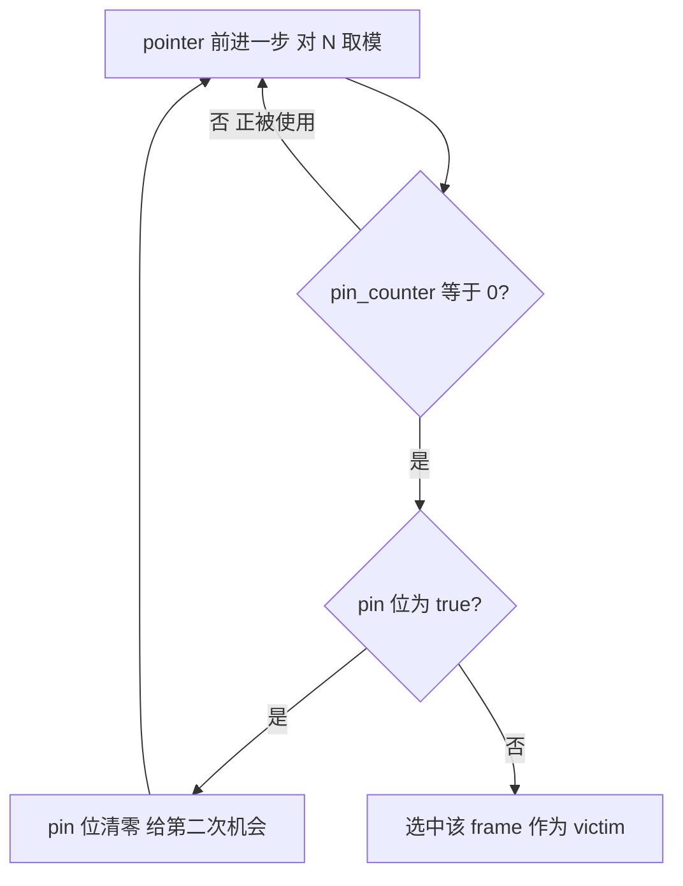
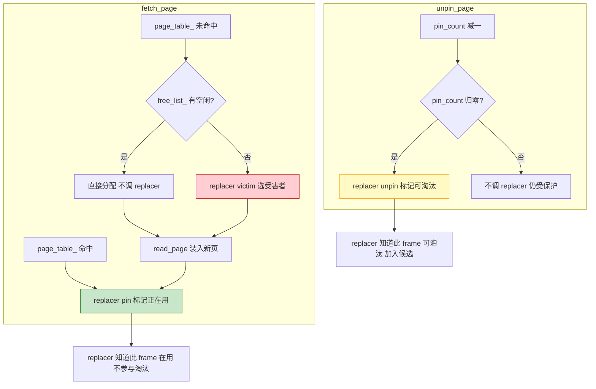

# 07. 页面替换算法

## 问题

缓冲池只有有限个 frame（65536 个），但一个数据库可能有很多页面（几十万甚至更多）。当所有 frame 都被占用且没有空闲时，需要**淘汰**某个旧页面，腾出空间给新页面。

这就需要一个 **替换策略（Replacer）** 来回答：淘汰谁？

## 两种替换器对比

框架给了 `LRUReplacer`（标准 LRU），参考实现改用了 `ClockReplacer`（时钟算法）。两者接口完全一样，都继承 `Replacer`：

```cpp
// db2026-x/src/replacer/replacer.h:18-40（框架，抽象基类）
class Replacer {
  virtual bool victim(frame_id_t* frame_id) = 0;  // 选一个受害者
  virtual void pin(frame_id_t frame_id) = 0;       // 标记为"正在使用"
  virtual void unpin(frame_id_t frame_id) = 0;     // 标记为"可淘汰"
  virtual size_t Size() = 0;                       // 可淘汰的 frame 数量
};
```

## LRUReplacer

### 数据结构

```cpp
// src/replacer/lru_replacer.h（框架）
class LRUReplacer : public Replacer {
  std::mutex latch_;
  std::list<frame_id_t> LRUlist_;                                    // 双向链表，首部=最近访问
  std::unordered_map<frame_id_t, std::list<frame_id_t>::iterator>
      LRUhash_;                                                      // frame_id → 链表位置
  size_t max_size_;                                                  // 最大容量
};
```

### 工作原理

**LRU（Least Recently Used，最近最少使用）**：每次访问都把被访问项移到链表首部，链表尾部就是最久未用的。

```
初始:     [ ]  ←→  [ ]  ←→  [ ]   (空链表)

访问 frame 3:  (pin)
访问 frame 7:  (pin)
访问 frame 3:  (pin, 已在链表中)

链表:  [3]  ←→  [7]
      首部(新)   尾部(旧)

unpin frame 3:
unpin frame 7:

现在需要淘汰一个 → victim() → 从尾部取 → 淘汰 frame 7
```

### 方法实现

**pin(frame_id)**：frame 被访问了，把它移到链表首部（或插入首部）：

```cpp
// db2026-x/src/replacer/lru_replacer.cpp:44
void LRUReplacer::pin(frame_id_t frame_id) {
    auto it = LRUhash_.find(frame_id);
    if (it != LRUhash_.end()) {
        LRUlist_.erase(it->second);     // 从原位置移除
    }
    LRUlist_.push_front(frame_id);       // 插入首部
    LRUhash_[frame_id] = LRUlist_.begin();
}
```

**unpin(frame_id)**：frame 不再被使用（pin_count 归零），可以被淘汰了：

```cpp
// db2026-x/src/replacer/lru_replacer.cpp:60
void LRUReplacer::unpin(frame_id_t frame_id) {
    // 注意：unpin 不改变链表位置！
    // 链表顺序由 pin（访问）决定，unpin 只是"放行"
}
```

**victim(frame_id)**：选一个受害者（链表尾部最久未访问的）：

```cpp
// db2026-x/src/replacer/lru_replacer.cpp:22
bool LRUReplacer::victim(frame_id_t* frame_id) {
    if (LRUlist_.empty()) return false;
    *frame_id = LRUlist_.back();         // 取尾部（最久未访问）
    LRUlist_.pop_back();                 // 从链表移除
    LRUhash_.erase(*frame_id);           // 从哈希表移除
    return true;
}
```

## ClockReplacer

参考实现没有用 LRU，而是用了**时钟算法（Clock Algorithm）**。这是一种 LRU 的近似实现，性能更好（不需要频繁移动链表节点）。

### 数据结构

```cpp
// src/replacer/lru_replacer.h:51-92（参考实现）
class ClockReplacer : public Replacer {
  int pin_counter_[BUFFER_POOL_INSTANCE_SIZE];   // 每个 frame 的 pin 计数
  bool pin_[BUFFER_POOL_INSTANCE_SIZE];          // 引用位（clock 位）
  int pointer_ = 0;                               // 时钟指针
};
```

### 工作原理

时钟算法维护一个循环指针 `pointer_`，像时钟指针一样循环扫描：



**实例**：假设 pointer 当前在 frame 3，要找一个受害者：

```
pointer → frame 3: pin_counter=0, pin=true  → pin=false, 跳过
          frame 4: pin_counter=1 (被pin着)   → 跳过
          frame 5: pin_counter=0, pin=false → 选中！淘汰 frame 5
```

### 为什么用 Clock 而不是 LRU？

| 方面 | LRUReplacer | ClockReplacer |
|------|------------|---------------|
| 数据结构 | 双向链表 + 哈希表 | 固定大小数组 |
| pin 操作 | 移动链表节点（O(1) 但涉及指针操作和内存分配） | `pin_counter_[id]++`（纯数组操作） |
| victim 操作 | 取尾部（O(1)） | 最多扫描 2 圈（O(N) 但 N 小） |
| 内存 | 链表节点有额外开销 | 数组，无额外开销 |
| 精确度 | 精确 LRU | 近似 LRU |

参考实现选 Clock 的原因：每个 Instance 只有 4096 个 frame，扫描成本低；数组操作比链表快得多；没有内存分配开销。

## 替换器与缓冲池的协作流程

回顾 [04](./04-buffer-pool-overview.md) 的 fetch_page 流程和 [05](./05-buffer-pool-single.md) 的源码实现，Replacer 在其中扮演三个角色。以下是 BufferPool 调用 Replacer 的时机和触发条件：



> **图例：** <span style="color:#2e7d32">■</span> pin — 标记在用 &nbsp; <span style="color:#c62828">■</span> victim — 选受害者淘汰 &nbsp; <span style="color:#f9a825">■</span> unpin — 标记可淘汰

Replacer 就像一个"页面户口本"：缓冲池通过 `pin` 告知"这页有人用"，通过 `unpin` 告知"这页没人用了"，需要淘汰时通过 `victim` 查询"户口本上最久没人用的那个"。

## 小结

- Replacer 接口只有 3 个方法：`pin`（标记在用）、`unpin`（标记可淘汰）、`victim`（选受害者）
- LRU 用双向链表维护访问顺序，精确但开销大
- Clock 用数组 + 循环指针近似 LRU，简单高效
- 参考实现选择 Clock，因为每个 Instance 规模小（4096 frame），近似 LRU 足够好

下一节：[08. Page Guard RAII 机制](./08-page-guard.md)
