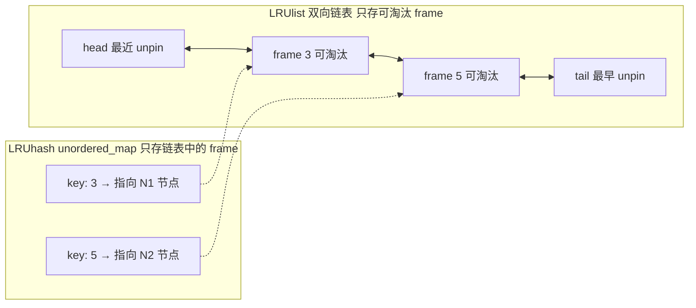
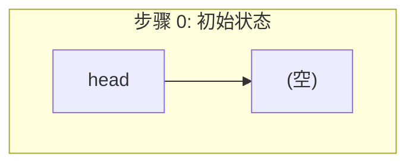
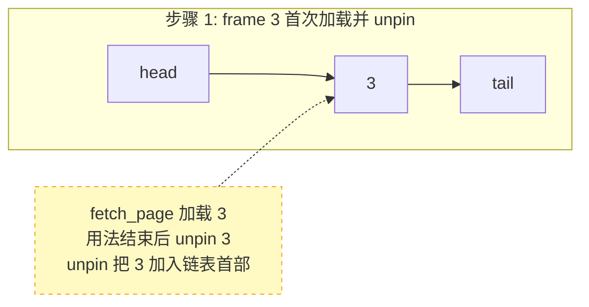
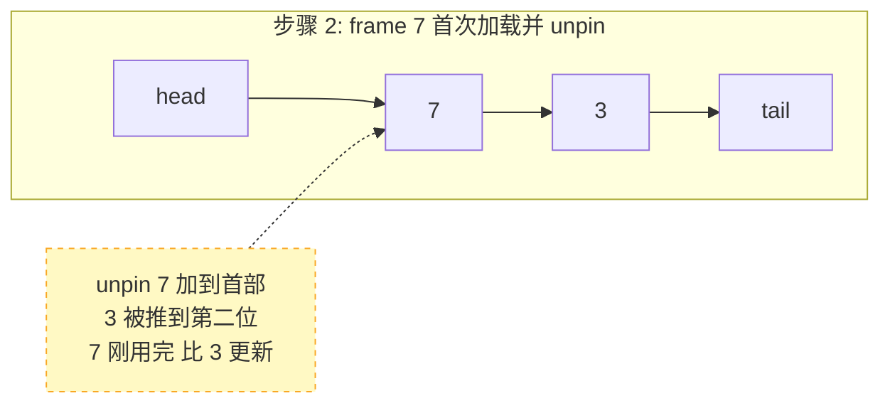
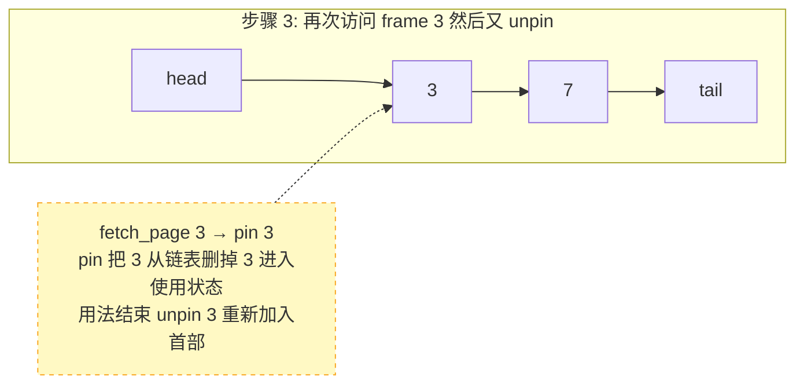
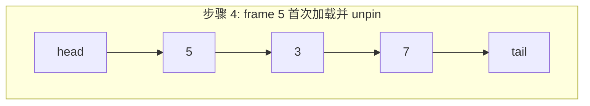
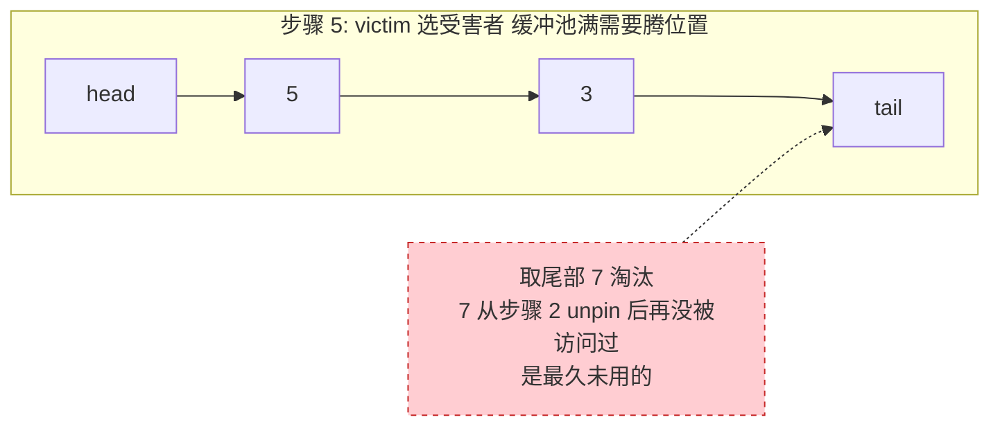
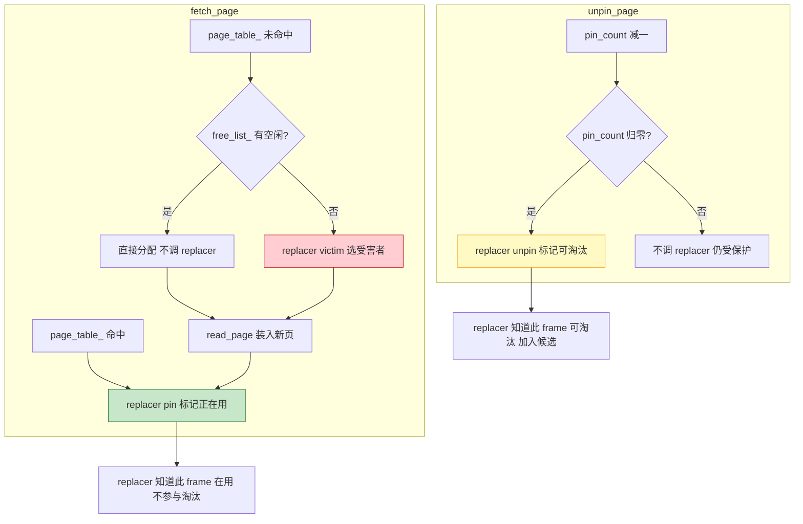

# 07. LRU 页面替换算法

## 问题

缓冲池只有有限个 frame（65536 个），但一个数据库可能有很多页面（几十万甚至更多）。当所有 frame 都被占用且没有空闲时，需要**淘汰**某个旧页面，腾出空间给新页面。

这就需要一个 **替换策略（Replacer）** 来回答：淘汰谁？

## Replacer 抽象接口

所有替换器都继承同一个抽象基类 `Replacer`，统一三个方法：

```cpp
// db2026-x/src/replacer/replacer.h:18-40（框架，抽象基类）
class Replacer {
  virtual bool victim(frame_id_t* frame_id) = 0;  // 选一个受害者
  virtual void pin(frame_id_t frame_id) = 0;       // 标记为"正在使用"
  virtual void unpin(frame_id_t frame_id) = 0;     // 标记为"可淘汰"
  virtual size_t Size() = 0;                       // 可淘汰的 frame 数量
};
```

## LRUReplacer

### 数据结构

```cpp
// src/replacer/lru_replacer.h（框架）
class LRUReplacer : public Replacer {
  std::mutex latch_;
  std::list<frame_id_t> LRUlist_;                                    // 双向链表，首部=最近访问
  std::unordered_map<frame_id_t, std::list<frame_id_t>::iterator>
      LRUhash_;                                                      // frame_id → 链表位置
  size_t max_size_;                                                  // 最大容量
};
```

### 工作原理

**LRU（Least Recently Used，最近最少使用）**：核心思路就是"最近用过的别淘汰，最久没用的先淘汰"。

**关键规则**：LRU 链表里**只放可淘汰的 frame**（即 pin_count 已归零、调过 unpin 的）。正在被使用的 frame（pin 着）**不在链表中**。

#### 两个数据结构如何配合



- **`LRUlist_`（双向链表）**：只存"可淘汰"的 frame。首部 = 最近 unpin 的，尾部 = 最早 unpin 的。正在使用的 frame（如 frame 7）**不在此链表中**
- **`LRUhash_`（哈希表）**：`unordered_map<frame_id, 链表迭代器>`，只存链表中有记录的 frame。链表之外的 frame 在这里也找不到——pin 删链表节点的同时也会从哈希表 erase 掉

> **注意：`LRUhash_` 是 `std::unordered_map`，不是数组。** 上图把哈希表画成 0, 1, 2, 3... 的横条只是为了跟 `LRUlist_` 里的 frame 编号对应，帮助理解"哪个 key 指向哪个链表节点"。实际上哈希表不会预分配 N 个槽位——pin 删一个 entry 它就少一个，不存在"空下标"的问题。`LRUlist_.size() == max_size_` 意味着链表中 frame 的数量碰巧等于缓冲池容量，这在正常运行中几乎不会发生。

> **常见的理解误区：以为链表里存了所有 frame，通过某个"状态字段"来区分谁可淘汰、谁不可淘汰。这是错的。**
>
> LRU 链表不是"全量列表 + 状态标记"，而是**只存可淘汰的 frame**。区分方式简单粗暴：
> - frame 可淘汰 → 在链表里
> - frame 正在用 → 不在链表里
>
> 没有中间状态，不需要额外字段。pin 就是"从名单上划掉"，unpin 就是"加入名单"，victim 只管从名单尾部取——名单上的每一个都保证可淘汰。
>
> **问：不在链表中的 frame 去哪了？还存在吗？**
>
> 当然存在，只是 Replacer 看不见它了。frame 本身是缓冲池 `pages_` 数组里的一个 Page 对象，靠 `page_table_` 的 PageId → frame_id 映射来查找，一直在内存里。Replacer 只是缓冲池的一个"辅助组件"，只负责回答"淘汰谁"，不负责存储 frame 本身。frame 被 pin 摘出链表后：
> - 缓冲池的 `pages_[frame_id]` — 还在，正常使用
> - 缓冲池的 `page_table_` — 还在，正常映射
> - Replacer 的 `LRUlist_` — 不在了（被 pin 摘掉了）
> - Replacer 的 `LRUhash_` — 不在了（跟着链表一起删了）
>
> 等这个 frame 用完了 unpin，再重新加入 LRUlist_ 和 LRUhash_，Replacer 又能看见它了。

#### pin 和 unpin 的正确逻辑

```cpp
// db2026-x/src/replacer/lru_replacer.cpp:44-54（框架）
void LRUReplacer::pin(frame_id_t frame_id) {
    // Todo: 固定指定id的frame, 在数据结构中移除该frame
    auto it = LRUhash_.find(frame_id);
    if(it == LRUhash_.end()) return;    // 不在链表中，说明从未 unpin 或已被 pin 过
    LRUlist_.erase(it->second);         // 从链表中删除 —— 不再可淘汰！
    LRUhash_.erase(it);
}

// db2026-x/src/replacer/lru_replacer.cpp:60-75（框架）
void LRUReplacer::unpin(frame_id_t frame_id) {
    if(LRUlist_.size() == max_size_) return;
    auto it = LRUhash_.find(frame_id);
    if(it != LRUhash_.end()) return;    // 已在链表中，不重复添加
    LRUlist_.emplace_front(frame_id);   // 加到链表首部 —— 刚刚 unpin，最近被用过
    LRUhash_.try_emplace(frame_id, LRUlist_.begin());
}
```

| 方法 | 对链表做什么 | 含义 |
|------|------------|------|
| `pin` | **从链表删除** | "这个 frame 正在用，不许淘汰它" |
| `unpin` | **加到链表首部** | "这个 frame 用完了，可以淘汰。但我刚用完，放最前面" |
| `victim` | **取链表尾部** | 尾部 = 最早 unpin 的 = 最久没再被访问的 |

#### 分步演示

以三个 frame 为例，跟踪 buffer pool 的完整操作周期。注意：**只有 unpin 才会把 frame 加入链表，pin 会把它摘出去**。













步骤 5 淘汰了 7 而不是 3，因为 3 在步骤 3 被重新访问（pin 摘掉又 unpin 加回首部），而 7 从步骤 2 之后就没再被碰过——**谁最久没被再次访问，谁沉到尾部。**

> **关键理解**：victim 能安全地从尾部取，因为链表中**全是已 unpin 的 frame**——正在使用的 frame 早就被 pin 摘出去了，根本不在链表里。不存在"误淘汰正在使用的 frame"的问题。

#### pin、unpin、victim 三者的分工

| 方法 | 改链表？ | 做什么 | 谁在链表中？ |
|------|:---:|------|------|
| `pin` | 是 | 把 frame **从链表中摘掉** | 摘掉后 frame 不在链表中 |
| `unpin` | 是 | 把 frame **加到链表首部** | 加入后 frame 在链表中 |
| `victim` | 是 | 取链表尾部，淘汰它 | 取走后 frame 不在链表中 |

### 方法实现

**pin(frame_id)**：frame 正在被使用，从可淘汰链表中摘掉它。

```cpp
// db2026-x/src/replacer/lru_replacer.cpp:44-54（框架，待完善）
void LRUReplacer::pin(frame_id_t frame_id) {
    std::scoped_lock lock{latch_};
    // Todo: 固定指定id的frame, 在数据结构中移除该frame
    auto it = LRUhash_.find(frame_id);      // 1. 查哈希: 这个 frame 在链表中吗?
    if(it == LRUhash_.end()) return;        // 2. 不在链表中（从未 unpin 过），不用处理
    LRUlist_.erase(it->second);             // 3. 在链表中 → 删掉！它现在被用了，不可淘汰
    LRUhash_.erase(it);                     // 4. 哈希同步删除
}
```

分两种情况：

| 情况 | 例子 | LRUhash 能找到？ | 链表操作 | 效果 |
|------|------|:---:|------|------|
| frame 在链表中 | `pin(3)`，3 已经 unpin 过 | 是 | `erase` 删除节点 | 3 从链表中消失，不再可淘汰 |
| frame 不在链表中 | `pin(7)`，7 从未 unpin 过 | 否 | 无操作，直接 return | 7 本来就不在可淘汰列表里 |

pin 不是"把东西移到前面"，而是**把东西拿走**——拿走了它才安全，不会被 victim 选中。

**unpin(frame_id)**：frame 用完了，加入可淘汰链表。

```cpp
// db2026-x/src/replacer/lru_replacer.cpp:60-75（框架，待完善）
void LRUReplacer::unpin(frame_id_t frame_id) {
    // Todo: 支持并发锁, 选择一个frame取消固定
    std::scoped_lock lock{latch_};
    if(LRUlist_.size() == max_size_) return;      // 1. 链表满了不加
    auto it = LRUhash_.find(frame_id);
    if(it != LRUhash_.end()) return;              // 2. 已在链表中，不重复加
    LRUlist_.emplace_front(frame_id);             // 3. 加到链表首部 —— 刚用完，最新
    LRUhash_.try_emplace(frame_id, LRUlist_.begin());
}
```

加到**首部**而不是尾部：因为刚 unpin 说明"刚被用过"，应该排在"最不可能被淘汰"的位置。

**victim(frame_id)**：选一个受害者，取链表尾部。

```cpp
// db2026-x/src/replacer/lru_replacer.cpp:22-38（框架，待完善）
bool LRUReplacer::victim(frame_id_t* frame_id) {
    std::scoped_lock lock{latch_};
    // Todo: 利用lru_replacer中的LRUlist_,LRUHash_实现LRU策略
    if(LRUlist_.empty() || frame_id == nullptr) return false;
    *frame_id = LRUlist_.back();                // 取尾部，最早 unpin 的 = 最久没再被碰过
    LRUlist_.pop_back();
    LRUhash_.erase(*frame_id);
    return true;
}
```

回想上文分步演示的步骤 5：链表是 `[5] → [3] → [7]`，`back()` 返回 7——7 从步骤 2 unpin 后一直沉在尾部，再也没被访问过。**链表里全是 unpin 过的 frame，不存在误淘汰正在使用的 frame 的风险。**

## 替换器与缓冲池的协作流程

回顾 [04](./04-buffer-pool-overview.md) 的 fetch_page 流程和 [05](./05-buffer-pool-single.md) 的源码实现，Replacer 在其中扮演三个角色。以下是 BufferPool 调用 Replacer 的时机和触发条件：



> **图例：** <span style="color:#2e7d32">■</span> pin — 标记在用 &nbsp; <span style="color:#c62828">■</span> victim — 选受害者淘汰 &nbsp; <span style="color:#f9a825">■</span> unpin — 标记可淘汰

Replacer 就像一个"页面户口本"：缓冲池通过 `pin` 告知"这页有人用"，通过 `unpin` 告知"这页没人用了"，需要淘汰时通过 `victim` 查询"户口本上最久没人用的那个"。

## 小结

- Replacer 接口只有 3 个方法：`pin`（标记在用）、`unpin`（标记可淘汰）、`victim`（选受害者）
- LRU 用双向链表维护访问顺序，精确但开销大
- Clock 用数组 + 循环指针近似 LRU，简单高效
- LRU 的局限性：链表操作涉及指针和动态内存分配，多实例场景下开销大

下一节：[07a. Clock 时钟替换算法](./07a-clock-replacer.md) — 参考实现使用的近似 LRU

后续：[08. Page Guard RAII 机制](./08-page-guard.md)
