# 07. 页面替换算法

## 问题

缓冲池只有有限个 frame（65536 个），但一个数据库可能有很多页面（几十万甚至更多）。当所有 frame 都被占用且没有空闲时，需要**淘汰**某个旧页面，腾出空间给新页面。

这就需要一个 **替换策略（Replacer）** 来回答：淘汰谁？

## 两种替换器对比

框架给了 `LRUReplacer`（标准 LRU），参考实现改用了 `ClockReplacer`（时钟算法）。两者接口完全一样，都继承 `Replacer`：

```cpp
// db2026-x/src/replacer/replacer.h:18-40（框架，抽象基类）
class Replacer {
  virtual bool victim(frame_id_t* frame_id) = 0;  // 选一个受害者
  virtual void pin(frame_id_t frame_id) = 0;       // 标记为"正在使用"
  virtual void unpin(frame_id_t frame_id) = 0;     // 标记为"可淘汰"
  virtual size_t Size() = 0;                       // 可淘汰的 frame 数量
};
```

## LRUReplacer

### 数据结构

```cpp
// src/replacer/lru_replacer.h（框架）
class LRUReplacer : public Replacer {
  std::mutex latch_;
  std::list<frame_id_t> LRUlist_;                                    // 双向链表，首部=最近访问
  std::unordered_map<frame_id_t, std::list<frame_id_t>::iterator>
      LRUhash_;                                                      // frame_id → 链表位置
  size_t max_size_;                                                  // 最大容量
};
```

### 工作原理

**LRU（Least Recently Used，最近最少使用）**：核心思路就是"最近用过的别淘汰，最久没用的先淘汰"。

#### 两个数据结构如何配合

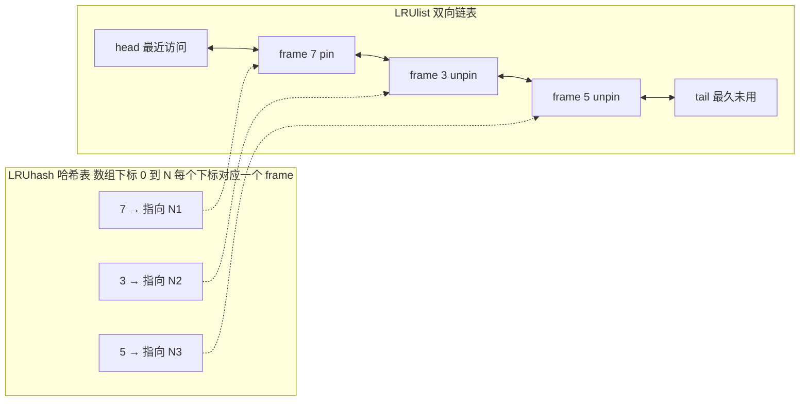

- **`LRUlist_`（双向链表）**：维护访问顺序。首部是最近访问的，尾部是最久未访问的
- **`LRUhash_`（哈希表）**：`frame_id` → 链表节点的迭代器。没这个哈希表，每次在链表中找某个 frame 就得从头到尾遍历（O(n)），有了它直接 O(1) 定位

#### 分步演示

以三个 frame 为例，跟踪每一步操作后链表的变化。记住两个口诀：

- **pin = "推到最前面"**（要么插入首部，要么从原位置移到首部）
- **unpin ≠ "删掉"**，unpin 不改变链表位置！顺序只由 pin（访问时间）决定，unpin 只是"放行"——表示这个 frame 现在可以被 victim 淘汰了

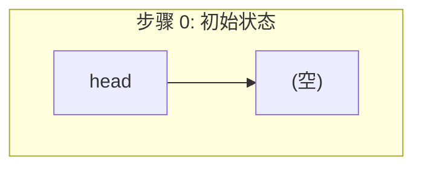

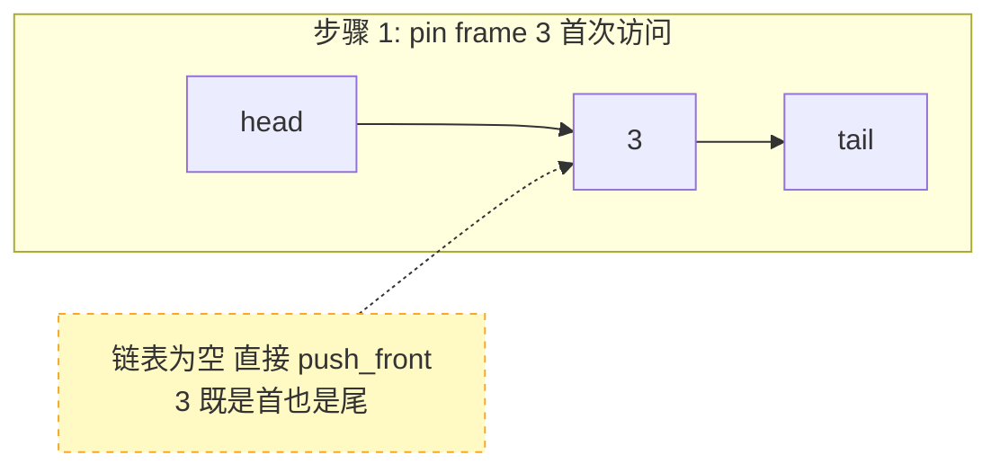

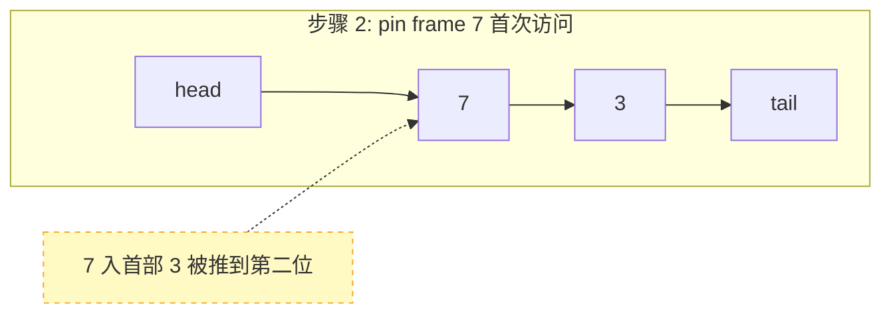

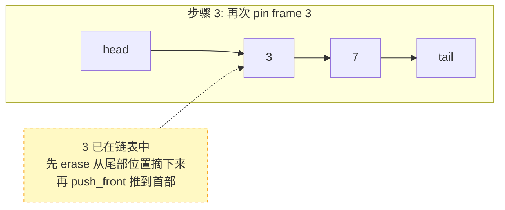

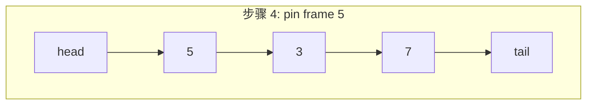

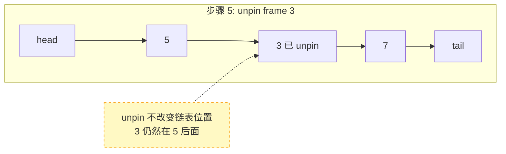

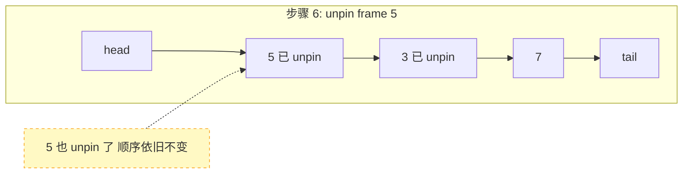

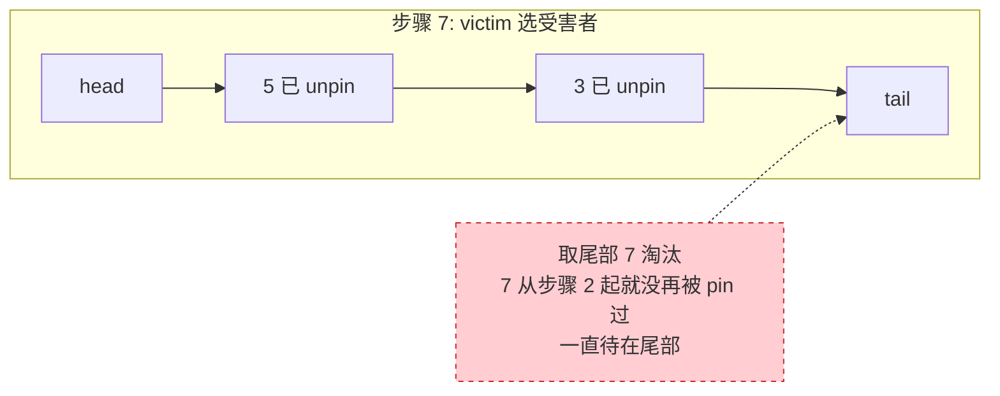

步骤 7 中 victim 选了 frame 7 而不是 3，为什么？因为 5 和 3 虽然都 unpin 了，但**3 在步骤 3 被重新 pin 过**，被推到了前面，而 7 从步骤 2 之后就没再被 pin 过，一直待在链表尾部——**谁最久没被访问，谁在尾部**。

#### pin、unpin、victim 三者的分工

| 方法 | 改链表位置？ | 做什么 | 口诀 |
|------|:--------:|------|------|
| `pin` | 是 | 把 frame 推到链表首部 | "刚用过，排最前" |
| `unpin` | 否 | 不改变位置，只标记"可淘汰" | "用完了，可以踢" |
| `victim` | 是 | 取链表尾部，删除它 | "最久没用的，淘汰" |

- **pin 负责排序**：每次 pin 都把 frame 推到头部，时间越近越靠前
- **unpin 负责放行**：不改变顺序，只标记"可淘汰"。不用链表位置来区分"是否可淘汰"，因为顺序另有他用
- **victim 负责淘汰**：链表尾部就是"最早 pin 且之后一直没再 pin 过的"那个

> **问：victim() 只从尾部取，没有检查 frame 7 是否还在使用。万一 7 还没 unpin 就被淘汰了怎么办？**
>
> 框架的 `LRUReplacer::unpin()` 确实是空函数——它完全不维护"谁可以淘汰、谁不可以淘汰"的状态。LRU 链表里**所有被访问过的 frame 都在**，不论 pin_count 是几。那安全网在哪？
>
> **安全网在缓冲池的 `find_victim_page`，不在 Replacer 内部。**
>
> 回看 [05. 单实例缓冲池](./05-buffer-pool-single.md) 的源码，`find_victim_page` 在调用 `replacer_->victim()` 之前，缓冲池已经持有了 `latch_` 锁。同一时刻只有一个线程在执行 `fetch_page`，而该线程在调用 `victim()` 后立即对 victim frame 执行 `update_page`。
>
> 但这不是关键——关键是：框架实现中 victim 确实可能选中一个 pin_count > 0 的 frame。框架的 LRUReplacer **没有区分"在用"和"可淘汰"**，它只是一个纯访问顺序记录器。这是框架实现的一个简化点：它假设"最久没被访问的 frame，大概率 pin_count 也归零了"。在单线程或低并发场景下这个假设成立，但在高并发下确实可能出问题。
>
> 正确的实现应该像 ClockReplacer：`pin()` 增加 `pin_counter_`（标记在用），`unpin()` 减少（标记可淘汰），`victim()` 只选 `pin_counter_ == 0` 的 frame。这就是为什么参考实现改用了 ClockReplacer——它不仅省了链表开销，更正确地隔离了"在用"和"可淘汰"两类 frame。

### 方法实现

**pin(frame_id)**：frame 被访问了，把它移到链表首部。

```cpp
// db2026-x/src/replacer/lru_replacer.cpp:44
void LRUReplacer::pin(frame_id_t frame_id) {
    auto it = LRUhash_.find(frame_id);      // 1. 查哈希: 这个 frame 是否已在链表中?
    if (it != LRUhash_.end()) {
        LRUlist_.erase(it->second);         // 2a. 已存在 → 从原位置摘下来
    }
    LRUlist_.push_front(frame_id);          // 3. 推到 / 插入到链表首部
    LRUhash_[frame_id] = LRUlist_.begin();  // 4. 更新哈希映射到新位置
}
```

分两种情况：

| 情况 | 例子 | LRUhash 能找到？ | 链表操作 | 效果 |
|------|------|:---:|------|------|
| **首次 pin** | `pin(7)`，7 从未在链表中 | 否 | `push_front(7)` | 在首部插入一个新节点 |
| **再次 pin** | `pin(3)`，3 已在链表某个位置 | 是 | `erase` + `push_front(3)` | 把 3 从原位置摘下来，重新插到首部 |

不管哪种情况，最终 frame_id 一定在链表首部。这就是 LRU 的"最近用了往前排"。

**unpin(frame_id)**：frame 不再被使用（pin_count 归零），可以被淘汰了：

```cpp
// db2026-x/src/replacer/lru_replacer.cpp:60
void LRUReplacer::unpin(frame_id_t frame_id) {
    // 注意：unpin 不改变链表位置！
    // 链表顺序由 pin（访问）决定，unpin 只是"放行"
}
```

**victim(frame_id)**：选一个受害者。逻辑很简单——直接取链表尾部：

```cpp
// db2026-x/src/replacer/lru_replacer.cpp:22
bool LRUReplacer::victim(frame_id_t* frame_id) {
    if (LRUlist_.empty()) return false;         // 没有可淘汰的
    *frame_id = LRUlist_.back();                // 取尾部，即最久未访问的
    LRUlist_.pop_back();                        // 从链表删除
    LRUhash_.erase(*frame_id);                  // 从哈希表同步删除
    return true;
}
```

回想上文分步演示的步骤 7：调用 `victim()` 时链表是 `[5] → [3] → [7]`，`back()` 返回 7——因为 7 从步骤 2 被 pin 之后就没再被碰过，一直待在尾部。pop_back 后链表变成 `[5] → [3]`，7 从哈希表中也一并删除。

## ClockReplacer

参考实现没有用 LRU，而是用了**时钟算法（Clock Algorithm）**。这是一种 LRU 的近似实现，性能更好（不需要频繁移动链表节点）。

### 数据结构

```cpp
// src/replacer/lru_replacer.h:51-92（参考实现）
class ClockReplacer : public Replacer {
  int pin_counter_[BUFFER_POOL_INSTANCE_SIZE];   // 每个 frame 的 pin 计数
  bool pin_[BUFFER_POOL_INSTANCE_SIZE];          // 引用位（clock 位）
  int pointer_ = 0;                               // 时钟指针
};
```

### 工作原理

时钟算法维护一个循环指针 `pointer_`，像时钟指针一样循环扫描：

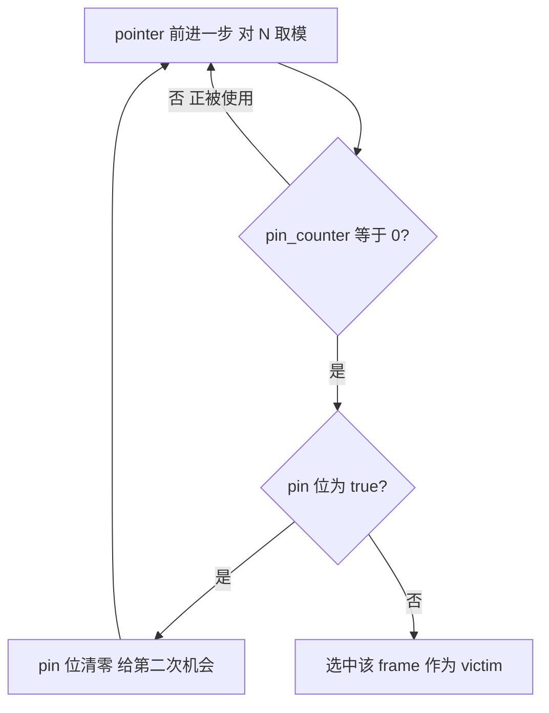

**实例**：假设 pointer 当前在 frame 3，要找一个受害者：

```
pointer → frame 3: pin_counter=0, pin=true  → pin=false, 跳过
          frame 4: pin_counter=1 (被pin着)   → 跳过
          frame 5: pin_counter=0, pin=false → 选中！淘汰 frame 5
```

### 为什么用 Clock 而不是 LRU？

| 方面 | LRUReplacer | ClockReplacer |
|------|------------|---------------|
| 数据结构 | 双向链表 + 哈希表 | 固定大小数组 |
| pin 操作 | 移动链表节点（O(1) 但涉及指针操作和内存分配） | `pin_counter_[id]++`（纯数组操作） |
| victim 操作 | 取尾部（O(1)） | 最多扫描 2 圈（O(N) 但 N 小） |
| 内存 | 链表节点有额外开销 | 数组，无额外开销 |
| 精确度 | 精确 LRU | 近似 LRU |

参考实现选 Clock 的原因：每个 Instance 只有 4096 个 frame，扫描成本低；数组操作比链表快得多；没有内存分配开销。

## 替换器与缓冲池的协作流程

回顾 [04](./04-buffer-pool-overview.md) 的 fetch_page 流程和 [05](./05-buffer-pool-single.md) 的源码实现，Replacer 在其中扮演三个角色。以下是 BufferPool 调用 Replacer 的时机和触发条件：

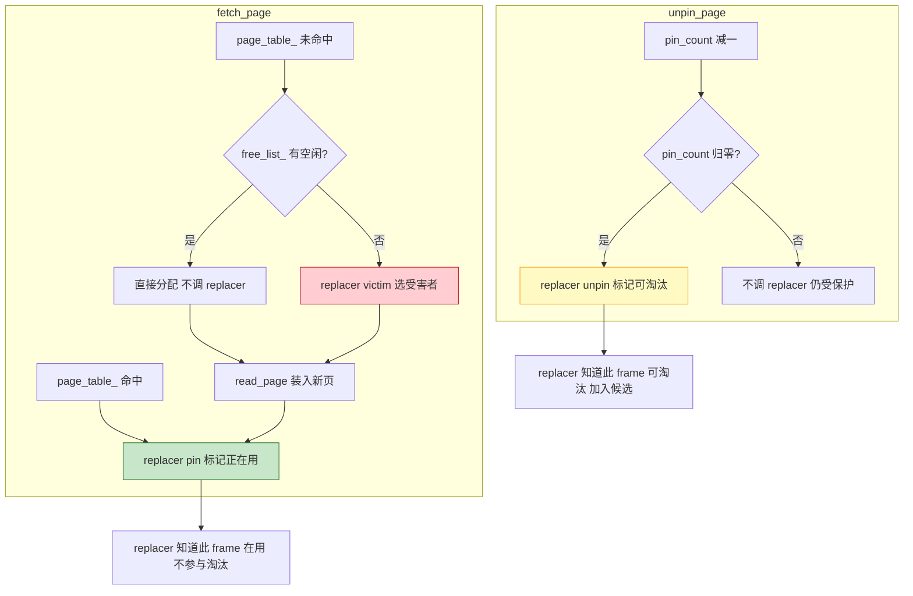

> **图例：** <span style="color:#2e7d32">■</span> pin — 标记在用 &nbsp; <span style="color:#c62828">■</span> victim — 选受害者淘汰 &nbsp; <span style="color:#f9a825">■</span> unpin — 标记可淘汰

Replacer 就像一个"页面户口本"：缓冲池通过 `pin` 告知"这页有人用"，通过 `unpin` 告知"这页没人用了"，需要淘汰时通过 `victim` 查询"户口本上最久没人用的那个"。

## 小结

- Replacer 接口只有 3 个方法：`pin`（标记在用）、`unpin`（标记可淘汰）、`victim`（选受害者）
- LRU 用双向链表维护访问顺序，精确但开销大
- Clock 用数组 + 循环指针近似 LRU，简单高效
- 参考实现选择 Clock，因为每个 Instance 规模小（4096 frame），近似 LRU 足够好

下一节：[08. Page Guard RAII 机制](./08-page-guard.md)
