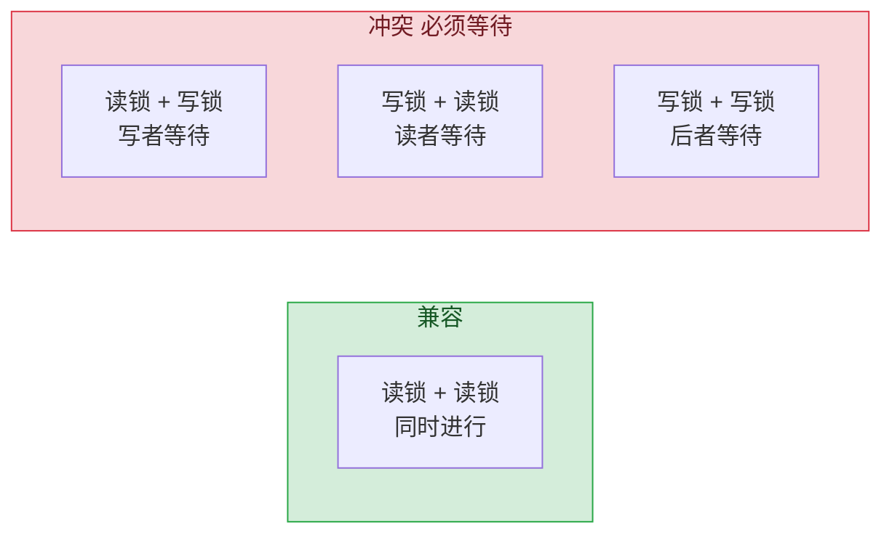
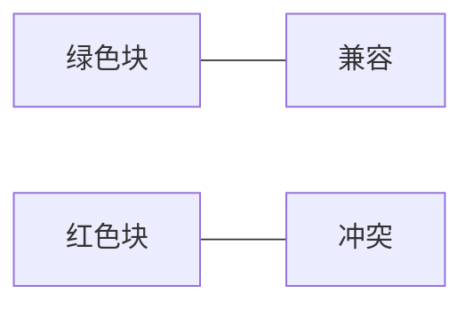
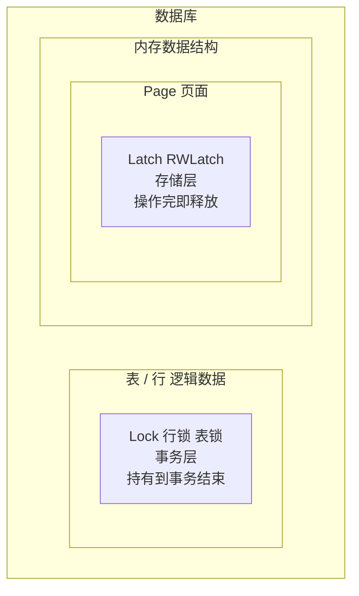
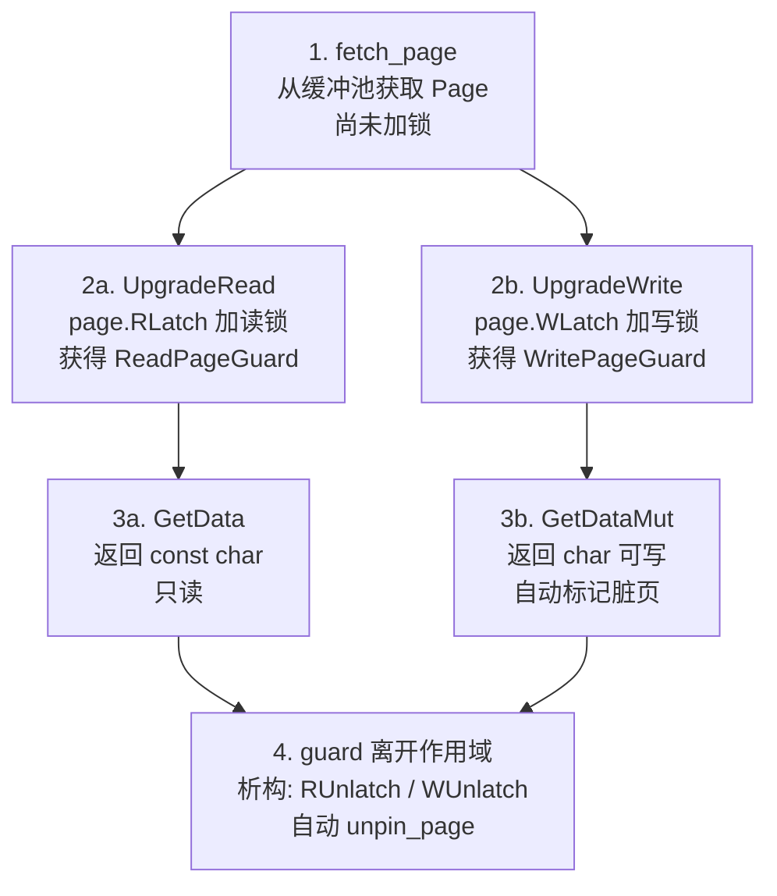
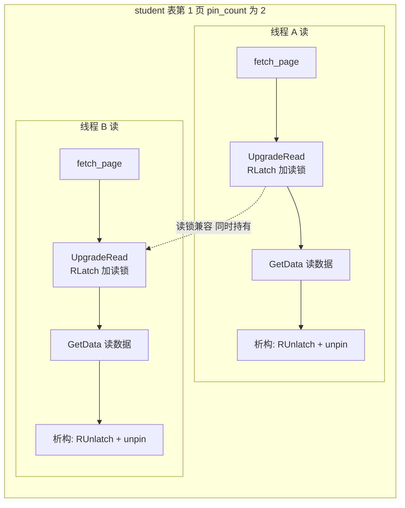
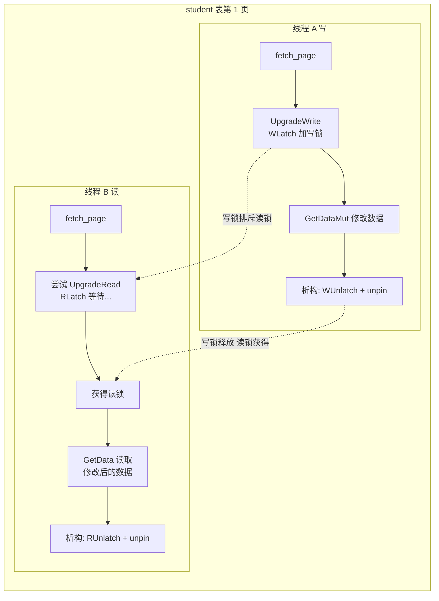

# 07. RWLatch 读写锁

## 概述

RWLatch 是存储层最底层的并发控制原语。它是对 C++ 标准库 `std::shared_mutex` 的简单封装，为 Page 对象提供**读写锁**能力。

## 前置知识

### 为什么要读写锁？

普通的 `std::mutex` 是**互斥锁**——不管读还是写，都独占。但实际上：

- **多个读操作可以同时进行**（读不影响数据，谁都改不了数据）
- **写操作必须独占**（写的时候其他读或写都要等待）
- **读和写不能同时进行**（读到一半被改了，数据不一致）

读写锁（Shared-Exclusive Lock）正是为此设计：

| 操作 | 锁类型 | 与谁兼容 |
|------|--------|----------|
| 读 | 共享锁（Shared Lock） | 与其他读操作兼容（多人同时读） |
| 写 | 排他锁（Exclusive Lock） | 不与任何人兼容（独占） |





## 数据结构与实现

RWLatch 极其简单，就是 `std::shared_mutex` 的薄封装（`rwlatch.h` 全文仅 24 行）：

```cpp
// src/storage/rwlatch.h
class RWLatch {
 public:
  void WLock()   { mutex_.lock(); }         // 加写锁（排他）
  void WUnlock() { mutex_.unlock(); }

  void RLock()   { mutex_.lock_shared(); }   // 加读锁（共享）
  void RUnlock() { mutex_.unlock_shared(); }

 private:
  std::shared_mutex mutex_;
};
```

`RWLatch` 内部只有一个成员变量 `std::shared_mutex mutex_`，这一个对象同时提供**两种锁定模式**：

| 模式 | 调用的方法 | 语义 |
|------|-----------|------|
| 排他锁（当互斥锁用） | `mutex_.lock()` / `mutex_.unlock()` | 同一时刻只有一个线程持有，排斥所有其他线程 |
| 共享锁（当读锁用） | `mutex_.lock_shared()` / `mutex_.unlock_shared()` | 多个线程可同时持有，但和排他锁互斥 |

关键规则：
- **共享锁之间兼容**——多个线程可以同时 `lock_shared()`
- **共享锁与排他锁互斥**——有一方持有时，另一方必须等待

所以 `std::shared_mutex` 本身就是一个"二合一"锁。`RWLatch` 只是给两类操作起了更直白的名字——`WLock` / `WUnlock` 走排他通道，`RLock` / `RUnlock` 走共享通道。

四个方法的命名含义：

| 方法 | 全称 | 含义 |
|------|------|------|
| `WLock` | Write Lock | 获取写锁（排他锁），修改数据前调用 |
| `WUnlock` | Write Unlock | 释放写锁 |
| `RLock` | Read Lock | 获取读锁（共享锁），读取数据前调用 |
| `RUnlock` | Read Unlock | 释放读锁 |

## 锁的级别

DBMS 中的锁按**保护对象**和**持有时间**分不同级别：

| 级别 | 名称 | 保护对象 | 持有时间 | 示例 |
|------|------|----------|----------|------|
| 最底层 | Latch（闩 shuān 锁） | 内存数据结构（页面、链表等） | 微秒~毫秒，操作完即释放 | `RWLatch`、`mutex` |
| 中层 | Lock（锁） | 逻辑数据（行、表等） | 毫秒~秒，事务结束时释放 | 行锁、表锁（事务层讲） |
| 最顶层 | 全局锁 | 整个数据库 | 秒~分钟 | 全库备份锁（暂不涉及） |

三层锁的从属关系——越往外层保护范围越大、持有时间越长：



`RWLatch` 的命名刻意用了 **Latch** 而不是 Lock，因为它处于最底层——只保护一个 Page 对象在内存中的并发访问，不管这个 Page 上的数据在逻辑上属于哪个表、哪些行。逻辑层面的锁（行锁、表锁）由事务层负责，后续讲到事务时再展开。

> **补充**：类名叫 `RWLatch`，但内部方法叫 `WLock`/`WUnlock`/`RLock`/`RUnlock`——这是因为底层调用的是 `std::shared_mutex` 的 `lock()`/`unlock()`/`lock_shared()`/`unlock_shared()`，方法名沿用了标准库的命名习惯。到了 Page 类的封装层（`WLatch()`/`WUnlatch()` 等），又统一回了 Latch 命名。

## RWLatch 在 Page 中的集成

每个 Page 对象都有一个 RWLatch 成员（`page.h:96`）：

```cpp
class Page {
  RWLatch rwlatch_;         // 每个页面自己的读写锁

  inline void WLatch()   { rwlatch_.WLock(); }
  inline void WUnlatch() { rwlatch_.WUnlock(); }
  inline void RLatch()   { rwlatch_.RLock(); }
  inline void RUnlatch() { rwlatch_.RUnlock(); }
};
```

> **注意**：框架版本的 Page 没有 RWLatch 成员，也没有这四个方法。这说明框架设计时没有考虑页级别的并发控制。

## 完整的页面并发访问流程

结合 Page Guard 和 RWLatch，一次完整的并发安全页面访问：



**实例**：两个线程同时访问 student 表第 1 页。

**场景一：两个线程都读**——读锁兼容，同时进行：



**场景二：一个写一个读**——写锁排斥读锁，读者必须等待：



## 框架 vs 参考实现

| 方面 | 框架 `db2026-x/` | 参考实现 `src/` |
|------|-----------------|-----------------|
| RWLatch 类 | 不存在 | `src/storage/rwlatch.h`（24 行） |
| Page 读写锁 | 无 | `RWLatch rwlatch_` 成员 + 4 个方法 |
| 读并发 | 无保护（可能读到脏数据） | 多读并发安全 |
| 写保护 | 无保护（可能写冲突） | 写独占安全 |

## 小结

- RWLatch 实现了读写锁：多个读者可同时访问，写者独占
- 每个 Page 持有一个 RWLatch，实现页面级别的并发控制
- 与 Page Guard 配合：Guard 在构造时自动加锁，析构时自动释放锁和 unpin
- 框架中完全没有这个模块，参考实现**从零实现**

下一节：[08. 存储层实例串讲](./08-storage-structure-example.md)

存储层的完整总结见：[09. 存储层总结](./09-storage-layer-summary.md)
