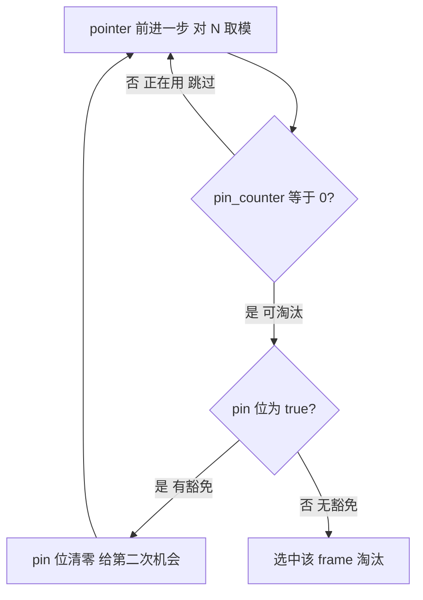

# 08. Clock 时钟替换算法

## 问题：LRU 的不足

[07. LRU](./07-lru-replacer.md) 中的 `LRUReplacer` 用双向链表 + 哈希表精确维护访问顺序，但它有两个代价：

- **每次 pin/unpin 都操作链表**：erase、push_front 涉及指针修改和可能的动态内存分配
- **每个链表节点有额外内存开销**：双向链表的每个节点需要两个指针（prev/next）

参考实现把一个大缓冲池拆成了 16 个 Instance（[06. 多实例缓冲池](./06-buffer-pool-multi.md)），每个只有 4096 个 frame。在这个规模下，不需要 LRU 那么精确——用一个更轻量的近似算法就够了。这就是 **Clock 时钟算法**。

## 数据结构

```cpp
// src/replacer/lru_replacer.h:51-92（参考实现）
class ClockReplacer : public Replacer {
  int pin_counter_[BUFFER_POOL_INSTANCE_SIZE];   // 每个 frame 的 pin 计数
  bool pin_[BUFFER_POOL_INSTANCE_SIZE];          // 引用位 / 二次机会位
  int pointer_ = 0;                               // 时钟指针（游标）
};
```

三个成员的含义：

| 成员 | 类型 | 作用 |
|------|------|------|
| `pin_counter_[i]` | `int` 数组 | frame i 当前被 pin 的次数。大于 0 = 正在使用，等于 0 = 可淘汰 |
| `pin_[i]` | `bool` 数组 | frame i 的"引用位"。`true` = 最近被访问过（给一次豁免），`false` = 没有豁免 |
| `pointer_` | `int` | 时钟指针，从 0 开始循环扫描，每次 victim 从上次停下的位置继续 |

**和 LRU 的关键区别**：

- LRU 链表只存"可淘汰的 frame"
- Clock 的 `pin_counter_` 和 `pin_` 数组覆盖了**全部 frame**（0 到 BUFFER_POOL_INSTANCE_SIZE-1），不管是否可淘汰
- Clock 通过 `pin_counter_ == 0` 来判断"可淘汰"，不需要单独维护一个链表

## 三个方法的逻辑

### pin：标记正在使用

```cpp
// src/replacer/lru_replacer.h:77-79（参考实现）
void pin(frame_id_t frame_id) override {
    ++pin_counter_[frame_id];                // pin 计数 +1
    if (pin_counter_[frame_id] == 1)         // 如果是首次 pin（从 0 变 1）
        pin_[frame_id] = true;               // 设置引用位 = true，表示"被访问过"
}
```

- `pin_counter_` 和缓冲池的 `pin_count_` 不是同一个东西——后者在 Page 对象里，前者在 ClockReplacer 数组里。两者数值应该一致，但各管各的。

- `pin_[i] = true` 的含义是：frame i **曾经被访问过**，victim 扫描到它时会宽容一次。**但宽容的前提是 `pin_counter_ == 0`（frame 没有被 pin 着）**——如果 frame 正在使用中（`pin_counter_ > 0`），victim 直接跳过，根本不会去看 `pin_` 的值。

### unpin：标记可淘汰

```cpp
// src/replacer/lru_replacer.h:82（参考实现）
void unpin(frame_id_t frame_id) override {
    --pin_counter_[frame_id];                // pin 计数 -1
}
```

简单到只有一行——减到 0 就表示 frame 不再被使用。注意 `pin_` 引用位**不会在 unpin 时清零**，它保留着"曾经被访问过"的记录，供 victim 使用。

> **问：`pin_counter_` 会减成负数吗？**
>
> 正常不会。ClockReplacer 自己没有防负数检查（就一行 `--`），安全网在缓冲池的 `unpin_page` 方法里：它先检查 `pin_count_ == 0` 就直接 return false，只有 `pin_count_` 从 1 减到 0 时才调 `replacer_->unpin()`。所以 pin 和 unpin 的调用次数是严格配对的——每次 unpin 一定对应之前的一次 pin。但如果缓冲池有 bug（比如对同一页重复 unpin），`pin_counter_` 确实可能被减成负数，ClockReplacer 自身不做防御。

> **工程经验**：虽然逻辑上保证了 `pin_counter_` 不会为负，但从代码健壮性角度，`unpin()` 里加一行 `if (pin_counter_[frame_id] > 0)` 再 `--` 是更好的做法。理由有三：
>
> 1. **调用方可能犯错**：ClockReplacer 不控制谁调用它，未来如果有新代码绕过缓冲池直接调 unpin，负数 bug 极难排查
> 2. **"信任调用方"的假设会随时间失效**：今天缓冲池的调用逻辑是正确的，明天有人重构 `unpin_page` 可能无意间打破这个假设
> 3. **防御一行，调试省一天**：`if (pin_counter_[frame_id] > 0)` 只多一行代码，但万一出问题，bug 会在 ClockReplacer 内部暴露（pin_counter 异常），而不是在 victim 扫描时以诡异方式表现出来
>
> 框架代码为了简洁省略了这类防御，实际工程中值得加上。

### victim：选受害者

```cpp
// src/replacer/lru_replacer.h:61-75（参考实现）
bool victim(frame_id_t* frame_id) override {
    int steps = 0;
    do {
        pointer_ = (pointer_ + 1) % BUFFER_POOL_INSTANCE_SIZE;  // 1. 指针前移
        if (pin_counter_[pointer_] == 0 && pin_[pointer_] == 0) { // 2. 可淘汰且无豁免
            *frame_id = pointer_;
            return true;
        }
        if (pin_counter_[pointer_] == 0) {   // 3. 可淘汰但有豁免 → 清零豁免，给第二次机会
            pin_[pointer_] = false;
        }
        ++steps;
    } while (steps < 2 * BUFFER_POOL_INSTANCE_SIZE);  // 4. 最多扫两圈
    return false;                            // 5. 两圈都没找到，放弃
}
```

逐行解读：

1. **指针循环前移**：`pointer_ = (pointer_ + 1) % N`，到数组末尾后回到 0
2. **第一关：`pin_counter_ > 0`** → 正在使用，直接跳过，不关心 pin_ 的值
3. **第二关：`pin_counter_ == 0 && pin_ == true`** → 可淘汰但有豁免 → 清零 pin_，给第二次机会，继续扫描
4. **命中：`pin_counter_ == 0 && pin_ == false`** → 可淘汰且无豁免 → 直接选中返回
5. **最多扫两圈**：防止死循环，两圈后还没找到就返回 false



### pin 和 unpin 配合的完整周期

```
frame 3 被访问 → pin(3):    pin_counter_[3] = 1,  pin_[3] = true
frame 3 用完了 → unpin(3):  pin_counter_[3] = 0,  pin_[3] = true  （引用位保留！）
frame 3 再次访问 → pin(3):  pin_counter_[3] = 1,  pin_[3] = true  （已在 true，不变）
frame 3 又用完 → unpin(3):  pin_counter_[3] = 0,  pin_[3] = true  （引用位还在）
```

关键点：`pin_[i]` 只在 pin 从 0→1 时设为 true，unpin 不清零。清零只在 victim 扫描时发生。

> **强调：`pin_[i] = true` 的"宽容"只在 `pin_counter_ == 0` 时才生效。** 如果 frame 正在被使用（`pin_counter_ > 0`），victim 直接跳过它，根本不会去看 `pin_` 的值。Clock 的优先级是：
> 1. `pin_counter_ > 0` → 在用，无条件跳过
> 2. `pin_counter_ == 0 && pin_ == true` → 可淘汰，但给一次豁免（清零 pin_，下一轮再淘汰）
> 3. `pin_counter_ == 0 && pin_ == false` → 可淘汰且无豁免，直接选中

## 分步演示

假设 `BUFFER_POOL_INSTANCE_SIZE = 8`（实际是 4096，这里简化），初始状态所有 frame 的 `pin_counter_` 和 `pin_` 都是 0。`pointer_` 初始为 7（即将从 0 开始）。

**步骤 0：初始状态**

| frame | pin_counter | pin | 说明 |
|-------|:----------:|:---:|------|
| 0 | 0 | false | 空闲 |
| 1 | 0 | false | 空闲 |
| 2 | 0 | false | 空闲 |
| 3 | 0 | false | 空闲 |
| 4 | 0 | false | 空闲 |
| 5 | 0 | false | 空闲 |
| 6 | 0 | false | 空闲 |
| 7 | 0 | false | 空闲 |

`pointer_ = 7`（下次从 0 开始扫描）

**步骤 1：frame 3 被访问并 unpin**

```
pin(3):  pin_counter_[3] = 1,  pin_[3] = true   （首次 pin，设引用位）
unpin(3): pin_counter_[3] = 0                    （用完了）
```

| frame | pin_counter | pin |
|-------|:----------:|:---:|
| 3 | 0 | **true** |

**步骤 2：frame 7 被访问并 unpin**

```
pin(7):  pin_counter_[7] = 1,  pin_[7] = true
unpin(7): pin_counter_[7] = 0
```

frame 3 和 7 都可淘汰，且都有引用位。

**步骤 3：frame 3 再次被访问并 unpin**

```
pin(3):  pin_counter_[3] = 1,  pin_[3] = true   （已经在 true，不变）
unpin(3): pin_counter_[3] = 0
```

frame 3 的引用位仍然是 true——它最近被用过。

**步骤 4：frame 5 被访问并 unpin**

```
pin(5):  pin_counter_[5] = 1,  pin_[5] = true
unpin(5): pin_counter_[5] = 0
```

现在 frame 3、5、7 都是 pin_counter=0，pin=true。frame 2 是被 pin 着的（pin_counter=1）：

| frame | 0 | 1 | 2 | 3 | 4 | 5 | 6 | 7 |
|-------|:-:|:-:|:-:|:-:|:-:|:-:|:-:|:-:|
| pin_counter | 0 | 0 | 1 | 0 | 0 | 0 | 0 | 0 |
| pin | - | - | true | true | - | true | - | true |

**步骤 5：调用 victim 选受害者**

pointer_ 从 7 → 0 开始扫描：

```
pointer=0: pin_counter=0, pin=false → 选中！返回 frame 0
```

等等，这样 frame 0 会被选中，但 frame 3、5、7 都有引用位，它们应该比 frame 0 更"安全"。这就是 Clock 的"二次机会"机制。

如果 frame 0 实际上也是空闲的（从未被用过），那选它是合理的。但如果所有 frame 都有 pin=true，那第一轮扫描会把所有 pin 清零，第二轮才真正淘汰：

```
第一轮: 0→false淘汰 或 0→7 全清零
第二轮: 回到0，此时所有pin都是false，直接选中0
```

**实际的 victim 扫描（假设 frame 1~7 的 pin 都是 true）：**

```
pointer=0: pin_counter=0, pin=false → 直接淘汰 frame 0
```

如果 frame 0 的 pin 也是 true：
```
pointer=0: pin_counter=0, pin=true → pin=false（清零），继续
pointer=1: pin_counter=0, pin=true → pin=false，继续
...
pointer=7: pin_counter=0, pin=true → pin=false，继续
pointer=0: pin_counter=0, pin=false → 淘汰 frame 0！
```

**这就是"二次机会"的精髓**：被访问过的 frame 会多活一轮扫描，只有连续两轮都没被访问才会被淘汰。

## Clock vs LRU 对比

| 方面 | LRUReplacer | ClockReplacer |
|------|------------|---------------|
| 数据结构 | 双向链表 + 哈希表 | 两个定长数组 + 一个整数游标 |
| 链表/数组存什么 | 只存可淘汰的 frame | 覆盖**全部** frame（用 pin_counter 区分） |
| pin 操作 | 查哈希 → erase 链表节点 O(1) | `pin_counter_[id]++` 纯数组 O(1) |
| unpin 操作 | 查哈希 → push_front O(1) | `pin_counter_[id]--` 纯数组 O(1) |
| victim 操作 | 取链表尾部 O(1) | 最多扫 2 圈 O(N) |
| 内存分配 | 链表节点动态分配 | 零动态分配 |
| 精确度 | 精确 LRU | 近似 LRU（二次机会） |
| 内部锁 | 自带 `std::mutex` | 无锁（Instance 的 latch_ 已保护） |

### LRU 的优缺点

**优点**：精确维护访问顺序，victim 选中的一定是最久未用的，淘汰质量最高。链表只要存"可淘汰的"frame，节点数通常远小于缓冲池容量，内存占用小。

**缺点**：每次 pin/unpin 都涉及链表指针操作和哈希表查找，虽然 O(1) 但常数大。链表节点动态分配可能触发内存碎片。内部 `std::mutex` 带来额外锁开销（即使调用方已持有外层锁）。

**潜在问题**：链表 + 哈希两套结构必须严格同步——pin 删链表也必须删哈希，否则悬挂指针；unpin 加链表也必须加哈希。维护成本高，容易出 bug。

### Clock 的优缺点

**优点**：纯数组操作，极低的常数开销，零动态分配。内部无锁，不会和外层 latch_ 产生嵌套锁开销。实现极其简单——pin 和 unpin 各只有一两行代码。

**缺点**：victim 需要循环扫描，最坏 O(2N)，在缓冲池很大时（如单实例 65536 frame）扫描成本不可忽略。只是近似 LRU，"二次机会"在某些访问模式下可能做出不合理的淘汰决策——比如某个 frame 很久没被访问但因引用位侥幸躲过，而另一个稍微更近但引用位已被清零的却被淘汰。

**潜在问题**：`pointer_` 是全局游标，上次停在哪里，下次就从哪里继续。如果长时间没有调用 victim，指针始终不动，无法反映最新的访问情况。另外"最多扫两圈"是硬上限，如果两圈内全是 `pin_counter_ > 0` 的 frame（都在使用中），victim 会返回 false 导致缓冲池无法装入新页。

### 为什么参考实现选 Clock

参考实现权衡后选择 Clock，因为在这个场景下它的缺点被规避了：

1. **分区小**：每个 Instance 只有 4096 frame，victim O(N) 的上限也只有 8192 次扫描，远没到不可接受的程度
2. **多实例 + 频繁调用**：16 个 Instance 各自独立加锁，高频的 pin/unpin 操作常数越小越好——Clock 的纯数组操作正好命中这个需求
3. **简单 = 可靠**：实现越短 bug 越少，教学和竞赛场景下有实际价值

如果场景换成一个单实例 65536 frame 的大缓冲池且访问模式复杂，LRU 可能更合适。**没有绝对更好的方案，只有更适合某个场景的方案。**

## 小结

- Clock 用 `pin_counter_` 区分"在用"和"可淘汰"，用 `pin_`（引用位）实现"二次机会"近似 LRU
- `pin` = `pin_counter_++` + 首次时设引用位，`unpin` = `pin_counter_--`，`victim` = 循环扫描
- 被访问过的 frame 获得一次豁免：引用位为 true 时不淘汰，清零后多活一轮
- 比 LRU 更轻量：纯数组操作，零动态分配，适合分区小池子

下一节：[09. Page Guard RAII 机制](./09-page-guard.md)
