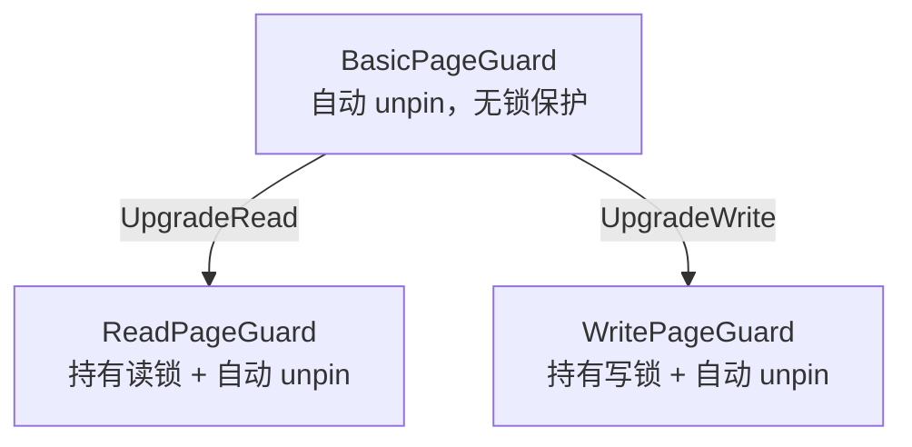

# 08. Page Guard（RAII 页面守卫）

## 问题

缓冲池要求每个 `fetch_page` 之后必须成对调用 `unpin_page`。如果代码逻辑复杂、有多个提前返回路径或抛出异常，很容易忘记 unpin，导致页面永远无法被淘汰（内存泄漏）。

```cpp
// 危险！如果中间抛异常，unpin_page 永远不会被调用
Page* page = buffer_pool_manager->fetch_page(page_id);
// ... 复杂逻辑，可能抛异常 ...
buffer_pool_manager->unpin_page(page_id, false);  // 可能走不到这行
```

## RAII 解决方案

**RAII（Resource Acquisition Is Initialization，资源获取即初始化）**是 C++ 的核心惯用法：在构造函数中获取资源，在析构函数中释放资源。Page Guard 正是把这个模式应用到页面管理上。

### 调用方对比

```cpp
// 不用 Guard（手动管理，危险）
Page* page = bpm->fetch_page(page_id);
// ... 用 page ...
bpm->unpin_page(page_id, true);  // 容易忘记

// 用 BasicPageGuard（自动 unpin，安全）
auto guard = bpm->fetch_page(page_id);
// ... 用 guard.GetData() ...
// guard 离开作用域 → 析构函数自动 unpin
```

## 三层 Guard 体系



### BasicPageGuard

```cpp
// src/storage/page_guard.h:14-61
class BasicPageGuard {
  BufferPoolManager* bpm_{nullptr};
  Page* page_{nullptr};
  bool is_dirty_{false};
};
```

析构时自动 unpin（`page_guard.cpp:44`）：

```cpp
BasicPageGuard::~BasicPageGuard() { Drop(); }

void BasicPageGuard::Drop() {
    if (bpm_ && page_) {
        bpm_->unpin_page(page_->get_page_id(), is_dirty_);  // 自动 unpin！
    }
}
```

只读数据用 `GetData()`，修改数据用 `GetDataMut()`（自动标记脏页）：

```cpp
auto GetData() const -> const char* { return page_->get_data(); }

auto GetDataMut() -> char* {
    is_dirty_ = true;                    // 自动标记脏页！
    return page_->get_data();
}
```

### ReadPageGuard

持有页面的**读锁**（共享锁），多个读操作可以同时进行：

```cpp
// 从 BasicPageGuard 升级
auto BasicPageGuard::UpgradeRead() -> ReadPageGuard {
    page_->RLatch();                     // 加读锁
    ReadPageGuard read_guard(bpm_, page_);
    // 转移所有权，BasicPageGuard 不再负责 unpin
    return read_guard;
}

// 析构时先释放读锁，再 unpin
ReadPageGuard::~ReadPageGuard() {
    if (page_) page_->RUnlatch();        // 释放读锁
    guard_.Drop();                       // unpin
}
```

### WritePageGuard

持有页面的**写锁**（排他锁），写操作独占页面：

```cpp
auto BasicPageGuard::UpgradeWrite() -> WritePageGuard {
    page_->WLatch();                     // 加写锁
    WritePageGuard write_guard(bpm_, page_);
    return write_guard;
}

WritePageGuard::~WritePageGuard() {
    if (page_) page_->WUnlatch();        // 释放写锁
    guard_.Drop();                       // unpin
}
```

## 移动语义

Guard 使用了 C++ 的**移动语义（Move Semantics）**——禁止拷贝，只允许移动。这保证了页面所有权始终唯一：

```cpp
BasicPageGuard(const BasicPageGuard&) = delete;           // 禁止拷贝
BasicPageGuard(BasicPageGuard&& that) noexcept;            // 允许移动

auto guard1 = bpm->fetch_page(page_id);  // guard1 拥有页面
auto guard2 = std::move(guard1);         // 所有权转移给 guard2
// guard1 现在是空的，不会 unpin
// guard2 离开作用域时会自动 unpin
```

## 完整使用实例

```cpp
// 场景：修改 student 表中某条记录的年龄
auto basic_guard = buffer_pool_manager->fetch_page({fd:3, page_no:1});

// 升级为写锁守卫（需要修改数据）
auto write_guard = basic_guard.UpgradeWrite();

// 在页面中定位并修改数据
char* data = write_guard.GetDataMut();   // 自动标记脏页
// ... 修改 data 中的记录 ...

// write_guard 离开作用域:
//   1. WUnlatch() 释放写锁
//   2. unpin_page({fd:3, 1}, true) 自动 unpin + 标记脏页
```

## 框架 vs 参考实现

| 方面 | 框架 `db2026-x/` | 参考实现 `src/` |
|------|-----------------|-----------------|
| Page Guard | 不存在 | Basic / Read / Write 三层 |
| 页面释放 | 手动调用 unpin_page | 析构自动 unpin |
| 锁管理 | 无 | 通过 UpgradeRead/UpgradeWrite 自动加锁 |
| 脏页标记 | 手动传 is_dirty 参数 | GetDataMut() 自动标记 |

## 小结

- Page Guard 用 RAII 模式解决了"忘记 unpin"的问题
- 三层设计：Basic（基础 unpin）→ Read（+ 读锁）→ Write（+ 写锁）
- 使用移动语义保证页面所有权唯一，禁止拷贝
- 框架中没有这个模块，参考实现是**从零开始**实现的

下一节：[09. RWLatch 读写锁](./09-rwlatch.md)
