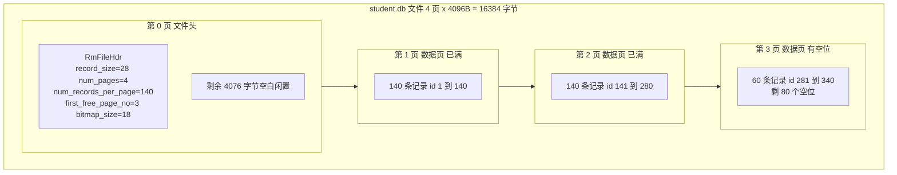
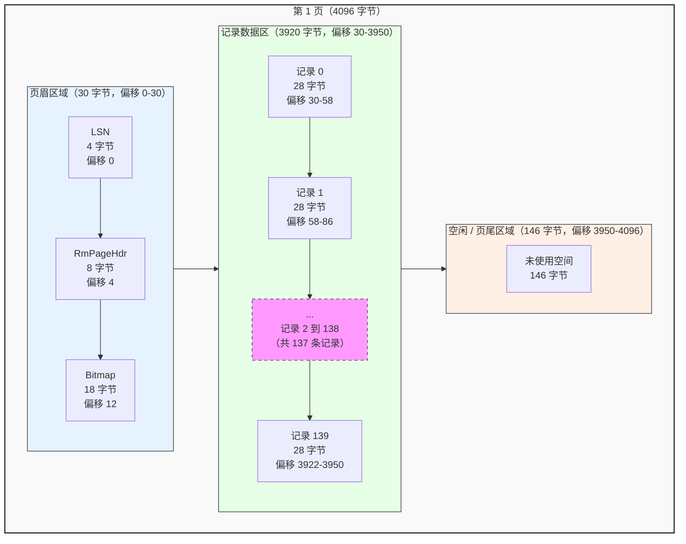
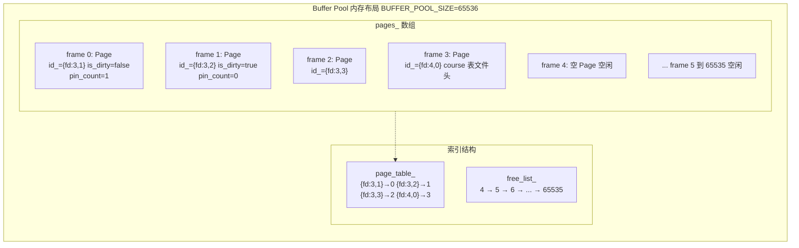
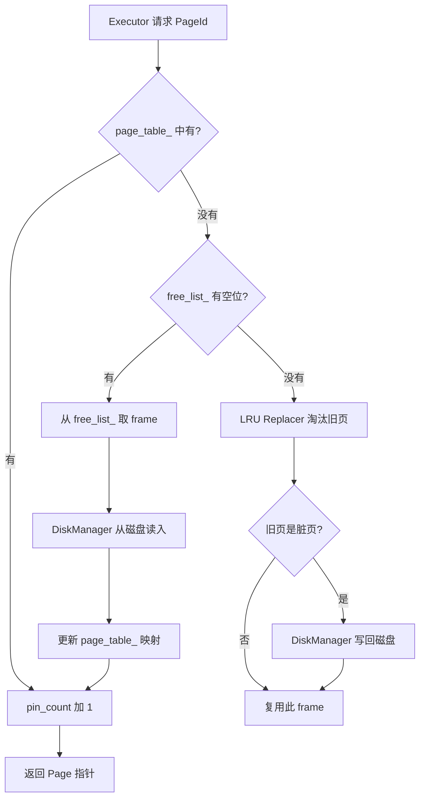
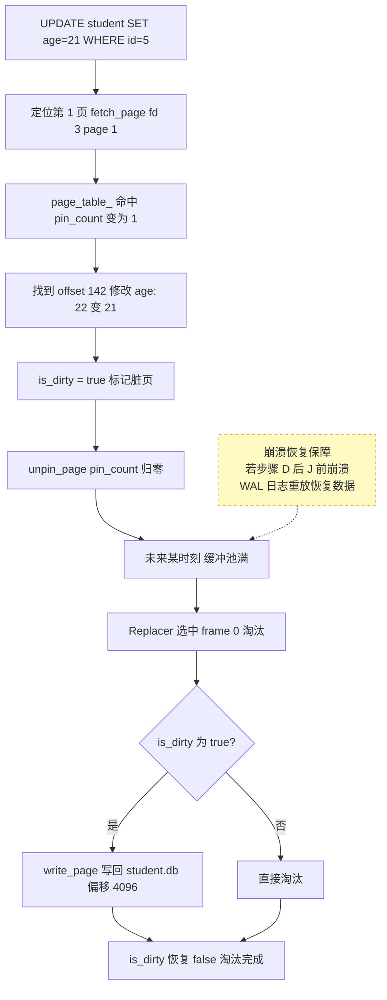
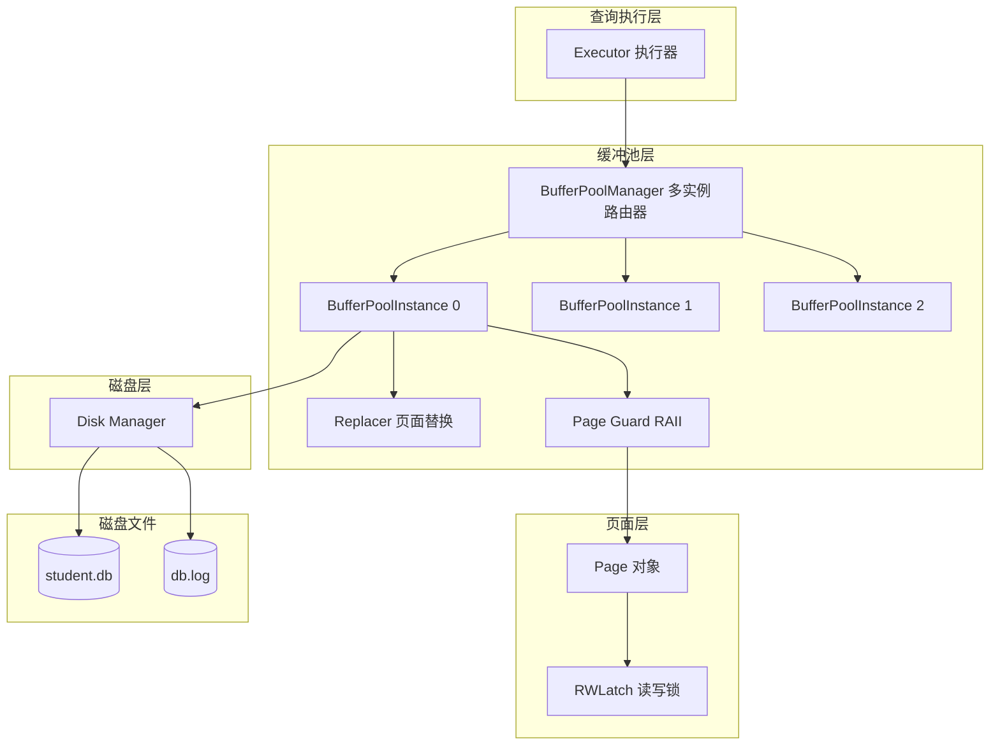

# 08. 存储层实例串讲

## 概述

前面 01~07 逐一讲解了存储层的各个组件。本文用一个具体的实例从头到尾把所有组件串起来，建立整体认知。

**贯穿全文的实例**：

```
数据库：mydb/
表：    student
列：    id INTEGER, name STRING(20), age INTEGER
记录大小：4 + 20 + 4 = 28 字节
数据文件：mydb/student.db（文件描述符 fd = 3）
```

## 磁盘上的数据库长什么样

首先看 `mydb/` 目录下有什么文件：

```
mydb/
├── student.db       # student 表的数据文件（fd=3），每页 4096 字节
│   ├── 第 0 页      # RmFileHdr 文件头（元数据）
│   ├── 第 1 页      # 数据页，存记录
│   ├── 第 2 页      # 数据页
│   ├── 第 3 页      # 数据页，有空位
│   └── ...          # 共 4 页（num_pages = 4）
├── student.idx      # student 表的索引文件（暂不讨论）
└── db.log           # WAL 日志文件
```

`student.db` 文件在磁盘上的完整布局：



**关键设计点**：
- 文件头独占第 0 页，不存实际记录（`RM_FIRST_RECORD_PAGE = 1`）
- 文件头绕过缓冲池，创建/关闭时直接由 Disk Manager 写入
- 数据页从第 1 页开始，走缓冲池管理

## 单页内部结构解剖

以第 1 页为例，放大看它的 4096 字节内部长什么样：

```
第 1 页（4096 字节）的内部结构：

offset  size    内容
──────────────────────────────────────────────────────────────────
0       4       LSN（日志序列号，恢复用）
4       8       RmPageHdr {
                  next_free_page_no = 3   ← 此页已满，下一个有空位的页是第 3 页
                  num_records      = 140  ← 当前已存 140 条
                }
12      18      Bitmap（140 位 = 17.5 字节向上取整 → 18 字节）
                每个 bit 对应一个记录槽，1=已占用，0=空闲
                由于已满，140 个 bit 全是 1
30      3920    记录数据区（28 字节 × 140 条）
                  record[0]: {id:1,  name:"Alice",   age:20}
                  record[1]: {id:2,  name:"Bob",     age:22}
                  record[2]: {id:3,  name:"Charlie", age:21}
                  ...
                  record[139]: {id:140, name:"Zoe",  age:19}
        ────
        4096 字节（30 + 3920 = 3950，剩余 146 字节无法塞下第 141 条记录）
```

用更直观的方式看记录在页内的排列：



**Bitmap 的作用**：快速判断某个槽位是否已占用，以及快速找到空闲槽位。插入时不需要遍历记录内容，直接查 bitmap 空位即可。

> **数据是谁解析的？** 存储层看到的始终是 `char data_[4096]` 原始字节，它不关心里面存了什么。那 `{id:1, name:"Alice", age:20}` 这样的列信息是谁解读出来的？答案是上层的**系统管理（SM）**——SM 知道每张表有哪些列、各列什么类型、每个字段占多少字节、按什么顺序排列，它负责把 `char*` 字节数组"翻译"成有意义的字段值。存储层只管搬运，SM 负责理解。

## 缓冲池在内存中的结构

Buffer Pool 在内存中是一大块预先分配好的 Page 数组。以单实例框架版本为例：



**三个关键数据结构的关系**：

- `frames_[N]`：物理存储，N 是 frame_id，通过 `frames_[frame_id]` 直接访问 Page 对象
- `page_table_`：逻辑索引，`page_table_[PageId] → frame_id`，给定 {fd, page_no} 找到对应 frame
- `free_list_`：空闲 frames 链表，新页面优先从这里分配

**为什么需要 page_table_？** 因为 frames 数组的索引（frame_id）和页面的逻辑标识（PageId）没有固定映射关系。同一页在不同时刻可能落在不同 frame。page_table_ 就是这个动态映射的记录本。

## 读操作完整流程

以 `SELECT * FROM student WHERE id = 5` 为例，看数据如何从磁盘一路到达查询执行器：

```
步骤 0: 初始状态
  缓冲池中已有 student.db 的第 1 页（frame 0）和第 2 页（frame 1）
  第 1 页 pin_count_ = 1（正被另一个查询使用）

步骤 1: Executor 发起请求
  SeqScanExecutor 需要遍历 student 表
  → 调用 fetch_page({fd:3, page_no:1})

步骤 2: 查找 page_table_
  page_table_.find({fd:3, page_no:1})
  → 找到了！frame_id = 0
  → pin_count_++（从 1 变为 2）
  → 直接返回 frames_[0] 的指针

步骤 3: Executor 遍历第 1 页
  遍历 Page->data_ 中的 140 条记录
  → 找到 id=5 的记录：{id:5, name:"Eve", age:22}
  → 返回给客户端

步骤 4: 释放页面
  unpin_page({fd:3, page_no:1})
  → pin_count_--（从 2 变为 1）
  → 因为 pin_count_ 仍 > 0，不淘汰

步骤 5: 请求下一页
  → fetch_page({fd:3, page_no:2})
  → 命中 page_table_，frame_id = 1
  → pin_count_++，遍历，找到 id=141~280
  ... 依此类推直到全表扫描完毕
```

mermaid 流程：



## 写操作完整流程

以 `UPDATE student SET age = 21 WHERE id = 5` 为例：

```
步骤 1: 定位记录所在页面
  id=5 → 在第 1 页（每页 140 条，id 1-140 都在第 1 页）
  → fetch_page({fd:3, page_no:1})
  → page_table_ 命中，pin_count_ = 1

步骤 2: 修改内存中的页面数据
  在 Page->data_ 中找到 offset 30 + (5-1)*28 = offset 142
  → 修改 age 字段: 22 → 21
  → Page->is_dirty_ = true   ← 标记脏页！
  
  此时状态:
    frames_[0]:
      id_ = {fd:3, page_no:1}
      is_dirty_ = true       ← 内存和磁盘不一致了
      pin_count_ = 1
      data_[142] = 21        ← 已修改

步骤 3: 释放页面
  unpin_page({fd:3, page_no:1})
  → pin_count_-- = 0
  → 现在可以被淘汰了

步骤 4: 脏页写回（某个未来时刻）
  缓冲池满了，需要装入新页面
  → LRU Replacer 选择淘汰 frame 0（第 1 页）
  → 检测到 is_dirty_ == true
  → disk_manager_->write_page(3, 1, page->data_, 4096)
  → 将 4096 字节覆盖写入 student.db 的偏移 4096 处
  → is_dirty_ = false
  → 淘汰完成

步骤 5: 崩溃恢复保障
  如果在步骤 2 之后、步骤 4 之前崩溃了（脏页未写回）：
  → 重放 WAL 日志中的 UPDATE 记录
  → 恢复到步骤 2 完成后的状态
  → 数据不丢失
```

写操作的 Mermaid 流程：



**脏页延迟写回的权衡**：

```
内存修改（即时）  vs  磁盘写回（延迟批量）

优点：多次修改同一页只写一次磁盘，大幅减少 I/O
风险：崩溃时内存修改丢失 → 靠 WAL 日志保证不丢数据
```

## 所有组件的协作全景图

把前面 01~07 学过的所有组件放到同一张图里：



各组件的职责一句话总结：

| 组件 | 一句话职责 |
|------|-----------|
| Disk Manager | 按页号读写磁盘文件（`page_no × 4096 = 偏移量`） |
| File Header | 每个文件的第 0 页，记录文件的元数据说明书 |
| Page | 4KB 数据块，`pin_count_` 控制生命周期，`is_dirty_` 标记是否需写回 |
| Buffer Pool | 65536 个 frame 的 Page 缓存池，`page_table_` 维护 PageId → frame 映射 |
| Buffer Pool Instance | 多实例分区，每个分区有独立的锁，消除全局锁瓶颈 |
| Replacer | 淘汰最久未使用的页面，为新的磁盘读取腾空间 |
| Page Guard | RAII 自动 unpin，防止忘记释放页面导致内存泄漏 |
| RWLatch | 页面级读写锁，允许多读者并发、写者独占 |

## 小结

本文用一个 student 表的完整实例，从磁盘文件 → 页面内部 → 缓冲池 → 读写流程，串起了存储层的所有核心概念：

- **磁盘侧**：文件 = 第 0 页文件头 + 第 1 页起数据页，每页 4096 字节
- **页面内部**：LSN（4B）+ RmPageHdr（8B）+ Bitmap（18B）+ 记录数据区
- **缓冲池侧**：frames 数组存 Page 对象，page_table_ 做 PageId → frame 索引，free_list_ 管空闲帧
- **读写分离**：读命中直接返回，写标记脏页延迟写回，崩溃靠 WAL 恢复
- **并发控制**：多实例分区消除全局锁，RWLatch 实现页面级读写锁，Page Guard 自动管理 pin 计数

下一节：[09. 存储层总结](./09-storage-layer-summary.md) — 各模块框架状态与核心学习点汇总

下一章：[第 2 章：记录层](../02-record-layer/README.md)（待编写）
