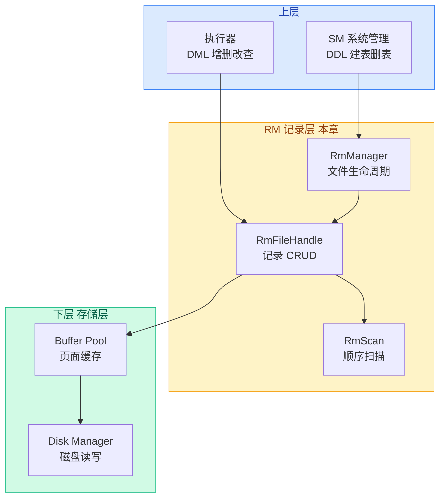

# 01. 记录层概述

## 记录层是什么

记录层（Record Manager，简称 RM）负责管理**表的数据文件**。一张表在磁盘上对应一个 `.db` 数据文件，记录层决定了"表中一行行的记录在这个文件里怎么存放、怎么找到、怎么修改"。

打个比方：存储层给了你一叠白纸（Page），记录层决定了在这些纸上怎么排表格、怎么写字、怎么查找某一行的内容。

## 在架构中的位置

**向下**：通过 `BufferPoolManager` 获取和释放页面，通过 `DiskManager` 读写磁盘文件。

**向上**：为系统管理（SM）提供文件创建/删除接口，为执行器提供记录的增删改查接口。

## 输入与输出

| 方向 | 输入 | 输出 | 说明 |
|------|------|------|------|
| 写入 | `char* buf`（记录数据的字节数组） | `Rid`（记录在文件中的位置） | 上层把一条记录序列化为字节数组传给记录层 |
| 读取 | `Rid`（记录位置） | `RmRecord`（包含 data + size） | 上层给定记录位置，记录层返回记录内容 |
| 扫描 | 表文件 | 逐条返回 `Rid` + `RmRecord` | 遍历表中所有记录 |

## 核心要解决的问题

记录层要解决的关键问题只有一个：**"在一个定长页面的文件中，如何高效管理不定数量的定长记录？"**

围绕这个核心问题，拆解出以下几个子问题：

1. **如何定位一条记录？** — 用 `Rid`（page_no + slot_no）作为记录的"地址"
2. **如何知道哪个槽位是空的？** — 每页用一个 Bitmap（位图）标记每个槽位是否被占用
3. **插入时怎么找空闲位置？** — 维护一个"有空闲空间"的页面链表
4. **删除后空间如何回收？** — 标记槽位为空，把页面重新加入空闲链表
5. **如何遍历所有记录？** — `RmScan` 扫描器，逐页逐槽检查 bitmap

## 涉及的文件

| 文件 | 作用 |
|------|------|
| `src/record/rm_defs.h` | 数据结构定义：RmFileHdr、RmPageHdr、RmRecord |
| `src/record/rm_file_handle.h` | RmFileHandle、RmPageHandle 声明 |
| `src/record/rm_file_handle.cpp` | 记录增删改查的具体实现 |
| `src/record/rm_manager.h` | RmManager：文件创建、打开、关闭、删除 |
| `src/record/rm_scan.h` | RmScan：顺序扫描 |
| `src/record/rm_scan.cpp` | RmScan 实现 |
| `src/record/bitmap.h` | Bitmap 位图工具类 |
| `src/defs.h` | Rid、ColType 等公共类型 |
