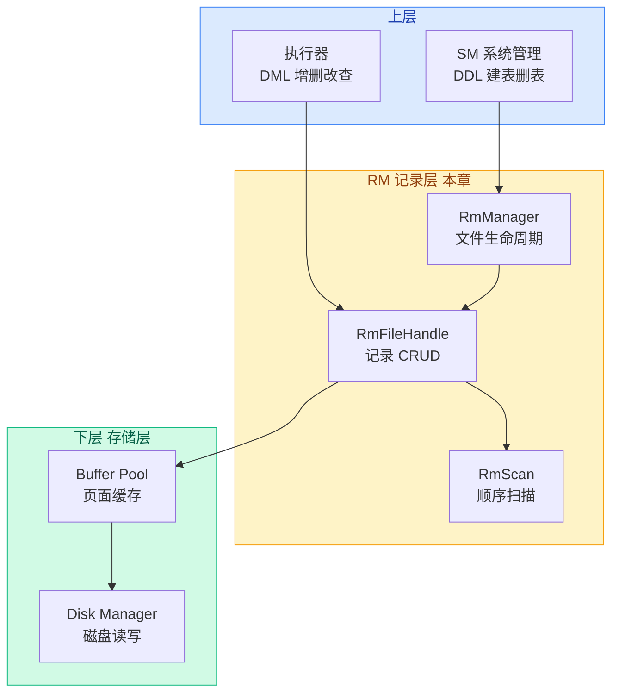
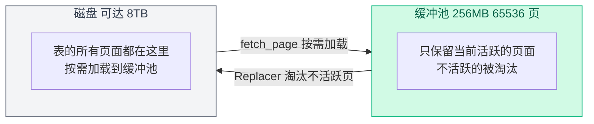

# 01. 记录层概述

## 记录层是什么

记录层（Record Manager，简称 RM）负责管理**表的数据文件**。一张表在磁盘上对应一个 `.db` 数据文件，记录层决定了"表中一行行的记录在这个文件里怎么存放、怎么找到、怎么修改"。

打个比方：存储层给了你一叠白纸（Page），记录层决定了在这些纸上怎么排表格、怎么写字、怎么查找某一行的内容。

## 在架构中的位置



**向下**：通过 `BufferPoolManager` 获取和释放页面，通过 `DiskManager` 读写磁盘文件。

**向上**：为系统管理（SM）提供文件创建/删除接口，为执行器提供记录的增删改查接口。

## 输入与输出

| 方向 | 输入 | 输出 | 说明 |
|------|------|------|------|
| 写入 | `char* buf`（记录数据的字节数组） | `Rid`（记录在文件中的位置） | 上层把一条记录序列化为字节数组传给记录层 |
| 读取 | `Rid`（记录位置） | `RmRecord`（包含 data + size） | 上层给定记录位置，记录层返回记录内容 |
| 扫描 | 表文件 | 逐条返回 `Rid` + `RmRecord` | 遍历表中所有记录 |

## 核心要解决的问题

记录层要解决的关键问题只有一个：**"在一个定长页面的文件中，如何高效管理<u>不定数量</u>的<u>定长记录</u>？"**

围绕这个核心问题，拆解出以下几个子问题：

1. **如何定位一条记录？** — 用 `Rid`（page_no + slot_no）作为记录的"地址"
2. **如何知道哪个槽位是空的？** — 每页用一个 Bitmap（位图）标记每个槽位是否被占用
3. **插入时怎么找空闲位置？** — 维护一个"有空闲空间"的页面链表
4. **删除后空间如何回收？** — 标记槽位为空，把页面重新加入空闲链表
5. **如何遍历所有记录？** — `RmScan` 扫描器，逐页逐槽检查 bitmap

## 存储容量与缓冲池

### 一张表能存多少数据？

理论的硬上限来自 `page_no` 的类型——`page_id_t = int32_t`（`src/common/config.h:50`），最大值约 21 亿。每页 4096 字节，所以：

```
单表最大 ≈ 2.1×10⁹ × 4096 字节 ≈ 8 TB
```

另外 `record_size` 上限是 `RM_MAX_RECORD_SIZE = 512` 字节（`src/record/rm_defs.h:21`）。实际使用中，OS 文件系统限制通常会先于这些理论值到达。

### 表比缓冲池大怎么办？

缓冲池大小是 `BUFFER_POOL_SIZE = 65536` 页 × 4KB = **256 MB**（`src/common/config.h:39`）。但一张表可以远超 256 MB——这完全正常。

关键认知：**缓冲池是缓存，不是容器**。



工作方式：
1. 需要访问某页时，`fetch_page` 把它从磁盘读到缓冲池
2. 用完 `unpin_page`，该页变为"可淘汰"
3. 缓冲池满了又有新页要加载时，**Replacer（替换器）**选一个不活跃的旧页淘汰
4. 如果被淘汰的页是脏页（修改过），先写回磁盘再淘汰

所以缓冲池 256 MB 完全可以支撑一张几 GB 甚至几 TB 的表——同一时刻只有一小部分"热"页面在内存里，其余都在磁盘上。

### 极端情况：全表扫描大表

`SELECT * FROM huge_table` 且表有 100 万页（约 4GB），缓冲池只有 65536 个 frame：

- 扫描会依次 `fetch_page` 每一页
- 缓冲池很快装满，新页面不断替换旧页面
- 每页只被访问一次就被淘汰，缓存命中率为 0

这就是**缓冲池抖动**（thrashing），也是为什么需要索引（第 3 章）——通过 B+ 树直接定位到目标页面，避免全表扫描。

## 涉及的文件

| 文件 | 作用 |
|------|------|
| `src/record/rm_defs.h` | 数据结构定义：RmFileHdr、RmPageHdr、RmRecord |
| `src/record/rm_file_handle.h` | RmFileHandle、RmPageHandle 声明 |
| `src/record/rm_file_handle.cpp` | 记录增删改查的具体实现 |
| `src/record/rm_manager.h` | RmManager：文件创建、打开、关闭、删除 |
| `src/record/rm_scan.h` | RmScan：顺序扫描 |
| `src/record/rm_scan.cpp` | RmScan 实现 |
| `src/record/bitmap.h` | Bitmap 位图工具类 |
| `src/defs.h` | Rid、ColType 等公共类型 |
