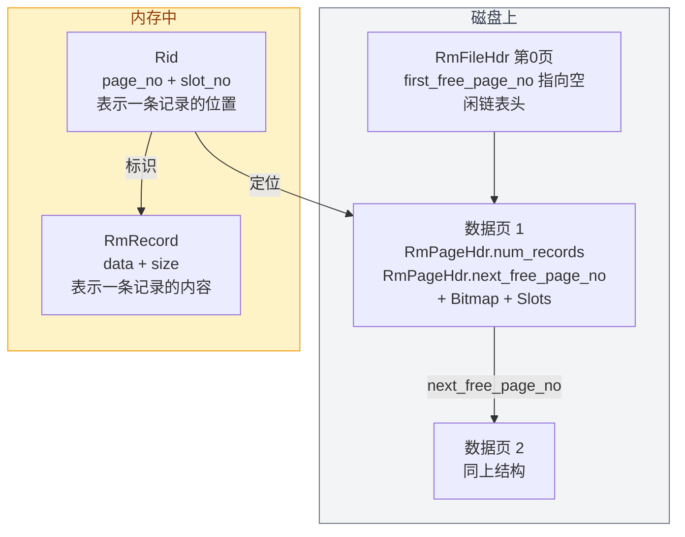

# 02. 数据结构

在讲"怎么做"之前，先搞清楚记录层涉及哪些数据结构、各自存什么信息。

从**具体到抽象**：先看记录本身（长什么样、怎么定位），再看管理记录的元信息头（页面头、文件头）。

## 数据结构总览


- 一条记录 = `Rid`（地址）+ `RmRecord`（内容），存在页面的 Slots 槽位里
- 每个数据页 = `RmPageHdr`（页级元信息）+ `Bitmap`（槽位标记）+ `Slots`（记录槽位）
- 一个表文件 = 第 0 页 `RmFileHdr`（文件级元信息）+ 第 1 页起的数据页

## Rid：记录的唯一地址

`src/defs.h:33`

```cpp
struct Rid {
  int page_no;  // 记录在哪个页面
  int slot_no;  // 记录在页面的哪个槽位
};
```

Rid 相当于记录的"门牌号"：先找到楼栋（page_no），再找到房间号（slot_no），两个字段一起唯一确定一条记录的位置。

举例：假设 student 表有 3 列（id INT, name STRING, age INT），插入第 1 条记录时它被放到页面 1 的槽位 0，那它的 Rid 就是 `{page_no: 1, slot_no: 0}`。

## RmRecord：记录的数据内容

`src/record/rm_defs.h:40`

```cpp
struct RmRecord {
  char* data;          // 记录的数据，字节数组
  int size;            // 记录的大小（字节数）
  bool allocated_;     // 是否已为 data 分配内存
};
```

`RmRecord` 是记录在内存中的表示。注意它只存**原始字节**，不关心记录里有什么字段——记录的具体列结构是上层（系统管理 SM）关心的，记录层只负责按字节搬运。

记录层的所有记录都是**定长**的——表创建时就确定了 `record_size`，之后不会变（因为不支持变长字段 VARCHAR）。

## RmPageHdr：页级元信息

有了记录本身，现在看**页面怎么管理这些记录**。每个数据页的开头都有一个 `RmPageHdr`，记录本页的状态。

`src/record/rm_defs.h:34`

```cpp
struct RmPageHdr {
  int next_free_page_no;  // 下一个有空闲空间的页面号
  int num_records;        // 当前页面已存储的记录数
};
```

它很小，只有两个字段：

| 字段 | 作用 |
|------|------|
| `num_records` | 本页当前存了几条记录，插入 +1、删除 -1 |
| `next_free_page_no` | 空闲页面链表的"next 指针"，指向下一个有空闲空间的页面 |

`next_free_page_no` 和 `first_free_page_no` 配合使用，构成一个**单向链表**，串联所有还有空位的页面。

> **`next_free_page_no` 指向的页面一定有空位吗？** 是的。链表里的页面只在"还有空位"时才留在链表中——一旦某个页面插满（`num_records == num_records_per_page`），它会被移出链表；当删除记录让满页重新出现空位时，它又被加回链表。所以链表中的每个页面**至少有一个空闲槽位**，"free" 名副其实。这个链表的具体运作方式会在 [05b 空闲页链表管理](./05b-record-free-list.md) 详细讲解。

## RmFileHdr：文件级元信息

再往上一层，**整个文件怎么管理这些页面**。文件头 `RmFileHdr` 存在每个表数据文件的**第 0 号页面**，记录了整张表的全局信息。

`src/record/rm_defs.h:24`

```cpp
struct RmFileHdr {
  int record_size;                     // 每条记录的大小（字节）
  int num_pages;                       // 文件已分配的页面总数
  int num_records_per_page;            // 每页最多能存几条记录
  std::atomic<int> first_free_page_no; // 第一个有空闲空间的页面号
  int bitmap_size;                     // 每页 bitmap 的字节数
};
```

| 字段 | 作用 | 确定时机 |
|------|------|----------|
| `record_size` | 定长记录的大小，插入/查询时用来定位槽位 | 建表时确定，之后不变 |
| `num_pages` | 当前文件有多少页，新增页面时递增 | 动态变化 |
| `num_records_per_page` | 每页最多能放的记录数，由 PAGE_SIZE 和 record_size 算出 | 建表时计算 |
| `first_free_page_no` | 空闲链表头指针，指向第一个有空闲空间的页面号，-1 表示没有 | 动态变化 |
| `bitmap_size` | 每页 bitmap 占多少字节，由 num_records_per_page 算出 | 建表时计算 |

**设计要点**：每条记录定长，所以一页能放几条是固定的，不需要担心"剩下的空间够不够放"。

> **第 0 页会被占满吗？** RmFileHdr 只有约 24 字节，但独占整个第 0 页（4096 字节），剩余约 4072 字节是空闲的。这是因为页面是存储管理的最小单位，一个页面不能同时属于"文件头"和"数据页"。把文件头放在独立的第 0 页，让文件头和数据页各管各的，边界清晰、实现简单。4072 字节的浪费对于磁盘来说微不足道，用一点空间换代码简化是值得的。

## 数据结构之间的关系

现在把具体数据和抽象元信息放在一起看：



从第 1 章的知识可知，`PAGE_SIZE = 4096` 字节（4KB）。假设 `record_size = 32` 字节，那么一页大约能存 100 多条记录。具体能存几条由 `num_records_per_page` 的计算公式决定，会在 [03 数据页内部布局](./03-record-page-layout.md) 中详细推导。

## 源码对应

| 数据结构 | 文件 | 行号 |
|----------|------|------|
| `Rid` | `src/defs.h` | 33-42 |
| `RmRecord` | `src/record/rm_defs.h` | 40-120 |
| `RmPageHdr` | `src/record/rm_defs.h` | 34-37 |
| `RmFileHdr` | `src/record/rm_defs.h` | 24-31 |
| 常量（RM_NO_PAGE 等） | `src/record/rm_defs.h` | 18-21 |

上一节：[01. 记录层概述](./01-record-layer-overview.md) | 下一节：[03. 数据页内部布局](./03-record-page-layout.md)
