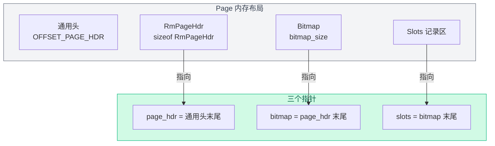

# 03. 数据页内部布局

搞清楚每个数据页里面长什么样——空间怎么划分、每块占多大、怎么定位到具体记录。

## Page 的原始结构

从第 1 章我们知道，每个 `Page` 对象底层是一个 4096 字节的数组（`PAGE_SIZE`）。记录层在这个数组上定义了自己的格式：


**三段式布局**（通用 page header 之后的部分）：

| 段 | 内容 | 大小 |
|----|------|------|
| RmPageHdr | 页级元信息（num_records, next_free_page_no） | `sizeof(RmPageHdr)` = 8 字节 |
| Bitmap | 位图，标记每个槽是否被占用 | `bitmap_size` 字节 |
| Slots | 定长记录槽位数组 | `num_records_per_page × record_size` 字节 |

## 三段大小的计算过程

以 student 表为例，假设 `record_size = 32` 字节：

### 第一步：算每页能放几条记录

关键在于"**bitmap 的每一位对应一个槽位**"。bitmap 是用 `char[]` 数组实现的，每字节（8 位）对应 8 个槽。

举个例子：假设 `num_records_per_page = 10`，需要 `ceil(10/8) = 2` 字节的 bitmap。两个字节共 16 位，只用前 10 位标记 slot 0~9，后 6 位闲置：

```
bitmap 第 0 字节           bitmap 第 1 字节
┌─────────────────┐       ┌─────────────────┐
│ b7 b6 b5 b4 b3 b2 b1 b0 │ │ b7 b6 b5 b4 b3 b2 b1 b0 │
│ │  │  │  │  │  │  │  │  │ │  │  │  │  │  │  │  │  │
│ ↓  ↓  ↓  ↓  ↓  ↓  ↓  ↓  │ ↓  ↓  ↓  ↓  ↓  ↓  ↓  ↓  │
│s0 s1 s2 s3 s4 s5 s6 s7│ │s8 s9  -  -  -  -  -  - │
└─────────────────┘       └─────────────────┘
                                           ↑ 闲置位（始终为 0）
```

如果插入了 slot 0 和 slot 3，bitmap 第 0 字节变为：

```
b7  b6  b5  b4  b3  b2  b1  b0
 0   0   0   0   1   0   0   1   = 0x09
 ↑   ↑   ↑   ↑   ↑   ↑   ↑   ↑
s7  s6  s5  s4  s3  s2  s1  s0
                        占   占
                        用   用
```

`s0=1, s3=1`，其余为 0。高位在左边，slot 号从小到大对应从 LSB（最低位）到 MSB（最高位）。

计算公式来自 `RmManager::create_file()`（`src/record/rm_manager.h:48`）：

```
num_records_per_page = (BITMAP_WIDTH × (PAGE_SIZE - 1 - sizeof(RmFileHdr)) + 1)
                     / (1 + record_size × BITMAP_WIDTH)
```

其中 `BITMAP_WIDTH = 8`（每字节 8 位）。代入 student 表的数据：

- `PAGE_SIZE = 4096`
- `sizeof(RmPageHdr) = 8`
- `OFFSET_PAGE_HDR` 是 page 通用头部大小，对于数据页来说是固定的

这个公式本质是在解：**总空间 = header + bitmap + slots**，其中 bitmap 大小取决于槽位数，slots 大小也取决于槽位数。

```
PAGE_SIZE = OFFSET_PAGE_HDR + sizeof(RmPageHdr) + bitmap_size + num_records_per_page × record_size

其中 bitmap_size = ceil(num_records_per_page / 8)
```

把 bitmap_size 代入，解出 `num_records_per_page` 的最大整数值。

### 第二步：算 bitmap 大小

```
bitmap_size = ceil(num_records_per_page / 8)
            = (num_records_per_page + BITMAP_WIDTH - 1) / BITMAP_WIDTH
```

`src/record/rm_manager.h:51`

## RmPageHandle：页面的"读写指针"

`RmPageHandle` 是一个轻量级的包装结构体，把页面上的三块区域解析成对应的指针，方便后续直接读写。

`src/record/rm_file_handle.h:25`

```cpp
struct RmPageHandle {
  const RmFileHdr* file_hdr;  // 指向所属文件的文件头（只读）
  Page* page;                 // 指向缓冲池中的页面对象
  RmPageHdr* page_hdr;        // 指向页内的 RmPageHdr 区域
  char* bitmap;               // 指向页内的 Bitmap 区域
  char* slots;                // 指向页内的 Slots 区域
};
```

**构造函数**（`src/record/rm_file_handle.h:37`）：

```cpp
RmPageHandle(const RmFileHdr* fhdr_, Page* page_)
    : file_hdr(fhdr_), page(page_) {
  page_hdr = reinterpret_cast<RmPageHdr*>(
      page->get_data() + page->OFFSET_PAGE_HDR);
  bitmap = page->get_data() + sizeof(RmPageHdr)
           + page->OFFSET_PAGE_HDR;
  slots = bitmap + file_hdr->bitmap_size;
}
```

三个指针的偏移关系一目了然：



## get_slot：定位具体记录

`src/record/rm_file_handle.h:46`

```cpp
inline char* get_slot(int slot_no) const {
  return slots + slot_no * file_hdr->record_size;
}
```

给定槽位号 `slot_no`，计算该记录在 slots 数组中的地址偏移：

```
偏移 = slots 首地址 + slot_no × record_size
```

因为每条记录是定长的，所以可以直接用乘法算出任意槽位的地址。这是定长记录的核心优势。

举例：student 表 `record_size = 32`，要找 slot_no = 3 的记录：

```
地址 = slots + 3 × 32 = slots + 96
```

也就是从 slots 开头往后数第 96 个字节开始，读 32 字节就是 slot 3 的记录。

## 源码对应

| 内容 | 文件 | 行号 |
|------|------|------|
| RmPageHandle 定义 | `src/record/rm_file_handle.h` | 25-51 |
| RmPageHandle 构造函数 | `src/record/rm_file_handle.h` | 37-43 |
| get_slot | `src/record/rm_file_handle.h` | 46-50 |
| num_records_per_page 计算 | `src/record/rm_manager.h` | 48-50 |
| bitmap_size 计算 | `src/record/rm_manager.h` | 51-52 |
