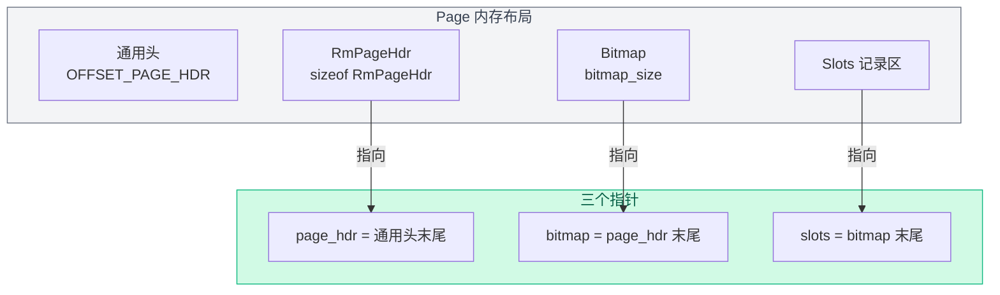

# 03. 数据页内部布局

搞清楚每个数据页里面长什么样——空间怎么划分、每块占多大、怎么定位到具体记录。

## Page 的原始结构

从第 1 章我们知道，每个 `Page` 对象底层是一个 4096 字节的数组（`PAGE_SIZE`）。记录层在这个数组上定义了自己的格式：


**三段式布局**（通用 page header 之后的部分）：

| 段 | 内容 | 大小 |
|----|------|------|
| RmPageHdr | 页级元信息（num_records, next_free_page_no） | `sizeof(RmPageHdr)` = 8 字节 |
| Bitmap | 位图，标记每个槽是否被占用 | `bitmap_size` 字节 |
| Slots | 定长记录槽位数组 | `num_records_per_page × record_size` 字节 |

## 三段大小的计算过程

以 student 表为例，假设 `record_size = 32` 字节：

### 第一步：算每页能放几条记录

关键在于"**bitmap 的每一位对应一个槽位**"。bitmap 是用 `char[]` 数组实现的，每字节（8 位）对应 8 个槽。

举个例子：假设 `num_records_per_page = 10`，每页可以记录 10 条记录，需要 `ceil(10/8) = 2` 字节的 bitmap。两个字节共 16 位，只用前 10 位标记 slot 0~9，后 6 位闲置：

```
bitmap 第 0 字节              bitmap 第 1 字节
┌─────────────────────────┐ ┌─────────────────────────┐
│ b7 b6 b5 b4 b3 b2 b1 b0 │ │ b7 b6 b5 b4 b3 b2 b1 b0 │
│ │  │  │  │  │  │  │  │  │ │ │  │  │  │  │  │  │  │  │
│ ↓  ↓  ↓  ↓  ↓  ↓  ↓  ↓  │ │ ↓  ↓  ↓  ↓  ↓  ↓  ↓  ↓  │
│s0 s1 s2 s3 s4 s5 s6 s7  │ │s8 s9  -  -  -  -  -  -  │
└─────────────────────────┘ └─────────────────────────┘
                                           ↑ 闲置位（始终为 0）
```

如果插入了 slot 0 和 slot 3，bitmap 第 0 字节变为：

```
b7  b6  b5  b4  b3  b2  b1  b0
 1   0   0   1   0   0   0   0   = 0x90
 ↑   ↑   ↑   ↑   ↑   ↑   ↑   ↑
s0  s1  s2  s3  s4  s5  s6  s7
占           占
用           用
```

`s0=1, s3=1`，其余为 0。高位 b7 对应 slot 0，低位 b0 对应 slot 7。

计算公式来自 `RmManager::create_file()`（`src/record/rm_manager.h:48`）：

```
num_records_per_page = (BITMAP_WIDTH × (PAGE_SIZE - 1 - sizeof(RmFileHdr)) + 1)
                     / (1 + record_size × BITMAP_WIDTH)
```

这个公式一步到位，不好理解。下面用 student 表（`record_size = 32`）逐步推导。

### 推导公式

**第 1 步：写出空间约束方程**

一页中可用于记录层的空间是"Page 总大小 − 通用头"：

```
可用空间 = PAGE_SIZE - OFFSET_PAGE_HDR
         = 4096 - 4 = 4092 字节
```

这 4092 字节要装三样东西：`RmPageHdr` + `bitmap` + `slots`。设槽位数为 `n`：

```
sizeof(RmPageHdr) + bitmap_size + n × record_size ≤ 4092
                  8 + bitmap_size + n × 32        ≤ 4092
                        bitmap_size + n × 32      ≤ 4084   ... ①
```

**第 2 步：把 bitmap_size 用 n 精确表示**

`bitmap_size = ceil(n / 8)`。向上取整在整数运算中有个标准技巧：**`ceil(n / 8) = (n + 7) / 8`**（整数除法）。

为什么成立？设 `n = 8k + r`（`0 ≤ r < 8`）：
- 若 r = 0（整除）：`ceil(8k/8) = k`，而 `(8k+7)/8 = k`（因为 7/8 在整数除法中舍去）✓
- 若 r > 0（有余数）：`ceil(n/8) = k+1`，而 `(n+7)/8 = (8k+r+7)/8`，由于 `r ≥ 1, r+7 ≥ 8`，`(8k+r+7)/8 = k+1` ✓

因此 `bitmap_size = (n + 7) / 8`，精确成立，不需要近似。

代入 ①：

```
(n + 7) / 8 + n × 32 ≤ 4084
```

**第 3 步：去分母，乘以 8**

```
n + 7 + n × 256 ≤ 4084 × 8
n + 7 + n × 256 ≤ 32672
n × 257 + 7 ≤ 32672
n × 257 ≤ 32665
```

**第 4 步：解出 n**

```
n ≤ 32665 / 257
n ≤ 127.10...
```

向下取整：**`n = 127`**。即每页最多存 127 条记录。

**第 5 步：验证**

```
bitmap_size = ceil(127 / 8) = ceil(15.875) = 16 字节
slots = 127 × 32 = 4064 字节
总计 = 8 + 16 + 4064 = 4088 ≤ 4092 ✓
```

如果 n = 128：
```
bitmap_size = ceil(128 / 8) = 16 字节
slots = 128 × 32 = 4096 字节
总计 = 8 + 16 + 4096 = 4120 > 4092 ✗  放不下！
```

### 通用公式与推导的对应关系

上面逐步推导的结果等价于代码中的公式。把推导过程整理成通用形式：

```
推导:  n = 4084 × BITMAP_WIDTH / (1 + record_size × BITMAP_WIDTH)
代码:  n = (BITMAP_WIDTH × (PAGE_SIZE - 1 - sizeof(RmFileHdr)) + 1)
         / (1 + record_size × BITMAP_WIDTH)
```

其中：
- `PAGE_SIZE - 1 - sizeof(RmFileHdr)` ≈ 可用空间（`sizeof(RmFileHdr)` 约等于 `OFFSET_PAGE_HDR + sizeof(RmPageHdr)`，代码中用它近似表示页面总开销）
- `+ 1` 是整数除法向上取整的修正项（保证 `ceil` 效果）
- `BITMAP_WIDTH = 8`

**实际计算结果**：student 表 `record_size = 28`（4+20+4），代入公式得到 `num_records_per_page ≈ 140`。

### 第二步：算 bitmap 大小

```
bitmap_size = ceil(num_records_per_page / 8)
            = (num_records_per_page + BITMAP_WIDTH - 1) / BITMAP_WIDTH
```

`src/record/rm_manager.h:51`

## RmPageHandle：页面的"读写指针"

`RmPageHandle` 是一个轻量级的包装结构体，把页面上的三块区域解析成对应的指针，方便后续直接读写。

`src/record/rm_file_handle.h:25`

```cpp
struct RmPageHandle {
  const RmFileHdr* file_hdr;  // 指向所属文件的文件头（只读）
  Page* page;                 // 指向缓冲池中的页面对象
  RmPageHdr* page_hdr;        // 指向页内的 RmPageHdr 区域
  char* bitmap;               // 指向页内的 Bitmap 区域
  char* slots;                // 指向页内的 Slots 区域
};
```

**构造函数**（`src/record/rm_file_handle.h:37`）：

```cpp
RmPageHandle(const RmFileHdr* fhdr_, Page* page_)
    : file_hdr(fhdr_), page(page_) {
  page_hdr = reinterpret_cast<RmPageHdr*>(
      page->get_data() + page->OFFSET_PAGE_HDR);
  bitmap = page->get_data() + sizeof(RmPageHdr)
           + page->OFFSET_PAGE_HDR;
  slots = bitmap + file_hdr->bitmap_size;
}
```

三个指针的偏移关系一目了然：



## get_slot：定位具体记录

`src/record/rm_file_handle.h:46`

```cpp
inline char* get_slot(int slot_no) const {
  return slots + slot_no * file_hdr->record_size;
}
```

给定槽位号 `slot_no`，计算该记录在 slots 数组中的地址偏移：

```
偏移 = slots 首地址 + slot_no × record_size
```

因为每条记录是定长的，所以可以直接用乘法算出任意槽位的地址。这是定长记录的核心优势。

举例：student 表 `record_size = 32`，要找 slot_no = 3 的记录：

```
地址 = slots + 3 × 32 = slots + 96
```

也就是从 slots 开头往后数第 96 个字节开始，读 32 字节就是 slot 3 的记录。

## 源码对应

| 内容 | 文件 | 行号 |
|------|------|------|
| RmPageHandle 定义 | `src/record/rm_file_handle.h` | 25-51 |
| RmPageHandle 构造函数 | `src/record/rm_file_handle.h` | 37-43 |
| get_slot | `src/record/rm_file_handle.h` | 46-50 |
| num_records_per_page 计算 | `src/record/rm_manager.h` | 48-50 |
| bitmap_size 计算 | `src/record/rm_manager.h` | 51-52 |
