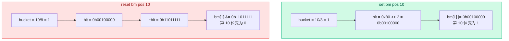

# 04. Bitmap 位图

记录层用位图（Bitmap）来标记每个槽位"有没有存记录"——1 表示已占用，0 表示空闲。每条记录只占 1 个 bit 来标记状态。

## 为什么需要位图

页面上的 slots 数组是按顺序排列的：

- insert 后 delete slot 3 → slot 3 空了，但 slot 2 和 slot 4 可能还有数据
- 下次 insert 时，需要知道 slot 3 可以复用

如果没有位图，就只能顺序往后填，删除产生的"空洞"无法回收利用。位图用每个 bit 标记对应槽位的占用状态，插入时找第一个 0 的位即可。

```
假设一页有 8 个槽位，bitmap = 1 字节

槽位:   0    1    2    3    4    5    6    7
bit:   1    1    0    1    0    0    0    1
       ↑    ↑         ↑                   ↑
      已用  已用      已用                 已用

空闲槽位: 2、4、5、6
```

## Bitmap 类的实现

`src/record/bitmap.h`

Bitmap 是一个**纯静态方法类**，所有方法都是 static，不需要实例化。

```cpp
static constexpr int BITMAP_WIDTH = 8;                 // 每个字节有 8 位
static constexpr unsigned BITMAP_HIGHEST_BIT = 0x80u;  // 0b10000000
```

### 前置知识：位运算符

如果对位运算不熟悉，先看这几个运算符（以 8 位 `char` 为例）：

**一个字节就是 8 个 bit**。每个 bit 只能是 0 或 1。8 个 bit 从高到低排列：

```
b7  b6  b5  b4  b3  b2  b1  b0     ← 位编号
 1   0   0   0   0   0   0   0      ← 0x80 = 0b10000000
```

**`|` 按位或**：两个位中只要有一个是 1，结果就是 1。

```
  0b10000000   ← 0x80
| 0b00010000   ← 0x10
────────────
  0b10010000   ← 0x90  （只有两列都是 1 才得 1? 不，有一列是 1 就得 1）
```

> 理解为"置 1 操作"：想在第 4 个 bit 位置 1？把 `0b00010000` 和原值做 `|` 即可。其他位不受影响——0 跟任何值做 `|` 都保持原值。

**`&` 按位与**：两个位**都是** 1 时，结果才是 1。

```
  0b10010000   ← 0x90
& 0b00010000   ← 0x10
────────────
  0b00010000   ← 0x10  （只有两列都是 1 才得 1）
```

> 理解为"检测操作"：想检查第 4 个 bit 是不是 1？拿 `0b00010000` 和原值做 `&`。如果结果 ≠ 0，说明那一位是 1。

**`~` 按位取反**：每位翻转，1 变 0，0 变 1。

```
~ 0b00010000   → 0b11101111
```

> 理解为"清零操作"：想把第 4 位清零？先取反得到 `0b11101111`，再 `&` 原值。

**`>>` 右移**：所有位向右移动指定次数，左边补 0。

```
0b10000000 >> 3  →  0b00010000
```

每右移 1 位，相当于除以 2。第 7 位的 1 跑到了第 4 位。

搞懂这四个运算符，Bitmap 的代码就能看懂了。下面看源码怎么用它们。

### get_bucket 和 get_bit

位图中用"字节数组 + 位偏移"定位具体某一位：

```cpp
static int get_bucket(int pos) {
  return pos / BITMAP_WIDTH;   // pos / 8，确定是第几个字节
}

static char get_bit(int pos) {
  return BITMAP_HIGHEST_BIT >> (pos % BITMAP_WIDTH);
  // 0x80 >> 偏移，生成该位对应的掩码
}
```

举例：要操作第 10 位（pos = 10）：

- `get_bucket(10)` → `10 / 8 = 1`，在第 1 号字节（第二个字节）
- `get_bit(10)` → `0x80 >> (10 % 8)` = `0x80 >> 2` = `0b00100000`

### 核心操作

| 方法 | 作用 | 实现 |
|------|------|------|
| `init(bm, size)` | 将 size 字节全部清零 | `memset(bm, 0, size)` |
| `set(bm, pos)` | 将第 pos 位置为 1 | `bm[bucket] \|= bit` |
| `reset(bm, pos)` | 将第 pos 位置为 0 | `bm[bucket] &= ~bit` |
| `is_set(bm, pos)` | 检查第 pos 位是否为 1 | `(bm[bucket] & bit) != 0` |
| `first_bit(bit, bm, max_n)` | 找第一个为 0 或 1 的位 | 从 0 开始调用 `next_bit` |
| `next_bit(bit, bm, max_n, curr)` | 从 curr+1 开始找下一个为 0 或 1 的位 | 线性遍历 |



## next_bit：找下一个满足条件的位

这是 RmScan 遍历记录时的核心方法：

```cpp
static int next_bit(bool bit, const char* bm, int max_n, int curr) {
  for (int i = curr + 1; i < max_n; i++) {
    if (is_set(bm, i) == bit) {
      return i;
    }
  }
  return max_n;  // 没找到，返回 max_n 作为结束信号
}
```

- `bit = true`：找下一个**已占用**的槽位（扫描时用）
- `bit = false`：找下一个**空闲**的槽位（插入时用）

`first_bit` 就是 `next_bit` 的简化版，从 -1 开始找，等价于从 0 开始：

```cpp
static int first_bit(bool bit, const char* bm, int max_n) {
  return next_bit(bit, bm, max_n, -1);
}
```

## 在插入与扫描中的使用

**插入记录**时，找第一个空闲槽位：

```cpp
auto slot_no = Bitmap::first_bit(false, page_handle.bitmap,
                                  file_hdr_.num_records_per_page);
// false = 找第一个为 0 的位（空闲槽位）
```

**扫描记录**时，找下一个已占用槽位：

```cpp
rid_.slot_no = Bitmap::next_bit(true, cur_page_handle_.bitmap,
                                 file_hdr_.num_records_per_page, rid_.slot_no);
// true = 找下一个为 1 的位（已占用槽位）
```

## 源码对应

| 内容 | 文件 | 行号 |
|------|------|------|
| Bitmap 完整实现 | `src/record/bitmap.h` | 1-71 |
| get_bucket / get_bit | `src/record/bitmap.h` | 66-70 |
| set / reset / is_set | `src/record/bitmap.h` | 25-35 |
| next_bit / first_bit | `src/record/bitmap.h` | 45-57 |

上一节：[03-record-page-layout.md](./03-record-page-layout.md) | 下一节：[05a-record-crud.md](./05a-record-crud.md)
