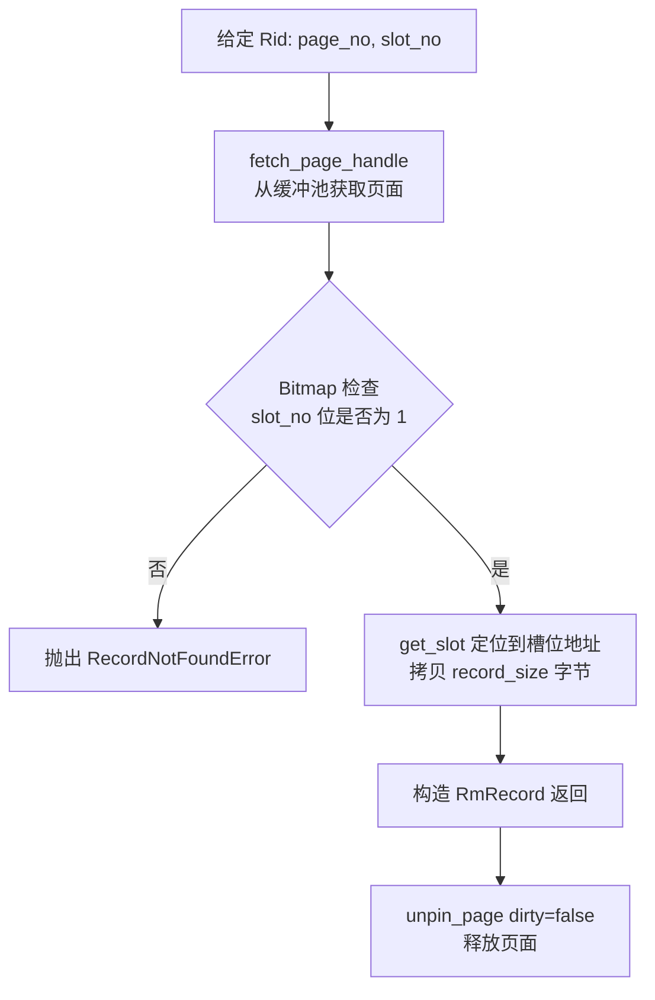
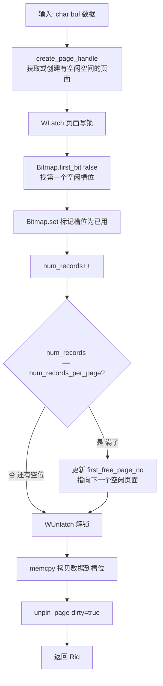
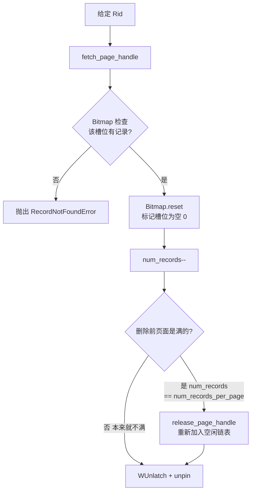

# 05a. 记录增删改查

`RmFileHandle` 提供了五个对记录的操作。这一节逐一讲解每个操作的实现逻辑。

## 辅助方法：fetch_page_handle

在看 CRUD 之前，先理解一个它们都要用到的辅助方法——从缓冲池获取页面。

`src/record/rm_file_handle.cpp:189`

```cpp
RmPageHandle RmFileHandle::fetch_page_handle(int page_no) const {
  if (page_no >= file_hdr_.num_pages || page_no < 0) {
    throw PageNotExistError(disk_manager_->get_file_name(fd_), page_no);
  }
  auto page = buffer_pool_manager_->fetch_page({fd_, page_no});
  if (page == nullptr) {
    throw PageNotExistError(disk_manager_->get_file_name(fd_), page_no);
  }
  return {&file_hdr_, page};
}
```

流程：
1. 检查 page_no 是否合法（0 ≤ page_no < num_pages）
2. 调用 BufferPoolManager 的 `fetch_page` 获取页面（内部会 pin_count++）
3. 用 `RmPageHandle` 包装返回

**重要**：调用 `fetch_page_handle` 后页面被 pin，**用完必须 unpin**，否则页面永远留在缓冲池中无法被替换。

## get_record：读取记录

```cpp
std::unique_ptr<RmRecord> RmFileHandle::get_record(const Rid& rid,
                                                    Context* context) const {
  auto page_handle = fetch_page_handle(rid.page_no);

  if (!Bitmap::is_set(page_handle.bitmap, rid.slot_no)) {
    throw RecordNotFoundError(rid.page_no, rid.slot_no);
  }

  auto record = std::make_unique<RmRecord>(
      page_handle.get_slot(rid.slot_no), file_hdr_.record_size, true);

  buffer_pool_manager_->unpin_page(page_handle.page->get_page_id(), false);
  return record;
}
```

**流程**：



要点：
- 先检查 bitmap 确认该槽位确实有记录
- `std::make_unique<RmRecord>` 在堆上创建一个 `RmRecord` 对象，包装成 `unique_ptr` 智能指针返回。离开作用域时自动释放，不需要手动 `delete`
- 传入的三个参数对应 `RmRecord(char* data_, int size_, bool non_copy)` 构造函数，从页面槽位拷贝 `record_size` 字节的数据
- `unpin_page` 的 `dirty=false`：只读操作，页面没被修改

## insert_record（不指定位置）：自动找空位插入

这是最常用的插入方式——系统自动找一个有空位的页面和槽位。

`src/record/rm_file_handle.cpp:46`

```cpp
Rid RmFileHandle::insert_record(char* buf, Context* context) {
  auto page_handle = create_page_handle();  // 获取有空闲空间的页面
  page_handle.page->WLatch();               // 加写锁

  auto slot_no = Bitmap::first_bit(false, page_handle.bitmap,
                                    file_hdr_.num_records_per_page);

  Bitmap::set(page_handle.bitmap, slot_no);  // 标记槽位为已用

  if (++page_handle.page_hdr->num_records == file_hdr_.num_records_per_page) {
    // 页面满了，从空闲链表移除
    file_hdr_.first_free_page_no = page_handle.page_hdr->next_free_page_no;
  }

  page_handle.page->WUnlatch();  // 尽早解锁
  memcpy(page_handle.get_slot(slot_no), buf, file_hdr_.record_size);

  Rid rid{page_handle.page->get_page_id().page_no, slot_no};
  buffer_pool_manager_->unpin_page(page_handle.page->get_page_id(), true);
  return rid;
}
```

**流程图**：



**关键细节**：

1. `create_page_handle()` 返回一个有空闲空间的页面——可能是现有的空闲页面，也可能是新创建的。具体逻辑在 [05b 空闲页链表管理](./05b-record-free-list.md)。
2. `WLatch()` 加写锁保护并发安全——防止两个线程同时插入到同一槽位。
3. `first_bit(false, ...)` 找第一个值为 0 的位（空闲槽位）。
4. 插入后如果页面满了（`num_records == num_records_per_page`），把它从空闲链表移除。
5. 先解锁再拷贝数据——减少锁的持有时间。
6. `unpin_page(..., true)` 中 `dirty=true` 表示页面被修改，缓冲池会把脏页写回磁盘。

## insert_record（指定位置）：插入到指定 Rid

```cpp
void RmFileHandle::insert_record(const Rid& rid, char* buf) {
  auto page_handle = fetch_page_handle(rid.page_no);
  page_handle.page->WLatch();

  if (!Bitmap::is_set(page_handle.bitmap, rid.slot_no)) {
    Bitmap::set(page_handle.bitmap, rid.slot_no);
    if (++page_handle.page_hdr->num_records == file_hdr_.num_records_per_page) {
      file_hdr_.first_free_page_no = page_handle.page_hdr->next_free_page_no;
    }
  }

  page_handle.page->WUnlatch();
  memcpy(page_handle.get_slot(rid.slot_no), buf, file_hdr_.record_size);
  buffer_pool_manager_->unpin_page(page_handle.page->get_page_id(), true);
}
```

与自动位置插入的区别：
- 用 `fetch_page_handle` 而不是 `create_page_handle`——用指定的页面
- 只在槽位为空时才执行插入逻辑（`!Bitmap::is_set`）
- 用于 load 数据或在特定位置恢复记录

## delete_record：删除记录

`src/record/rm_file_handle.cpp:135`

```cpp
void RmFileHandle::delete_record(const Rid& rid, Context* context) {
  auto page_handle = fetch_page_handle(rid.page_no);
  page_handle.page->WLatch();

  if (!Bitmap::is_set(page_handle.bitmap, rid.slot_no)) {
    throw RecordNotFoundError(rid.page_no, rid.slot_no);
  }

  Bitmap::reset(page_handle.bitmap, rid.slot_no);  // 标记为空闲

  if (page_handle.page_hdr->num_records-- == file_hdr_.num_records_per_page) {
    // 页面从满变不满，重新加入空闲链表
    release_page_handle(page_handle);
  }

  page_handle.page->WUnlatch();
  buffer_pool_manager_->unpin_page(page_handle.page->get_page_id(), true);
}
```

**关键点**：



**判断条件解读**：

```cpp
if (page_handle.page_hdr->num_records-- == file_hdr_.num_records_per_page)
```

这是一个经典的"**后置递减 + 前置值比较**"：
- 先比较 `num_records` 的**当前值**是否等于 `num_records_per_page`（满）
- 然后再 `num_records -= 1`
- 如果删除前页面是满的，删除后就有空位了，需要重新加入空闲链表

## update_record：更新记录

`src/record/rm_file_handle.cpp:164`

```cpp
void RmFileHandle::update_record(const Rid& rid, char* buf,
                                  Context* context) {
  auto page_handle = fetch_page_handle(rid.page_no);

  if (!Bitmap::is_set(page_handle.bitmap, rid.slot_no)) {
    throw RecordNotFoundError(rid.page_no, rid.slot_no);
  }

  memcpy(page_handle.get_slot(rid.slot_no), buf, file_hdr_.record_size);
  buffer_pool_manager_->unpin_page(page_handle.page->get_page_id(), true);
}
```

更新是最简单的操作——记录是定长的，所以直接覆盖即可，不需要关心新旧数据大小是否一致（因为一定一致）。

没有加 WLatch——注释中说明不需要加页锁（有间隙锁保护）。

## 五个操作对比

| 操作 | 锁 | bitmap 变化 | num_records 变化 | 空闲链表变化 | dirty |
|------|-----|------------|-----------------|-------------|-------|
| get_record | 无 | 不变 | 不变 | 不变 | false |
| insert_record | WLatch | set 1 | ++ | 满了就移除 | true |
| delete_record | WLatch | reset 0 | -- | 从满变不满就加入 | true |
| update_record | 无 | 不变 | 不变 | 不变 | true |

## 源码对应

| 内容 | 文件 | 行号 |
|------|------|------|
| get_record | `src/record/rm_file_handle.cpp` | 19-38 |
| insert_record（自动） | `src/record/rm_file_handle.cpp` | 46-80 |
| insert_record（指定） | `src/record/rm_file_handle.cpp` | 87-106 |
| delete_record | `src/record/rm_file_handle.cpp` | 135-156 |
| update_record | `src/record/rm_file_handle.cpp` | 164-179 |
| fetch_page_handle | `src/record/rm_file_handle.cpp` | 189-202 |

上一节：[04-record-bitmap.md](./04-record-bitmap.md) | 下一节：[05b-record-free-list.md](./05b-record-free-list.md)
