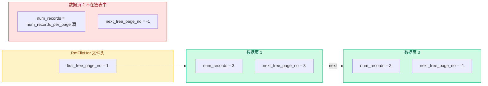
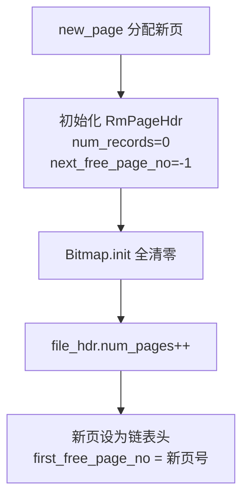
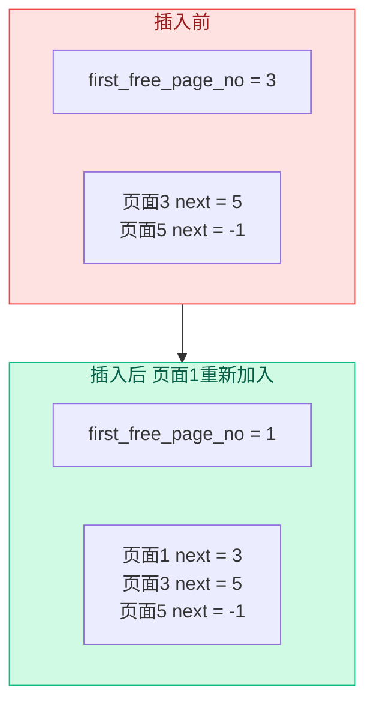
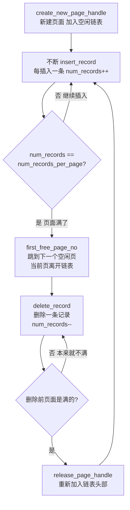

# 05b. 空闲页链表管理

插入记录时需要找一个有空闲槽位的页面。如何快速找到？答案是维护一个**空闲页面链表**。

## 数据结构

链表由两个字段配合实现：

| 字段 | 位置 | 作用 |
|------|------|------|
| `RmFileHdr::first_free_page_no` | 文件头 | 链表头指针，指向第一个有空闲空间的页面号 |
| `RmPageHdr::next_free_page_no` | 每个数据页的页头 | 链表 next 指针，指向下一个有空闲空间的页面号 |

空链表时，`first_free_page_no = RM_NO_PAGE`（即 -1）。

> **为什么需要这个链表？** 数据页在文件中是按 page_no 顺序排列的，每个页面位置固定。但一个页面"有空位还是已满"与它的 page_no 没有任何关系——你无法根据页面号推断它有没有空位。如果没有这个链表，每次插入都要从第 1 页开始逐个检查每个页面的 bitmap，直到找到空位，最坏情况要扫遍所有页面。空闲链表相当于给"有空位的页面"建了一个索引，插入时 O(1) 就能定位到目标页面。



页面 2 不在链表中（已满），所以它不占用链表节点。插入找到的空位时它会被从链表中移除；删除记录后如果从满变不满，它会被重新加入链表。

## 三个核心方法

### create_page_handle：获取有空闲空间的页面

`src/record/rm_file_handle.cpp:235`

```cpp
RmPageHandle RmFileHandle::create_page_handle() {
  std::lock_guard lock(latch_);  // 互斥锁，保护并发

  if (file_hdr_.first_free_page_no == INVALID_PAGE_ID) {
    return create_new_page_handle();      // 没有空闲页，新建一个
  }
  return fetch_page_handle(file_hdr_.first_free_page_no);  // 返回链表头
}
```

逻辑很简单：
1. 如果有空闲页面，直接拿链表头
2. 如果没有，新建一个页面

`latch_` 是 `std::mutex`，保护并发插入——两个线程同时调用 `create_page_handle` 时，只有一个能获取到同一个空闲页面头。

### create_new_page_handle：创建全新的页面

`src/record/rm_file_handle.cpp:208`

```cpp
RmPageHandle RmFileHandle::create_new_page_handle() {
  PageId page_id{fd_, INVALID_PAGE_ID};
  auto page = buffer_pool_manager_->new_page(&page_id);
  // new_page 会分配一个新的 page_no，填充到 page_id.page_no

  RmPageHandle rm_page_handle{&file_hdr_, page};

  // 初始化页头
  rm_page_handle.page_hdr->num_records = 0;
  rm_page_handle.page_hdr->next_free_page_no = RM_NO_PAGE;

  // 初始化 bitmap 全部为 0
  Bitmap::init(rm_page_handle.bitmap, file_hdr_.bitmap_size);

  // 更新文件头
  ++file_hdr_.num_pages;
  file_hdr_.first_free_page_no = page->get_page_id().page_no;

  return rm_page_handle;
}
```



### release_page_handle：把页面重新加入空闲链表

当一个页面从"满"变成"不满"时调用（删除记录后）。

`src/record/rm_file_handle.cpp:254`

```cpp
void RmFileHandle::release_page_handle(RmPageHandle& page_handle) {
  // 当前页面插入链表头部
  page_handle.page_hdr->next_free_page_no = file_hdr_.first_free_page_no;
  file_hdr_.first_free_page_no = page_handle.page->get_page_id().page_no;
}
```

**头插法**——把当前页面插到空闲链表的最前面：



注意 `release_page_handle` **不负责加锁**——调用者（如 `delete_record`）在调用前已经加了 `WLatch`。

## 完整生命周期

以一个页面从创建到满再到回收为例：



## 具体追踪实例

假设 `num_records_per_page = 3`（每页最多 3 条），从头追踪 `first` 和 `next` 的值变化。

**初始状态**：文件刚创建，只有第 0 页（文件头）。
```
first_free_page_no = -1     （空链表）
num_pages = 1               （只有文件头）
```

### 操作 1：INSERT 第 1 条记录

```
create_page_handle():
  first_free = -1 → create_new_page_handle()
  → 分配页面 1，page1.next_free = -1，first_free = 1
insert_record():
  page1.num_records: 0 → 1  （不满，链表不动）
```
```
链表:  first_free=1  →  [page1 num=1 next=-1]  →  -1
```

### 操作 2：INSERT 第 2 条记录

```
create_page_handle():
  first_free = 1 → 返回 page1
insert_record():
  page1.num_records: 1 → 2  （不满）
```
```
链表:  first_free=1  →  [page1 num=2 next=-1]  →  -1
```

### 操作 3：INSERT 第 3 条记录

```
create_page_handle():
  first_free = 1 → 返回 page1
insert_record():
  page1.num_records: 2 → 3 == num_records_per_page  → 满了！
  first_free = page1.next_free = -1       ← page1 被移出链表
```
```
链表:  first_free = -1   （空链表）
```

### 操作 4：INSERT 第 4 条记录

```
create_page_handle():
  first_free = -1 → create_new_page_handle()
  → 分配页面 2，page2.next_free = -1，first_free = 2
insert_record():
  page2.num_records: 0 → 1  （不满）
```
```
链表:  first_free=2  →  [page2 num=1 next=-1]  →  -1
```

### 操作 5：DELETE page1 的第 1 条记录

```
delete_record(page1):
  page1.num_records: 3 → 2  （之前是满的，3 == num_records_per_page）
  → release_page_handle(page1):
      page1.next_free = first_free = 2
      first_free = 1                        ← page1 头插回链表
```
```
链表:  first_free=1  →  [page1 num=2 next=2]  →  [page2 num=1 next=-1]  →  -1
```

### 操作 6：INSERT 第 5 条记录

```
create_page_handle():
  first_free = 1 → 返回 page1
insert_record():
  page1.num_records: 2 → 3 == num_records_per_page  → 又满了！
  first_free = page1.next_free = 2          ← page1 再次移出，链表头交给 page2
```
```
链表:  first_free=2  →  [page2 num=1 next=-1]  →  -1
```

### 规律总结

观察上面六步操作中 `first` 和 `next` 的变化：

| 事件 | `first_free_page_no` 怎么变 | `next_free_page_no` 怎么变 |
|------|---------------------------|--------------------------|
| 新建页面 | 指向新页面 | 新页面的 next 设为 -1 |
| 页面插满 | 改为当前页面的 next 值（链表头后移） | 不变（当前页的 next 保留，但它已不在链表中） |
| 满页删除变不满 | 指向当前页面（头插） | 当前页的 next 设为旧的 first |

核心规律：**first 永远指向链表头**，链表里的页面都还有空位。插满就摘头，删除变不满就头插回来。

## 框架与参考实现的差异

框架在 `RmFileHandle` 中没有 `latch_`（`std::mutex`），并且新增了一个 `remove_page_from_free_list` 方法（`db2026-x/src/record/rm_file_handle.cpp:220`）：

```cpp
void RmFileHandle::remove_page_from_free_list(RmPageHandle &page_handle) {
  int target_page_no = page_handle.page->get_page_id().page_no;

  if (file_hdr_.first_free_page_no == target_page_no) {
    // 目标在链表头：直接移除头部
    file_hdr_.first_free_page_no = page_handle.page_hdr->next_free_page_no;
    page_handle.page_hdr->next_free_page_no = RM_NO_PAGE;
    return;
  }

  // 目标在链表中间或尾部：遍历找到前驱
  int prev_page_no = file_hdr_.first_free_page_no;
  while (prev_page_no != RM_NO_PAGE) {
    auto prev_page_handle = fetch_page_handle(prev_page_no);
    int next_page_no = prev_page_handle.page_hdr->next_free_page_no;
    if (next_page_no == target_page_no) {
      // 找到前驱，跳过目标节点
      prev_page_handle.page_hdr->next_free_page_no =
          page_handle.page_hdr->next_free_page_no;
      page_handle.page_hdr->next_free_page_no = RM_NO_PAGE;
      buffer_pool_manager_->unpin_page(
          prev_page_handle.page->get_page_id(), true);
      return;
    }
    buffer_pool_manager_->unpin_page(
        prev_page_handle.page->get_page_id(), false);
    prev_page_no = next_page_no;
  }
}
```

**为什么参考实现不需要这个方法？**

参考实现中，`create_page_handle` 拿到的总是链表**头**。插入时如果页面满了，直接更新 `first_free_page_no = next_free_page_no` 就把头部移除了。不需要在链表中间删除节点。

框架为什么写了这个方法？因为框架的 `insert_record` 可能拿到的不一定是链表头——`create_page_handle` 返回链表头，但如果没有加锁保护，并发时可能发生竞争。不过框架也没有 `latch_`，所以这个方法的出现可能是设计上的防御性编程，也可能是不同版本的实现差异。

## 源码对应

| 内容 | 文件 | 行号 |
|------|------|------|
| create_page_handle | `src/record/rm_file_handle.cpp` | 235-248 |
| create_new_page_handle | `src/record/rm_file_handle.cpp` | 208-227 |
| release_page_handle | `src/record/rm_file_handle.cpp` | 254-261 |
| remove_page_from_free_list（框架特有） | `db2026-x/src/record/rm_file_handle.cpp` | 220-249 |

上一节：[05a-record-crud.md](./05a-record-crud.md) | 下一节：[06-record-manager.md](./06-record-manager.md)
