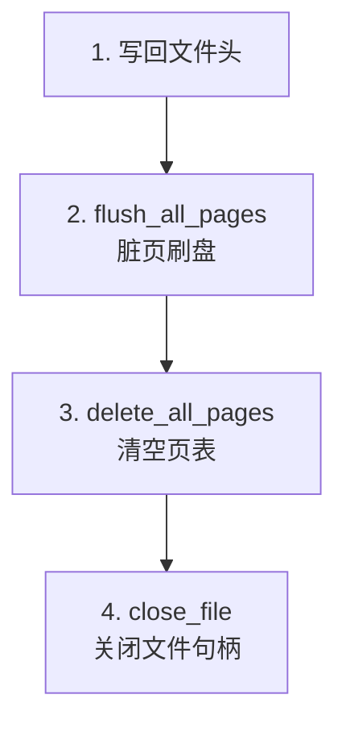
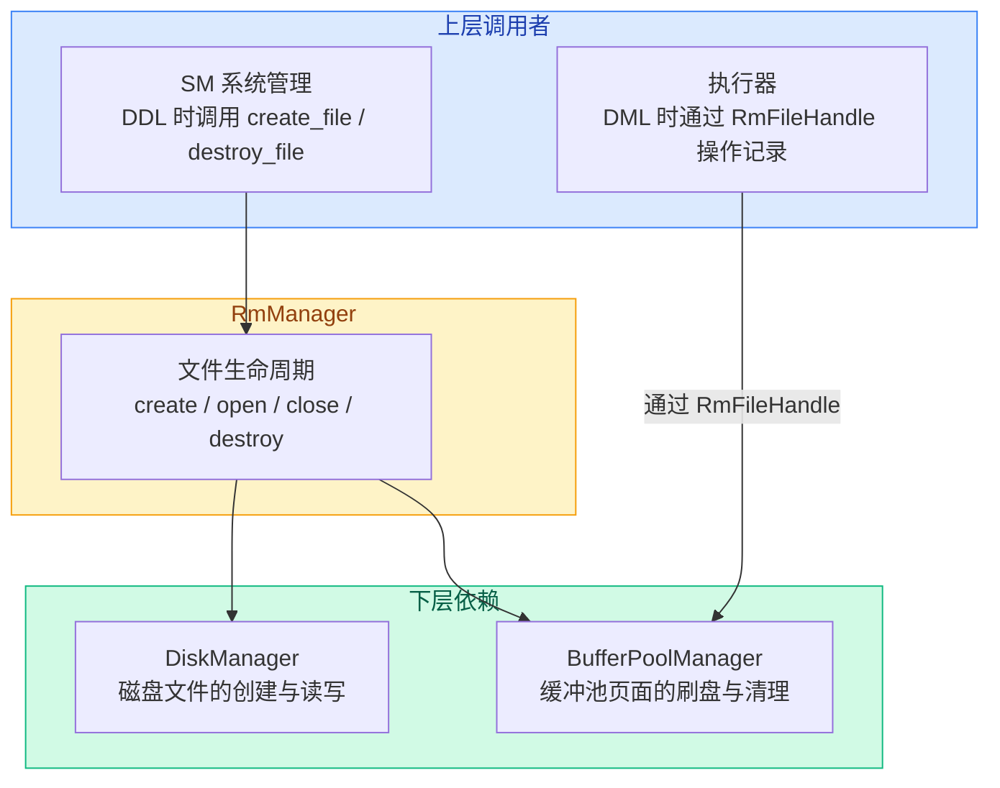

# 06. RmManager 记录管理器

`RmManager` 负责表数据文件的**生命周期管理**——创建、打开、关闭、删除。它本身不操作记录，而是管理 `RmFileHandle` 的创建和销毁。

## 成员与构造

`src/record/rm_manager.h:20`

```cpp
class RmManager {
 private:
  DiskManager* disk_manager_;
  BufferPoolManager* buffer_pool_manager_;

 public:
  RmManager(DiskManager* disk_manager, BufferPoolManager* buffer_pool_manager)
      : disk_manager_(disk_manager),
        buffer_pool_manager_(buffer_pool_manager) {}
```

持有存储层的两个核心组件的指针——自己不做磁盘读写，而是委托给 `DiskManager` 和 `BufferPoolManager`。

## 文件操作一览

| 方法 | 作用 | 调用时机 |
|------|------|---------|
| `create_file` | 创建表的数据文件，初始化文件头 | DDL CREATE TABLE |
| `open_file` | 打开已有文件，生成 RmFileHandle | DML 操作前 |
| `close_file` | 关闭文件，刷盘释放缓冲池页面 | 表不再使用时 |
| `destroy_file` | 删除文件 | DDL DROP TABLE |
| `flush_file` | 刷盘（checkpoint 时用） | 检查点 |

## create_file：创建表文件

`src/record/rm_manager.h:35`

```cpp
void create_file(const std::string& filename, int record_size) {
  if (record_size < 1 || record_size > RM_MAX_RECORD_SIZE) {
    throw InvalidRecordSizeError(record_size);
  }

  disk_manager_->create_file(filename);
  int fd = disk_manager_->open_file(filename);

  // 初始化文件头
  RmFileHdr file_hdr{};
  file_hdr.record_size = record_size;
  file_hdr.num_pages = 1;
  file_hdr.first_free_page_no = RM_NO_PAGE;
  file_hdr.num_records_per_page =
      (BITMAP_WIDTH * (PAGE_SIZE - 1 - (int)sizeof(RmFileHdr)) + 1) /
      (1 + record_size * BITMAP_WIDTH);
  file_hdr.bitmap_size =
      (file_hdr.num_records_per_page + BITMAP_WIDTH - 1) / BITMAP_WIDTH;

  // 将文件头写入第 0 页
  disk_manager_->write_page(fd, RM_FILE_HDR_PAGE, (char*)&file_hdr,
                            sizeof(file_hdr));
  disk_manager_->close_file(fd);
}
```

**流程**：

1. 检查 `record_size` 合法性（1 ~ 512 字节）
2. 通过 `DiskManager` 创建文件并打开
3. 计算 `num_records_per_page` 和 `bitmap_size`（公式见 [03 数据页内部布局](./03-record-page-layout.md)）
4. 把 `RmFileHdr` 直接写入第 0 页（`RM_FILE_HDR_PAGE`）
5. 关闭文件

**注意**：文件头是**直接磁盘写入**的，不走缓冲池（没有调用 `new_page` 或 `fetch_page`），所以也不需要 `flush`。

## open_file：打开文件

```cpp
std::unique_ptr<RmFileHandle> open_file(const std::string& filename) {
  int fd = disk_manager_->open_file(filename);
  return std::make_unique<RmFileHandle>(disk_manager_, buffer_pool_manager_, fd);
}
```

打开文件获取 fd，用 fd 构造 `RmFileHandle`。`RmFileHandle` 的构造函数会从磁盘读取文件头到内存。

## close_file：关闭文件

```cpp
void close_file(const RmFileHandle* file_handle) {
  // 1. 先把文件头写回磁盘
  disk_manager_->write_page(file_handle->fd_, RM_FILE_HDR_PAGE,
                            (char*)&file_handle->file_hdr_,
                            sizeof(file_handle->file_hdr_));
  // 2. 缓冲池中该文件的所有脏页刷盘
  buffer_pool_manager_->flush_all_pages(file_handle->fd_);
  // 3. 清空缓冲池中该文件的页表项
  buffer_pool_manager_->delete_all_pages(file_handle->fd_);
  // 4. 关闭文件
  disk_manager_->close_file(file_handle->fd_);
}
```

关闭时的步骤顺序很重要：



为什么要先写文件头？因为 `RmFileHdr` 在内存中可能被修改过（如 `num_pages` 增加了），必须先持久化。

为什么要 `delete_all_pages`？防止后续操作误读到已关闭文件的旧缓存。

## destroy_file：删除文件

```cpp
void destroy_file(const std::string& filename) {
  disk_manager_->destroy_file(filename);
}
```

直接委托 `DiskManager` 删除文件。

## 对上传下层



## 源码对应

| 内容 | 文件 | 行号 |
|------|------|------|
| RmManager 类定义 | `src/record/rm_manager.h` | 20-107 |
| create_file | `src/record/rm_manager.h` | 35-59 |
| open_file | `src/record/rm_manager.h` | 75-79 |
| close_file | `src/record/rm_manager.h` | 85-94 |
| destroy_file | `src/record/rm_manager.h` | 65-67 |
| flush_file | `src/record/rm_manager.h` | 100-106 |
