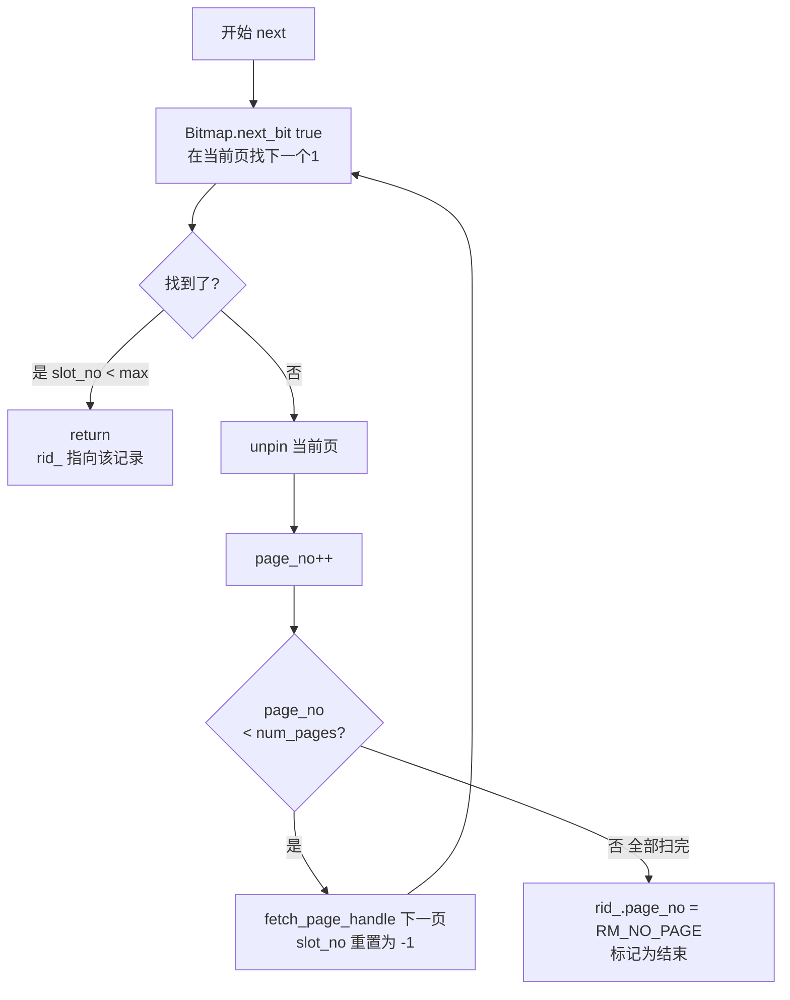

# 07. RmScan 记录扫描

`RmScan` 实现**全表顺序扫描**——从文件的第一个数据页开始，逐个检查每个槽位的 bitmap，找到所有已占用的记录。

## 基类 RecScan

`src/defs.h:52`

```cpp
class RecScan {
 public:
  virtual ~RecScan() = default;
  virtual void next() = 0;          // 移动到下一条记录
  virtual bool is_end() const = 0;  // 是否已扫描完所有记录
  virtual Rid rid() const = 0;      // 获取当前记录的 Rid
};
```

`RecScan` 定义了一个抽象的扫描器接口（`Rec` = Record 的缩写）。`RmScan` 是它的具体实现（`ix_scan` 索引扫描也是），它们都是"扫描记录"，只是扫描方式不同。

## RmScan 的成员

`src/record/rm_scan.h:18`

```cpp
class RmScan : public RecScan {
 private:
  const RmFileHandle* file_handle_;    // 要扫描的文件
  RmPageHandle cur_page_handle_;       // 当前正在扫描的页面（缓存）
  Rid rid_;                            // 当前记录的位置

 public:
  RmScan(const RmFileHandle* file_handle);
  void next() override;
  bool is_end() const override;
  Rid rid() const override;
  std::unique_ptr<RmRecord> get_record();  // 直接获取当前记录
};
```

`cur_page_handle_` 是缓存的关键——扫描过程中始终持有同一个页面的引用，避免每次 `next()` 都重新去缓冲池查。

## 构造函数：初始化并定位第一条记录

`src/record/rm_scan.cpp:19`

```cpp
RmScan::RmScan(const RmFileHandle* file_handle) : file_handle_(file_handle) {
  rid_ = {RM_FIRST_RECORD_PAGE, -1};  // 从第 1 页开始（第 0 页是文件头）
  if (rid_.page_no < file_handle_->file_hdr_.num_pages) {
    cur_page_handle_ = file_handle_->fetch_page_handle(rid_.page_no);
    next();  // 定位到第一条记录
    return;
  }
  rid_.page_no = RM_NO_PAGE;  // 文件没有任何数据页
}
```

从 `RM_FIRST_RECORD_PAGE`（即第 1 页）开始，`slot_no = -1` 是为了让 `next()` 第一次调用 `Bitmap::next_bit` 时从 0 开始找。

## next：找到下一条记录

`src/record/rm_scan.cpp:35`

```cpp
void RmScan::next() {
  do {
    // 在当前页中找下一个已占用的槽位
    rid_.slot_no = Bitmap::next_bit(
        true, cur_page_handle_.bitmap,
        file_handle_->file_hdr_.num_records_per_page, rid_.slot_no);

    if (rid_.slot_no < file_handle_->file_hdr_.num_records_per_page) {
      return;  // 找到了
    }

    // 当前页找完了，切换到下一页
    file_handle_->buffer_pool_manager_->unpin_page(
        cur_page_handle_.page->get_page_id(), false);

    if (++rid_.page_no >= file_handle_->file_hdr_.num_pages) {
      break;  // 所有页都扫完了
    }

    cur_page_handle_ = file_handle_->fetch_page_handle(rid_.page_no);
    rid_.slot_no = -1;  // 重置，下次从 0 开始找
  } while (true);

  rid_.page_no = RM_NO_PAGE;  // 标记为结束
}
```



**关键细节**：
- `next_bit(true, ...)` 中的 `true` 表示找值为 1 的位（已占用）
- 切换页面时**必须先 unpin 旧页面**，否则多次扫描后所有页面都被 pin 住，缓冲池无法替换
- `slot_no = -1` 配合 `next_bit` 从 `curr+1=0` 开始

## is_end 和 rid

```cpp
bool RmScan::is_end() const {
  return rid_.page_no == RM_NO_PAGE;  // page_no = -1 表示扫描结束
}

Rid RmScan::rid() const {
  return rid_;
}
```

## get_record：直接获取当前记录

```cpp
std::unique_ptr<RmRecord> RmScan::get_record() {
  return std::make_unique<RmRecord>(
      cur_page_handle_.get_slot(rid_.slot_no),
      file_handle_->file_hdr_.record_size, true);
}
```

因为 `cur_page_handle_` 已经缓存了当前页面，可以直接从槽位读取数据，不需要再走缓冲池。

## 典型使用方式

```cpp
auto file_handle = rm_manager->open_file("student.db");
RmScan scan(file_handle.get());       // 栈上直接构造，传入 RmFileHandle 裸指针
                                       // .get() 返回 unique_ptr 管理的裸指针，所有权不转移

while (!scan.is_end()) {
  auto rid = scan.rid();
  auto record = scan.get_record();
  // 处理 record->data 中的字节数据
  scan.next();
}                                      // scan 离开作用域，自动销毁
```

> **语法说明**：`RmScan scan(file_handle.get())` 是 C++ 在**栈上直接构造对象**的写法（等价于 `new` 但不需要手动 `delete`，对象离开作用域自动销毁）。`.get()` 是 `unique_ptr` 的方法，返回它管理的裸指针，**所有权仍归 unique_ptr**，`RmScan` 不会销毁传入的 `RmFileHandle`。
>
> **`unique_ptr` 是什么？** C++ 的**独占所有权智能指针**，替代手动 `new`/`delete`。
> 同一时刻只有一个 `unique_ptr` 拥有某个对象——不能拷贝，只能转移所有权（`std::move`）。
> 离开作用域自动释放，零额外开销（和裸指针一样大）。RMDB 中 `open_file` 返回 `unique_ptr<RmFileHandle>`，`get_record` 返回 `unique_ptr<RmRecord>`，都是明确独占的场景。
>
> **跟 `shared_ptr` 的区别**：`shared_ptr` 是共享所有权，多个指针可以指向同一对象，内部维护引用计数，最后一个释放时才销毁。RMDB 中对象的拥有关系很明确，不需要共享，所以用更轻量的 `unique_ptr`。


## 框架与参考实现的差异

### 框架的 next

框架（`db2026-x/src/record/rm_scan.cpp:30`）的实现：

```cpp
void RmScan::next() {
  int page_no = rid_.page_no;
  int slot_no = rid_.slot_no;

  while (page_no < file_handle_->file_hdr_.num_pages) {
    auto page_handle = file_handle_->fetch_page_handle(page_no);  // 每次都重新获取
    slot_no = Bitmap::next_bit(true, page_handle.bitmap,
                                file_handle_->file_hdr_.num_records_per_page,
                                slot_no);
    if (slot_no < file_handle_->file_hdr_.num_records_per_page) {
      rid_.page_no = page_no;
      rid_.slot_no = slot_no;
      file_handle_->buffer_pool_manager_->unpin_page(
          page_handle.page->get_page_id(), false);
      return;
    }
    file_handle_->buffer_pool_manager_->unpin_page(
        page_handle.page->get_page_id(), false);
    page_no++;
    slot_no = -1;
  }
  rid_.page_no = file_handle_->file_hdr_.num_pages;  // 注意：这里用的是 num_pages
  rid_.slot_no = -1;
}
```

### 主要差异

| 方面 | 框架 | 参考实现 |
|------|------|----------|
| 页面缓存 | 不缓存，每次 `next()` 都重新 fetch | `cur_page_handle_` 成员缓存当前页 |
| 结束标记 | `rid_.page_no = num_pages`（非 -1） | `rid_.page_no = RM_NO_PAGE`（-1） |
| `get_record()` | 无 | 有，直接从缓存页面读取 |
| 缓冲池访问 | 同一条记录所在的页可能被反复 fetch/unpin | 一个页面只 fetch 一次 |

### 为什么参考实现更好

1. **减少缓冲池锁竞争**：框架每调用 `next()` 一次就要 fetch/unpin 一次，而同一页面上要连续调用多次 `next()`。参考实现一个页面只 fetch 一次。
2. **`get_record()` 消除额外访问**：框架没有 `get_record()`，调用者需要拿着 `rid()` 再去 `RmFileHandle::get_record(rid)`，又会触发一次缓冲池的 `fetch_page`。
3. **结束标记一致性**：参考实现用 `RM_NO_PAGE`（-1），与整个系统的"无效页面"语义一致。框架用 `num_pages` 不是一个常规做法。

## 源码对应

| 内容 | 文件 | 行号 |
|------|------|------|
| RecScan 基类 | `src/defs.h` | 52-61 |
| RmScan 类定义 | `src/record/rm_scan.h` | 18-34 |
| 构造函数 | `src/record/rm_scan.cpp` | 19-30 |
| next | `src/record/rm_scan.cpp` | 35-69 |
| is_end | `src/record/rm_scan.cpp` | 74-77 |
| get_record | `src/record/rm_scan.cpp` | 85-88 |
| 框架版本 | `db2026-x/src/record/rm_scan.cpp` | 18-74 |

上一节：[06-record-manager.md](./06-record-manager.md) | 下一节：[08-record-interaction.md](./08-record-interaction.md)
