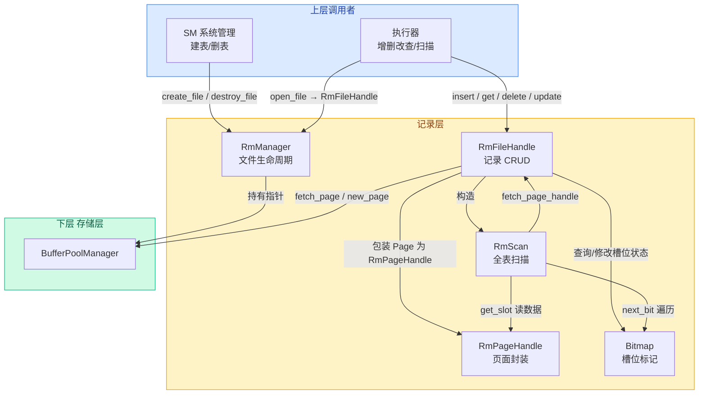
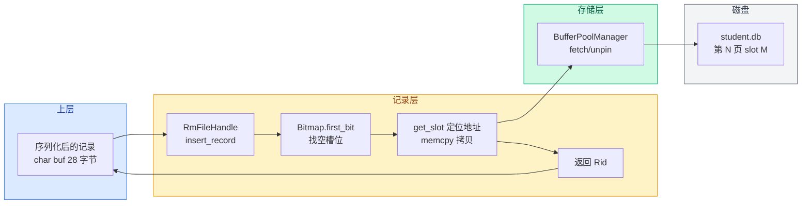

# 07b. 记录层组件交互机制

前面逐一讲解了各个组件。本文把它们串起来，看清"谁调用谁、谁依赖谁、数据怎么流转"。

## 组件分工

每个组件只负责一件事：

| 组件 | 一句话职责 |
|------|-----------|
| `RmManager` | 文件管理员——创建、打开、关闭、删除表数据文件 |
| `RmFileHandle` | 记录操作员——对一张表做增删改查 |
| `RmPageHandle` | 页面手柄——把原始页面字节解析成可读写的指针 |
| `Bitmap` | 位图标示——标记每个槽位是否被占用 |
| `RmScan` | 扫描器——从头到尾遍历表中所有记录 |

## 调用关系



## 典型工作流

### 建表

```
SM → RmManager.create_file("student.db", 28)
       ├── DiskManager.create_file("student.db")
       ├── 计算 num_records_per_page、bitmap_size
       ├── 初始化 RmFileHdr
       ├── DiskManager.write_page(第0页, RmFileHdr)
       └── DiskManager.close_file()
```

### 插入记录

```
执行器 → RmManager.open_file("student.db") → RmFileHandle

执行器 → fh.insert_record(buf)
           ├── create_page_handle()
           │     ├── 有空闲页？→ fetch_page_handle(链表头)
           │     └── 无空闲页？→ create_new_page_handle()
           │           ├── BufferPool.new_page() → 分配新页面
           │           ├── 初始化 RmPageHdr (num=0, next=-1)
           │           ├── Bitmap.init() → 全部清零
           │           └── 新页设为链表头
           ├── WLatch 加锁
           ├── Bitmap.first_bit(false) → 找第一个空槽位
           ├── Bitmap.set(slot_no) → 标记槽位为已用
           ├── num_records++
           ├── 满了？→ first_free = next_free (移出链表)
           ├── WUnlatch 解锁
           ├── memcpy → 拷贝数据到槽位
           └── unpin_page(dirty=true) → 返回 Rid
```

### 读取记录

```
执行器 → fh.get_record(Rid{page_no:1, slot_no:0})
           ├── fetch_page_handle(1) → RmPageHandle
           ├── Bitmap.is_set(slot=0) → 确认有记录
           ├── page_handle.get_slot(0) → 定位到槽位地址
           ├── make_unique<RmRecord> → memcpy 拷贝数据
           └── unpin_page(dirty=false) → 返回 RmRecord
```

### 全表扫描

```
执行器 → RmScan(file_handle).next()
           ├── Bitmap.next_bit(true) → 在当前页找下一个已占用槽位
           ├── 当前页找完了？
           │     ├── unpin 当前页
           │     ├── page_no++ → fetch_page_handle(下一页)
           │     └── 重新调用 next_bit
           └── 所有页找完了 → rid_.page_no = RM_NO_PAGE
```

### 关闭文件

```
SM → RmManager.close_file(fh)
       ├── DiskManager.write_page(第0页, 最新的 RmFileHdr)
       ├── BufferPool.flush_all_pages(fd) → 脏页刷盘
       ├── BufferPool.delete_all_pages(fd) → 清空页表
       └── DiskManager.close_file(fd)
```

## 数据流向

以一条 INSERT 为例，数据从上层流向磁盘的完整路径：



**输入**：`char* buf`（28 字节的序列化记录）
**输出**：`Rid{page_no, slot_no}`（记录存储的位置）

上层拿着这个 Rid，以后就可以通过 `get_record` 把数据取回来。

## 依赖层次

从下到上的依赖关系：

```
存储层                    记录层
────────────────────────────────────────────
BufferPoolManager  ←──── RmPageHandle (fetch/unpin 页面)
                         ↑
                    RmFileHandle (CRUD + 空闲链表)
                    ↑        ↑        ↑
                    │   Bitmap      RmScan
                    │
磁盘上: .db 文件 ──→ RmFileHdr (第0页元数据)
                     RmPageHdr (每页元数据)
```

`RmFileHandle` 是中心枢纽：它持有 `RmFileHdr`（文件元数据），通过 `RmPageHandle` 访问页面，通过 `Bitmap` 管理槽位，并构造 `RmScan` 进行扫描。

`RmManager` 在更外层，负责文件的创建和销毁，不参与具体的记录操作。

上一节：[07-record-scan.md](./07-record-scan.md) | 下一节：[08-record-structure-example.md](./08-record-structure-example.md)
