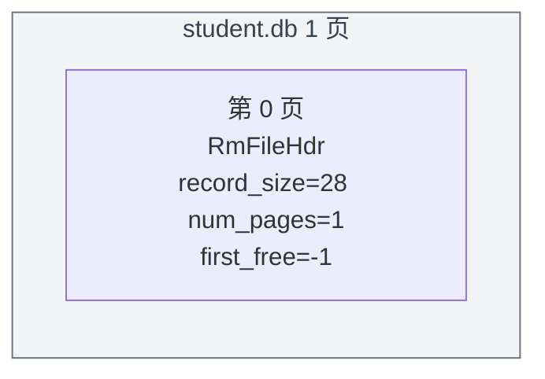
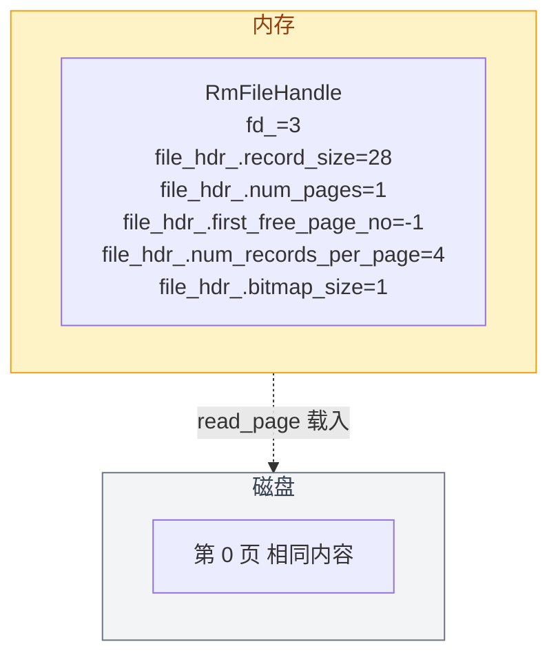
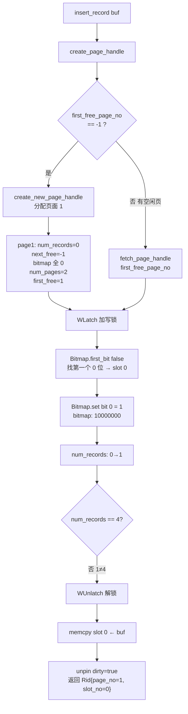
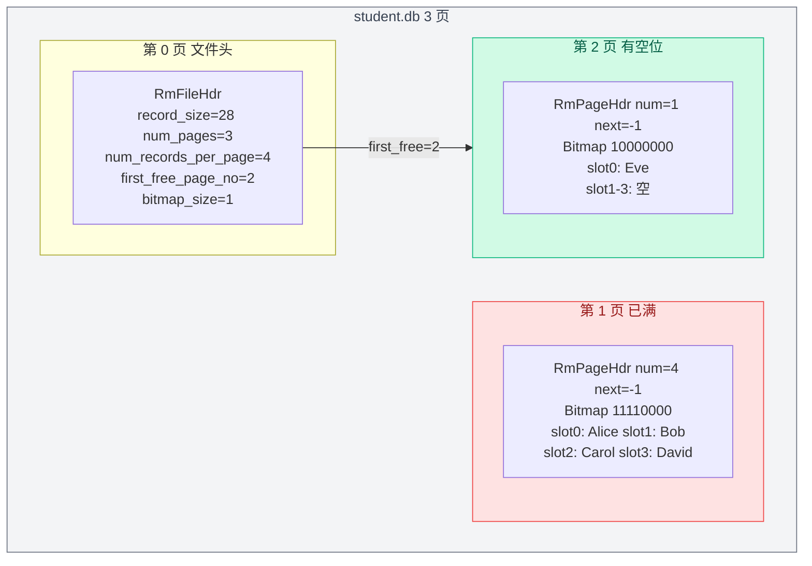
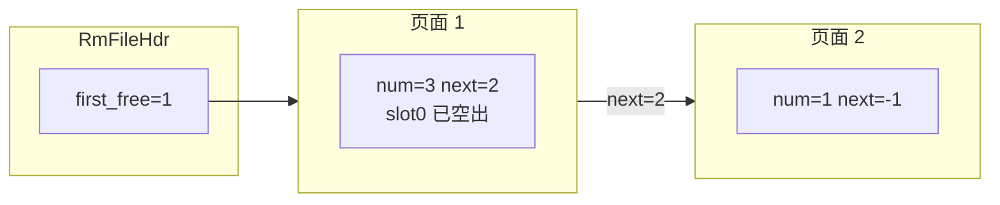
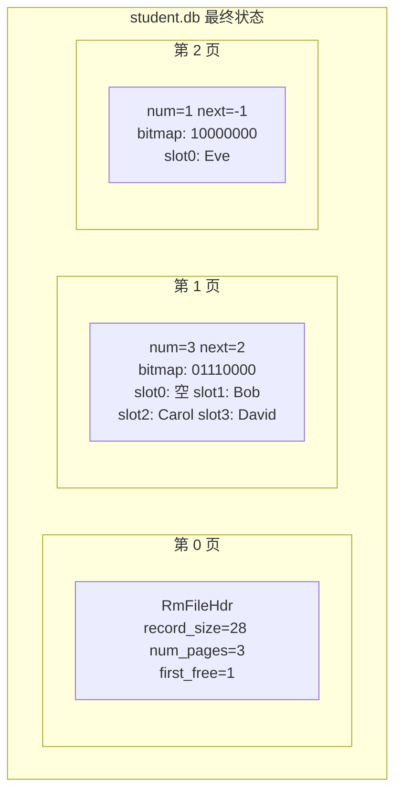

# 08. 记录层实例串讲

前面 01~07 逐一讲解了记录层的各个组件。本文用一个具体实例从头到尾把所有组件串起来，建立整体认知。

**贯穿全文的实例**：

```
数据库：mydb/
表：    student
列：    id INTEGER, name STRING[20], age INTEGER
记录大小：4 + 20 + 4 = 28 字节（假设 INT 4 字节）
数据文件：mydb/student.db（文件描述符 fd = 3）
每页最多记录数：num_records_per_page = 4（为方便演示，实际会更大）
```

## 步骤 1：创建表文件

上层（SM 系统管理）执行 `CREATE TABLE student (id INT, name STRING, age INT)` 时，调用：

```cpp
RmManager::create_file("student.db", 28);
```

RMDB 开始执行内部操作：

```
DiskManager::create_file("student.db")   → 在磁盘上创建空文件
DiskManager::open_file("student.db")     → 打开，得到 fd = 3

计算 num_records_per_page 和 bitmap_size：
  PAGE_SIZE = 4096, record_size = 28
  num_records_per_page ≈ 140           ← 实际值，后文用 4 演示
  bitmap_size = ceil(140 / 8) = 18

初始化 RmFileHdr：
  record_size            = 28
  num_pages              = 1          ← 只有第 0 页
  num_records_per_page   = 140        ← 后文简化用 4
  first_free_page_no     = -1         ← 空链表
  bitmap_size            = 18

DiskManager::write_page(fd=3, page_no=0, &file_hdr, sizeof(file_hdr))
  → 将文件头写入第 0 页

DiskManager::close_file(fd=3)
```

创建完成后的磁盘状态：



## 步骤 2：打开文件，构造 RmFileHandle

执行器要操作 student 表时，SM 先打开文件：

```cpp
auto fh = RmManager::open_file("student.db");
```

内部流程：

```
DiskManager::open_file("student.db")  → fd = 3

RmFileHandle 构造函数：
  disk_manager_->read_page(fd=3, page_no=0, &file_hdr_, sizeof(file_hdr_))
    → 把第 0 页的 RmFileHdr 读到内存中的 file_hdr_ 成员

  disk_manager_->set_fd2pageno(fd=3, num_pages=1)
    → 告诉 DiskManager 下次从 page_no=1 开始分配新页
```

此时内存中的数据结构：



## 步骤 3：插入 4 条记录（逐条追踪）

为方便演示，下面假设 `num_records_per_page = 4`。实际 student 表 record_size=28，一页能存约 140 条。

### 插入第 1 条：INSERT student VALUES (1, 'Alice', 20)

上层把记录序列化为 28 字节的 `char* buf`，调用：

```cpp
Rid rid = fh->insert_record(buf, context);
```



**操作后页面 1 的状态**：

```
第 1 页（4096 字节）内部结构：

offset  size    内容
──────────────────────────────────────────
0       4       Page 通用头（LSN）
4       8       RmPageHdr {
                  next_free_page_no = -1    ← 链表末尾
                  num_records      = 1      ← 当前 1 条
                }
12      1       Bitmap: 10000000            ← 只有 slot 0 被占用
13      28      slot 0: {id:1, name:"Alice", age:20}
41      28      slot 1: (空)
69      28      slot 2: (空)
97      28      slot 3: (空)
125     3971    剩余空间
──────────────────────────────────────────
        4096 字节
```

**链表状态**：`first_free=1 → [page1 num=1 next=-1] → -1`

### 插入第 2 条：INSERT student VALUES (2, 'Bob', 22)

```
create_page_handle():
  first_free = 1 → fetch_page_handle(1)   ← 复用页面 1

insert_record():
  Bitmap.first_bit(false) → slot 1
  Bitmap.set bit 1 = 1
  num_records: 1→2  （2≠4，不满）
  memcpy slot 1 ← buf
  → Rid{page_no=1, slot_no=1}
```

**操作后的 bitmap**：`11000000`（slot 0 和 slot 1 被占用）

**链表不变**：`first_free=1 → [page1 num=2 next=-1] → -1`

### 插入第 3 条和第 4 条

过程相同，每次 `create_page_handle()` 都返回页面 1，直到插满。

**插入第 4 条后页面 1 的状态**：

```
RmPageHdr: next_free=-1, num_records=4
Bitmap: 11110000    ← 4 个槽位全部占用
slot 0: {id:1, name:"Alice", age:20}
slot 1: {id:2, name:"Bob",   age:22}
slot 2: {id:3, name:"Carol", age:21}
slot 3: {id:4, name:"David", age:23}
```

**链表变化**：`num_records == num_records_per_page`（4==4），页面满了！

```cpp
// insert_record 中：
file_hdr_.first_free_page_no = page_handle.page_hdr->next_free_page_no;
// = -1
```

**链表状态**：`first_free = -1`（空链表，页面 1 已移出）

### 插入第 5 条：INSERT student VALUES (5, 'Eve', 19)

```
create_page_handle():
  first_free = -1 → create_new_page_handle()
  → 分配页面 2
  → page2: num_records=0, next_free=-1
  → num_pages=3, first_free=2

insert_record():
  → slot 0, num_records=1
  → Rid{page_no=2, slot_no=0}
```

**链表状态**：`first_free=2 → [page2 num=1 next=-1] → -1`

**当前全局快照**：



## 步骤 4：读取记录

```cpp
Rid rid{page_no: 1, slot_no: 0};  // Alice 的位置
auto record = fh->get_record(rid, context);
```

```
get_record({1, 0}):
  fetch_page_handle(1)       → 从缓冲池获取页面 1
  Bitmap::is_set(bitmap, 0)  → true ✓
  get_slot(0) → 页面 1 偏移 13，读 28 字节
  构造 RmRecord{data=..., size=28}
  unpin_page(page1, dirty=false)
  → 返回 {id:1, name:"Alice", age:20}
```

## 步骤 5：删除记录

```cpp
fh->delete_record(Rid{page_no: 1, slot_no: 0}, context);  // 删除 Alice
```

```
delete_record({1, 0}):
  fetch_page_handle(1)
  WLatch 加锁
  Bitmap::is_set → true ✓
  Bitmap::reset bit 0 = 0       → bitmap: 01110000
  num_records: 4→3
  删除前 4 == num_records_per_page → 满了变不满！
  → release_page_handle(page1):
      page1.next_free = first_free = 2
      first_free = 1
  WUnlatch
  unpin_page(page1, dirty=true)
```

**链表变化**：

```
操作前: first_free=2 → [page2 num=1 next=-1] → -1

release_page_handle(page1):
  page1.next_free = 2          ← page1 的 next 指向原来的头
  first_free = 1               ← page1 成为新头

操作后: first_free=1 → [page1 num=3 next=2] → [page2 num=1 next=-1] → -1
```



## 步骤 6：更新记录

```cpp
// UPDATE student SET age = 21 WHERE id = 2  → 定位到 {page_no: 1, slot_no: 1}
fh->update_record(Rid{page_no: 1, slot_no: 1}, new_buf, context);
```

```
update_record({1, 1}):
  fetch_page_handle(1)
  Bitmap::is_set → true ✓
  memcpy(get_slot(1), new_buf, 28)   ← 直接覆盖，因为定长
  unpin_page(page1, dirty=true)
```

定长记录的优势：更新就是原地覆盖，不需要关心新老数据大小是否一致。

## 步骤 7：全表扫描

```cpp
RmScan scan(fh.get());
while (!scan.is_end()) {
  auto rid = scan.rid();
  auto rec = scan.get_record();
  // 处理记录...
  scan.next();
}
```

扫描过程逐页逐槽检查 bitmap，跳过已删除的 slot 0：

```
初始化:
  rid_ = {page_no: 1, slot_no: -1}
  cur_page_handle_ = fetch_page_handle(1)   ← 缓存页面 1

第 1 次 next():
  Bitmap.next_bit(true, bitmap, 4, -1)
    → 从 slot 0 开始找第一个 1 的位
    → slot 0 的 bit=0（已删除），跳过
    → slot 1 的 bit=1 ✓ → rid_ = {1, 1}   ← Bob

第 2 次 next():
  Bitmap.next_bit(true, bitmap, 4, 1)
    → slot 2 的 bit=1 ✓ → rid_ = {1, 2}   ← Carol

第 3 次 next():
  → slot 3 的 bit=1 ✓ → rid_ = {1, 3}     ← David

第 4 次 next():
  Bitmap.next_bit(true, bitmap, 4, 3)
    → 超出范围，返回 4
  unpin_page(page1)                         ← 页面 1 扫完
  page_no++ → 2
  cur_page_handle_ = fetch_page_handle(2)   ← 换到页面 2

第 5 次 next():
  Bitmap.next_bit(true, bitmap, 4, -1)
    → slot 0 的 bit=1 ✓ → rid_ = {2, 0}   ← Eve

第 6 次 next():
  → 页面 2 也没有更多记录
  page_no++ → 3 >= num_pages=3
  rid_.page_no = RM_NO_PAGE                 ← 扫描结束
```

## 步骤 8：关闭文件

```cpp
RmManager::close_file(fh.get());
```

```
1. write_page(fd=3, page_no=0, &file_hdr_, sizeof(file_hdr_))
   → 将最新 file_hdr_ 写回第 0 页（num_pages=3, first_free=1 等）

2. buffer_pool_manager_->flush_all_pages(fd=3)
   → 所有脏页刷盘

3. buffer_pool_manager_->delete_all_pages(fd=3)
   → 清空缓冲池中该文件的页表

4. disk_manager_->close_file(fd=3)
```

## 最终磁盘状态



## 所有数据结构回顾

| 结构 | 实例中的值 | 作用 |
|------|----------|------|
| `Rid` | `{1, 0}` ~ `{2, 0}` | 每条记录的"门牌号" |
| `RmRecord` | `{data=28字节, size=28}` | 记录内容，原始字节 |
| `RmPageHdr` | `num_records`, `next_free_page_no` | 每页的状态和链表指针 |
| `Bitmap` | `01110000` 等 | 标记每个槽位占用 |
| `RmFileHdr` | 第 0 页的文件头 | 全局元信息、链表头指针 |
| `RmPageHandle` | page_hdr + bitmap + slots 三指针 | 页面访问的"手柄" |
| `RmScan` | cur_page_handle_ + rid_ | 扫描时的当前位置 |

上一节：[07. 记录扫描](./07-record-scan.md) | 下一节：[09. 框架对比分析](./09-record-frame-vs-reference.md)
