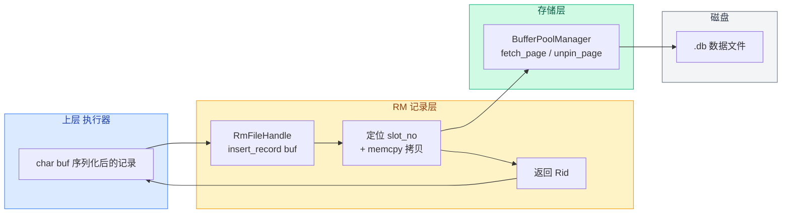

# 12. 记录层总结

记录层共 11 个小节，覆盖了表数据文件的组织方式与记录的增删改查完整链路：

```
RmManager → RmFileHandle → RmPageHandle → Bitmap → RmScan
(文件管理)  (记录CRUD)    (页面封装)   (槽位标记)  (全表扫描)
```

## 各模块框架状态与学习要点

| 模块 | 框架状态 | 核心学习点 |
|------|---------|-----------|
| 数据结构定义 | 已完整实现 | Rid 定位记录、RmRecord 存字节、RmFileHdr/RmPageHdr 元信息 |
| RmPageHandle | 已完整实现 | 三段式指针（page_hdr + bitmap + slots）、get_slot 槽位定位 |
| Bitmap | 已完整实现 | get_bucket/get_bit 位运算、set/reset/is_set、next_bit 查找 |
| RmFileHandle CRUD | 基础实现，**需加强** | get/insert/delete/update 流程、位图检查、并发保护 |
| 空闲页链表 | 基础实现，**需加强** | create_page_handle、release_page_handle、头插法 |
| RmManager | 已完整实现 | 文件生命周期、close_file 的步骤顺序 |
| RmScan | 基础实现，**需加强** | 页面缓存优化、get_record 消除额外缓冲池访问 |

## 核心设计思路

1. **定长记录 + 槽位数组**：记录定长 → 槽位按数组排列 → 用乘法直接定位（O(1)）
2. **位图标记占用**：每槽 1 bit → bitmap_size 极小 → next_bit 线性扫描找空位
3. **空闲链表加速插入**：空闲页面用单向链表串联 → 插入 O(1) 找到有空位的页面
4. **先解锁再拷贝**：加锁只保护元数据修改（bitmap + num_records），数据拷贝在解锁后进行

## 数据流转



**输入**：`char* buf`（序列化的记录字节）  
**输出**：`Rid`（记录位置，page_no + slot_no）

## 与上下层的对接

| 方向 | 层 | 通过什么接口 | 传递什么 |
|------|----|-------------|---------|
| 对上 | 系统管理 SM | `RmManager::create_file` / `destroy_file` | 文件名 + record_size |
| 对上 | 执行器 | `RmFileHandle::insert_record` 等 | `char* buf` → `Rid` |
| 对下 | BufferPoolManager | `fetch_page` / `new_page` / `unpin_page` | `PageId` → `Page*` |
| 对下 | DiskManager | `read_page` / `write_page` | fd + page_no + data |

上一节：[11-record-api-reference.md](./11-record-api-reference.md)

下一章：[第 3 章：索引层](../03-index-layer/README.md)
