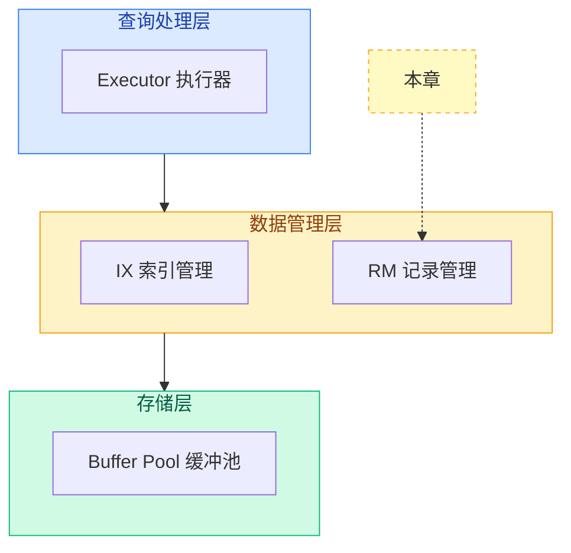

# 第 2 章：记录层

记录层（Record Manager，简称 RM）是数据管理层的下层模块，负责**表数据文件的组织与管理**——把表中的记录存到磁盘页面上、从页面上读取记录、增删改查记录。

## 框架 vs 参考实现

| 模块 | 框架 `db2026-x/` | 参考实现 `src/` | 学习目标 |
|------|-----------------|-----------------|----------|
| 数据结构定义 | 已给完整定义 | 同框架（无变化） | 了解 |
| RmPageHandle | 已给完整实现 | 同框架（无变化） | 了解 |
| Bitmap | 已给完整实现 | 同框架（无变化） | 了解 |
| RmFileHandle CRUD | 基础实现，无并发保护 | 加了页级锁、边界检查 | **核心学习目标** |
| RmManager | 已完整实现 | 同框架（无变化） | 了解 |
| RmScan | 基础实现 | 优化了页面复用 | **核心学习目标** |

## 本章目录

| 序号 | 文档 | 内容 | 类型 |
|------|------|------|------|
| 01 | [记录层概述](./01-record-layer-overview.md) | 记录层是什么、架构位置、输入输出 | 理解 |
| 02 | [数据结构](./02-record-data-structures.md) | Rid、RmRecord、RmFileHdr、RmPageHdr | 掌握 |
| 03 | [数据页内部布局](./03-record-page-layout.md) | 页头 + bitmap + slots 三层结构 | 掌握 |
| 04 | [Bitmap 位图](./04-record-bitmap.md) | 用 1 bit 标记每个槽位占用状态 | 理解 |
| 05a | [记录增删改查](./05a-record-crud.md) | get_record、insert、delete、update | **核心** |
| 05b | [空闲页链表管理](./05b-record-free-list.md) | free page list 的创建与回收 | **核心** |
| 06 | [记录管理器](./06-record-manager.md) | RmManager 文件生命周期管理 | 了解 |
| 07 | [记录扫描] | RmScan 顺序扫描迭代器 | **核心** |
| 07b | [组件交互机制](/07b-record-interaction.md) | 各组件间的调用关系、工作流、数据流向 | 理解 |(./07-record-scan.md) | RmScan 顺序扫描迭代器 | **核心** |
| 08 | [记录层实例串讲](./08-record-structure-example.md) | 用具体实例串联所有数据结构，建立整体认知 | 综合 |
| 09 | [框架对比分析](./09-record-frame-vs-reference.md) | 框架实现 vs 参考实现的差异与原因 | 理解 |
| 10 | [记录层总结](./10-record-layer-summary.md) | 各模块框架状态与核心学习点汇总 | 总结 |

## 记录层在整体架构中的位置

