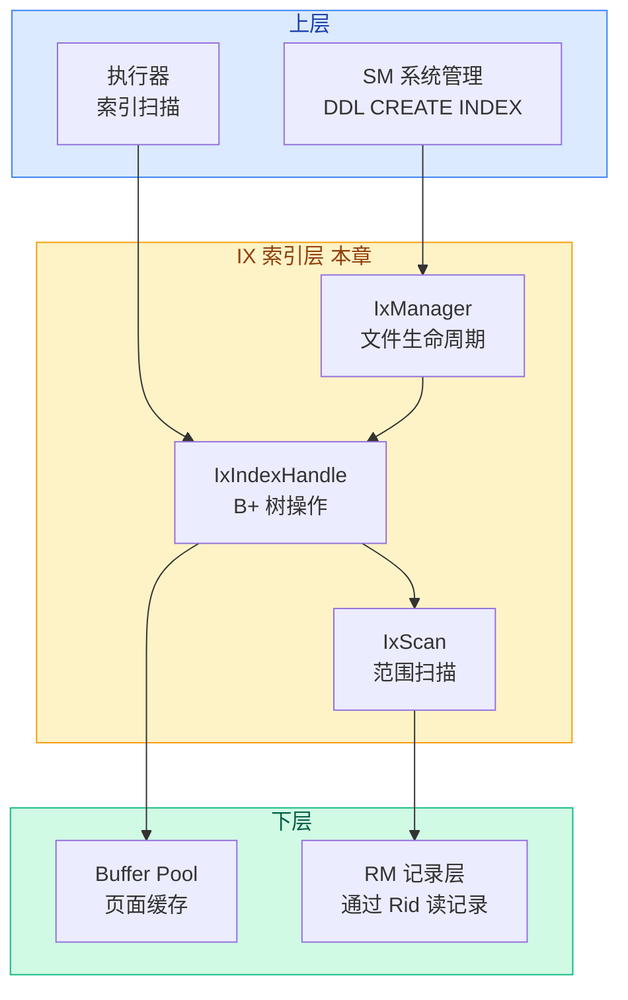

# 01. 索引层概述

## 索引层是什么

索引层（Index Manager，简称 IX）负责管理表的**索引文件**。

记录层让我们能按 `Rid` 精确定位一条记录——但前提是你已经知道 `Rid`。
如果想查 `WHERE age = 20`，记录层只能全表扫描，逐条检查 age 是不是 20。
索引层解决的就是这个问题：**给定某个字段的值，快速找到包含该值的所有记录的 Rid**。

打比方：记录层是书的正文（按页码查找），索引层是书末的索引（按关键词查找页码）。

## 在架构中的位置

**向下**：通过 `BufferPoolManager` 读写索引页面，通过记录层的 `get_record(Rid)` 获取实际记录。

**向上**：为系统管理提供索引创建/删除接口，为执行器提供索引查找和范围扫描接口。

## 输入与输出

| 方向 | 输入 | 输出 | 说明 |
|------|------|------|------|
| 查找 | `char* key`（索引键值） | `vector<Rid>`（匹配的所有记录位置） | 用 B+ 树查找 |
| 范围扫描 | `lower` ~ `upper`（Iid 范围） | 逐条返回 `Rid` | 利用叶节点链表 |
| 插入 | `key` + `Rid` | 无（更新 B+ 树结构） | 插入记录时同步更新索引 |
| 删除 | `key` | 无（更新 B+ 树结构） | 删除记录时同步更新索引 |

## 核心要解决的问题

索引层要解决的关键问题：**"给定键值，如何在对数时间内找到对应的 Rid？"**

围绕这个核心问题，拆解出以下子问题：

1. **用什么数据结构？** — B+ 树，平衡多路搜索树
2. **键值如何比较？** — `ix_compare`，根据列类型（INT/FLOAT/STRING）分别比较
3. **如何插入新键？** — 找到叶节点插入，满则分裂，分裂可能递归向上
4. **如何删除键？** — 叶节点删除，太小时合并或重分配
5. **如何范围扫描？** — 先定位下界，沿叶节点链表顺序遍历
6. **如何保证并发安全？** — 页级读写锁 + 根节点特殊处理

## 涉及的文件

| 文件 | 作用 |
|------|------|
| `src/index/ix_defs.h` | 数据结构定义：IxFileHdr、IxPageHdr、Iid |
| `src/index/ix_index_handle.h` | IxNodeHandle（B+ 树节点）、IxIndexHandle（B+ 树）声明 |
| `src/index/ix_index_handle.cpp` | B+ 树查找、插入、删除、分裂、合并的完整实现 |
| `src/index/ix_manager.h` | IxManager：索引文件创建、打开、关闭、删除 |
| `src/index/ix_scan.h` | IxScan：B+ 树范围扫描 |
| `src/index/ix_scan.cpp` | IxScan 实现 |

下一节：[02-index-data-structures.md](./02-index-data-structures.md)（待编写）
