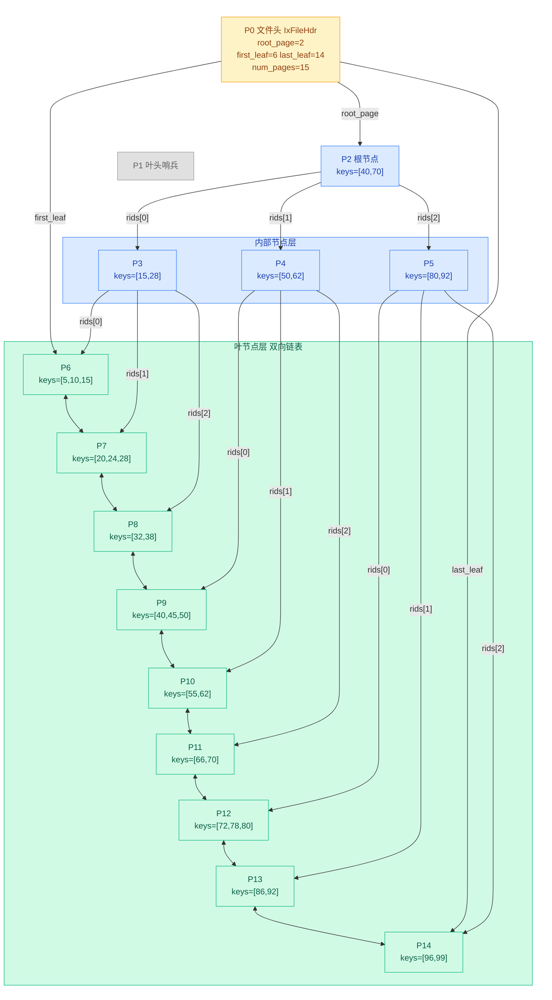

# 01b. B+ 树基础

## 为什么数据库不用二叉搜索树

学数据结构时，查找问题通常用二叉搜索树 BST 解决。

BST 每个节点存一个键，左小右大，查找时每一步排除一半数据。

但数据库不用 BST。原因是**磁盘 I/O**。

内存中 BST 查找很快——沿着指针跳转，每次只访问一个节点，O(log₂n) 次比较。

磁盘上情况完全不同。磁盘读写以**页**（Page，4096 字节）为单位，每次读取整页。如果 BST 的每个节点放在不同页上，查找一条记录可能需要 log₂n 次磁盘读取：

```
100 万条记录，BST 高度约 20 层 → 最多 20 次磁盘 I/O
每次磁盘 I/O 约 10ms → 20 次 = 200ms，太慢了
```

B+ 树的核心思路：**让每个节点存更多的键，让树变得更矮更胖**。

同一个节点内的键存在同一页上，一次磁盘 I/O 就能加载整个节点。节点越宽，树越矮，磁盘 I/O 越少。

```
100 万条记录，B+ 树阶数为 100 → 高度约 3 层 → 最多 3 次磁盘 I/O
3 次 × 10ms = 30ms，比 BST 快一个数量级
```

> **关键认知**：B+ 树的"阶数"不是随便定的——它由页面大小和键大小共同决定。
> 一页 4096 字节，一个键 8 字节，一页能塞约 500 个键，树就只需要 2~3 层。
> 这就是为什么 B+ 树是数据库索引的标准数据结构。

## B+ 树是什么

B+ 树是一种**平衡多路搜索树**。拆开理解：

- **多路**：每个节点可以有多个孩子（不像二叉树只有 2 个）
- **平衡**：所有叶节点在同一层，从根到任何叶的路径长度相同
- **搜索树**：节点内的键按大小排序，可以二分查找

B+ 树的核心规则：**数据只存在叶节点，内部节点只存"路标"**。

```
内部节点（非叶节点）：只存分隔键 + 孩子指针，不存实际数据
叶节点：存实际键 + 数据指针，叶节点之间串成双向链表
```

打个比方：内部节点是高速公路的路牌（告诉你往哪个方向走），叶节点是具体的门牌号（告诉你数据在哪）。

## B+ 树的结构

下面是 RMDB 中一棵 3 层 B+ 树的逻辑拓扑——节点间如何连接：




**从逻辑拓扑图可以看出**：
- 一棵 3 层的 B+ 树：根（1 个）→ 内部节点（3 个）→ 叶节点（9 个），共 15 页
- 内部节点（蓝底）只存分隔键和孩子指针，不存实际数据
- 叶节点（绿底）存实际键和记录 Rid，所有叶节点通过 `prev_leaf`/`next_leaf` 串成双向链表
- 范围扫描只需沿链表顺序遍历，不需要回溯内部节点
- 每个节点的 `parent` 字段指回父节点，根节点的 `parent = -1`
- 文件头（黄底）记录整棵树的全局信息：`root_page` 指向根节点，`first_leaf`/`last_leaf` 指向叶节点链表首尾
- 第 1 页（灰底哨兵）不出现在查找路径中，它是叶节点链表的逻辑哨兵，`first_leaf` 指向的才是第一个真正的叶节点

**每个页面内部**都是三段式布局：

```
页面内部（4096 字节）：
┌──────────────────┬───────────────────────────┬──────────────────────────┐
│ IxPageHdr        │ keys[0..btree_order]      │ rids[0..btree_order]     │
|                  | 键数组，keys_size 字节    | 孩子指针数组               │
│ parent num_key   │                           │                          │
│ is_leaf          │ col_tot_len x (order+1)   │ sizeof(Rid) x (order+1)  │
│ prev next        │                           │                          │
└──────────────────┴───────────────────────────┴──────────────────────────┘
```

keys 和 rids 在创建时就预分配了固定大小（由 `btree_order` 决定），不随数据量动态变化。

**三个关键特征**：

**特征一：数据只在叶节点**。内部节点（蓝底）的键是"分隔键"，只用于导航。比如根节点的 `[40, 70]` 表示：< 40 走 rids[0]，40~70 走 rids[1]，> 70 走 rids[2]。实际数据全在叶节点（绿底）。

**特征二：叶节点串成链表**。所有叶节点通过 `prev_leaf`/`next_leaf` 形成有序双向链表。想做范围扫描（如 `WHERE age BETWEEN 20 AND 30`），找到起始位置后沿链表走就行，不需要回溯内部节点。

**特征三：绝对平衡**。不管插入还是删除，B+ 树始终保持所有叶节点在同一层。树的高度只会因为根节点分裂而整体增加一层。

## 关键概念

### 阶数 order

阶数是 B+ 树最重要的参数：**一个节点最多能存多少个键**。

阶数由页面大小和键大小共同决定。在 RMDB 中，阶数在创建索引时计算：

```
阶数 ≈ (PAGE_SIZE - 页头大小) / (键大小 + Rid大小)
```

> 具体公式见 `src/index/ix_defs.h:27` 中 `btree_order_` 的计算，将在下一节数据结构中详细推导。

阶数决定了树的分支能力。阶数 = 100 时，每个内部节点最多有 101 个孩子。100 万条记录，log₁₀₀(100 万) ≈ 3，树只需要 3 层。

### 节点填充率

B+ 树要求每个节点（除根外）至少填满一半：

- **最少键数**：⌈order/2⌉ 个（根节点可以更少）
- **最多键数**：order 个

这个"半满"约束保证了树不会退化成链表，维持 O(log n) 的查找效率。

当插入导致键数超过 order → **分裂**。
当删除导致键数少于 ⌈order/2⌉ → **合并**或**重分配**。

### 根节点的特殊性

根节点是唯一没有最小键数限制的节点。一棵空 B+ 树的根节点可能只有 0 个键。当根节点被删空时，它的唯一孩子成为新根，树的高度减 1。

## 内部节点 vs 叶节点

B+ 树只有两种节点，区别在于 `is_leaf` 这个标志位：

| | 内部节点 | 叶节点 |
|------|---------|-------|
| 存什么键 | 分隔键，用于导航 | 实际数据的键 |
| 存什么指针 | 孩子节点的页面号 | 记录在 .db 文件中的 Rid |
| 键值对数量 | n 个键 → n+1 个孩子 | n 个键 → n 个 Rid |
| 是否在链表里 | 否 | 是，prev 和 next 串成双向链表 |
| is_leaf | false | true |

这两种节点在物理上完全一样——同一套页面格式，同一个 `IxPageHdr`，同一套读写代码。靠 `is_leaf` 区分行为。

> 这跟记录层的设计思路一致：第 0 页（文件头）和数据页用同一套 Page 机制，靠页面号区分用途。

## 基本操作概览

以下只是操作的概念模型，详细实现见后续文档（04a 查找、04b 插入、04c 删除）。

### 查找

从根节点开始，自上而下：

1. 在当前节点内二分查找，定位键应该在哪个区间
2. 沿着对应的孩子指针下到下一层
3. 重复直到到达叶节点
4. 在叶节点内二分查找，找到对应键的 Rid

```
查找 key=45 的路径：
根节点 keys=[40,70] → 45 在 40~70 之间 → 走 rids[1] 的孩子
→ 内部节点 keys=[50,62] → 45 < 50 → 走 rids[0] 的孩子
→ 叶节点 keys=[40,45,50] → 找到 key=45 → 返回对应的 Rid
```

这个路径长度 = 树的高度，每次下降一层只需一次磁盘 I/O。

### 插入

1. 查找到目标叶节点
2. 在叶节点中插入键值对
3. 如果叶节点键数 > order → **分裂**：一半留在原节点，一半搬到新节点，中间键提升到父节点
4. 父节点如果也满了 → 继续向上分裂，可能一直传到根

分裂是递归向上的，最坏情况下会一直裂到根，树的高度 +1。

### 删除

1. 查找到目标叶节点
2. 在叶节点中删除键值对
3. 如果叶节点键数 < ⌈order/2⌉ → 先尝试从兄弟节点**借**一个键（重分配）
4. 借不到 → **合并**兄弟节点，父节点中对应的分隔键也被删除
5. 父节点如果也太空了 → 继续向上合并，可能传到根

合并也是递归向上的。如果合并导致根节点变空，根的唯一孩子成为新根，树的高度 -1。

## B+ 树 vs B 树

B 树和 B+ 树常被混淆。核心区别只有一条：

| | B 树 | B+ 树 |
|------|------|------|
| 数据存放位置 | **所有节点**都可以存数据 | **只有叶节点**存数据 |
| 内部节点的键 | 既是分隔键也是数据 | 只是分隔键，数据在叶节点有副本 |
| 范围查询 | 需要中序遍历，回溯内部节点 | 叶节点链表顺序遍历，O(1) 定位下一条 |
| 内部节点容量 | 较小（每个键附带数据） | 较大（只有键，可以放更多） |
| 树的高度 | 较高 | 较低（内部节点能容纳更多键） |

B+ 树在数据库中几乎一统天下，核心原因就两个：

1. **范围查询高效**：叶节点链表保证范围扫描是纯顺序遍历
2. **内部节点更"轻"**：不存数据，能容纳更多键，树更矮，磁盘 I/O 更少

## B+ 树在 RMDB 中的对应关系

学了概念后，把它们映射到实际代码：

| B+ 树概念 | RMDB 中的对应 | 文件位置 |
|-----------|-------------|---------|
| 整棵树 | 一个 `.idx` 索引文件 | `src/index/` |
| 根节点页面号 | `IxFileHdr::root_page_` | `src/index/ix_defs.h:27` |
| 阶数 | `IxFileHdr::btree_order_` | 同上 |
| 节点 | `IxNodeHandle` 管理的一个 Page | `src/index/ix_index_handle.h` |
| 节点页头 | `IxPageHdr` | `src/index/ix_defs.h:140` |
| 内部/叶节点标志 | `IxPageHdr::is_leaf` | 同上 |
| 叶节点链表 | `prev_leaf` + `next_leaf` | 同上 |
| 键数组 | `IxNodeHandle::get_key(i)` | `src/index/ix_index_handle.cpp` |
| 孩子指针数组 | `IxNodeHandle::get_rid(i)` | 同上 |
| 查找操作 | `IxIndexHandle::find_leaf_page` + `lower_bound` | 见 04a |
| 插入操作 | `IxIndexHandle::insert_entry` | 见 04b |
| 删除操作 | `IxIndexHandle::delete_entry` | 见 04c |

这些结构的详细定义和布局会在下一节 [02-index-data-structures.md](./02-index-data-structures.md) 展开。

上一节：[01-index-layer-overview.md](./01-index-layer-overview.md) | 下一节：[02-index-data-structures.md](./02-index-data-structures.md)
