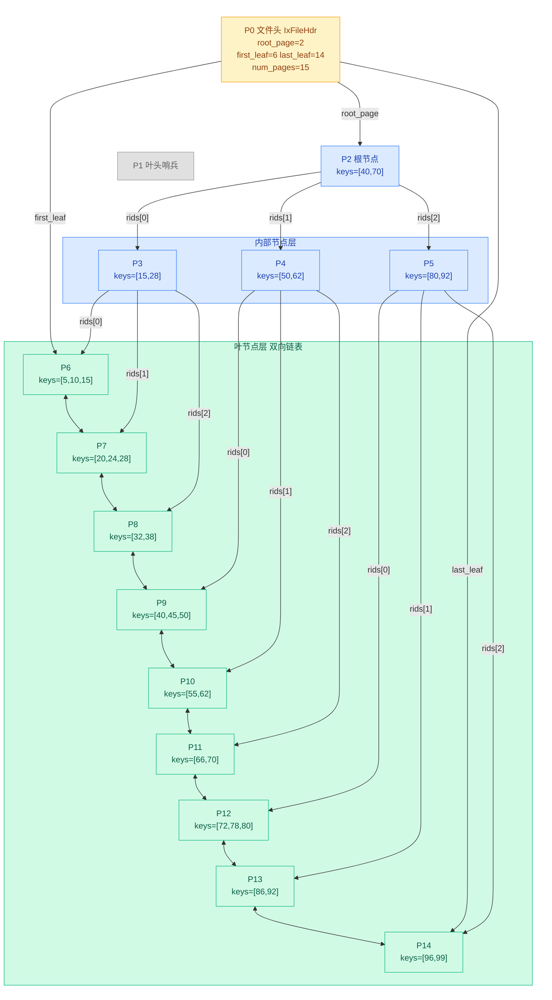

# 02. 索引层数据结构

索引层用 B+ 树组织索引键值。先看数据结构——文件存什么、页面存什么、如何定位。

## 常量

`src/index/ix_defs.h:20-25`

```cpp
constexpr int IX_NO_PAGE = -1;          // 无效页面号
constexpr int IX_FILE_HDR_PAGE = 0;     // 文件头在第 0 页
constexpr int IX_LEAF_HEADER_PAGE = 1;  // 叶头在第 1 页
constexpr int IX_INIT_ROOT_PAGE = 2;    // 初始根节点在第 2 页
constexpr int IX_INIT_NUM_PAGES = 3;    // 初始页面数
constexpr int IX_MAX_COL_LEN = 512;     // 索引列最大长度
```

索引文件初始有 3 页：第 0 页文件头、第 1 页叶头（叶节点链表哨兵）、第 2 页根节点。

## B+ 树磁盘存储全景

插入一些数据后，`student.idx` 文件在磁盘上的样子：




**从上图可以看出**：
- 一棵 3 层的 B+ 树：根（1 个）→ 内部节点（3 个）→ 叶节点（9 个），共 15 页
- 内部节点（蓝底）只存分隔键和孩子指针，不存实际数据
- 叶节点（绿底）存实际键值和记录 Rid，所有叶节点通过 `prev_leaf`/`next_leaf` 串成一条双向链表
- 范围扫描只需沿链表顺序遍历，不需要回溯内部节点
- 每个节点的 `parent` 字段指回父节点，根节点的 `parent = -1`

**每个页面内部**都是三段式布局：

```
页面内部（4096 字节）：
┌──────────────────┬───────────────────────────┬──────────────────────────┐
│ IxPageHdr        │ keys[0..btree_order]      │ rids[0..btree_order]     │
│ parent num_key   │ 键值数组，keys_size 字节    │ 孩子指针数组               │
│ is_leaf          │ col_tot_len × (order+1)   │ sizeof(Rid) × (order+1)  │
│ prev next        │                           │                          │
└──────────────────┴───────────────────────────┴──────────────────────────┘
```

keys 和 rids 在创建时就预分配了固定大小（由 `btree_order` 决定），不随数据量动态变化。

### keys 和 rids 分别存什么？

**keys**：键数组。每个元素是 `col_tot_len` 字节的键值。

如果索引建立在 `age` 字段上，那 key 就是一个 int 值（如 20、30、40）。
如果索引建立在 `(name, age)` 联合字段上，那 key 就是 name+age 拼接起来的字节串。

**rids**：指针数组。每个元素是一个 `Rid{page_no, slot_no}`。

但内部节点和叶节点的 rids 含义**不同**：

```
内部节点:  keys[i] = 分隔键（用于导航）
          rids[i] = 孩子节点的页面号 (page_no)

          例: keys=[30, 60]
              rids=[page3, page4, page5]
              含义: <30 走 page3, 30~60 走 page4, >60 走 page5

叶节点:    keys[i] = 实际数据的键值
          rids[i] = 该键对应记录的 Rid (page_no, slot_no)

          例: keys=[5, 10, 15]
              rids=[{p1,s0}, {p1,s3}, {p2,s1}]
              含义: age=5 的记录在 p1 页 s0 槽位
```

> **类比记录层**：叶节点的 `(key, rid)` 就像记录层的 `(slot_no, record)` 映射。
> 记录层通过 Rid 的 slot_no 定位槽位里的记录内容；
> 索引层通过 key 定位到 Rid，再拿着 Rid 去记录层取记录内容。

与记录层页面对比：两边都是三段式布局，但内容不同。

```
记录层 data page:    RmPageHdr + Bitmap + Slots (定长记录数组)
索引层 index page:   IxPageHdr + keys[] + rids[] (键值对数组)
```

记录层需要 Bitmap 因为删除记录后槽位状态不确定（有空洞）。
索引层不需要 Bitmap——`num_key` 直接告诉你有效键的数量，键值对紧密排列，删除靠 memmove 填补空缺。

## IxFileHdr：索引文件头

存在索引文件的第 0 页，存储 B+ 树的全局元信息。

`src/index/ix_defs.h:27`

```cpp
class IxFileHdr {
 public:
  page_id_t first_free_page_no_;   // 第一个空闲页面号（已删除的页面可复用）
  int num_pages_;                  // 文件总页数
  page_id_t root_page_;            // B+ 树根节点页面号
  int col_num_;                    // 索引包含的字段数
  std::vector<ColType> col_types_; // 各字段类型
  std::vector<int> col_lens_;      // 各字段长度
  int col_tot_len_;                // 所有字段总长度（单键大小）
  int btree_order_;                // B+ 树阶数（每个节点最多可插入的键值对数量）
  int keys_size_;                  // 每页 keys 区大小 = (btree_order + 1) * col_tot_len
  page_id_t first_leaf_;           // 首叶节点页号（IxScan 起点）
  page_id_t last_leaf_;            // 尾叶节点页号（IxScan 终点判断）
  int tot_len_;                    // 结构体序列化后的总长度
};
```

| 字段 | 作用 | 确定时机 |
|------|------|----------|
| `root_page_` | B+ 树入口，所有查找从此开始 | 建索引时初始化，此后可能变更 |
| `btree_order_` | 阶数，由 PAGE_SIZE 和 key 大小算出 | 建索引时计算 |
| `keys_size_` | 每页预留给 keys 的字节数 | = (order+1) × col_tot_len |
| `first_leaf_` / `last_leaf_` | 叶节点链表头尾，用于范围扫描 | 动态维护 |
| `num_pages_` | 当前文件页数，新增节点时递增 | 动态变化 |

与记录层的 `RmFileHdr` 对比：索引层多了 `root_page_`（B+ 树入口）、`btree_order_`（阶数控制分支数）、叶节点链表指针（`first_leaf_`/`last_leaf_`）。

## IxPageHdr：索引页头

每个索引页的开头，对应记录层的 `RmPageHdr`。两者大小不同但作用类似：

| | RmPageHdr | IxPageHdr |
|------|-----------|----------|
| 大小 | 8 字节（2 个 int） | ~32 字节（6 个字段） |
| 记录数 | `num_records`（当前页几条记录） | `num_key`（当前节点几个键） |
| 链表指针 | `next_free_page_no`（有空位的页链表） | `prev_leaf / next_leaf`（叶节点双向链表） |
| 特有字段 | 无 | `parent`（父节点）、`is_leaf`（叶/内部节点标志） |

记录层用链表串联"有空位的页面"是为了插入时快速定位；
索引层用链表串联"叶节点"是为了范围扫描时顺序遍历。
两者都在页头里嵌入链表指针，复用同一个设计模式。

`src/index/ix_defs.h:140`

```cpp
class IxPageHdr {
 public:
  page_id_t next_free_page_no;  // 未使用（保留字段）
  page_id_t parent;             // 父节点页面号
  int num_key;                  // 当前节点的键值对数量
  bool is_leaf;                 // 是否为叶节点
  page_id_t prev_leaf;          // 前驱叶节点页面号（仅叶节点有效）
  page_id_t next_leaf;          // 后继叶节点页面号（仅叶节点有效）
};
```

| 字段 | 作用 |
|------|------|
| `parent` | 指向父节点，根节点的 parent = -1 |
| `num_key` | 当前节点中有几个键（= 孩子数 - 1） |
| `is_leaf` | 叶节点 / 内部节点的标志位 |
| `prev_leaf` / `next_leaf` | 叶节点双向链表，支持范围扫描 |

## Iid：索引记录标识

`src/index/ix_defs.h:153`

```cpp
class Iid {
 public:
  int page_no;  // 索引页面号
  int slot_no;  // 页面内槽位号（即 key_idx）
};
```

`Iid` 对应记录层的 `Rid`，两者结构完全一样（都是 `page_no + slot_no`），但 `slot_no` 的含义不同：

| | Rid（记录层） | Iid（索引层） |
|------|------------|------------|
| page_no | 数据页号 | 索引页号 |
| slot_no | 页面内的记录槽位号 | 节点内 keys 数组下标 |
| 指向 | 一条表记录的位置 | 一个键值对在节点中的位置 |

同样都是 `{page_no, slot_no}`，一个定位记录，一个定位键值对——相同的结构，不同的语义。

**Iid 用在哪里？** 主要在范围扫描中：

- `IxIndexHandle::lower_bound(key)` → 返回 `Iid`，表示 >= key 的起始位置
- `IxIndexHandle::upper_bound(key)` → 返回 `Iid`，表示 > key 的结束位置后一个
- `IxIndexHandle::leaf_begin()` → 返回 `Iid`，指向第一个叶节点的第 0 个键
- `IxIndexHandle::leaf_end()` → 返回 `Iid`，指向最后一个叶节点的末尾

`IxScan` 拿着这两个 `Iid`（lower ~ upper）沿叶节点链表遍历：

```
Iid lower = ih->lower_bound(key_20);   // 从 age>=20 的位置开始
Iid upper = ih->upper_bound(key_30);   // 到 age>30 的位置结束
IxScan scan(ih, lower, upper, bpm);   // 在 [lower, upper) 范围扫描
```

## 源码对应

| 内容 | 文件 | 行号 |
|------|------|------|
| 常量定义 | `src/index/ix_defs.h` | 20-25 |
| IxFileHdr | `src/index/ix_defs.h` | 27-138 |
| IxPageHdr | `src/index/ix_defs.h` | 140-151 |
| Iid | `src/index/ix_defs.h` | 153-163 |
| IxNodeHandle 构造函数 | `src/index/ix_index_handle.h` | 76-81 |

上一节：[01-index-layer-overview.md](./01-index-layer-overview.md) | 下一节：[03-index-node-handle.md](./03-index-node-handle.md)
