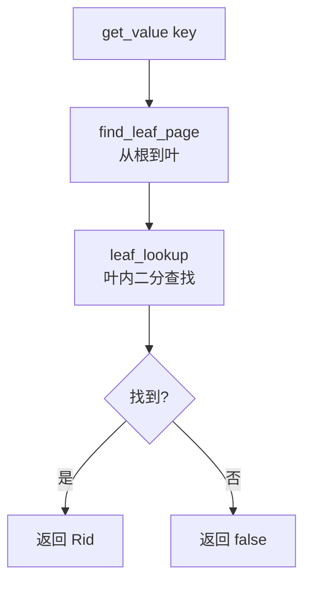

# 04a. B+ 树查找

B+ 树的查找从根节点开始，逐层向下定位到目标叶节点，然后在叶节点内二分查找。

## 前置概念：B+ 树节点结构

```
内部节点:                        叶节点:
┌─────────────────────┐          ┌──────────────────────┐
│ key[0] key[1] key[2]│          │ key[0] key[1] key[2] │
│ rid[0] rid[1] rid[2] │ rid[3]│ │ rid[0] rid[1] rid[2] │
│ child0 child1 child2 child3 │          │ 指向数据记录的 Rid  │
└─────────────────────┘          └──────────────────────┘
  孩子数 = 键数 + 1                  键数 = 孩子数（叶节点）
```

内部节点存储分隔键和孩子指针，叶节点存储实际键和记录 Rid。

## 键比较：ix_compare

`src/index/ix_index_handle.h:28-45`

```cpp
// 单字段比较
// src/index/ix_index_handle.h:28
int ix_compare(const char* a, const char* b, ColType type, int col_len) {
  switch (type) {
    case TYPE_INT:   return (*(int*)a < *(int*)b) ? -1 : ((*(int*)a > *(int*)b) ? 1 : 0);
    case TYPE_FLOAT: return (*(float*)a < *(float*)b) ? -1 : ((*(float*)a > *(float*)b) ? 1 : 0);
    case TYPE_STRING: return memcmp(a, b, col_len);
  }
}

// 多字段比较：逐字段比，不等则返回
int ix_compare(const char* a, const char* b,
               const std::vector<ColType>& col_types,
               const std::vector<int>& col_lens) {
  int offset = 0;
  for (size_t i = 0; i < col_types.size(); ++i) {
    int res = ix_compare(a + offset, b + offset, col_types[i], col_lens[i]);
    if (res != 0) return res;
    offset += col_lens[i];
  }
  return 0;
}
```

返回值语义：`< 0` 表示 a < b，`== 0` 表示相等，`> 0` 表示 a > b。

## 查找流程概览



## find_leaf_page：从根到叶

从根节点出发，逐层搜索直到叶节点。框架中为空，参考实现的流程：

1. 读根节点（加读锁/写锁）
2. 循环：当前不是叶节点 → 调用 `internal_lookup(key)` 找下一个孩子
3. 到达叶节点 → 返回

`src/record/rm_file_handle.cpp:270`（参考实现）

关键点：锁缩放（latch crabbing）——向下遍历时先给子节点加锁，如果子节点安全（不会分裂/合并）则释放父节点锁，提高并发。查找操作用读锁，插入/删除操作用写锁。

## internal_lookup：内部节点查孩子

`src/index/ix_index_handle.cpp:119`（参考实现）

```cpp
// src/index/ix_index_handle.cpp:119
page_id_t IxNodeHandle::internal_lookup(const char* key) {
  return value_at(upper_bound(key) - 1);
}
```

`upper_bound(key)` 返回第一个 **大于** key 的位置。
- 如果 key=10，keys 为 [5, 15, 25]，则 upper_bound 返回 1（5≤10<15，15 是第一个 > 10 的）
- 减 1 后为 0，即 value_at(0)，等于 keys[0] 左侧的孩子指针

## leaf_lookup：叶节点内查找

`src/index/ix_index_handle.cpp:100`（参考实现）

```cpp
// src/index/ix_index_handle.cpp:100
bool IxNodeHandle::leaf_lookup(const char* key, Rid** value) {
  int pos = lower_bound(key);         // 二分找第一个 >= key 的位置
  if (pos == page_hdr->num_key ||     // 越界 → 不存在
      Compare(key, get_key(pos))) {   // 不相等 → 不存在
    return false;
  }
  *value = get_rid(pos);              // 返回对应 Rid
  return true;
}
```

## get_value：顶层查找入口

`src/index/ix_index_handle.cpp:329`（参考实现）

1. `find_leaf_page(key, FIND)` → 找到叶节点
2. `leaf_node->leaf_lookup(key, &rid)` → 查键
3. 释放锁和 unpin
4. 返回 Rid

## 树级范围操作

`lower_bound(key)`：调用 `find_leaf_page` + `leaf_node->lower_bound`，返回 `Iid{page_no, slot_no}`，用于 IxScan 的起始位置。

`upper_bound(key)`：同理，调用 `leaf_node->upper_bound`，返回 IxScan 的结束位置后一个。

`leaf_begin()` / `leaf_end()`：范围扫描的起止边界，leaf_begin 返回 first_leaf 的 Iid{first_leaf, 0}。

## 源码对应

| 内容 | 文件 | 行号 |
|------|------|------|
| ix_compare | `src/index/ix_index_handle.h` | 28-57 |
| lower_bound/upper_bound（节点级） | `src/index/ix_index_handle.cpp` | 48-90 |
| leaf_lookup | `src/index/ix_index_handle.cpp` | 100-112 |
| internal_lookup | `src/index/ix_index_handle.cpp` | 119-125 |
| find_leaf_page | `src/index/ix_index_handle.cpp` | 270-319 |
| get_value | `src/index/ix_index_handle.cpp` | 329-348 |
| lower_bound/upper_bound（树级） | `src/index/ix_index_handle.cpp` | 889-937 |
| leaf_begin/leaf_end | `src/index/ix_index_handle.cpp` | 945-963 |

上一节：[03-index-node-handle.md](./03-index-node-handle.md) | 下一节：[04b-btree-insert.md](./04b-btree-insert.md)
