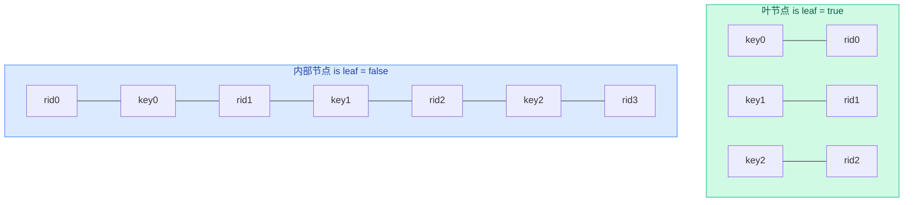
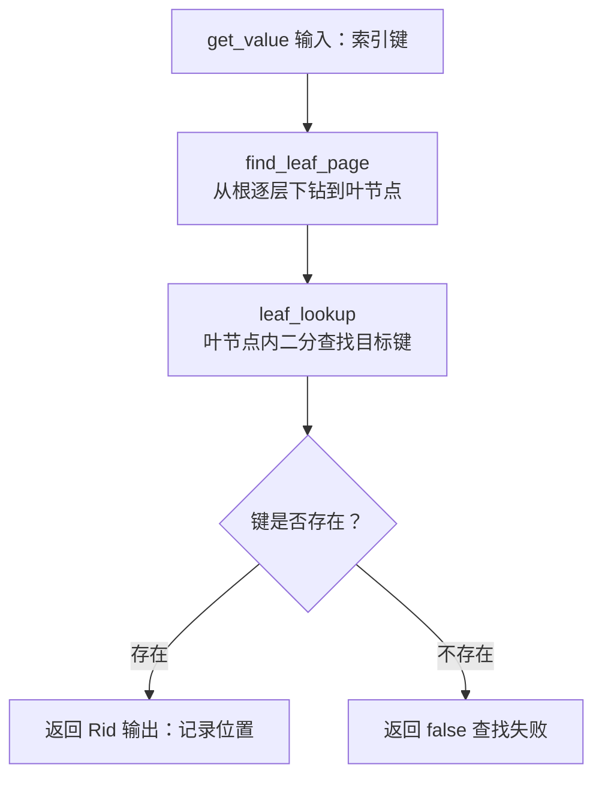

# 04a. B+ 树查找

B+ 树的查找从根节点开始，逐层向下定位到目标叶节点，然后在叶节点内二分查找。

## 前置概念：B+ 树节点结构



内部节点存储分隔键和孩子指针，叶节点存储实际键和记录 Rid。

> **内部节点为什么不是键值对？**
>
> 内部节点的键是**分隔键**——每个键夹在两个孩子指针之间，划分值域范围。
>
> ```
> 以 keys=[40, 70] 为例，rids=[rid0, rid1, rid2] 三个孩子各自负责：
>
>   rid0  -->  值 < 40 的子树
>   rid1  -->  40 ≤ 值 < 70 的子树
>   rid2  -->  值 ≥ 70 的子树
>
> 排列在一起就是：rid0 | 40 | rid1 | 70 | rid2
> ```
>
> 这正是 mermaid 图中内部节点一行 7 个块的排列方式——rid0、key0、rid1、key1、rid2、key2、rid3 交替相连，n 个键对应 n+1 个孩子：**分隔关系**，不是配对关系。
>
> 叶节点则是**配对关系**：`key0 : rid0`，每个键就是实际数据键，rid 是该键对应记录的位置，键数 = Rid 数。

## 键比较：ix_compare

**含义**：B+ 树所有查找和排序的基础——比较两个键的大小。支持 INT、FLOAT、STRING 三种类型，多字段联合索引时逐字段比较。

```cpp
// 单字段比较
// ix_compare, src/index/ix_index_handle.h:28
int ix_compare(const char* a, const char* b, ColType type, int col_len) {
  switch (type) {
    case TYPE_INT:   return (*(int*)a < *(int*)b) ? -1 : ((*(int*)a > *(int*)b) ? 1 : 0);
    case TYPE_FLOAT: return (*(float*)a < *(float*)b) ? -1 : ((*(float*)a > *(float*)b) ? 1 : 0);
    case TYPE_STRING: return memcmp(a, b, col_len);
  }
}

// 多字段比较：逐字段比，不等则返回
int ix_compare(const char* a, const char* b,
               const std::vector<ColType>& col_types,
               const std::vector<int>& col_lens) {
  int offset = 0;
  for (size_t i = 0; i < col_types.size(); ++i) {
    int res = ix_compare(a + offset, b + offset, col_types[i], col_lens[i]);
    if (res != 0) return res;
    offset += col_lens[i];
  }
  return 0;
}
```

返回值语义：`< 0` 表示 a < b，`== 0` 表示相等，`> 0` 表示 a > b。

## 查找流程概览



## find_leaf_page：从根到叶

**含义**：B+ 树的逐层下钻操作——从根节点出发，每一层调用 `internal_lookup` 确定走哪个孩子，直到抵达叶节点。这是所有 B+ 树操作（查找、插入、删除）的公共前缀。

**场景**：被 `get_value`、`insert_entry`、`delete_entry` 及树级 `lower_bound` / `upper_bound` 调用。

**实现**：框架中为空，参考实现（`src/index/ix_index_handle.cpp:270`）：

1. 读根节点，根据操作类型加读锁（FIND）或写锁（INSERT/DELETE）
2. 循环：当前不是叶节点 → 调用 `internal_lookup(key)` 找下一个孩子 → 给孩子加锁 → 判断孩子是否"安全"
3. 到达叶节点 → 返回

**锁缩放（latch crabbing）**：查找对并发的影响最大——如果每次操作都把从根到叶的整条路径锁住，其他操作全部要排队。锁缩放的名字很形象：像螃蟹走路，**抓住下一级节点后，才松开上一级**。

具体流程（以插入为例）：

```
1. root_latch_.lock()              // 先锁根互斥锁，防止根被其他线程分裂
2. 加载根节点 node
3. node->page->WLatch()            // 对根节点页面加写锁
4. if (node->isSafe(INSERT))       // 根 isSafe 总是 true
      root_latch_.unlock()         // 释放根互斥锁

5. 循环向下:
   a. child_node = fetch_node(下一级)
   b. child_node->page->WLatch()               // 先锁住孩子
   c. 把 node 加入 latch_page_set               // 记录已加锁的祖先
   d. if (child_node->isSafe(INSERT))           // 孩子安全？
        release_all_index_latch_page(txn)       // → 释放所有祖先的锁！
   e. node = child_node                         // 继续向下

6. 到达叶节点，返回
```

**关键转折**在步骤 5d：如果孩子节点 `isSafe`，说明孩子不会分裂，那祖先节点的结构都不会变——释放祖先锁，让其他线程可以访问。

如果孩子节点不安全（比如插入后会满），就**保留祖先锁**。因为孩子一旦分裂，需要修改父节点（插入新的分隔键），父节点如果之前被释放了，其他线程可能正在改它，就出问题了。

> **isSafe 的判断逻辑**：非根节点上，插入时 `size + 1 < max` 才算安全，删除时 `size > min` 才算安全。根节点一律返回 true——不是因为根不会分裂，而是根的分裂由专门的 `root_latch_` 互斥锁处理。详见 [03-index-node-handle.md](./03-index-node-handle.md)。

**一个具体例子**：

```
要插入 key=45，当前树状态：
  根节点 [40, 70]，已满（size=2, max=2）
  中间节点 [50, 62]，未满（size=2, max=3）
  目标叶节点 [40, 45, 50]，已满（size=3, max=3）

加锁过程：
1. WLock 根 → isSafe(根) = true → 释放 root_latch_
2. 下行到中间节点 [50, 62] → WLock 它 → isSafe([50,62])?
   size=2, max=3 → 2+1 < 3 = true → SAFE
   → 释放根的 WLock！
3. 下行到叶节点 [40, 45, 50] → WLock 它 → isSafe([40,45,50])?
   size=3, max=3 → 3+1 < 3 = false → NOT SAFE
   → 保留中间节点的 WLock
4. 在叶节点插入 key=45，触发分裂
5. 分裂需要修改父节点 [50, 62] → 它的锁还拿着，安全！
```

没有锁缩放的话，步骤 1~4 根和中间节点都被锁着，其他线程全堵住。
有了锁缩放，步骤 2 就释放了根锁，步骤 3 只保留中间节点的锁，并发度大幅提升。

## internal_lookup：内部节点查孩子

**含义**：在内部节点中，确定目标 key 应该走**哪个孩子指针**继续向下搜索。

内部节点的键和指针交替排列，每个键左右各有一个孩子指针。`internal_lookup` 用 `upper_bound` 找到第一个大于 key 的键，然后取它左边的孩子——那个孩子指向的子树正是 key 应该去的地方。

**场景**：由 `find_leaf_page` 在逐层向下遍历时调用（`src/index/ix_index_handle.cpp:296`）。

```cpp
// IxNodeHandle::internal_lookup, src/index/ix_index_handle.cpp:119
page_id_t IxNodeHandle::internal_lookup(const char* key) {
  return value_at(upper_bound(key) - 1);
}
```

其中 `value_at(i)` 是 `IxNodeHandle` 的辅助方法（`src/index/ix_index_handle.h:96`）：取节点内第 i 个 Rid 中存储的**页面号**。

```cpp
// IxNodeHandle::value_at, src/index/ix_index_handle.h:96
page_id_t value_at(int i) { return get_rid(i)->page_no; }
```

`get_rid(i)` 返回第 i 个 Rid 的指针。在内部节点中，每个 Rid 存的是一个孩子节点的页面号，所以 `value_at` 的实际作用是：**给定下标 i，返回第 i 个孩子节点的页面号**。

> 这里的方法名一点都不**见名知意**，命名不友好

## leaf_lookup：叶节点内查找

**含义**：在叶节点中精确查找目标 key，找到则返回对应的记录 Rid（传出参数），找不到返回 false。

**实现**：`lower_bound` 定位第一个 ≥ key 的位置 → 越界或不相等则不存在 → 相等则返回该位置的 Rid。

```cpp
// IxNodeHandle::leaf_lookup, src/index/ix_index_handle.cpp:100
bool IxNodeHandle::leaf_lookup(const char* key, Rid** value) {
  int pos = lower_bound(key);         // 二分找第一个 >= key 的位置
  if (pos == page_hdr->num_key ||     // 越界 → 不存在
      Compare(key, get_key(pos))) {   // 不相等 → 不存在
    return false;
  }
  *value = get_rid(pos);              // 返回对应 Rid
  return true;
}
```

## get_value：顶层查找入口

**含义**：给定一个索引键，从 B+ 树中查出所有匹配的**记录 Rid**。注意：返回的不是记录内容，而是记录的物理位置——调用方拿着 Rid 再去记录层取实际数据。

**为什么返回多个 Rid？** 索引不一定建在唯一字段上。比如 `age=20` 的学生可能有好几个，B+ 树允许重复键，所以一次查找可能命中多条记录。`get_value` 把它们全部收集到 `std::vector<Rid>` 中返回。

**签名**：`src/index/ix_index_handle.h`

```cpp
// IxIndexHandle::get_value, src/index/ix_index_handle.h
bool get_value(const char* key, std::vector<Rid>* result, Transaction* transaction);
```

- `key`：输入，要查找的索引键
- `result`：输出，存放所有匹配记录的 Rid 列表
- 返回值：找到至少一条返回 `true`，一条都没有返回 `false`

**实现**：`src/index/ix_index_handle.cpp:329`（参考实现）

1. `find_leaf_page(key, FIND)` → 加读锁，从根下到叶节点
2. `leaf_node->leaf_lookup(key, &rid)` → 叶节点内二分查找第一个匹配的 key
3. 沿叶节点链表继续扫描，收集所有相同 key 的 Rid
4. 释放读锁和 unpin，返回结果

> **B+ 树如何处理重复键？**
>
> B+ 树中键不要求唯一。同一个键值可以对应多条记录，每条的 Rid 不同。
>
> 存储层面：叶节点的 keys 数组按排序存放，相同 key 的多个条目并排在一起：
>
> ```
> keys: [18,  20,  20,  20,  21,  21, 25]
> rids: [r1,  r2,  r3,  r4,  r5,  r6, r7]
>                   ↑           ↑ 
>              三个 key=20   两个 key=21      各配不同的 Rid
> ```
>
> 每个位置存的是一个 **(key, rid) 对**，不是"一个 key 映射到多个 rid"。同一个 key 出现了多次，每次配一个不同的 Rid。
>
> **如果重复 key 的数量超过一个节点的容量怎么办？** 溢出的部分放到下一个叶节点，键值保持 `20` 不变。内部节点的分隔键也随之变为 `20`——意思是"值 ≥ 20 的走右边"。
>
> ```
> 叶节点 1: [..., 20, 20, 20]  ← 满了，后面还有 key=20
> 叶节点 2: [20, 20, 21, ...]  ← 下一个节点以 20 开头
> 内部节点分隔键: 20  ← 指向叶节点 2
> ```
>
> 查找时：`lower_bound(20)` 找到第一个 `20`，然后沿叶节点链表向右扫描，只要 key 还等于 20 就继续收集 Rid。跨节点也不怕——叶节点链表串着所有叶节点，`next_leaf` 直接跳过去。

## 树级范围操作

**含义**：以下三个方法是 B+ 树对外暴露的范围扫描定位接口，返回 `Iid`（索引位置）而非 `Rid`。

**场景**：全部被 `IxScan`（见 06）用于确定扫描的起止范围。

| 方法 | 作用 | 实现 |
|------|------|------|
| `lower_bound(key)` | 返回第一个 ≥ key 的位置 | `find_leaf_page` + `leaf_node->lower_bound` |
| `upper_bound(key)` | 返回第一个 > key 的位置 | `find_leaf_page` + `leaf_node->upper_bound` |
| `leaf_begin()` | 扫描起点 | 返回 `Iid{first_leaf, 0}` |
| `leaf_end()` | 扫描终点后一个 | 返回末叶节点末尾的下一个位置 |

## 源码对应

| 内容 | 文件 | 行号 |
|------|------|------|
| ix_compare | `src/index/ix_index_handle.h` | 28-57 |
| lower_bound/upper_bound（节点级） | `src/index/ix_index_handle.cpp` | 48-90 |
| leaf_lookup | `src/index/ix_index_handle.cpp` | 100-112 |
| internal_lookup | `src/index/ix_index_handle.cpp` | 119-125 |
| find_leaf_page | `src/index/ix_index_handle.cpp` | 270-319 |
| get_value | `src/index/ix_index_handle.cpp` | 329-348 |
| lower_bound/upper_bound（树级） | `src/index/ix_index_handle.cpp` | 889-937 |
| leaf_begin/leaf_end | `src/index/ix_index_handle.cpp` | 945-963 |

上一节：[03-index-node-handle.md](./03-index-node-handle.md) | 下一节：[04b-btree-insert.md](./04b-btree-insert.md)
