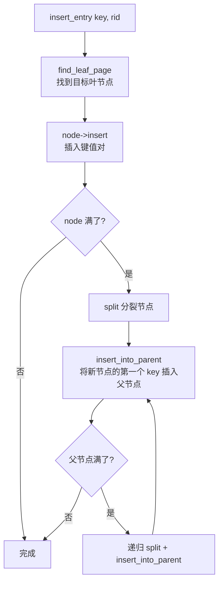

# 04b. B+ 树插入与分裂

B+ 树插入从叶节点开始，满则分裂，分裂向上传播，直到根节点。

## 整体流程



框架中以下方法全部为空，需要自行实现。

## insert_pairs：节点内插入键值对

`src/index/ix_index_handle.cpp:142`（参考实现）

在节点的 pos 位置插入 n 个连续键值对。核心是 `memmove` 腾出空间：

```
插入前: [A, B, D, E, _, _]  pos=2, n=1
         0  1  2  3  4  5

memmove(pos+n, pos, count-pos): 将 [D, E] 右移一位
插入后: [A, B, C, D, E, _]
         0  1  2  3  4  5
         插入 ↑ 插入C
```

```cpp
// IxNodeHandle::insert_pairs, src/index/ix_index_handle.cpp:142
void IxNodeHandle::insert_pairs(int pos, const char* key, const Rid* rid, int n) {
  auto cur_key = get_key(pos);
  auto cur_rid = get_rid(pos);
  int num_keys = page_hdr->num_key;
  int cols_len = file_hdr->col_tot_len_;

  if (pos < num_keys) {
    memmove(cur_key + n * cols_len, cur_key, (num_keys - pos) * cols_len);
    memmove(cur_rid + n, cur_rid, (num_keys - pos) * sizeof(Rid));
  }
  memcpy(cur_key, key, n * cols_len);
  memcpy(cur_rid, rid, n * sizeof(Rid));
  page_hdr->num_key += n;
}
```

## split：节点分裂

`src/index/ix_index_handle.cpp:358`（参考实现）

节点满时，将右半部分搬到新节点：

```
分裂前 node: [A, B, C, D, E, F]  假设 max_size=6
                        ↓ split_point = min_size = 3
分裂后 node: [A, B, C]            new_node: [D, E, F]
```

**三步操作**：

1. 创建 `new_node`，`num_key` 初始化为 0
2. 用 `insert_pairs(0, ...)` 把 node 后半部分搬入 new_node
3. `node->set_size(split_point)` 软删除 node 的后半部分

如果是叶节点，还需要维护叶节点链表（`prev_leaf` / `next_leaf` 指针）。
如果是内部节点，新节点的孩子需要更新父指针（调用 `maintain_child`）。

## insert_into_parent：向上传播

`src/index/ix_index_handle.cpp:418`（参考实现）

分裂后，新节点 `new_node` 的第一个 key 需要插入到父节点中。

**两种情况**：

1. **node 是根节点**：创建新根，将 old_node 和 new_node 的第一个 key 插入新根，设置父子关系
2. **node 不是根节点**：获取父节点，在 `find_child(old_node) + 1` 位置插入 new_node 的第一个 key；如果父节点也满了，递归 `split` + `insert_into_parent`

## insert_entry：顶层插入入口

`src/index/ix_index_handle.cpp:500`（参考实现）

整合以上步骤：

1. `find_leaf_page(key, INSERT)` → 找到叶节点
2. `leaf_node->insert(key, value)` → 插入，重复则跳过
3. 检查是否满 → `split` + `insert_into_parent`
4. 如果插入在第一个位置，调用 `maintain_parent` 向上更新父节点的第一个 key
5. 释放锁和 unpin

## 源码对应

| 内容 | 文件 | 行号 |
|------|------|------|
| insert_pairs | `src/index/ix_index_handle.cpp` | 142-172 |
| insert | `src/index/ix_index_handle.cpp` | 181-193 |
| split | `src/index/ix_index_handle.cpp` | 358-401 |
| insert_into_parent | `src/index/ix_index_handle.cpp` | 418-468 |
| insert_entry | `src/index/ix_index_handle.cpp` | 500-561 |

上一节：[04a-btree-search.md](./04a-btree-search.md) | 下一节：[04c-btree-delete.md](./04c-btree-delete.md)
