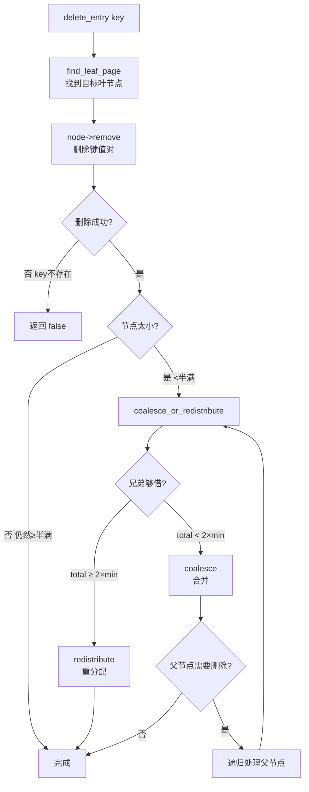

# 04c. B+ 树删除、合并与重分配

B+ 树删除比插入更复杂：删除后节点可能太小，需要从兄弟借一个键（重分配），或者和兄弟合并。

## 整体流程



## erase_pair：节点内删除

删除操作的最底层：在节点内部删掉 pos 位置的一个键值对。

与 `insert_pairs` 对称——插入是"右移→写入"，删除是"左移→覆盖"。`memmove` 把 pos 后面的所有键值对整体前移一位，填补被删位置的空缺，然后 `num_key--`。

```
删除前: [A, B, C, D, _]  pos=1, n=1
         0  1  2  3  4

memmove(pos, pos+1, count-pos-1): 将 [C, D] 左移一位 覆盖 B
删除后: [A, C, D, _, _]
         0  1  2  3  4
```

`src/index/ix_index_handle.cpp:200`

```cpp
// IxNodeHandle::erase_pair, src/index/ix_index_handle.cpp:200
void IxNodeHandle::erase_pair(int pos) {
  auto cur_key = get_key(pos);
  auto cur_rid = get_rid(pos);
  int num_keys = page_hdr->num_key;
  int cols_len = file_hdr->col_tot_len_;

  if (pos < num_keys - 1) {
    memmove(cur_key, cur_key + cols_len, (num_keys - pos - 1) * cols_len);
    memmove(cur_rid, cur_rid + 1, (num_keys - pos - 1) * sizeof(Rid));
  }
  page_hdr->num_key--;
}
```

> **使用场景**：`erase_pair` 本身只操作当前节点。它被 `remove`（删除指定 key）、`coalesce`（合并后清理）、`redistribute`（重分配后清理）调用。详见 [03-index-node-handle.md](./03-index-node-handle.md)。

## delete_entry：顶层删除入口

删除操作的入口，调用链为：找到叶节点 → 删除键值对 → 检查是否需要下溢处理。

`src/index/ix_index_handle.cpp:568`

1. `find_leaf_page(key, DELETE)` → 从根下到目标叶节点，加写锁
2. 在叶节点中 `remove(key)` → 调用 `lower_bound` 定位 + `erase_pair` 删除
3. 如果删除的是节点第一个 key，向上更新父节点的分隔键（`maintain_parent`）
4. 调用 `coalesce_or_redistribute(node)` → 检查是否太空，决定重分配还是合并
5. 释放锁和 unpin

## coalesce_or_redistribute：核心决策

删除后节点可能太空（低于半满），此时不能放着不管——否则树会退化成链表。

需要做两种选择之一：从兄弟借（轻量），或和兄弟合并（重量）。这个决策就是 `coalesce_or_redistribute`。

`src/index/ix_index_handle.cpp:786`

**决策逻辑**：先找兄弟节点，计算两个节点的键值对总数。

```
node.size + sibling.size >= 2 × min_size
  → redistribute(node, sibling)  轻量：总数够多，从兄弟借一个过来
  → coalesce(node, sibling)      重量：总数太少，必须合并，可能递归向上
```

**找哪个兄弟？** 优先找左兄弟（`prev_leaf`）。没有左兄弟才找右兄弟（`next_leaf`）。
如果 node 是左兄弟（index=0），则 sibling 是右兄弟；否则 sibling 是左兄弟。

**特殊情况**：如果 node 是根节点，调用 `adjust_root`——根不受半满约束，有自己的一套规则。

## redistribute：重分配

从兄弟节点借一个键值对过来，让"瘦"的节点恢复到至少半满。只在两个节点总量足够时使用（轻量操作）。

`src/index/ix_index_handle.cpp:673`

**两种方向**（由 node 和 sibling 的左右关系决定）：

```
node 在左, neighbor 在右 (index == 0):
    neighbor[0] → 移到 node 末尾
    父节点用 neighbor 的新第一个 key 更新分隔键

node 在右, neighbor 在左 (index > 0):
    neighbor[最后] → 移到 node 开头（第 0 位）
    父节点用 node 的新第一个 key 更新分隔键
```

**操作步骤**（以 node 在右为例）：

1. 从 neighbor 的末尾取最后一个键值对
2. 用 `insert_pair(0, ...)` 插入到 node 的开头
3. 用 `erase_pair(neighbor.size-1)` 从 neighbor 删除
4. 更新父节点中 node 对应的分隔键

redistribute 只涉及键值对移动，不创建也不删除节点，不会递归向上。

## coalesce：合并

两个节点太少，没法各占一个节点——把 node 的全部键值对搬到 neighbor，删除 node，从父节点去掉 node 的分隔键。可能递归向上。

`src/index/ix_index_handle.cpp:728`

**前置处理**：保证 node 在右边（如果 index=0 说明 node 在左，交换 node 和 neighbor 指针）。

**三个步骤**：

1. 把 node 的所有键值对用 `insert_pairs` 追加到 neighbor 末尾
2. 从 parent 中删除 node 对应的分隔键：`parent->erase_pair(index)`
3. node 页面标记为删除，释放回空闲列表

**副作用**：如果是叶节点，需要更新叶节点链表（`prev_leaf` / `next_leaf`）。
如果是内部节点，需要维护孩子节点的父指针（`maintain_child`）。

**递归**：parent 删除一个条目后也可能太小，需要递归调用 `coalesce_or_redistribute(parent)`。

## adjust_root：根节点特殊处理

根节点不受半满约束（一个键都没有也行），但有两种情况需要调整。

`src/index/ix_index_handle.cpp:627`

**触发条件**：`coalesce_or_redistribute` 发现当前节点是根时调用。

**两种情况**：

- 根是叶节点且 `num_key == 0`：整棵树空了。将根页面号设为 -1（`IX_NO_PAGE`），释放根页面
- 根是内部节点且 `num_key == 1`：根只有一个孩子。把唯一的孩子提升为新根——`root_page_` 指向该孩子，释放旧根页面。树的高度减 1

## 源码对应

| 内容 | 文件 | 行号 |
|------|------|------|
| erase_pair | `src/index/ix_index_handle.cpp` | 200-221 |
| remove | `src/index/ix_index_handle.cpp` | 229-239 |
| delete_entry | `src/index/ix_index_handle.cpp` | 568-618 |
| adjust_root | `src/index/ix_index_handle.cpp` | 627-655 |
| redistribute | `src/index/ix_index_handle.cpp` | 673-706 |
| coalesce | `src/index/ix_index_handle.cpp` | 728-773 |
| coalesce_or_redistribute | `src/index/ix_index_handle.cpp` | 786-856 |

上一节：[04b-btree-insert.md](./04b-btree-insert.md) | 下一节：[05-index-manager.md](./05-index-manager.md)
