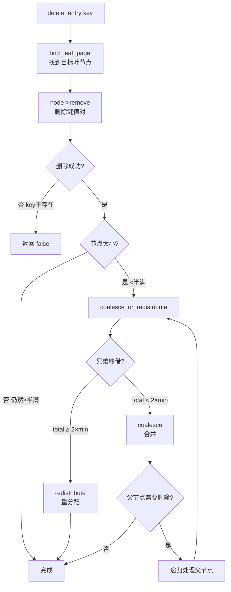

# 04c. B+ 树删除、合并与重分配

B+ 树删除比插入更复杂：删除后节点可能太小，需要从兄弟借一个键（重分配），或者和兄弟合并。

## 整体流程



## erase_pair：节点内删除

删除 pos 位置的键值对，用 `memmove` 把后续元素前移填补空缺。

与 `insert_pairs` 对称：一个是"右移→插入"，一个是"左移→删除"。

## delete_entry：顶层删除入口

`src/index/ix_index_handle.cpp:568`

1. `find_leaf_page(key, DELETE)` → 找到叶节点
2. `leaf_node->remove(key)` → 删除
3. 如果删的是第一个 key，向上更新父节点
4. `coalesce_or_redistribute(leaf_node)` → 处理下溢

## coalesce_or_redistribute：核心决策

`src/index/ix_index_handle.cpp:786`

每个 B+ 树节点（除根外）必须保持至少半满。删除后若低于半满，分两种情况：

```
node.size + sibling.size >= 2 × min_size
  → redistribute()  轻量操作：从兄弟借一个键
  → coalesce()      重量操作：和兄弟合并，可能递归向上
```

**特殊情况**：如果是根节点，调用 `adjust_root` 处理。

## redistribute：重分配

`src/index/ix_index_handle.cpp:673`

从兄弟节点借一个键值对给 node。node 是"受害节点"（太小的那个）。

两种情况（由 index 区分）：

```
index == 0: node 在左，neighbor 在右
  → 从 neighbor 取第一个键给 node 的末尾
  → 父节点用 neighbor 的新第一个键更新

index > 0: node 在右，neighbor 在左
  → 从 neighbor 取最后一个键给 node 的开头
  → 父节点用 node 的新第一个键更新
```

## coalesce：合并

`src/index/ix_index_handle.cpp:728`

两个节点的键值对总数不够 2×min_size，无法各占一个节点，必须合并。

**保证 node 在右边**：如果 index=0 说明 node 在左边，交换指针。

**三步**：
1. 把 node 的所有键值对追加到 neighbor 末尾
2. 删除 parent 中 node 对应的条目
3. node 的页面标记为删除，释放

如果是叶节点，需要更新叶节点链表。parent 删除后也可能太小，需要递归调用 `coalesce_or_redistribute`。

## adjust_root：根节点特殊处理

`src/index/ix_index_handle.cpp:627`

根节点不受半满限制，但有特殊情况：

- 根是叶节点且大小为 0 → 树为空，重置 root_page
- 根是内部节点且大小只有 1 → 将唯一的孩子提升为新根

## 源码对应

| 内容 | 文件 | 行号 |
|------|------|------|
| erase_pair | `src/index/ix_index_handle.cpp` | 200-221 |
| remove | `src/index/ix_index_handle.cpp` | 229-239 |
| delete_entry | `src/index/ix_index_handle.cpp` | 568-618 |
| adjust_root | `src/index/ix_index_handle.cpp` | 627-655 |
| redistribute | `src/index/ix_index_handle.cpp` | 673-706 |
| coalesce | `src/index/ix_index_handle.cpp` | 728-773 |
| coalesce_or_redistribute | `src/index/ix_index_handle.cpp` | 786-856 |

上一节：[04b-btree-insert.md](./04b-btree-insert.md) | 下一节：[05-index-manager.md](./05-index-manager.md)
