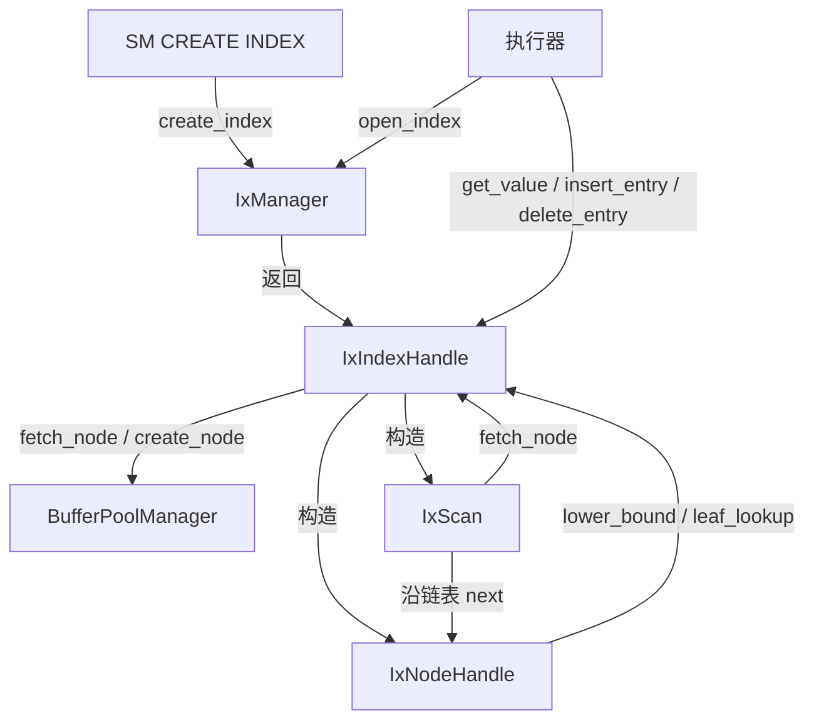

# 07. 索引层组件交互机制

各组件如何协作完成一次索引查询。

## 组件分工

| 组件 | 一句话职责 |
|------|-----------|
| `IxManager` | 索引文件管理员——创建、打开、关闭、删除 |
| `IxIndexHandle` | B+ 树操作枢纽——查找、插入、删除 |
| `IxNodeHandle` | 单个 B+ 树节点——键值对的读写和查找 |
| `IxScan` | 范围扫描器——沿叶节点链表遍历 |

## 调用关系



## 典型工作流

**建索引**：`SM → IxManager.create_index → DiskManager 创建 .idx 文件 → 初始化 3 页`

**查询**：`执行器 → IxIndexHandle.get_value(key) → find_leaf_page → leaf_lookup → 返回 Rid → 执行器用 Rid 去 RmFileHandle.get_record 取数据`

**插入**：`执行器 → IxIndexHandle.insert_entry(key, rid) → find_leaf_page → node.insert → (满)split → insert_into_parent`

**删除**：`执行器 → IxIndexHandle.delete_entry(key) → find_leaf_page → node.remove → coalesce_or_redistribute`

**范围扫描**：`执行器 → lower_bound/upper_bound 获取 Iid 范围 → IxScan 沿叶节点链表遍历 → 逐条返回 Rid`

## 与记录层的配合

索引层不直接返回记录内容——它返回 `Rid`。上层拿着 `Rid` 去记录层 `RmFileHandle::get_record(rid)` 获取实际数据：

```
索引查询: IxIndexHandle → Rid{page_no, slot_no}
          ↓
记录读取: RmFileHandle.get_record(Rid) → RmRecord{data, size}
```

索引是记录的"快速目录"，记录层是"正文"。

上一节：[06-index-scan.md](./06-index-scan.md) | 下一节：[08-index-frame-vs-reference.md](./08-index-frame-vs-reference.md)
