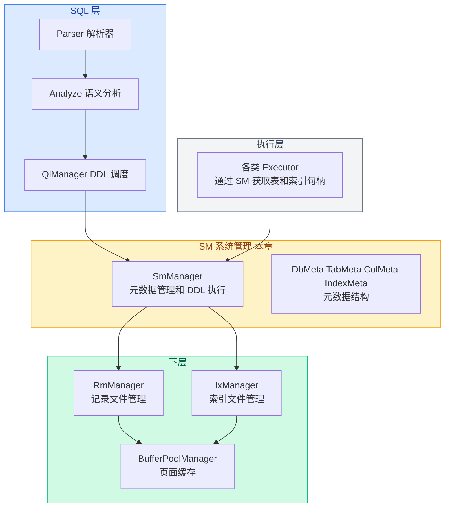

# 01. 系统管理概述

## 系统管理是什么

系统管理层（System Manager，简称 SM）是 RMDB 中**管理数据库结构和元数据**的模块。

存储层管页面、记录层管记录、索引层管索引——这三层都专注在"怎么存数据"。而 SM 层关心的是更高一层的问题：**"这个数据库里有几张表？每张表有哪些字段？建了哪些索引？"**

打个比方：记录层和索引层是仓库的货架和检索系统，SM 层是仓库的平面图——记录了什么东西放在哪里、仓库里有哪些区域。

## 在架构中的位置



**向下**：SM 不直接操作页面和数据——它调用 RM 创建/删除记录文件，调用 IX 创建/删除索引文件。

**向上**：SM 接收来自 SQL 解析层的 DDL 命令（CREATE/DROP TABLE, CREATE/DROP INDEX），向下转换为 RM/IX 的文件操作。

**对执行层**：SM 通过 `fhs_` 和 `ihs_` 两个 map 提供表的记录文件句柄和索引文件句柄，执行器（Insert、Select 等）通过这些句柄读写数据。

## SM 层的三大职责

### 1. 元数据管理

SM 通过一系列嵌套的数据结构（DbMeta → TabMeta → ColMeta / IndexMeta）记录了：

- 当前打开了哪个数据库
- 这个数据库里有几张表、每张表有哪些字段、字段的类型和长度
- 每张表上建了哪些索引、索引包含哪些字段

全部元数据在**内存中**以 `DbMeta` 树的形式存在，**在磁盘上**以 `db.meta` 文件持久化。

### 2. DDL 执行

SM 是 CREATE/DROP 语句的最终执行者：

| DDL 语句 | SmManager 方法 | 做了什么 |
|----------|---------------|----------|
| `CREATE DATABASE` | `create_db()` | 创建数据库目录 + 初始化 db.meta |
| `DROP DATABASE` | `drop_db()` | 删除整个数据库目录 |
| `CREATE TABLE` | `create_table()` | 构建字段元数据 + 委托 RM 创建 .db 文件 |
| `DROP TABLE` | `drop_table()` | 级联删除表的所有索引 + 委托 RM 删除 .db 文件 |
| `CREATE INDEX` | `create_index()` | 全表扫描 + 构建 B+ 树索引 |
| `DROP INDEX` | `drop_index()` | 委托 IX 删除 .idx 文件 + 更新元数据 |

### 3. 句柄注册表

`SmManager` 持有两个关键 map：

```cpp
// src/system/sm_manager.h:31-33
std::unordered_map<std::string, std::unique_ptr<RmFileHandle>> fhs_;
// 表文件名 → 记录文件句柄

std::unordered_map<std::string, std::unique_ptr<IxIndexHandle>> ihs_;
// 索引文件名 → 索引文件句柄
```

**含义**：数据库打开后，SM 把每张表的 `.db` 文件和每个索引的 `.idx` 文件都打开，句柄缓存在这两个 map 中。

执行器做 INSERT 时，通过 `sm_manager->fhs_["student"]` 就能直接拿到 student 表的记录文件句柄，不需要自己打开文件。

## Context：贯穿所有操作的环境对象

你可能注意到 SM 的很多方法都有一个 `Context* context` 参数。`Context` 是一个**贯穿 SQL 执行全流程的环境对象**，它随身携带了当前操作所需的 "运行时信息"。

```cpp
// src/common/context.h:22-41
class Context {
 public:
  Context(LockManager* lock_mgr, LogManager* log_mgr, Transaction* txn)
      : lock_mgr_(lock_mgr), log_mgr_(log_mgr), txn_(txn) {}

  LockManager* lock_mgr_;   // 锁管理器 — 加锁/解锁
  LogManager* log_mgr_;     // 日志管理器 — 写 redo/undo 日志
  Transaction* txn_;        // 当前事务 — 记录事务 ID 和状态
  char* data_send_;         // 结果发送缓冲区 — 查询结果返回给客户端
  int* offset_;             // 发送缓冲区的当前偏移量
  bool ellipsis_;           // 结果是否被截断
};
```

**作用**：`Context` 像一个"公文袋"，在 SQL 解析 → 语义分析 → 执行计划 → 执行器 → SM/RM/IX 的整条调用链上传递。每个环节可能往里面放东西，也可能从里面读东西。

**在 SM 层的使用**：

- `context->txn_` 传给 `insert_entry(key, rid, context->txn_)`——告诉 B+ 树当前是哪个事务在做插入，事务层用它做并发控制
- `context->lock_mgr_` 在注释代码中用于表级锁：级别是事务锁管理器的表级锁，范围是整张表文件，类型可能是共享锁或排他锁，生命周期随事务释放；SM 层参考实现多数锁调用被注释，细节留到事务层章节
- `context->data_send_` 用于 `show_tables` / `desc_table` 等查询操作，把结果格式化输出到客户端缓冲区

**为什么 SM 层不直接用，还要往下传**：SM 自己不操作数据，但它调用的 RM 和 IX 层需要——`RmFileHandle::get_record(rid, context)` 需要 `context->txn_` 来判断并发冲突，`get_record` 拿到的数据要通过 `context->data_send_` 返回给客户端。

**简短理解**：你现在只需要知道它是一个"环境参数"，随着 SQL 执行一路往下传，SM 层用 `context->txn_` 传事务 ID，其他暂时不用深究。事务和锁的细节会在后面的事务层章节展开。

## 与记录层、索引层的关系

SM 层和 RM/IX 层是**管理者与被管理者**的关系：

```
SmManager（管理者）
  ├── 持有 RmManager 指针 → 调用 rm_manager_->create_file / open_file / close_file
  ├── 持有 IxManager 指针 → 调用 ix_manager_->create_index / open_index / close_index
  ├── fhs_ 缓存 RmFileHandle → 给执行器用
  └── ihs_ 缓存 IxIndexHandle → 给执行器用
```

和记录层、索引层不同，SM 层**没有自己的文件格式或页面布局**——它不直接读写 Page，只通过 RM/IX 的接口来操作数据。

## 数据存储结构

一个数据库在磁盘上是**一个目录**，目录内有：

```
student_db/              ← 数据库目录，名称 = 数据库名
  db.meta                ← 元数据文件：DbMeta 序列化文本
  db.log                 ← 日志文件
  student.db             ← student 表的记录文件
  course.db              ← course 表的记录文件
  student_age_name.idx   ← student 表上的复合索引
```

建数据库 = 建目录，建表 = 在目录里建 `.db` 文件，建索引 = 在目录里建 `.idx` 文件。

## 输入与输出

| 操作 | 输入 | 输出 | 说明 |
|------|------|------|------|
| 建数据库 | 数据库名称 | 目录 + db.meta + db.log | 调用 mkdir + 文件创建 |
| 删数据库 | 数据库名称 | 无（目录被删除） | 调用 rm -r |
| 建表 | 表名 + 字段定义列表 | .db 文件 + 元数据更新 | 委托 RM 创建文件 |
| 删表 | 表名 | .db 文件 + .idx 文件被删除 | 级联删除所有索引 |
| 建索引 | 表名 + 字段名列表 | .idx 文件 + 元数据更新 | 全表扫描构建 B+ 树 |
| 删索引 | 表名 + 字段名列表 | .idx 文件被删除 + 元数据更新 | 委托 IX 删除文件 |

## 涉及的文件

| 文件 | 作用 |
|------|------|
| `src/system/sm_defs.h` | 空头文件，聚合引用 common/defs.h |
| `src/system/sm_meta.h` | 元数据结构定义：ColMeta、IndexMeta、TabMeta、DbMeta |
| `src/system/sm_manager.h` | SmManager 类声明 + ColDef 结构 |
| `src/system/sm_manager.cpp` | SmManager 全部方法实现 |
| `src/system/sm.h` | 聚合头文件，引用以上所有文件 |

下一节：[02-system-data-structures.md](./02-system-data-structures.md)
