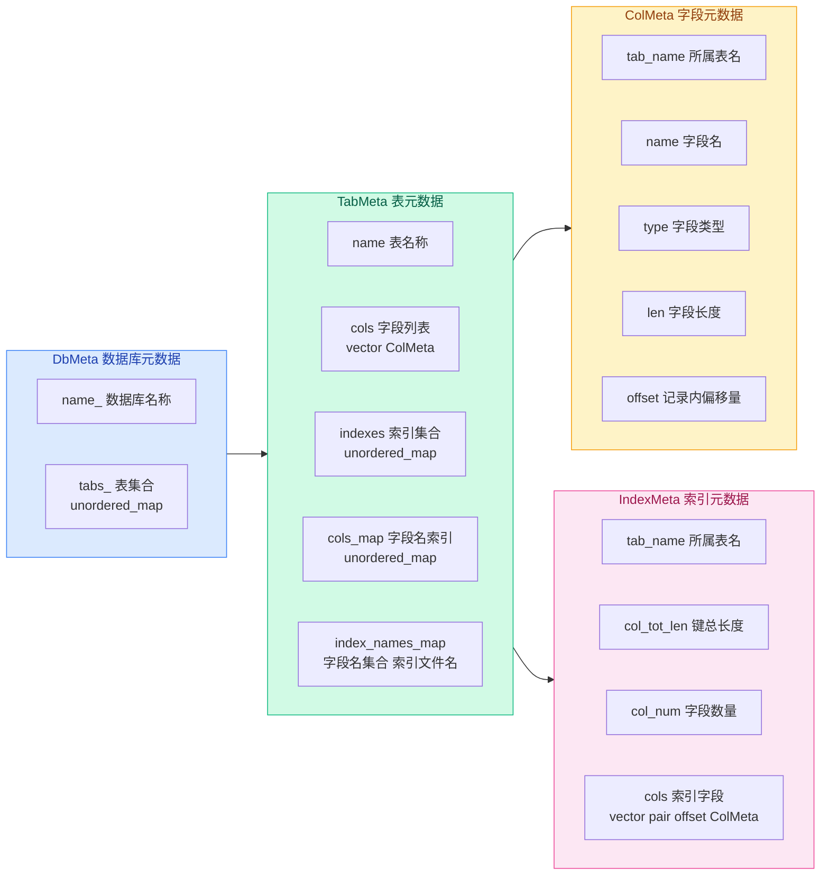
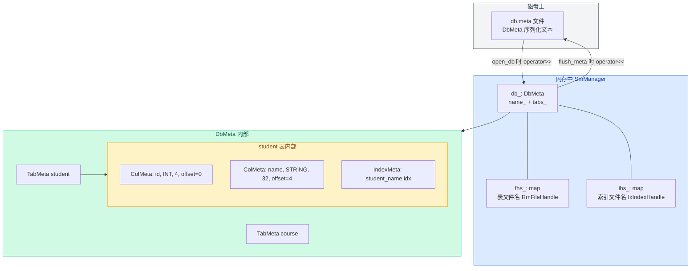

# 02. 数据结构

系统层的核心任务是**管理元数据**——即"描述数据的数据"。

在讲 DDL 操作之前，先搞清楚 SM 层维护了哪些元数据、它们之间什么关系。

## 数据结构总览



从外到内四层嵌套：一个数据库包含多张表，一张表包含多个字段和多个索引。

## ColMeta：字段元数据

描述表中一个字段（列）的基本信息。

```cpp
// src/system/sm_meta.h:21-42
struct ColMeta {
  std::string tab_name;  // 字段所属表名称
  std::string name;      // 字段名称
  ColType type;          // 字段类型
  int len;               // 字段长度
  int offset;            // 字段位于记录中的偏移量
};
```

**含义**：`ColMeta` 记录了一个字段的完整描述——它属于哪张表、叫什么名字、什么类型、占几个字节、在记录中排第几个位置。

**示例**：`CREATE TABLE student (id INT, name STRING(32), age INT)` 定义的三个字段：

| 字段 | type | len | offset |
|------|------|-----|--------|
| id | INT | 4 | 0 |
| name | STRING | 32 | 4 |
| age | INT | 4 | 36 |

`offset` 是建表时计算出来的：每条记录的总大小 = 最后一个字段的 offset + 它的 len = 36 + 4 = 40 字节。

**位置**：offset 的计算逻辑在 `SmManager::create_table` 中，`curr_offset` 逐字段累加。

## IndexMeta：索引元数据

描述一个索引的定义信息。

```cpp
// src/system/sm_meta.h:44-101
struct IndexMeta {
  std::string tab_name;                              // 索引所属表名称
  int col_tot_len = 0;                               // 索引字段长度总和
  int col_num = 0;                                   // 索引字段数量
  std::vector<std::pair<int, ColMeta>> cols;         // 索引包含的字段
  std::unordered_map<std::string, std::pair<int, ColMeta>> cols_map;
};
```

**含义**：`cols` 数组记录了这个索引由哪些字段组成。`pair<int, ColMeta>` 中有**两个偏移量**，指向不同的维度：

- `pair.first`（int）：字段在**索引键**中的偏移量——建索引时，键的哪个字节位置开始放这个字段的值
- `ColMeta.offset`：字段在**表记录**中的偏移量——从记录的哪个字节位置读取这个字段的值

**示例**：student 表 `(id INT, name STRING(32), age INT)`，记录布局：

```
record->data（40 字节）
| id (4B) | name (32B) | age (4B) |
  偏移 0      偏移 4       偏移 36
```

`CREATE INDEX ON student(age, name)` 创建的索引：

```
cols[0] = (0,  {tab_name="student", name="age",  len=4,  offset=36})
          ↑    ↑
    键偏移 0   记录偏移 36 — 从记录的第 36 字节读 4 字节，放到键的第 0 字节

cols[1] = (4,  {tab_name="student", name="name", len=32, offset=4})
          ↑    ↑
    键偏移 4   记录偏移 4 — 从记录的第 4 字节读 32 字节，放到键的第 4 字节

col_tot_len = 4 + 32 = 36   ← 键的总长度
```

> **注意**：这里有两个 offset。
>
> 第一个是索引键内偏移量，和真实的索引键布局相关。
>
> 这里先放 age，所以 age 的键偏移量是 0；再放 name，因为 age 的长度是 4，所以 name 的键偏移量是 4。
>
> 第二个是记录内偏移量，和表记录布局相关。
>
> 在 student 表记录中，name 在 age 前面，并且前面还有 id 字段，所以 name 的记录内偏移量是 4，age 的记录内偏移量是 4 + 32 = 36。

构建键的代码就靠这两个偏移量：

```cpp
// src/system/sm_manager.cpp:368-371
for (auto& col_meta : col_metas) {
  memcpy(key + offset, record->data + col_meta.offset, col_meta.len);
  //     key + 键偏移    record + 记录偏移
  offset += col_meta.len;
}
```

最终键的布局：

```
key（36 字节）
| age (4B) | name (32B) |
  键偏移 0     键偏移 4
```

**为什么记录中 age 的偏移是 36**：age 是表的第 3 个字段，前面有 id(4 字节) + name(32 字节) = 36 字节。这个值在建表时就固定了，和索引定义无关。

**为什么键中 age 的偏移是 0**：`CREATE INDEX ON student(age, name)` 把 age 放在第一个，所以键偏移从 0 开始。如果换成 `ON student(name, age)`，那就是 name 在键偏移 0、age 在键偏移 32。

**核心**：记录偏移（读数据的地方）由建表决定，键偏移（写数据的地方）由建索引的字段顺序决定。两个偏移量各管各的。

**`cols_map` 的作用**：通过字段名快速查找该字段在 `cols` 中的位置和偏移量，避免每次都遍历 `cols` 数组。

> **对比框架**：框架的 `IndexMeta` 用 `vector<ColMeta>` 存字段，没有 offset。参考实现改为 `vector<pair<int, ColMeta>>`，把每个字段在键中的偏移量也记录下来——构建键时不需要重新计算，直接用现成的。

## TabMeta：表元数据

```cpp
// src/system/sm_meta.h:133-229
struct TabMeta {
  std::string name;                                    // 表名称
  std::vector<ColMeta> cols;                           // 表包含的字段
  std::unordered_map<std::string, IndexMeta> indexes;  // 表上建立的索引
  std::unordered_map<std::string, size_t> cols_map;    // 字段名 → 在 cols 中的下标
  std::unordered_map<std::vector<std::string>, std::string> index_names_map;
};
```

`TabMeta` 是元数据层次中最核心的结构，它完整描述了一张表：

- **有哪些字段** → `cols`（按顺序排列）
- **建了哪些索引** → `indexes`（按索引名查找）
- **字段名快速定位** → `cols_map`（Analyze 阶段高频使用）
- **索引文件名缓存** → `index_names_map`（避免重复拼接字符串）

**索引文件命名规则**：`CREATE INDEX ON student(age, name)` → 索引文件名为 `student_age_name.idx`。

`get_index_name` 方法会先查 `index_names_map` 缓存，未命中才拼接字符串：

```cpp
// src/system/sm_meta.h:151-164
std::string get_index_name(const std::vector<std::string>& index_cols) {
  auto it = index_names_map.find(index_cols);
  if (it == index_names_map.end()) {
    std::string ix_name(name);
    for (const auto& col : index_cols) {
      ix_name.append("_").append(col);
    }
    ix_name.append(".idx");
    it = index_names_map.emplace(index_cols, std::move(ix_name)).first;
  }
  return it->second;
}
```

> **对比框架**：框架的 `TabMeta` 少了两样东西——`cols_map` 和 `index_names_map`。
>
> 没有 `cols_map` 时，`get_col("age")` 要遍历整个 `cols` 数组（O(n)）。Analyze 阶段对每个列引用都要调一次 `get_col`，大表（几十列）的 SQL 解析开销就是 O(n²) 级别的。
>
> 没有 `index_names_map` 时，每次 `get_index_name` 都重新拼接字符串——如果同一张表上有多次索引操作，字符串拼接会反复执行，虽然影响不大，但缓存一下更干净。

## DbMeta：数据库元数据

```cpp
// src/system/sm_meta.h:233-283
class DbMeta {
 private:
  std::string name_;                               // 数据库名称
  std::unordered_map<std::string, TabMeta> tabs_;  // 数据库中包含的表
 public:
  bool is_table(const std::string& tab_name) const;
  TabMeta& get_table(const std::string& tab_name);
  void SetTabMeta(const std::string& tab_name, const TabMeta& meta);
};
```

**含义**：`DbMeta` 是元数据层次的最外层——它包含了一个数据库下所有表的元数据。

**作用**：
- `is_table("student")` → 查 student 表是否存在
- `get_table("student")` → 获取 student 表的全部元数据，不存在则抛异常
- `name_` → 数据库名称，和存放数据库文件的**目录名**一致

> **对比框架**：框架的 `DbMeta` 用 `std::map`（有序），参考实现用 `unordered_map`（哈希）。表名查找是高频操作（每次 DDL/DML 都要查），O(1) 的哈希比 O(log n) 的红黑树更快。另外框架没有声明 `friend class Analyze`，参考实现声明了，因为 Analyze 在语义分析阶段需要读取 DbMeta 的 `tabs_` 来解析表名和字段名。

## 元数据的序列化：怎么存到磁盘

以上数据都在内存中，关闭数据库后它们不会丢——因为会被写入 `db.meta` 文件。

**实现**：每个结构都重载了 `operator<<`（写出）和 `operator>>`（读入），以文本格式一行一行写入/读出。

```cpp
// src/system/sm_meta.h:192-203
// 写出格式：
friend std::ostream& operator<<(std::ostream& os, const TabMeta& tab) {
  os << tab.name << '\n' << tab.cols.size() << '\n';    // 表名 + 字段个数
  for (auto& col : tab.cols) { os << col << '\n'; }      // 逐字段写出
  os << tab.indexes.size() << "\n";                       // 索引个数
  for (auto& [index_name, index] : tab.indexes) {
    os << index_name << '\n';                             // 索引名
    os << index << "\n";                                  // 索引元数据
  }
  return os;
}
```

写出顺序：表名 → 字段数量 → 逐字段 → 索引数量 → 逐索引（索引名 + IndexMeta）。

读入时必须严格按**相同顺序**：

```cpp
// src/system/sm_meta.h:205-228
friend std::istream& operator>>(std::istream& is, TabMeta& tab) {
  size_t n;
  is >> tab.name >> n;            // 读表名 + 字段个数
  for (size_t i = 0; i < n; i++) {
    ColMeta col; is >> col;
    tab.cols.emplace_back(col);
  }
  for (size_t i = 0; i < tab.cols.size(); ++i) {
    tab.cols_map.emplace(tab.cols[i].name, i);  // 重建 cols_map
  }
  is >> n;                        // 读索引个数
  std::string index_name; IndexMeta index;
  for (size_t i = 0; i < n; ++i) {
    is >> index_name;
    is >> index;
    tab.indexes.emplace(std::move(index_name), std::move(index));
  }
  return is;
}
```

读入时还要**重建辅助结构**——`cols_map` 和 `index_names_map` 不是存在文件里的，而是在读入后根据 `cols` 和 `indexes` 重新构建的。这避免了在文件中存储冗余数据。

**DbMeta 自身的序列化同理**——写出时先写 `name_` 再写 `tabs_` 的大小，然后逐个 TabMeta 写出。

### 具体例子：db.meta 长什么样

假设 `student_db` 中有一张 student 表（id INT 4 字节，name STRING 32 字节），建了一个 `student_name.idx` 索引。关闭数据库后，`db.meta` 的实际内容：

```
student_db
1
student
2
student id 0 4 0
student name 2 32 4
1
student_name.idx
student 32 1
student name 2 32 4
```

每一行的含义：

```
行 1:  student_db          ← DbMeta::name_（数据库名）
行 2:  1                   ← tabs_ 数量

  ── student 表 ──
行 3:  student             ← TabMeta::name（表名）
行 4:  2                   ← cols 数量
行 5:  student id 0 4 0    ← ColMeta: tab_name="student", name="id", type=0(INT), len=4, offset=0
行 6:  student name 2 32 4 ← ColMeta: tab_name="student", name="name", type=2(STRING), len=32, offset=4
行 7:  1                   ← indexes 数量
行 8:  student_name.idx    ← 索引名（IndexMeta 在 map 中的 key）

  ── student_name.idx 索引 ──
行 9:  student 32 1        ← IndexMeta: tab_name="student", col_tot_len=32, col_num=1
行 10: student name 2 32 4 ← 索引中的 ColMeta: name="name", type=2, len=32, offset=4
```

如果 database 是空的（只有 `create_db` 后还没建表），`db.meta` 只有两行：

```
student_db
0
```

**解析靠什么**：没有 magic number、没有二进制头、没有分隔符标记——全靠 `operator>>` 的调用顺序。

C++ stream 遇到空格和换行都会分隔，所以一行写一个字段还是用空格分隔效果一样。`operator>>` 的嵌套调用链决定了谁读下一段文本：

```
DbMeta::operator>> 读 "student_db" 和 "1"
  └─→ TabMeta::operator>> 读 "student" 和 "2"
        └─→ ColMeta::operator>> 读 "student id 0 4 0"（5 个字段）
        └─→ ColMeta::operator>> 读 "student name 2 32 4"
        └─→ 读 "1" 和 "student_name.idx"
        └─→ IndexMeta::operator>> 读 "student 32 1"
              └─→ ColMeta::operator>> 读 "student name 2 32 4"
```

**必须对称**：写的嵌套顺序和读的嵌套顺序必须一致——每个 `operator<<` 写出的内容，由同一个 struct 的 `operator>>` 读回。顺序错位，整棵元数据树就全乱套了。

**辅助结构不用写**：`cols_map`、`index_names_map` 不在文件中，读入后从 `cols` 和 `indexes` 重建。避免冗余也避免不一致。

<a id="hdr-vs-meta"></a>
## Hdr vs Meta："元数据"的两种形态

前三章你见过了 `RmFileHdr`、`RmPageHdr`、`IxFileHdr`、`IxPageHdr` 这些 **Hdr** 结构。

本章遇到了 `DbMeta`、`TabMeta`、`ColMeta`、`IndexMeta` 这些 **Meta** 结构。

它们都叫"元数据"——都是描述数据的数据。

但 RMDB 用两套命名把它们分开了。

### 全景对照

| 维度 | Hdr（物理头） | Meta（逻辑元数据） |
|------|-------------|-------------------|
| 代表类型 | `RmFileHdr`, `RmPageHdr`, `IxFileHdr`, `IxPageHdr` | `DbMeta`, `TabMeta`, `ColMeta`, `IndexMeta` |
| 描述对象 | 物理存储结构——页、文件、B+ 树节点 | 逻辑模式——数据库、表、字段、索引定义 |
| 数据类型 | `int`, `page_id_t`, `bool` 等原始类型 | `std::string`, `std::vector`, `std::unordered_map` 等容器 |
| 序列化方式 | `reinterpret_cast` 直接映射二进制，或 `serialize()` 逐字段写入 | `operator<<` / `>>` 文本流，一行一个字段 |
| 存在位置 | 数据文件 / 索引文件的第 0 页内，或页面固定偏移处 | 独立的 `db.meta` 文本文件中 |
| 访问频率 | 每次 CRUD 操作都要读页头；文件头在打开/关闭时读写 | DDL 时写出，查询时只在 Analyze 阶段读取 schema |
| 由谁管理 | `RmFileHandle` / `IxIndexHandle` 持有并维护 | `SmManager::db_` 持有，`flush_meta()` 持久化 |
| 是否走缓冲池 | 文件头不走（直接调用 `DiskManager`），页头走 | 不走缓冲池，直接文件流读写 |

### 为什么是两套

**Hdr 追求紧凑高效。**

Hdr 放在数据文件和索引文件内部，每次 CRUD 都要访问，必须快。

用原始类型 + 固定布局 + `reinterpret_cast`，读写就是一次内存拷贝，零开销。

文件头独占第 0 页，页头嵌入每个页面的固定偏移，位置确定，访问简单。

**Meta 追求灵活可读。**

数据库 schema 变化不频繁——建表时写一次，之后就是只读。

用 C++ 标准容器表达嵌套关系更自然：一个数据库下有多个表，一个表下有多个字段和索引。

文本序列化到 `db.meta`，可以手动打开查看和修复，调试友好。

**核心分界线**：Hdr 描述"怎么存"（物理布局），Meta 描述"存了什么"（逻辑内容）。

### 从名称一眼识别

- 见到 `XxxHdr` → 物理头，操作的是原始字节，在磁盘页面里
- 见到 `XxxMeta` → 逻辑元数据，操作的是 C++ 对象，在 `db.meta` 文件里

一个例外：`IxFileHdr` 里有 `std::vector`（字段类型列表），但它整体仍然用 `serialize()` 二进制序列化到第 0 页，不走文本流。

## 元数据层次回顾



打开数据库时，`open_db` 从 `db.meta` 读入元数据，重建内存中的 `DbMeta` 树。

关闭数据库时，`flush_meta` 把当前 `DbMeta` 完整序列化回 `db.meta`。

`fhs_` 和 `ihs_` 是 SmManager 持有的句柄缓存——它们不在 `DbMeta` 里，但和 `DbMeta` 中的表/索引一一对应。

## 源码对应

| 数据结构 | 文件 | 行号 |
|----------|------|------|
| `ColMeta` | `src/system/sm_meta.h` | 21-42 |
| `IndexMeta` | `src/system/sm_meta.h` | 44-101 |
| `TabMeta` | `src/system/sm_meta.h` | 133-229 |
| `DbMeta` | `src/system/sm_meta.h` | 233-283 |
| `hash<IndexMeta>` | `src/system/sm_meta.h` | 106-116 |
| `hash<vector<string>>` | `src/system/sm_meta.h` | 119-130 |
| `ColDef` | `src/system/sm_manager.h` | 21-25 |
| `SmManager` 成员 | `src/system/sm_manager.h` | 28-39 |

上一节：[01-system-layer-overview.md](./01-system-layer-overview.md) | 下一节：[03-database-operations.md](./03-database-operations.md)
