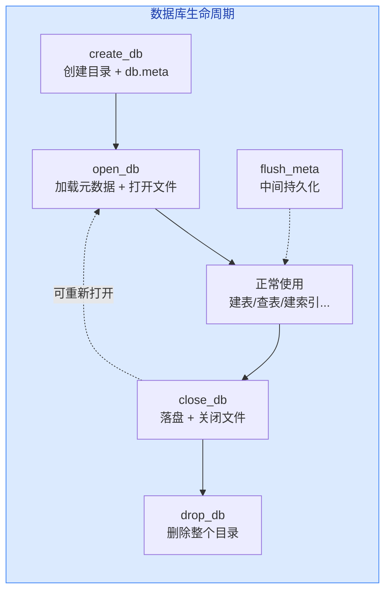

# 03. 数据库操作

数据库操作是 SM 层最基础的功能——创建、打开、关闭、删除数据库。

一个数据库在磁盘上就是一个**目录**，所有表文件、索引文件、元数据文件都放在目录里。

## 数据库生命周期



五个操作围绕两个状态：

- **未打开**：数据库目录存在于磁盘上，但元数据未加载
- **已打开**：`SmManager::db_` 中加载了完整的 `DbMeta` 树，`fhs_` 和 `ihs_` 中持有打开的文件句柄

`create_db` 和 `open_db` 都让数据库进入"已打开"状态，`close_db` 让它回到"未打开"状态。

## 工作目录切换模式

在理解具体操作之前，先了解一个关键的实现模式：**chdir 切换工作目录**。

`chdir`（change directory）是 Linux 系统调用，作用是改变**当前进程的工作目录**。

每个进程都有一个"当前在哪个目录下"的状态，执行 `open("student.db")` 这类相对路径操作时，系统会自动在工作目录下查找文件。

```cpp
// 打开数据库时的典型模式
chdir(db_name.c_str());    // 进入数据库目录
// ... 所有文件操作都在数据库目录内进行 ...
chdir("..");               // 关闭时返回上级目录
```

**含义**：把当前进程的工作目录切换到数据库目录，之后所有相对路径的文件操作（如打开 `student.db`、`db.meta`）都直接在数据库目录内完成。

这样做的好处是**简洁**——不需要在每个文件路径前面拼数据库名，代码中直接用文件名即可。

> **频繁 chdir 会影响性能吗？** 不会。chdir 只修改进程的一个指针变量（指向当前目录的 inode），不涉及磁盘 I/O。即使每秒调用上千次也几乎无开销。在 SM 层的使用场景中，chdir 只在数据库打开/关闭时各调一次，频率极低，完全可以忽略。

## create_db：创建数据库

`src/system/sm_manager.cpp:36-69`

```cpp
void SmManager::create_db(const std::string& db_name) {
  if (is_dir(db_name)) {
    throw DatabaseExistsError(db_name);
  }
  // 1. 创建数据库子目录
  if (system(("mkdir " + db_name).c_str()) < 0) {
    throw UnixError();
  }
  // 2. 进入目录
  if (chdir(db_name.c_str()) < 0) {
    throw UnixError();
  }
  // 3. 初始化空的 DbMeta 并写入 db.meta
  DbMeta* new_db = new DbMeta();
  new_db->name_ = db_name;
  std::ofstream ofs(DB_META_NAME);  // DB_META_NAME = "db.meta"
  ofs << *new_db;                    // operator<< 序列化
  delete new_db;
  // 4. 创建日志文件
  disk_manager_->create_file(LOG_FILE_NAME);
  // 5. 回到根目录
  if (chdir("..") < 0) {
    throw UnixError();
  }
}
```

**流程**：

1. **检查重复**：如果目录已存在，抛异常
2. **创建目录**：调用系统 `mkdir` 命令
3. **初始化元数据**：创建一个空的 `DbMeta`（只有数据库名，没有表），序列化到 `db.meta` 文件
4. **创建日志**：通过 `DiskManager` 创建 `db.log` 日志文件
5. **返回**：chdir 回上级目录

创建完后，数据库目录内有 `db.meta` 和 `db.log` 两个文件，`db.meta` 内容大致为：

```
student_db
0
```

第一行是数据库名，第二行是表数量（0 张表）。

## open_db：打开数据库

`src/system/sm_manager.cpp:90-120`

```cpp
void SmManager::open_db(const std::string& db_name) {
  // 数据库不存在
  if (!is_dir(db_name)) {
    throw DatabaseNotFoundError(db_name);
  }
  // 数据库已经打开
  if (!db_.name_.empty()) {
    throw DatabaseExistsError(db_name);
  }
  // 进入数据库目录
  if (chdir(db_name.c_str()) < 0) {
    throw UnixError();
  }
  // 从 db.meta 加载元数据
  std::ifstream ifs(DB_META_NAME);
  ifs >> db_;  // operator>> 反序列化

  // 打开每张表的记录文件
  for (auto& [table_name, tab_meta] : db_.tabs_) {
    fhs_[table_name] = rm_manager_->open_file(table_name);
    // 打开每个索引文件
    for (auto& [index_name, _] : tab_meta.indexes) {
      ihs_[index_name] = ix_manager_->open_index(index_name);
    }
  }
}
```

**流程**：

1. **检查**：目录不存在 → 抛异常；已经打开了别的数据库 → 抛异常
2. **进入目录**：chdir 到数据库目录
3. **加载元数据**：从 `db.meta` 文件中反序列化出完整的 `DbMeta` 树（包括所有表、字段、索引的定义）
4. **打开文件**：遍历 `db_.tabs_` 中的每张表，通过 `RmManager` 打开对应的 `.db` 文件；遍历每个索引，通过 `IxManager` 打开对应的 `.idx` 文件
5. 所有打开的句柄存入 `fhs_` 和 `ihs_`

**关键**：`open_db` 不只是读元数据，还把**所有数据文件和索引文件都打开**了。这样之后执行 SQL 时，直接从句柄缓存中取，不需要再打开文件。

## close_db：关闭数据库

`src/system/sm_manager.cpp:134-163`

```cpp
void SmManager::close_db() {
  if (db_.name_.empty()) {
    throw DatabaseNotOpenError(db_.name_);
  }
  flush_meta();        // 先落盘元数据
  db_.name_.clear();
  db_.tabs_.clear();

  // 关闭所有记录文件
  for (auto& [_, file_handle] : fhs_) {
    rm_manager_->close_file(file_handle.get());
  }
  // 关闭所有索引文件
  for (auto& [_, index_handle] : ihs_) {
    ix_manager_->close_index(index_handle.get());
  }

  fhs_.clear();
  ihs_.clear();

  if (chdir("..") < 0) {
    throw UnixError();
  }
}
```

**流程**：

1. **落盘元数据**：先调用 `flush_meta()` 把当前 `DbMeta` 写回 `db.meta`
2. **清空元数据**：清除 `db_` 的 name 和 tabs
3. **关闭文件**：遍历 `fhs_` 关闭每个记录文件，遍历 `ihs_` 关闭每个索引文件
4. **清空句柄**：清空两个 map
5. **返回**：chdir 回上级目录

**框架对比**：框架的 `close_db()` 是空的。参赛者需要实现以上完整的关闭流程——漏掉任何一步都会导致资源泄漏（未关闭的文件）或数据丢失（未落盘的元数据）。

## flush_meta：持久化元数据

`src/system/sm_manager.cpp:125-129`

```cpp
void SmManager::flush_meta() {
  std::ofstream ofs(DB_META_NAME, std::ios::trunc);
  ofs << db_;
}
```

**含义**：把当前 `DbMeta` 的完整状态序列化写入 `db.meta`。

**调用时机**：
- `close_db()` 时——关闭前保证元数据落盘
- `create_table()` 后——新建表后立即持久化
- `drop_table()` 后——删除表后立即持久化
- `create_index()` 后——建索引后立即持久化
- `drop_index()` 后——删索引后立即持久化

**框架对比**：框架的 `flush_meta()` 缺少 `std::ios::trunc` 标志。

```cpp
// 框架（有缺陷）
std::ofstream ofs(DB_META_NAME);
// 参考实现（正确）
std::ofstream ofs(DB_META_NAME, std::ios::trunc);
```

**含义**：`std::ios::trunc` 会在打开文件时把文件内容**清空**（truncate）。

没有 `trunc` 时，如果新写入的内容比旧内容短，**旧内容的尾部会残留在文件中**。虽然因为 `operator>>` 只读取需要的部分，残留数据不会被读到——但文件会随着每次 flush 持续膨胀。例如反复 CREATE TABLE → DROP TABLE → flush，文件会越写越大。加上 `trunc` 后每次都是全新写入，文件大小始终是当前元数据的实际大小。

## drop_db：删除数据库

`src/system/sm_manager.cpp:75-83`

```cpp
void SmManager::drop_db(const std::string& db_name) {
  if (!is_dir(db_name)) {
    throw DatabaseNotFoundError(db_name);
  }
  std::string cmd = "rm -r " + db_name;
  if (system(cmd.c_str()) < 0) {
    throw UnixError();
  }
}
```

**含义**：直接用 `rm -r` 删除整个数据库目录。

这个操作非常直接——删掉目录后，里面的 `db.meta`、`db.log`、所有 `.db` 文件和 `.idx` 文件全部消失。

> **注意**：`drop_db` 的实现不检查数据库是否打开——就算 `SmManager` 还持有 `fhs_` 和 `ihs_` 句柄，它照样直接 `rm -r` 删目录。
>
> 但如果开着就删，那些句柄指向的文件已经被物理删除了，句柄就变成了悬空指针。之后再通过句柄操作文件，行为未定义。
>
> 所以正确的用法是：**先 `close_db`（正常关闭句柄、落盘元数据），再 `drop_db`（删除目录）**。`drop_db` 自身不强制这个顺序，但按顺序走才安全。

## 串联回顾

五个操作构成数据库的完整生命周期：

```
创建：create_db → 目录 + 空的 db.meta + db.log
打开：open_db   → 加载 db.meta → 打开所有 .db 和 .idx 文件
使用：各种 DDL/DML 操作通过 fhs_ / ihs_ 读取和写入数据
持久化：flush_meta → 把内存中的 DbMeta 树写回 db.meta
关闭：close_db  → flush_meta + 关闭所有文件 + chdir 返回
删除：drop_db   → rm -r 删除整个目录
```

核心设计理念：**数据库 = 目录，表 = 文件，元数据 = db.meta 文本**。简单直接，没有复杂的二进制格式。

上一节：[02-system-data-structures.md](./02-system-data-structures.md) | 下一节：[04-table-operations.md](./04-table-operations.md)
