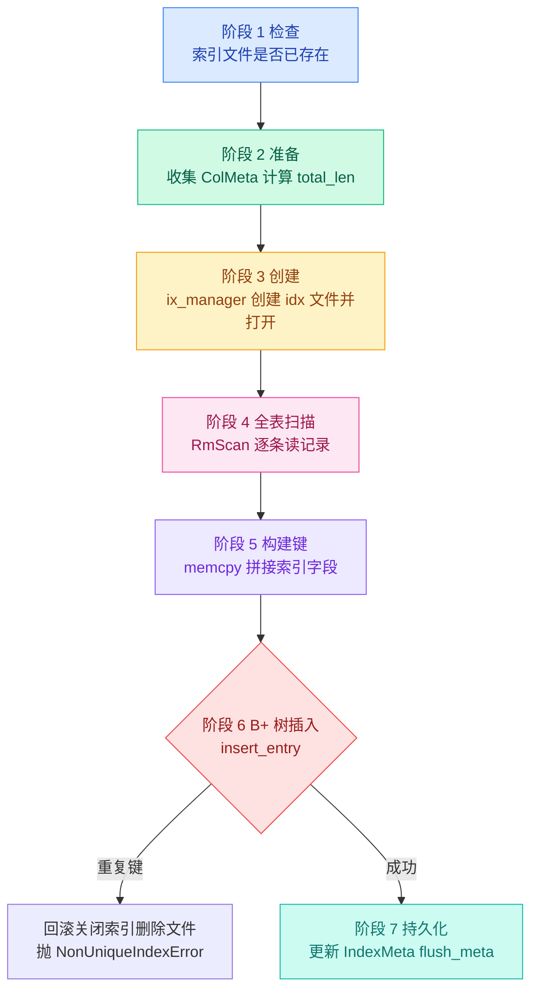

# 05. 索引操作

索引操作是 SM 层中最复杂的部分——特别是创建索引，需要扫描全表数据，构建 B+ 树。

## 操作总览

| 操作 | 方法 | 作用 |
|------|------|------|
| 建索引 | `create_index` | 全表扫描 → 拼键 → B+ 树插入 → 更新元数据 |
| 删索引 | `drop_index`（两个重载） | 关闭/删除 .idx 文件 → 清理元数据 |
| 重建索引 | `redo_index` | 恢复时重建索引（同 create_index，但复用已有 index_name） |

## create_index：概览

`src/system/sm_manager.cpp:330-395`

`create_index` 是 SM 层最长的方法（约 65 行），它做以下事情：



详细的 7 个阶段拆解见 [05b-create-index-detail.md](./05b-create-index-detail.md)。

这里先说几个重要的设计决策：

### 为什么索引名由 SM 层生成

`IxManager::get_index_name(tab_name, col_names)` 根据表名和字段名自动生成索引文件名：

```
CREATE INDEX ON student(age, name) → student_age_name.idx
```

**原因**：简化索引管理。用户不需要关心索引文件名，系统根据表名和字段名唯一确定一个索引。如果想让用户自定义索引名，可以在 `ColDef` 或 SQL 语法中增加一个可选参数。

### 为什么建索引时要全表扫描

索引需要包含表中**所有已有记录**的键。建索引时表中可能已经有数据了（先 INSERT 后 CREATE INDEX），所以必须扫描全表，为每条已有记录插入 B+ 树。

扫描用的是 `RmScan`——记录层的全表扫描器，它按页面顺序遍历每页的每条记录。

### 为什么 UNIQUE 违反要回滚整个索引

如果索引定义为 UNIQUE，而表中已有重复键值，建索引过程中发现重复时，已经插入的 B+ 树条目必须全部清理：

```cpp
ix_manager_->close_index(ih.get());    // 关闭句柄
ix_manager_->destroy_index(ix_name);    // 删除索引文件
throw NonUniqueIndexError(tab_name, col_names);
```

关闭句柄 + 删除文件 = "回滚"。`.idx` 文件被删除，B+ 树的所有节点随文件一起消失，不留下任何垃圾数据。

## drop_index：删除索引

`src/system/sm_manager.cpp:403-459`

有两个重载，分别接受 `vector<string>`（字段名）和 `vector<ColMeta>`（字段元数据）：

```cpp
// 重载 1：通过字段名
void SmManager::drop_index(const std::string& tab_name,
                           const std::vector<std::string>& col_names, Context* context);

// 重载 2：通过字段元数据
void SmManager::drop_index(const std::string& tab_name,
                           const std::vector<ColMeta>& cols, Context* context);
```

两者的逻辑相同，只是计算 `ix_name` 的方式不同：

```cpp
// 1. 关闭索引句柄
ix_manager_->close_index(ihs_[ix_name].get());
// 2. 删除索引文件
ix_manager_->destroy_index(ix_name);
// 3. 从 ihs_ 中移除
ihs_.erase(ix_name);
// 4. 从 tab_meta.indexes 中移除
table_meta.indexes.erase(ix_name);
// 5. 持久化
flush_meta();
```

**为什么有两个重载**：执行器有时手里有 `ColMeta` 对象（来自查询计划），有时只有字段名（来自 SQL 解析）。两个重载让调用方不用手动转换。

**框架对比**：框架的两个 `drop_index` 重载都是空的。参赛者需要实现上面的完整清理流程。

## redo_index：重建索引

`src/system/sm_manager.cpp:467-513`

**场景**：`redo_index` 仅在**恢复（Recovery）流程**中使用。当系统崩溃后重放日志时，可能发现某个索引文件损坏或不完整，此时需要重建索引。

**含义**：`redo_index` 和 `create_index` 几乎一样——也是全表扫描 + memcpy 拼键 + B+ 树插入。区别在于：

| 方面 | create_index | redo_index |
|------|-------------|------------|
| 索引名 | 由表名和字段名生成 | 直接传入已有的 `index_name` |
| 前置清理 | 无需（新建） | 先关闭并删除已有（可能损坏的）索引文件 |
| 元数据 | 构建新的 `IndexMeta` 并写入 | 不更新元数据（恢复前元数据已存在） |

**为什么叫 "redo"**：类似于 redo log 的概念——把创建索引的操作"重新做一遍"，确保索引文件的内容和表数据一致。

**框架对比**：框架没有 `redo_index` 方法。这是参考实现为支持恢复功能额外添加的。

上一节：[04-table-operations.md](./04-table-operations.md) | 下一节：[05b-create-index-detail.md](./05b-create-index-detail.md)
