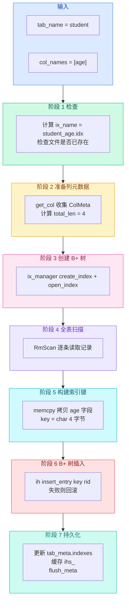

# 05b. 创建索引详解

`create_index` 是 SM 层最复杂的操作，约 65 行代码，跨越了 SQL 解析、元数据管理、记录扫描、B+ 树构建四个领域。

用 `CREATE INDEX ON student(age)` 做例子，详细拆解每一步。

## 全貌



## 阶段 1：检查重复

```cpp
// src/system/sm_manager.cpp:333-336
auto&& ix_name = ix_manager_->get_index_name(tab_name, col_names);
if (disk_manager_->is_file(ix_name)) {
  throw IndexExistsError(tab_name, col_names);
}
```

**含义**：根据表名和字段名生成索引文件名，检查这个文件是否已在磁盘上存在。

`get_index_name` 会把 `("student", ["age"])` 变成 `"student_age.idx"`。

如果文件已存在，说明这个索引建过了（或者有同名索引），抛异常。

**为什么提前检查**：避免创建 B+ 树到一半才发现重复——那需要回滚，浪费了前面的工作。

## 阶段 2：准备列元数据

```cpp
// src/system/sm_manager.cpp:339-355
auto& table_meta = db_.get_table(tab_name);

std::vector<ColMeta> col_metas;
auto total_len = 0;
for (auto& col_name : col_names) {
  col_metas.emplace_back(*table_meta.get_col(col_name));
  total_len += col_metas.back().len;
}
```

**含义**：把字段名字符串变成 `ColMeta` 对象，同时累加 `total_len`（索引键的总字节数）。

> **`emplace_back` 和 `push_back` 有什么区别？**
>
> 给 `vector` 尾部加元素有三种写法：
>
> ```cpp
> vector<ColMeta> col_metas;
> ColMeta& col = *table_meta.get_col(col_name);
>
> // 写法 1：push_back — 先有对象，再拷进 vector
> col_metas.push_back(col);
>
> // 写法 2：emplace_back + 已有对象 — 和 push_back 效果一样，也是拷贝
> col_metas.emplace_back(col);
>
> // 写法 3：emplace_back + 构造参数 — 直接在 vector 内部原地构造，省掉拷贝
> col_metas.emplace_back(col.tab_name, col.name, col.type, col.len, col.offset);
> ```
>
> **本质区别**：
> - `push_back(T&&)` / `push_back(const T&)` — 接收一个**已经构造好的对象**，拷贝或移动到 vector 内部
> - `emplace_back(args...)` — 接收**构造参数**，在 vector 内部直接调用构造函数，不产生临时对象
>
> **这里为什么用的 `emplace_back(*iter)` 没有优势**：代码中 `*table_meta.get_col(col_name)` 返回的是已有的 `ColMeta` 引用，传给 `emplace_back` 时走的是**拷贝构造**——和 `push_back` 完全一样。等价于写法 2。
>
> 真正能发挥 `emplace_back` 优势的场景是**只需要构造参数、不想先构造临时对象**：
>
> ```cpp
> // 好：直接原地构造，零拷贝
> col_metas.emplace_back(tab_name, col_def.name, col_def.type, col_def.len, curr_offset);
>
> // 差：先构造临时 ColMeta，再拷进 vector
> ColMeta col = {.tab_name = tab_name, ...};
> col_metas.push_back(col);
> ```
>
> **开销对比**：
>
> | 写法 | 临时对象 | 拷贝/移动 | 适用场景 |
> |------|---------|----------|---------|
> | `emplace_back(构造参数)` | 无 | 无 | 手头有构造参数时最优 |
> | `push_back(已有对象)` | 1 次（已有） | 1 次拷贝 | 对象已经存在 |
> | `emplace_back(已有对象)` | 1 次（已有） | 1 次拷贝 | 同上，无额外收益 |
> | `push_back(std::move(obj))` | 1 次（已有） | 1 次移动 | 对象之后不再用 |
>
> **什么场景差异明显**：
> - 对象**很大**（如长 string、嵌套容器）→ 拷贝贵，用构造参数版 `emplace_back` 省拷贝
> - 对象**不可拷贝**（如 `unique_ptr`）→ `emplace_back` 是唯一选择，`push_back` 编译不过
> - 对象像 `ColMeta` 这样就几个 `int` 和 `string`，建索引就几个字段 → 差异可忽略，但 `emplace_back` 是好习惯

对于 `CREATE INDEX ON student(age)`：

```
col_metas = [{tab_name="student", name="age", type=INT, len=4, offset=36}]
total_len = 4
```

对于复合索引 `CREATE INDEX ON student(age, name)`：

```
col_metas = [
  {tab_name="student", name="age", type=INT, len=4, offset=36},
  {tab_name="student", name="name", type=STRING, len=32, offset=4}
]
total_len = 4 + 32 = 36
```

`total_len` 决定了 B+ 树中每个键的大小。索引层用它来计算每页能放多少个键。

## 阶段 3：创建 B+ 树

```cpp
// src/system/sm_manager.cpp:357-360
ix_manager_->create_index(ix_name, col_metas);
auto&& ih = ix_manager_->open_index(ix_name);
auto&& fh = fhs_[tab_name];
```

**含义**：

1. `create_index`：由 `IxManager` 创建 `.idx` 文件，写入 `IxFileHdr`（记录 `col_tot_len` 等信息）
2. `open_index`：打开文件，返回 `IxIndexHandle`——B+ 树的入口句柄
3. `fh = fhs_[tab_name]`：获取表的记录文件句柄，接下来全表扫描要用

此时 B+ 树是**空的**——只有一个根节点（叶节点），`num_key = 0`。

## 阶段 4 + 5：全表扫描 + 构建键

```cpp
// src/system/sm_manager.cpp:362-384
int offset = 0;
char* key = new char[total_len];
for (auto&& scan = std::make_unique<RmScan>(fh.get()); !scan->is_end();
     scan->next()) {
  auto&& rid = scan->rid();      // 当前记录的地址
  auto&& record = fh->get_record(rid, context);  // 读出记录内容

  // 构建索引键：逐个字段拷贝
  offset = 0;
  for (auto& col_meta : col_metas) {
    memcpy(key + offset, record->data + col_meta.offset, col_meta.len);
    offset += col_meta.len;
  }

  // 插入 B+ 树（阶段 6）
  if (ih->insert_entry(key, rid, context->txn_) == IX_NO_PAGE) {
    // 重复键 → 回滚
  }
}
```

**这是 create_index 的核心循环**，逐条处理表中的每条记录。

### 扫描层（RmScan）

`RmScan` 按页面顺序扫描全表，和 `SELECT * FROM student` 全表扫描用的是同一个类。

每调用一次 `scan->next()`，移动到下一条记录。`scan->is_end()` 返回 true 时扫描结束。

`scan->rid()` 返回的是 `Rid{page_no, slot_no}`——记录在页面中的位置。

### 获取记录

```cpp
auto&& record = fh->get_record(rid, context);
```

通过 `Rid` 精确定位并读取一条 `RmRecord`。

`record->data` 是记录内容的字节数组，`record->size` 是 40（student 表的情况）。

### 构建索引键（memcpy 拼接）

```cpp
offset = 0;
for (auto& col_meta : col_metas) {
  memcpy(key + offset, record->data + col_meta.offset, col_meta.len);
  offset += col_meta.len;
}
```

**这是最关键的一步**。以 student 表为例，一条记录的数据布局：

```
record->data（40 字节）
| id (4B) | name (32B) | age (4B) |
  偏移 0     偏移 4       偏移 36
```

要建的是 `ON student(age)` 索引，`col_metas` 里只有一个元素：`{name="age", offset=36, len=4}`。

```
memcpy(key + 0, record->data + 36, 4);
// 从记录的第 36 字节起，拷贝 4 字节 → 得到 age 的值
```

如果要建的是 `ON student(age, name)` 复合索引：

```
memcpy(key + 0, record->data + 36, 4);    // 先拷 age
memcpy(key + 4, record->data + 4, 32);    // 再拷 name
// 最终 key = [age 4B][name 32B] = 36 字节
```

**为什么用 `col_meta.offset` 而不是按顺序**：字段在索引中的顺序和在表中的顺序可能不同。`ON student(age, name)` 是 age 在前，但表中 age 的 offset=36 在 name(offset=4) 的后面。必须用 `col_meta.offset` 来确定字段在记录中的位置，不能靠遍历顺序。

### B+ 树插入

```cpp
ih->insert_entry(key, rid, context->txn_)
```

调用索引层的 `IxIndexHandle::insert_entry`，把 `(key, rid)` 插入 B+ 树。

- `key`：刚拼好的字节数组（4 字节 age 值）
- `rid`：记录的位置 `{page_no, slot_no}`
- `txn_`：事务 ID（用于事务层的并发控制）

返回值 `IX_NO_PAGE` 表示插入失败——唯一键冲突。

## 阶段 6：重复键回滚

```cpp
// src/system/sm_manager.cpp:374-381
if (ih->insert_entry(key, rid, context->txn_) == IX_NO_PAGE) {
  delete[] key;
  ix_manager_->close_index(ih.get());
  ix_manager_->destroy_index(ix_name);
  throw NonUniqueIndexError(tab_name, col_names);
}
```

**含义**：如果 `insert_entry` 返回 `IX_NO_PAGE`，说明表中已有两条记录的 age 值相同，违反了 UNIQUE 约束。

回滚三步：

1. 释放 key 的临时内存
2. 关闭索引句柄
3. 删除整个索引文件（之前已插入的 B+ 树条目随文件一起消失）

然后抛异常告知用户建索引失败。

> **UNIQUE 判断在 B+ 树层**：`IX_NO_PAGE` 的含义在索引层的 `insert_entry` 中定义——它意味着 B+ 树中已经存在相同的键（或键重复且索引是 unique 的），无法为新记录分配页面号。SM 层不需要自己比较键值，直接信任索引层的返回值。

## 阶段 7：持久化和缓存

```cpp
// src/system/sm_manager.cpp:387-394
delete[] key;

table_meta.indexes.emplace(
    ix_name,
    IndexMeta(std::move(tab_name), total_len,
              static_cast<int>(col_names.size()), std::move(col_metas)));

ihs_[std::move(ix_name)] = std::move(ih);

flush_meta();
```

**含义**：

1. 释放 key 的临时内存（全程用同一块 key 内存，循环内复用）
2. 构建 `IndexMeta` 写入 `tab_meta.indexes`——从此表元数据"知道"有这个索引
3. 把 `IxIndexHandle` 存入 `ihs_`——索引句柄被缓存，后续 SQL 可以直接用
4. `flush_meta()`——把更新后的元数据持久化到 `db.meta`

## 完整流程回顾

用一个具体例子串一遍：假设 student 表已有两条记录。

```
student 表数据:
Rid{1,0}: id=1, name="Alice", age=20
Rid{1,1}: id=2, name="Bob",   age=22

执行: CREATE UNIQUE INDEX ON student(age)
```

```
阶段 1: ix_name = "student_age.idx"，磁盘上不存在 → 通过
阶段 2: col_metas = [{age, INT, 4, offset=36}]，total_len = 4
阶段 3: 创建 student_age.idx，B+ 树根节点为空
阶段 4-6:
  第 1 条: rid={1,0}, record 内容解析，memcpy(key, data+36, 4) → key=20
           insert_entry(key=20, rid={1,0}) → 成功
  第 2 条: rid={1,1}, record 内容解析，memcpy(key, data+36, 4) → key=22
           insert_entry(key=22, rid={1,1}) → 成功
阶段 7: IndexMeta 写入 tab_meta.indexes["student_age.idx"]
        ihs_["student_age.idx"] = B+ 树句柄
        flush_meta()
```

最终 B+ 树结构：

```
叶节点: [key=20 → {1,0}] → [key=22 → {1,1}]
```

之后 `SELECT * FROM student WHERE age = 20` 就可以通过 B+ 树查找 key=20，定位到 Rid{1,0}，再去记录层读数据。

上一节：[05-index-operations.md](./05-index-operations.md) | 下一节：[06-system-interaction.md](./06-system-interaction.md)
