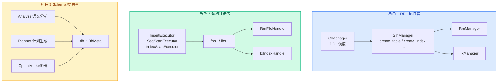
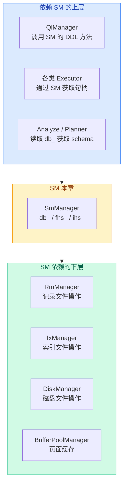

# 06. 组件交互

SM 层不是孤立工作的——它是整个 DBMS 的"调度中心"，协调 RM、IX、执行器、优化器等各层完成工作。

## SM 层的三个角色



## 角色 1：DDL 执行者

### 调用链

```
SQL 文本 → Parser → AST → Analyze → 逻辑计划 → QlManager → SmManager → RM/IX
```

**源码对应**：`src/execution/execution_manager.cpp:96-138`

```cpp
// QlManager 根据 DDL 类型分发到 SmManager 的不同方法
case SM_CREATE_TABLE:
  sm_manager_->create_table(x->tab_name_, x->cols_, context);
case SM_DROP_TABLE:
  sm_manager_->drop_table(x->tab_name_, context);
case SM_CREATE_INDEX:
  sm_manager_->create_index(x->tab_name_, x->tab_col_names_, context);
case SM_DROP_INDEX:
  sm_manager_->drop_index(x->tab_name_, x->tab_col_names_, context);
```

**含义**：SM 不解析 SQL——它收到的已经是结构化的 `ColDef`、字段名列表等参数。SQL 解析和语义分析在更上层完成，SM 只负责"执行"。

### SM 持有的指针

```cpp
// src/system/sm_manager.h:36-39
DiskManager* disk_manager_;
BufferPoolManager* buffer_pool_manager_;
RmManager* rm_manager_;
IxManager* ix_manager_;
```

SM 持有四个下层管理器的指针，通过 getter 方法暴露给执行层：

```cpp
BufferPoolManager* get_bpm() { return buffer_pool_manager_; }
RmManager* get_rm_manager() { return rm_manager_; }
IxManager* get_ix_manager() { return ix_manager_; }
DiskManager* get_disk_manager() { return disk_manager_; }
```

**含义**：SM 是 RMDB 中**唯一持有所有管理器指针的类**。任何需要访问 RM、IX、Buffer Pool 的组件，都可以通过 `sm_manager_` 拿到对应的管理器。

## 角色 2：句柄注册表

SM 通过 `fhs_` 和 `ihs_` 两个 map 缓存所有打开的文件句柄。

### fhs_：表文件句柄缓存

```cpp
std::unordered_map<std::string, std::unique_ptr<RmFileHandle>> fhs_;
```

`fhs_["student"]` → student 表的 `RmFileHandle`，可以直接调用 `insert_record`、`get_record`、`delete_record`。

### ihs_：索引文件句柄缓存

```cpp
std::unordered_map<std::string, std::unique_ptr<IxIndexHandle>> ihs_;
```

`ihs_["student_age.idx"]` → student 表上 age 索引的 `IxIndexHandle`，可以直接调用 `insert_entry`、`get_value`、`delete_entry`。

### 执行器的使用模式

执行器从 SM 获取句柄，然后直接操作：

```
InsertExecutor::execute()
  │
  ├─→ RmFileHandle* fh = sm_manager_->fhs_["student"].get();
  │     fh->insert_record(data, context);  // 插入记录
  │
  └─→ IxIndexHandle* ih = sm_manager_->ihs_["student_age.idx"].get();
        ih->insert_entry(key, rid, txn_);  // 同步更新索引
```

**含义**：SM 不参与具体的 INSERT/SELECT/DELETE 操作——它只提供句柄，执行器用句柄直接调用 RM/IX 的方法。

这种设计让 SM 保持简单——它不关心数据怎么插入、索引怎么查找，只关心"有没有这张表、这个索引在哪"。

## 角色 3：Schema 提供者

在解析和执行 SQL 之前，上层组件需要知道表的结构。`SmManager::db_` 提供了完整的数据库 schema 信息。

### Analyze 语义分析

Analyze 阶段需要验证：

- 表名是否存在 → `db_.is_table("student")`
- 字段名是否有效 → `tab_meta.is_col("age")`
- 字段类型是否匹配 → `col_meta.type == INT`

这些查询都通过 `db_` 的元数据完成。

**源码**：`DbMeta` 在 `sm_meta.h` 中声明了 `friend class Analyze`，允许 Analyze 直接访问 `tabs_` 成员。

### Planner 计划生成

Planner 在生成执行计划时需要：

- 检查表上有没有索引（决定用 IndexScan 还是 SeqScan）
- 获取索引包含的字段（生成索引扫描的 key）

这些信息都来自 `TabMeta::indexes`。

## 全局落盘：flush_all

`src/execution/execution_manager.cpp:202-210`

```cpp
// QlManager 层有一个全局 flush 操作
sm_manager_->flush_meta();
for (auto& [_, fh] : sm_manager_->fhs_) {
  sm_manager_->get_rm_manager()->flush_file(fh.get());
}
for (auto& [_, ih] : sm_manager_->ihs_) {
  sm_manager_->get_ix_manager()->flush_index(ih.get());
}
```

**含义**：全局落盘时，SM 的 `fhs_` 和 `ihs_` 作为"所有打开文件的清单"被遍历——每一个句柄对应的文件都被刷入磁盘。

SM 的 `flush_meta()` 只刷元数据，RM 的 `flush_file` 刷记录页面，IX 的 `flush_index` 刷索引页面。三者配合完成完整的持久化。

## SM 层与其他层的依赖关系



SM 是系统的"中轴"——对上提供服务和信息，对下协调各层工作。

上一节：[05b-create-index-detail.md](./05b-create-index-detail.md) | 下一节：[07-system-frame-vs-reference.md](./07-system-frame-vs-reference.md)
