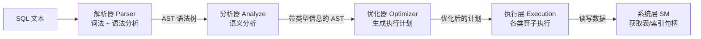
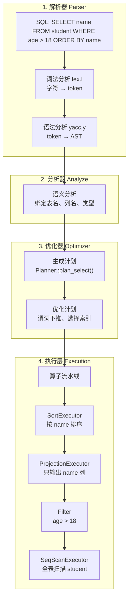

# 查询处理概述

## 查询处理在架构中的位置

SQL 语句从输入到执行，经过**解析 → 分析 → 优化 → 执行**四个阶段的流水线处理。



**含义**：查询处理是 DBMS 的"大脑"——把用户输入的 SQL 文本翻译成对底层存储的具体操作。

**作用**：将声明式的 SQL（"我想要什么"）转换为过程式的执行计划（"怎么做"）。

## 四个阶段

### 阶段 1：解析器（Parser）

**源码**：`src/parser/`

**输入**：SQL 文本（字符串）。
**输出**：AST（抽象语法树）。

```
输入: SELECT * FROM student WHERE age > 18
  │
  ▼ Parser（词法 lex.l + 语法 yacc.y）
  │
输出: AST 树
  SelectStmt
  ├── columns: [*]
  ├── table: "student"
  └── where: age > 18
```

**含义**：Parser 负责把 SQL 字符串变成程序可以操作的数据结构。

词法分析（`lex.l`）把字符流切成 token——`SELECT`、`*`、`FROM`、`student`、`WHERE`、`age`、`>`、`18`。

语法分析（`yacc.y`）根据 SQL 语法规则把这些 token 组织成树形结构——知道 `age > 18` 是 WHERE 子句的条件表达式。

### 阶段 2：分析器（Analyze）

**源码**：`src/analyze/`

**输入**：AST（Parser 输出的原始语法树）。
**输出**：带完整类型信息的 AST（表和列都绑定了实际的元数据）。

```
输入: AST 树（只知名字，不知实际结构）
  SelectStmt
  ├── columns: [*]              ← "*" 是哪些列？
  ├── table: "student"          ← "student" 表存不存在？
  └── where: age > 18           ← "age" 是什么类型？
  │
  ▼ Analyze（语义分析）
  │
输出: 绑定后的 AST
  SelectStmt
  ├── columns: [id INT, name STRING, age INT]  ← 从元数据查到了实际列
  ├── table: student (tab_id=1)                ← 验证了表存在
  └── where: age(INT, offset=8) > 18           ← 绑定了类型和偏移量
```

**含义**：Analyze 是语义分析阶段——检查 SQL 中引用的表、列、函数是否真实存在，把名字解析为实际的元数据引用。

### 阶段 3：优化器（Optimizer）

**源码**：`src/optimizer/`

**输入**：Analyze 输出的带类型 AST。
**输出**：优化后的执行计划（Plan）。

```
输入: 带类型的 AST
  │
  ▼ Optimizer
  │
输出: 执行计划
  ProjectionPlan (输出 id, name)
    └── FilterPlan (过滤 age > 18)
          └── SeqScanPlan (全表扫描 student)
```

**含义**：Optimizer 把"要什么结果"变成"怎么高效地算出来"。

核心文件：

| 文件 | 作用 |
|------|------|
| `plan.h` | 定义各种执行计划的节点类型 |
| `planner.h` / `planner.cpp` | 从 AST 生成初始执行计划 |
| `optimizer.h` | 对计划做优化（如谓词下推） |

### 阶段 4：执行层（Execution）

**源码**：`src/execution/`

**输入**：优化后的执行计划。
**输出**：查询结果。

```
输入: 执行计划
  │
  ▼ Execution (各类 Executor)
  │
输出: 查询结果（记录集合）
```

执行层由多种**算子（Executor）**组成，每种算子负责一种操作：

| 算子 | 文件 | 作用 |
|------|------|------|
| SeqScanExecutor | `executor_seq_scan.h` | 全表扫描 |
| IndexScanExecutor | `executor_index_scan.h` | 索引扫描 |
| InsertExecutor | `executor_insert.h` | 插入记录 |
| DeleteExecutor | `executor_delete.h` | 删除记录 |
| UpdateExecutor | `executor_update.h` | 更新记录 |
| NestedLoopJoinExecutor | `executor_nestedloop_join.h` | 嵌套循环连接 |
| SortMergeJoinExecutor | `executor_sortmerge_join.h` | 排序归并连接 |
| ProjectionExecutor | `executor_projection.h` | 投影（选列） |
| AggregateExecutor | `executor_aggregate.h` | 聚合（COUNT/SUM/AVG） |
| SortExecutor | `executor_sort.h` | 排序 |

这些算子通过**迭代器模式**组织——每个算子都有 `next()` 方法，调用一次返回一条记录。上层算子通过调用下层算子的 `next()` 来获取数据，形成流水线。

## 从 SQL 到结果的完整路径

用一条具体的 SQL 走一遍完整流程：

```
SELECT name FROM student WHERE age > 18 ORDER BY name
```



**数据流方向**：SQL 从左到右逐步变形——文本 → AST → 绑定 AST → 执行计划 → 结果。

**执行流方向**：算子从下到上调用——底层的 SeqScan 读取原始数据，上层的 Filter/Projection/Sort 逐层加工。

## 和前面几层的联系

查询处理是前面四层的"消费者"——前面学的存储层、记录层、索引层、系统层都是为查询处理服务的：

| 前面学的层 | 在查询处理中被谁用 | 怎么用 |
|-----------|------------------|--------|
| 系统层（SM） | Analyze、Executor | 获取表元数据、打开表/索引句柄 |
| 索引层（IX） | IndexScanExecutor | 用 B+ 树索引加速查找 |
| 记录层（RM） | SeqScanExecutor、InsertExecutor 等 | 读写记录 |
| 存储层（Storage） | 所有 Executor 间接使用 | 页面缓存、磁盘读写 |

## 下一节

下一节：[02-parser-detail.md](./02-parser-detail.md)
