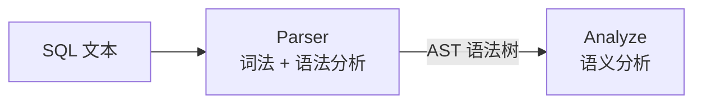
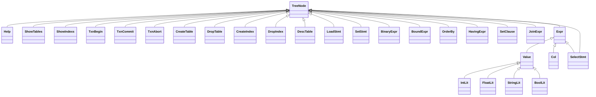

# 解析器

## Parser 在流水线中的位置

Parser 是查询处理流水线的第一阶段，负责把 SQL 文本翻译成程序可以操作的数据结构。



**含义**：Parser 做的是"翻译"工作——把人类可读的 SQL 字符串变成结构化的 AST (Abstract Syntax Tree，抽象语法树)。

**作用**：让后续的 Analyze、Optimizer、Execution 不需要处理原始文本，而是在结构化的树上操作。

**场景**：用户输入任何 SQL 语句时，`rmdb.cpp` 首先调用 `yyparse()` 触发 Parser，得到 AST 后再交给 Analyze。

Parser 内部分为两个子阶段：词法分析和语法分析。

```
输入: SELECT * FROM student WHERE age > 18
  │
  ▼ 词法分析（lex.l）
  │  字符流 → token 序列
  │  SELECT  *  FROM  student  WHERE  age  >  18
  │
  ▼ 语法分析（yacc.y）
  │  token 序列 → AST 树
  │
输出: SelectStmt
  ├── select_list: [BoundExpr(col=*, type=AGG_COL)]
  ├── tabs: ["student"]
  └── conds: [BinaryExpr(lhs=age, op=GT, rhs=18)]
```

## 词法分析

### 含义

词法分析（Lexical Analysis）把 SQL 字符串切成一个个 token（词法单元）。

比如 `SELECT * FROM student` 被切成四个 token：`SELECT`、`*`、`FROM`、`student`。

### 工具：flex

**含义**：flex 是一个词法分析器生成器——你写正则规则，它生成 C 代码。

**作用**：手写字符解析很容易出错、难维护。flex 把正则规则编译成高效的自动机（DFA, Deterministic Finite Automaton，确定有限自动机），输出一个 `yylex()` 函数供语法分析器调用。

**场景**：`yyparse()` 每需要一个 token 就调用一次 `yylex()`，`yylex()` 从输入流中匹配正则规则、返回 token 类型。

源码文件：`src/parser/lex.l`。

### Token 定义

token 的类型枚举定义在 `src/parser/parser_defs.h` 中。

关键字 token——每个 SQL 关键字对应一个 token：

```
SELECT, FROM, WHERE, INSERT, INTO, VALUES, DELETE, UPDATE, SET,
CREATE, TABLE, DROP, INDEX, AND, JOIN, ORDER, BY, ASC, DESC,
GROUP, HAVING, COUNT, MAX, MIN, SUM, AS, IN, INT, CHAR, FLOAT,
SHOW, TABLES, HELP, EXIT, LOAD, ON, OFF ...
```

实际值 token——携带具体数据：

| token | 携带的数据 | 示例 |
|-------|----------|------|
| `IDENTIFIER` | 字符串（表名、列名） | `student`、`age` |
| `VALUE_INT` | 整数值 | `18` |
| `VALUE_FLOAT` | 浮点值 | `3.14` |
| `VALUE_STRING` | 字符串（单引号括起） | `'hello'` |
| `VALUE_BOOL` | 布尔值 | `TRUE`、`FALSE` |

### 关键词法规则

以下是 `lex.l` 中的关键规则。

关键字匹配（`src/parser/lex.l:61-113`）：

```cpp
// src/parser/lex.l:61-113
"SELECT"  { return SELECT; }
"FROM"    { return FROM; }
"WHERE"   { return WHERE; }
// ... 所有关键字都直接 return 对应的 token 类型
```

标识符匹配（`src/parser/lex.l:122-125`）：

```cpp
// src/parser/lex.l:122-125
{identifier} {
    yylval->sv_str = yytext;
    return IDENTIFIER;
}
```

`{identifier}` 是 flex 开头定义的正则模式（`src/parser/lex.l:40`）：`alpha(_|alpha|digit)*`——以字母开头，后跟字母、数字或下划线。

匹配到的字符串存入 `yylval->sv_str`，返回 `IDENTIFIER` token。

数值匹配（`src/parser/lex.l:127-138`）：

```cpp
// src/parser/lex.l:127-138
{value_int} {
    yylval->sv_int = atoi(yytext);
    return VALUE_INT;
}
{value_float} {
    yylval->sv_float = atof(yytext);
    return VALUE_FLOAT;
}
{value_string} {
    yylval->sv_str = std::string(yytext + 1, strlen(yytext) - 2);
    return VALUE_STRING;
}
```

`VALUE_INT` 携带整数值（通过 `yylval->sv_int`）。
`VALUE_FLOAT` 携带浮点值（通过 `yylval->sv_float`）。
`VALUE_STRING` 携带去掉了首尾单引号的字符串（通过 `yylval->sv_str`）。

运算符匹配（`src/parser/lex.l:116-120`）：

```cpp
// src/parser/lex.l:116-120
">="  { return GEQ; }
"<="  { return LEQ; }
"<>"  { return NEQ; }
"!="  { return NEQ; }
{single_op}  { return yytext[0]; }
```

单字符运算符（`;` `(` `)` `,` `*` `=` `>` `<` `.`）直接返回字符本身的 ASCII 码作为 token 类型。

### `yylval` 的作用

**含义**：`yylval` 是 flex 和 bison 之间的"传话人"——flex 匹配到 token 后，把 token 携带的值写入 `yylval`，bison 在语法规则中读取这些值。

**作用**：token 类型（如 `SELECT`）只能告诉 bison"这是 SELECT 关键字"，但 `VALUE_INT` 还需要告诉 bison"这个整数的值是 18"。`yylval` 就负责传递这个附加值。

`yylval` 的类型是 `YYSTYPE`，在本项目中定义为 `ast::SemValue`（`src/parser/ast.h:357`）。

## 语法分析

### 含义

语法分析（Syntax Analysis）把词法分析输出的 token 序列，按照 SQL 语法规则组织成树形结构（AST）。

### 工具：bison

**含义**：bison 是一个语法分析器生成器——你写 BNF 语法规则，它生成 C 代码。

**作用**：bison 使用 LALR(1) 算法，把语法规则编译成移进-归约分析器，输出一个 `yyparse()` 函数。

**场景**：`yyparse()` 不断调用 `yylex()` 获取 token，按照语法规则逐步归约，最终规约到起始规则时得到完整的 AST。

源码文件：`src/parser/yacc.y`。

### SemValue：语法分析中的值传递

**含义**：`SemValue`（`src/parser/ast.h:310-352`）是一个"万能值容器"——bison 语法规则中的每个符号都可以携带一个 `SemValue`，用于在规则归约时传递数据。

**作用**：bison 的 `%type` 声明告诉每个符号使用 `SemValue` 中的哪个字段。

bison 中的类型声明（`src/parser/yacc.y:39-61`）：

```yacc
// src/parser/yacc.y:39-61
%type <sv_node> stmt dbStmt ddl dml
%type <sv_str> tbName colName alias
%type <sv_col> col
%type <sv_cond> condition
%type <sv_val> value
// ...
```

**示例**：`col` 符号使用 `<sv_col>` 字段（类型 `std::shared_ptr<Col>`），`value` 符号使用 `<sv_val>` 字段（类型 `std::shared_ptr<Value>`）。

### 关键语法规则

SELECT 语句（`src/parser/yacc.y:186-189`）：

```yacc
// src/parser/yacc.y:186-189
SELECT select_list FROM tableList optWhereClause group_by_clause
having_clauses opt_order_clause
{
    $$ = std::static_pointer_cast<Expr>(
        std::make_shared<SelectStmt>($2, $4, $5, $6, $7, $8));
}
```

**含义**：这条规则定义了 SELECT 语句的完整语法结构。

**作用**：当解析器识别到 SELECT 后跟 select_list、FROM、tableList 以及可选的 WHERE、GROUP BY、HAVING、ORDER BY 时，将这些部分组装成一个 `SelectStmt` AST 节点。

`$$` 表示这条规则规约后的结果（传给上层规则），`$2`、`$4` 等表示规则中第 2、第 4 个符号携带的 `SemValue`。

WHERE 条件（`src/parser/yacc.y:270-301`）：

```yacc
// src/parser/yacc.y:270-279
condition:
    col op expr
{
    $$ = std::make_shared<BinaryExpr>($1, $2, $3);
}
|   col op '(' valueList ')'
{
    $$ = std::make_shared<BinaryExpr>($1, $2, $4);
}
;

// src/parser/yacc.y:292-300
whereClause:
    condition
{
    $$.emplace_back(std::move($1));
}
|   whereClause AND condition
{
    $$.emplace_back(std::move($3));
}
;
```

**含义**：`condition` 是一条比较表达式（`col op expr`），`whereClause` 是多条条件的 AND 连接。

**作用**：`WHERE age > 18 AND score < 60` 会被解析为两条 `BinaryExpr`，都存入 `whereClause` 的向量中。

列引用（`src/parser/yacc.y:303-312`）：

```yacc
// src/parser/yacc.y:303-312
col:
    tbName '.' colName
{
    $$ = std::make_shared<Col>(std::move($1), std::move($3));
}
|   colName
{
    $$ = std::make_shared<Col>("", std::move($1));
}
;
```

**含义**：列引用有两种形式——带表名前缀的 `table.column` 和不带的 `column`。

**作用**：不带表名时，表名字段留空，由后续的 Analyze 阶段推断列属于哪张表。

SELECT 列表项（`src/parser/yacc.y:404-428`）：

```yacc
// src/parser/yacc.y:404-428
select_item:
    col asClause
{
    $$ = std::make_shared<BoundExpr>(std::move($1), AGG_COL, std::move($2));
}
|   COUNT '(' '*' ')' asClause
{
    $$ = std::make_shared<BoundExpr>(
        std::make_shared<Col>("", ""), AGG_COUNT, std::move($5));
}
|   MAX '(' col ')' asClause
{
    $$ = std::make_shared<BoundExpr>(
        std::move($3), AGG_MAX, std::move($5));
}
// ... MIN, SUM 类似
;
```

**含义**：`select_item` 可以是普通列、或聚合函数（COUNT、MAX、MIN、SUM）。

**作用**：普通列标记为 `AGG_COL`（表示无聚合），聚合函数标记为对应的 `AggType`。

### 优先级与结合性

RMDB 的 yacc 文件中没有显式的 `%left`/`%right`/`%nonassoc` 优先级声明。

运算符优先级通过语法规则的结构隐式体现——比如 `condition` 规则中 `col op expr` 是原子条件，`whereClause` 用 `AND` 连接多个条件。表达式 `expr` 本身没有定义运算符（如 `+`、`-`），因为 RMDB 不支持 WHERE 子句中的算术表达式。

### 起始规则

```yacc
// src/parser/yacc.y:64-95
start:
    stmt ';'
{
    parse_tree = std::move($1);
    YYACCEPT;
}
|   SET set_knob_type OFF { ... }
|   SET set_knob_type ON  { ... }
|   HELP { ... }
|   EXIT { ... }
|   T_EOF { ... }
;
```

**含义**：`start` 是语法的起始规则，也是 `yyparse()` 的最终归约目标。

**作用**：规约后生成的 AST 根节点存入全局变量 `parse_tree`，然后 `YYACCEPT` 结束解析。

## AST 数据结构

**含义**：AST (Abstract Syntax Tree，抽象语法树) 是 SQL 语句的树形表示。

**作用**：Parser 的输出，Analyze 的输入——连接词法语法分析和语义分析的数据桥梁。

AST 定义在 `src/parser/ast.h`。

### 节点类型总览



**含义**：所有 AST 节点都继承自 `TreeNode`。`Expr`（表达式）是一个虚基类，既是 `TreeNode` 又派生出 `Value`（字面量）、`Col`（列引用）和 `SelectStmt`（子查询）。

**作用**：`SelectStmt` 同时继承 `TreeNode` 和 `Expr`，这样它既可以作为顶层语句节点，又可以作为子查询出现在表达式中（如 `WHERE id IN (SELECT ...)`）。

### 核心节点类型

#### SelectStmt

**含义**：SELECT 语句的顶层节点，包含 SELECT 语句的全部信息。

```
SelectStmt
├── select_list: vector<BoundExpr>   -- SELECT 后面的列/聚合
├── tabs: vector<string>             -- FROM 后面的表名
├── jointree: vector<JoinExpr>       -- JOIN 信息
├── conds: vector<BinaryExpr>        -- WHERE 条件
├── group_bys: vector<Col>           -- GROUP BY 列
├── havings: vector<HavingExpr>      -- HAVING 条件
├── has_sort: bool                   -- 是否有 ORDER BY
└── order: shared_ptr<OrderBy>       -- ORDER BY 信息
```

**示例**：`SELECT name, MAX(score) FROM student WHERE age > 18 GROUP BY name HAVING MAX(score) > 80 ORDER BY name`

```
SelectStmt
├── select_list:
│   ├── BoundExpr(col=name, type=AGG_COL)
│   └── BoundExpr(col=score, type=AGG_MAX)
├── tabs: ["student"]
├── conds:
│   └── BinaryExpr(lhs=age, op=GT, rhs=IntLit(18))
├── group_bys: [Col(tab="", col="name")]
├── havings:
│   └── HavingExpr(lhs=BoundExpr(col=score, type=AGG_MAX), op=GT, rhs=IntLit(80))
├── has_sort: true
└── order: OrderBy(cols=Col(name), dir=OrderBy_DEFAULT)
```

#### BinaryExpr

**含义**：一条比较条件，如 `age > 18`。

```
BinaryExpr
├── lhs: shared_ptr<Col>    -- 左侧列引用
├── op: SvCompOp            -- 比较运算符
├── rhs: shared_ptr<Expr>   -- 右侧表达式（值、列或子查询）
└── rhs_list: vector<Value> -- 值列表（用于 IN 子句）
```

**示例**：`WHERE age > 18 AND name = 'Tom'` 产生两条 `BinaryExpr`：

| 字段 | 第一条 | 第二条 |
|------|-------|-------|
| `lhs` | `Col(tab="", col="age")` | `Col(tab="", col="name")` |
| `op` | `SV_OP_GT` | `SV_OP_EQ` |
| `rhs` | `IntLit(18)` | `StringLit("Tom")` |

#### BoundExpr

**含义**：SELECT 列表中的一项，包含列引用、聚合类型和可选的别名。

```
BoundExpr
├── col: shared_ptr<Col>   -- 列引用
├── type: AggType          -- AGG_COL / AGG_COUNT / AGG_MAX / AGG_MIN / AGG_SUM
└── alias: string          -- AS 别名
```

**示例**：`SELECT score AS s, MAX(age) FROM student`

| 字段 | 第一条 | 第二条 |
|------|-------|-------|
| `col` | `Col(tab="", col="score")` | `Col(tab="", col="age")` |
| `type` | `AGG_COL` | `AGG_MAX` |
| `alias` | `"s"` | `""` |

#### Col

**含义**：列引用——由一个可选的表名和一个列名组成。

```
Col
├── tab_name: string  -- 表名（可为空，如 "student"）
└── col_name: string  -- 列名（不可为空，如 "age"）
```

**作用**：`tab_name` 为空时，表示用户在 SQL 中没写表名前缀（如 `SELECT age` 而不是 `SELECT student.age`），需要 Analyze 阶段推断。

#### Value 子类

**含义**：SQL 字面量的 AST 表示。

| 节点 | C++ 类型 | 示例 SQL |
|------|---------|---------|
| `IntLit` | `int val` | `18` |
| `FloatLit` | `float val` | `3.14` |
| `StringLit` | `string val` | `'hello'` |
| `BoolLit` | `bool val` | `TRUE` |

#### DML 语句节点

| 节点 | 关键字段 | 用途 |
|------|---------|------|
| `InsertStmt` | `tab_name`, `vals` | INSERT 语句 |
| `DeleteStmt` | `tab_name`, `conds` | DELETE 语句 |
| `UpdateStmt` | `tab_name`, `set_clauses`, `conds` | UPDATE 语句 |

### 一条 SQL 的完整 AST

**输入**：`SELECT name FROM student WHERE age > 18`

**输出 AST**：

```
SelectStmt
├── select_list:
│   └── BoundExpr
│       ├── col: Col(tab_name="", col_name="name")
│       ├── type: AGG_COL
│       └── alias: ""
├── tabs: ["student"]
├── conds:
│   └── BinaryExpr
│       ├── lhs: Col(tab_name="", col_name="age")
│       ├── op: SV_OP_GT
│       └── rhs: IntLit(val=18)
├── jointree: []
├── group_bys: []
├── havings: []
├── has_sort: false
└── order: nullptr
```

注意：此时列的表名都是空的——Parser 只负责语法结构，不负责语义解析。列属于哪张表、表是否存在，这些由 Analyze 阶段处理。

## 框架对比

db2026-x 框架中的 parser 目录包含以下文件：

| 文件 | 状态 |
|------|------|
| `parser.h` | 已提供 |
| `parse_node.h` | 已提供（简化版 AST 定义） |
| `ast_printer.h` | 已提供 |

框架中**没有提供** `lex.l`、`yacc.y` 和完整版 `ast.h`——这些需要学生自己编写或从框架的 `parse_node.h` 出发逐步扩展。

这意味着框架中 Parser 的 TODO 包括：
- 编写 flex 词法规则（`lex.l`），定义各关键字的正则匹配
- 编写 bison 语法规则（`yacc.y`），覆盖 SELECT/INSERT/UPDATE/DELETE/CREATE TABLE 等核心语句
- 定义 AST 节点类型（从 `parse_node.h` 扩展），支持表达式、聚合、子查询等

## 小结

Parser 是 SQL 查询处理的入口。

**输入**：SQL 文本字符串。

**输出**：AST（抽象语法树），根节点为 `SelectStmt`、`InsertStmt`、`UpdateStmt`、`DeleteStmt` 或 DDL 节点之一。

**核心职责**：将人类可读的 SQL 文本翻译为结构化的树形数据，供后续的语义分析使用。

下一节：[03-analyze-detail.md](./03-analyze-detail.md)
