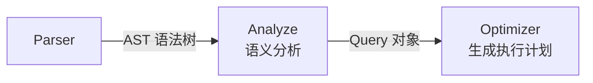
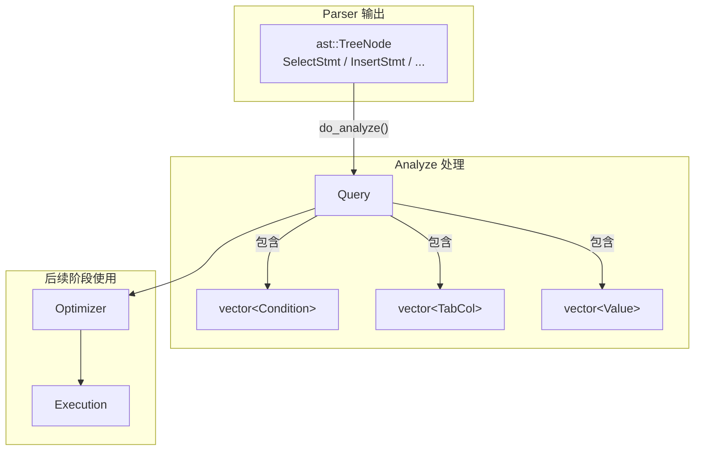
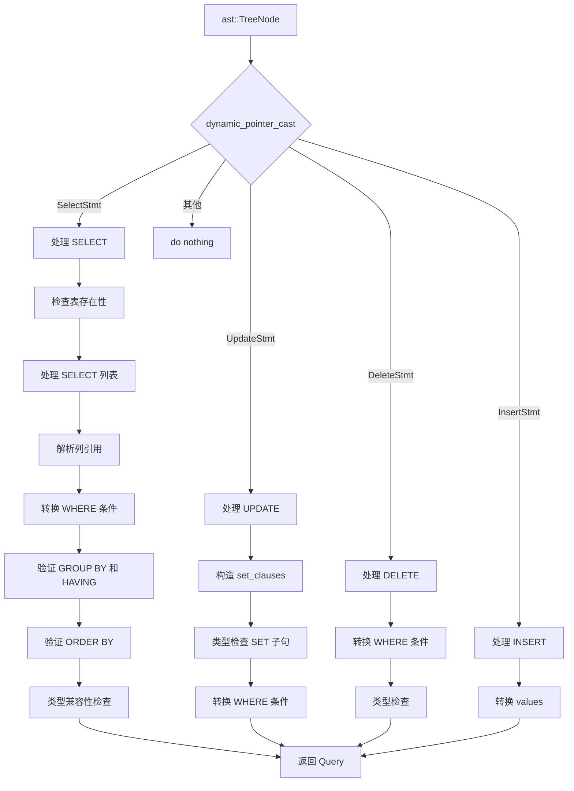

# 分析器

## Analyze 在流水线中的位置

Analyze 是查询处理流水线的第二阶段，负责对 Parser 输出的 AST 做语义分析。



**含义**：Analyze（分析器）是语义分析阶段——检查 SQL 中引用的表、列、函数是否真实存在，把 AST 中的名字解析为实际的元数据引用。

**作用**：Parser 只管语法（结构对不对），不管语义（内容对不对）。比如 `SELECT abc FROM xyz` 语法上完全正确，但 `xyz` 表可能不存在，`abc` 列也可能不存在。Analyze 负责做这些检查。

**场景**：`rmdb.cpp` 中，`yyparse()` 返回 AST 后，立即调用 `analyze->do_analyze(parse_tree)` 得到 `Query` 对象，再交给 Optimizer。

## 核心数据结构

在深入 `do_analyze()` 之前，先理解 Analyze 用到的关键数据结构。

### 数据流转总览



### Query

**含义**：`Query`（`src/analyze/analyze.h:23-60`）是 Analyze 的输出——一个结构化的查询描述对象。

**作用**：把 AST 中的信息转换为后续阶段（Optimizer、Execution）可以直接使用的格式——列有明确的类型偏移量、条件有明确的比较语义。

```
Query
├── parse: shared_ptr<ast::TreeNode>    -- 保留原始 AST 引用
├── tables: vector<string>              -- FROM 子句中的表名
├── cols: vector<TabCol>                -- 投影列（带表名.列名）
├── agg_types: vector<AggType>          -- 每列的聚合类型
├── alias: vector<string>               -- 每列的别名
├── conds: vector<Condition>            -- WHERE 条件
├── group_bys: vector<TabCol>           -- GROUP BY 列
├── havings: vector<Condition>          -- HAVING 条件
├── sort_bys: TabCol                    -- ORDER BY 列
├── asc: bool                           -- 排序方向
├── limit: int                          -- LIMIT 值
├── set_clauses: vector<SetClause>      -- UPDATE 的 SET 子句
└── values: vector<Value>               -- INSERT 的值列表
```

**示例**：`SELECT name, MAX(score) FROM student WHERE age > 18 GROUP BY name`

```
Query
├── tables: ["student"]
├── cols: [TabCol("student","name"), TabCol("student","score")]
├── agg_types: [AGG_COL, AGG_MAX]
├── alias: ["", "MAX(score)"]
├── conds: [Condition(lhs=age, op=GT, rhs=Int(18))]
├── group_bys: [TabCol("student","name")]
└── havings: []
```

### TabCol

**含义**：`TabCol`（`src/common/common.h:31-43`）表示"哪张表的哪一列"。

```
TabCol
├── tab_name: string  -- 表名（如 "student"）
└── col_name: string  -- 列名（如 "age"）
```

**作用**：在 AST 中，列引用可能没有表名（用户写 `age` 而不是 `student.age`）。Analyze 会把表名补全，让后续阶段明确知道每列来自哪张表。

### Condition

**含义**：`Condition`（`src/common/common.h:168-215`）表示一条比较条件，是 WHERE 和 HAVING 子句的基本组成单元。

```
Condition
├── agg_type: AggType           -- 聚合类型（WHERE 条件为 AGG_COL）
├── lhs_col: TabCol             -- 左侧列
├── op: CompOp                  -- 比较运算符（EQ/NE/LT/GT/LE/GE/IN）
├── is_rhs_val: bool            -- 右侧是值？
├── is_sub_query: bool          -- 右侧是子查询？
├── rhs_col: TabCol             -- 右侧列（如果右侧是列）
├── rhs_val: Value              -- 右侧值（如果右侧是值）
├── rhs_value_list: vector<Value> -- 值列表（用于 IN 子句）
└── sub_query: shared_ptr<Query>  -- 子查询（如果右侧是子查询）
```

**lhs/rhs 术语**：`lhs` 是 left-hand side（左侧），`rhs` 是 right-hand side（右侧）。在一条条件 `age > 18` 中，`lhs` 指向列 `age`，`rhs` 指向值 `18`。所有条件中 `lhs` 永远是列引用，`rhs` 根据条件类型可以是值、列、子查询或值列表。

右侧有四种可能的类型:
- 值（`is_rhs_val = true`）
- 列（`is_rhs_val = false`，通过 `rhs_col` 引用）
- 子查询（`is_sub_query = true`，通过 `sub_query` 引用）
- 值列表（`is_sub_query = true`，通过 `rhs_value_list` 引用）。

**示例**：

| SQL 条件 | Condition 各字段 |
|---------|-----------------|
| `age > 18` | `lhs_col=age`, `op=GT`, `is_rhs_val=true`, `rhs_val=Int(18)` |
| `t1.id = t2.id` | `lhs_col=t1.id`, `op=EQ`, `is_rhs_val=false`, `rhs_col=t2.id` |
| `id IN (1, 2, 3)` | `lhs_col=id`, `op=IN`, `is_sub_query=true`, `rhs_value_list=[1,2,3]` |
| `score > (SELECT AVG(score) FROM student)` | `lhs_col=score`, `op=GT`, `is_sub_query=true`, `sub_query=Query(...)` |

### Value

**含义**：`Value`（`src/common/common.h:45-164`）是 SQL 字面量在运行时的表示——把 `18`、`3.14`、`'Tom'` 这类字面量包装成程序可以直接使用的对象。

#### 数据结构

先看 `Value` 的 C++ 定义：

```cpp
// src/common/common.h:45-54
struct Value {
    ColType type;          // 值的类型：TYPE_INT / TYPE_FLOAT / TYPE_STRING
    union {
        int int_val;       // INT 类型的值
        float float_val;   // FLOAT 类型的值
    };
    std::string str_val;   // STRING 类型的值
    std::shared_ptr<RmRecord> raw;  // 序列化后的原始字节
};
```

`type` 字段取值（`src/defs.h:44`）：

```
ColType: TYPE_INT    → 整数
         TYPE_FLOAT  → 浮点数
         TYPE_STRING → 字符串
```

`union` 是什么：

`int_val` 和 `float_val` 被一个 `union` 包在一起。union 的意思是**这两个字段共享同一块内存**——同一时刻只能存其中一个。因为一个 Value 要么是 INT 要么是 FLOAT，不可能同时是两样，用 union 可以省内存。

`str_val` 为什么不在 union 里：

C++ 中 `std::string` 有构造函数和析构函数，不能和 `int`/`float` 这种基础类型放在同一个 union 里。所以 `str_val` 单独放在外面。

`raw` 的类型 `RmRecord`（`src/record/rm_defs.h:40-43`）：

```cpp
// src/record/rm_defs.h:40-43
struct RmRecord {
    char* data;              // 指向字节数组的指针
    int size;                // 字节数组的长度
    bool allocated_ = false; // 是否已分配内存
};
```

**含义**：`RmRecord` 就是一块连续内存——`data` 指针指向 `size` 个字节。它不关心这些字节代表什么，只是把数据原样存着。

**作用**：表中的每行记录在磁盘上就是以 `RmRecord` 的格式存储的。Value 里面的 `raw` 也指向一个 `RmRecord`，这样执行层在做 `WHERE age > 18` 时，拿记录的 age 字段的字节和 `raw.data` 的字节直接比较就可以了。

#### 两层表示

Value 用两套字段表示同一个值：

| 层面 | 用的字段 | 用途 | 谁用 |
|------|---------|------|------|
| C++ 类型层 | `int_val` / `float_val` / `str_val` | 类型检查、类型转换判断 | Analyze 阶段 |
| 原始字节层 | `raw` → `RmRecord` | 和执行层记录的字节做逐字节比较 | Execution 阶段 |

**为什么需要两层**：Analyze 阶段需要知道"这个值是 INT 还是 FLOAT"才能做类型兼容性检查（比如 INT 可以赋给 FLOAT 列）。执行层不关心类型——每条记录读到内存里就是一堆字节，条件比较时直接逐字节 `memcmp`。

#### 序列化：init_raw

**含义**：Analyze 阶段在完成类型检查后，调用 `init_raw()` 把 C++ 类型的值"拍扁"成字节数组，存到 `raw` 里。

```cpp
// src/common/common.h:133-148
void init_raw(int len) {
    raw = std::make_shared<RmRecord>(len);  // 分配 len 个字节
    if (type == TYPE_INT) {
        *(int*)(raw->data) = int_val;       // int → 4 字节
    } else if (type == TYPE_FLOAT) {
        *(float*)(raw->data) = float_val;   // float → 4 字节
    } else if (type == TYPE_STRING) {
        memset(raw->data, 0, len);          // 先全部清零
        memcpy(raw->data, str_val.c_str(),  // 把字符串内容拷贝进去
               str_val.size());
    }
}
```

**`len` 参数从哪里来**：对于 WHERE 条件中的值（如 `WHERE age > 18`），`len` 取自 `age` 列的元数据。如果 age 列定义为 `INT`（占 4 字节），那 `18` 也序列化为 4 字节。这样后续比较时两边的字节长度一致。

#### 具体示例

以 `WHERE age > 18` 为例，看值 `18` 在各阶段的形态：

```
Parser 阶段:
  AST 节点 IntLit(val=18)
  → 只知道"语法上这是一个整数"

Analyze 阶段:
  convert_sv_value() 创建 Value 对象:
    type = TYPE_INT
    int_val = 18
    raw = nullptr                        ← 还没序列化

  check_clause() 验证 age 列是 INT、18 也是 INT → 类型兼容，调用:
    rhs_val.init_raw(4)                  ← 参数 4 来自 age 列的元数据（INT 占 4 字节）

  init_raw 执行后 raw 指向:
    RmRecord {
        data ──→ 内存中连续的 4 个字节
        size = 4
    }
```

`raw.data` 指向的 4 个字节长什么样：

```
字节地址:  data+0   data+1   data+2   data+3
           ┌──────┬──────┬──────┬──────┐
内容(十六进制)│  12  │  00  │  00  │  00  │
           └──────┴──────┴──────┴──────┘
含义:       低位              高位
            ← 小端序存储，即最低有效字节在最前 →

十进制 18 的十六进制是 0x12（即 18 = 1×16 + 2 = 0x12）。
4 字节小端序：最低字节 0x12 存在最低地址 data+0，高位补零。
```

> 上面方框里的 `12 00 00 00` 只是为了展示加了空格分隔，**实际内存中没有任何分隔符**——就是紧挨着的 4 个字节，每个字节的值分别是 0x12、0x00、0x00、0x00。

**FLOAT 示例**——`WHERE score > 85.5` 中的 `85.5`：

```
Value:
  type = TYPE_FLOAT
  float_val = 85.5f
  raw.data ──→ 4 个字节（85.5 的 IEEE 754 单精度浮点表示）
  raw.size = 4

init_raw(4) 执行: *(float*)(raw.data) = float_val
即把 float_val 的 4 个字节原样拷贝到 raw.data 指向的内存。
```

**STRING 示例**——`WHERE name = 'Tom'` 中的 `'Tom'`，假设 name 列定义为 `CHAR(10)`：

```
Value:
  type = TYPE_STRING
  str_val = "Tom"
  raw.data ──→ 10 个字节
  raw.size = 10

init_raw(10) 执行:
  memset(raw.data, 0, 10)   → 10 个字节全部先置 0
  memcpy(raw.data, "Tom", 3) → 把 'T' 'o' 'm' 三个字符的 ASCII 码写进去

raw.data:
  字节 0: 'T'(0x54)  字节 3: 0x00      字节 4-9: 0x00 ...
  字节 1: 'o'(0x6F)  字节 2: 'm'(0x6D)
```

**含义**：字符串序列化时，先用 `memset` 全部清零，再把实际内容拷贝进去。末尾多余的字节全为 0。这样 `'Tom'` 和 `'Tom\0\0\0\0\0\0\0'` 在字节层面完全一致，`memcmp` 比较不会因为尾部垃圾数据而错误。

#### 完整流程串联

从 SQL 字面量到 Value 再到序列化字节，一条线串起来：

```
SQL: WHERE age > 18

1. Parser   → IntLit(val=18)                       // AST 节点
2. Analyze  → Value(type=INT, int_val=18, raw=null) // C++ 对象
3. Analyze  → check_clause() 验证类型
4. Analyze  → init_raw(4)                           // 序列化
5. Analyze  → Value(type=INT, int_val=18,
                    raw→RmRecord(data=4字节, size=4))
6. Executor → cmp_conds(record, conds)              // 用 raw.data 逐字节比较
               memcmp(record中age偏移量处的4字节, raw.data, 4)
```

**作用**：Analyze 阶段用 `int_val` 做类型检查，执行阶段用 `raw.data` 做字节比较。两层表示各司其职。

**含义**：`init_raw()` 就是把 C++ 类型的值"拍扁"成字节数组——跟记录在磁盘上存储的格式完全一致。

**场景**：Analyze 的 `check_clause()` 在验证完类型兼容性后，调用 `cond.rhs_val.init_raw(len)` 完成序列化。后续 SeqScanExecutor 扫描每条记录时，直接用 `memcmp` 比较记录中字段的字节和 `raw.data` 中的字节，不需要再知道"这是什么类型"。这样的设计让执行层完全不关心数据类型，只做字节级比较。

## 入口函数 do_analyze()

**入口**：`Analyze::do_analyze(std::shared_ptr<ast::TreeNode> parse) -> std::shared_ptr<Query>`（`src/analyze/analyze.cpp:23`）。

**含义**：接收 Parser 输出的 AST 根节点，按语句类型分发处理，返回语义验证后的 `Query` 对象。



## SELECT 语义分析

SELECT 是 Analyze 中最复杂的路径，下面按处理顺序逐步骤讲解。

### 第 1 步：表存在性检查

```cpp
// src/analyze/analyze.cpp:28-34
query->tables = std::move(x->tabs);
for (auto& table : query->tables) {
    if (!sm_manager_->db_.is_table(table)) {
        throw TableNotFoundError(table);
    }
}
```

**含义**：遍历 FROM 子句中的每个表名，在系统目录中查找该表是否存在。

**作用**：`SELECT * FROM nonexistent_table` 会在这里被拦截，抛出 `TableNotFoundError`。

**场景**：`sm_manager_->db_` 是系统管理器维护的数据库元数据（前面学过的系统层），`is_table()` 检查表是否在元数据中有记录。

### 第 2 步：SELECT 列表处理

```cpp
// src/analyze/analyze.cpp:37-69
for (auto& item : x->select_list) {
    query->cols.emplace_back(TabCol{item->col->tab_name, item->col->col_name});
    query->agg_types.emplace_back(item->type);
    // 自动生成别名
    if (query->agg_types.back() != AGG_COL && item->alias.empty()) {
        // COUNT(*) → "COUNT(*)"
        // MAX(score) → "MAX(score)"
        // ...
    }
}
```

**含义**：遍历 SELECT 列表中的每一项，提取列引用和聚合类型，并为没有别名的聚合函数自动生成别名。

**作用**：`SELECT MAX(score)` 没有写别名，Analyze 自动给它生成别名 `"MAX(score)"`，这样后续输出结果时就有了列标题。

RMDB 中的 `alias` 专指**列别名**（通过 `SELECT col AS alias` 指定）。RMDB 不支持表别名（如 `FROM student AS s`），所以不存在区分问题——看到 `alias` 就是列别名。

**示例**：

| SQL 写法 | `cols` | `agg_types` | `alias` |
|---------|--------|-------------|---------|
| `SELECT name` | `TabCol("","name")` | `AGG_COL` | `""` |
| `SELECT MAX(score)` | `TabCol("","score")` | `AGG_MAX` | `"MAX(score)"` |
| `SELECT COUNT(*)` | `TabCol("","")` | `AGG_COUNT` | `"COUNT(*)"` |
| `SELECT score AS s` | `TabCol("","score")` | `AGG_COL` | `"s"` |

### 第 3 步：SELECT * 展开

```cpp
// src/analyze/analyze.cpp:76-85
if (query->cols.empty()) {
    // select *
    if (!x->group_bys.empty() || !x->havings.empty()) {
        throw InternalError("select * 不能包含聚合和分组子句！");
    }
    for (auto& table : query->tables) {
        for (auto& col : sm_manager_->db_.tabs_[table].cols) {
            query->cols.emplace_back(TabCol{col.tab_name, col.name});
        }
    }
}
```

**含义**：当 `cols` 为空（即 `SELECT *`）时，从系统目录中查出所有涉及表的全部列，展开到 `cols` 中。

**作用**：`SELECT *` 在 AST 中不会产生 `select_list` 元素（`cols` 为空），这里的展开逻辑让后续阶段不需要特殊处理 `*`。

**场景**：如果 `SELECT *` 同时包含了 GROUP BY 或 HAVING，则抛出异常——`*` 展开与聚合分组没有明确的语义。

### 第 4 步：列引用解析

```cpp
// src/analyze/analyze.cpp:88-97
for (std::size_t i = 0; i < query->cols.size(); ++i) {
    if (query->agg_types[i] == AGG_COUNT &&
        query->cols[i].tab_name.empty() &&
        query->cols[i].col_name.empty()) {
        continue;  // 跳过 COUNT(*)
    }
    check_column(query->tables, query->cols[i]);
}
```

**含义**：对每个投影列调用 `check_column()`，验证列存在并补全表名。

`check_column()` 的实现（`src/analyze/analyze.cpp:217-248`）：

```cpp
// src/analyze/analyze.cpp:217-248
void Analyze::check_column(const std::vector<std::string>& tables,
                           TabCol& target) {
    if (target.tab_name.empty()) {
        // 表名缺失 → 推断表名
        std::string tab_name;
        for (auto& table : tables) {
            if (sm_manager_->db_.tabs_[table].is_col(target.col_name)) {
                if (!tab_name.empty()) {
                    throw AmbiguousColumnError(target.col_name);
                }
                tab_name = table;
            }
        }
        if (tab_name.empty()) {
            throw ColumnNotFoundError(target.col_name);
        }
        target.tab_name = std::move(tab_name);
    } else {
        // 表名存在 → 验证列在该表中存在
        // ...查找匹配的表和列...
        if (not_exist) {
            throw ColumnNotFoundError(target.col_name);
        }
    }
}
```

**含义**：`check_column` 做两件事——如果 `tab_name` 为空则推断表名（遍历所有表，看哪张表有这列）；如果 `tab_name` 有值则验证该列确实存在于指定的表中。

**作用**：处理两种 SQL 写法——`SELECT age`（没有表名前缀，需推断）和 `SELECT student.age`（有前缀，需验证）。

**场景**：如果列名在多个表中同时存在且用户没指定表名，抛出 `AmbiguousColumnError`（二义性列错误）。

### 第 5 步：WHERE 条件转换

```cpp
// src/analyze/analyze.cpp:101
get_clause(x->conds, query->conds);
```

**含义**：`get_clause()`（`src/analyze/analyze.cpp:298-365`）将 AST 中的 `BinaryExpr` 向量转换为运行时的 `Condition` 向量。

**作用**：这一步做了重要的语义判断——确定右侧是值、是列、是子查询还是值列表。

```cpp
// src/analyze/analyze.cpp:309-362（简化）
for (auto& expr : sv_conds) {
    Condition cond;
    cond.lhs_col = {expr->lhs->tab_name, expr->lhs->col_name};
    cond.op = convert_sv_comp_op(expr->op);

    if (auto rhs_val = dynamic_pointer_cast<ast::Value>(expr->rhs)) {
        // 右侧是值：age > 18
        cond.is_rhs_val = true;
        cond.rhs_val = convert_sv_value(rhs_val);
    } else if (auto rhs_col = dynamic_pointer_cast<ast::Col>(expr->rhs)) {
        // 右侧是列：t1.id = t2.id
        cond.is_rhs_val = false;
        cond.rhs_col = {rhs_col->tab_name, rhs_col->col_name};
    } else if (auto rhs_select = dynamic_pointer_cast<ast::SelectStmt>(expr->rhs)) {
        // 右侧是子查询：score > (SELECT AVG(...))
        cond.is_sub_query = true;
        cond.sub_query = do_analyze(expr->rhs);  // 递归分析子查询
    } else if (!expr->rhs_list.empty()) {
        // 右侧是值列表：id IN (1, 2, 3)
        cond.is_sub_query = true;
        for (auto& value : expr->rhs_list) {
            cond.rhs_value_list.emplace_back(convert_sv_value(value));
        }
    }
}
```

**含义**：子查询会递归调用 `do_analyze()` 进行分析——子查询也是一个完整的 SELECT，需要同样的语义验证流程。

### 第 6 步：GROUP BY 验证

```cpp
// src/analyze/analyze.cpp:104-146
// 处理 group by 列
for (auto& group_by : x->group_bys) {
    query->group_bys.emplace_back(TabCol{...});
    check_column(query->tables, tab_col);
}

if (query->group_bys.empty()) {
    // 没有 GROUP BY
    if (!x->havings.empty()) {
        throw InternalError("没有 GROUP BY 子句但是有 HAVING 子句！");
    }
    // 检查：不能同时包含聚合列和非聚合列
    // SELECT id, MAX(score) — 没有 GROUP BY，非法
    for (auto& agg_type : query->agg_types) {
        if (has_col && has_agg) {
            throw InternalError("没有 GROUP BY 子句且有聚合函数，但包含非聚合值！");
        }
    }
} else {
    // 有 GROUP BY：SELECT 中的非聚合列必须在 GROUP BY 中
    // SELECT id, score FROM t GROUP BY id  ← score 不在 GROUP BY，非法
    for (auto& col : query->cols) {
        if (agg_type == AGG_COL && col not in group_bys) {
            throw InternalError("非聚集列未出现在 GROUP BY 中！");
        }
    }
}
```

**含义**：GROUP BY 验证有三条规则：
1. 没有 GROUP BY 就不能有 HAVING。
2. 没有 GROUP BY 时，SELECT 列表要么全是普通列、要么全是聚合函数，不能混合。
3. 有 GROUP BY 时，SELECT 列表中的非聚合列必须出现在 GROUP BY 中。

### 第 7 步：HAVING 处理

```cpp
// src/analyze/analyze.cpp:367-395
void Analyze::get_having_clause(...) {
    for (auto& expr : sv_conds) {
        // HAVING 左侧必须是聚合函数
        if (expr->lhs->type == AGG_COL) {
            throw InternalError("Having 语句左侧必须是聚合函数！");
        }
        // ...
        // HAVING 右侧必须是数值（不支持列-列比较）
        if (auto rhs_col = dynamic_pointer_cast<ast::Col>(expr->rhs)) {
            throw InternalError("Having 语句右侧应该为数值！");
        }
    }
}
```

**含义**：HAVING 条件有两条约束——左侧必须是聚合函数（`HAVING MAX(score) > 80`），右侧必须是数值而非列（不支持 `HAVING MAX(score) > AVG(score)` 这种写法）。

### 第 8 步：ORDER BY 验证

```cpp
// src/analyze/analyze.cpp:152-157
if (x->has_sort) {
    TabCol tab_col = {x->order->cols->tab_name, x->order->cols->col_name};
    check_column(query->tables, tab_col);
    query->sort_bys = std::move(tab_col);
}
```

**含义**：验证 ORDER BY 指定的列存在，并存入 `query->sort_bys`。

### 第 9 步：类型兼容性检查

```cpp
// src/analyze/analyze.cpp:160-161
check_clause(query->conds, query->tables);
check_clause(query->havings, query->tables);
```

**含义**：`check_clause()`（`src/analyze/analyze.cpp:397-496`）对 WHERE 和 HAVING 条件做类型兼容性检查。

**作用**：确保 `age > 18` 中 age 是 INT 且 18 也是 INT（类型匹配）；也处理特殊兼容情况如 `float_col = 1`（INT 可自动提升为 FLOAT）。

```
check_clause 的处理流程：
  1. 对每个条件，推断左侧列表名（调用 check_column）
  2. 如果右侧是列，也推断它的表名
  3. 从系统目录查出左侧列的类型
  4. 如果右侧是值，做类型匹配 + 序列化
     - 特殊：FLOAT 列接受 INT 值（自动转换）
     - 特殊：COUNT 的结果类型是 INT
  5. 如果左右类型不兼容，抛出 IncompatibleTypeError
```

## INSERT 处理

```cpp
// src/analyze/analyze.cpp:204-208
else if (auto x = dynamic_pointer_cast<ast::InsertStmt>(parse)) {
    for (auto& sv_val : x->vals) {
        query->values.emplace_back(convert_sv_value(sv_val));
    }
}
```

**含义**：INSERT 的处理最简单——只是把 AST 中的字面量（`IntLit`/`FloatLit`/`StringLit`）转换为运行时的 `Value` 对象。

**作用**：值的类型和长度校验不在 Analyze 阶段做，而是在执行层的 `InsertExecutor` 中根据表元数据进行检查。

## DELETE 处理

```cpp
// src/analyze/analyze.cpp:196-203
else if (auto x = dynamic_pointer_cast<ast::DeleteStmt>(parse)) {
    get_clause(x->conds, query->conds);
    check_clause(query->conds, {x->tab_name});
}
```

**含义**：DELETE 只需要处理 WHERE 条件——转换条件然后做类型检查。

**作用**：DELETE 没有 SELECT 列表、没有 GROUP BY、没有 HAVING，所以逻辑非常直接。

## UPDATE 处理

```cpp
// src/analyze/analyze.cpp:162-195
else if (auto x = dynamic_pointer_cast<ast::UpdateStmt>(parse)) {
    // 1. 构造 set_clauses
    for (auto& set : x->set_clauses) {
        query->set_clauses.emplace_back(
            TabCol{"", set->col_name},
            convert_sv_value(set->val),
            set->is_incr);
    }
    // 2. 类型检查 SET 子句
    auto& tab_meta = sm_manager_->db_.get_table(x->tab_name);
    for (auto& set : query->set_clauses) {
        auto&& col_meta = tab_meta.get_col(set.lhs.col_name);
        // 兼容 INT → FLOAT
        if (col_meta->type == TYPE_FLOAT && set.rhs.type == TYPE_INT) {
            set.rhs.set_float(static_cast<float>(set.rhs.int_val));
        } else if (col_meta->type != set.rhs.type) {
            throw IncompatibleTypeError(...);
        }
        set.rhs.init_raw(col_meta->len);
    }
    // 3. 处理 WHERE 条件
    get_clause(x->conds, query->conds);
    check_clause(query->conds, {x->tab_name});
}
```

**含义**：UPDATE 的处理分为三步——构造 SET 子句、类型检查 SET 子句、处理 WHERE 条件。

**作用**：SET 子句的类型检查需要从系统目录查出列的元数据（类型和长度），确保赋值兼容（比如 INT 值可以赋给 FLOAT 列）。

**场景**：`is_incr` 字段标记是否为增量更新——`SET score = score + 10` 会被解析为 `is_incr = true`。

## 辅助方法速查

| 方法 | 位置 | 作用 |
|------|------|------|
| `do_analyze()` | `analyze.cpp:23` | 入口，按语句类型分发 |
| `check_column()` | `analyze.cpp:217` | 推断表名或验证列存在 |
| `get_clause()` | `analyze.cpp:298` | `BinaryExpr` → `Condition` 转换 |
| `get_having_clause()` | `analyze.cpp:367` | `HavingExpr` → `Condition` 转换 |
| `check_clause()` | `analyze.cpp:397` | 类型兼容性检查 + 值序列化 |
| `convert_sv_value()` | `analyze.cpp:499` | `ast::Value` → `Value` 转换 |
| `convert_sv_comp_op()` | `analyze.cpp:514` | `SvCompOp` → `CompOp` 转换 |

## 框架 TODO 对比

db2026-x 框架中的 analyze 模块有三个核心 TODO，是学生需要实现的关键功能。

### TODO 1：表存在性检查

**位置**：`db2026-x/src/analyze/analyze.cpp:29`，标注 `/** TODO: 检查表是否存在 */`。

**现状**：框架从 AST 中提取了表名列表（`query->tables = std::move(x->tabs)`），但没有检查这些表是否真的在数据库中存在。

**需要实现**：遍历 `query->tables`，调用 `sm_manager_->db_.is_table(table)` 验证每个表，不存在则抛出 `TableNotFoundError`。

**参考实现**：`src/analyze/analyze.cpp:30-34`。

### TODO 2：UpdateStmt 语义分析

**位置**：`db2026-x/src/analyze/analyze.cpp:51`，标注 `/** TODO: */`。

**现状**：整个 `UpdateStmt` 分支的方法体为空。框架跳过了 SET 子句的构造、SET 子句的类型校验和 WHERE 条件的转换。

**需要实现**：
- 遍历 `x->set_clauses` 构造 `query->set_clauses`
- 从系统目录查出列元数据校验 SET 子句的类型兼容性（含 INT→FLOAT 转换）
- 调用 `get_clause()` 和 `check_clause()` 处理 WHERE 条件

**参考实现**：`src/analyze/analyze.cpp:162-195`。

### TODO 3：显式表名的列存在性检查

**位置**：`db2026-x/src/analyze/analyze.cpp:87`，标注 `/** TODO: Make sure target column exists */`。

**现状**：当用户显式指定了表名（如 `SELECT student.age FROM student`），框架只处理了"推断表名"的分支（`tab_name` 为空时），没有处理"验证列在指定表中存在"的分支（`tab_name` 有值时）。

**需要实现**：当 `target.tab_name` 非空时，在 `tables` 列表中找到该表，检查表中是否有该列。

**参考实现**：`src/analyze/analyze.cpp:235-248`。

## 小结

Analyze 是 Parser 和 Optimizer 之间的语义验证桥梁。

**输入**：Parser 输出的 AST（`ast::TreeNode`）。

**输出**：`Query` 对象——包含带完整类型信息的投影列、语义验证后的 WHERE/HAVING 条件、已解析的 GROUP BY/ORDER BY 列。

**核心职责**：验证名字（表、列、函数）的真实性，补全缺失的表名信息，检查类型兼容性，将 AST 转换为后续阶段可直接使用的结构化数据。

上一节：[02-parser-detail.md](./02-parser-detail.md) | 下一节：[04-optimizer-detail.md](./04-optimizer-detail.md)
