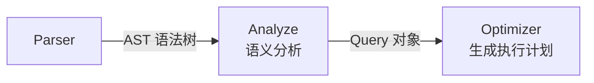
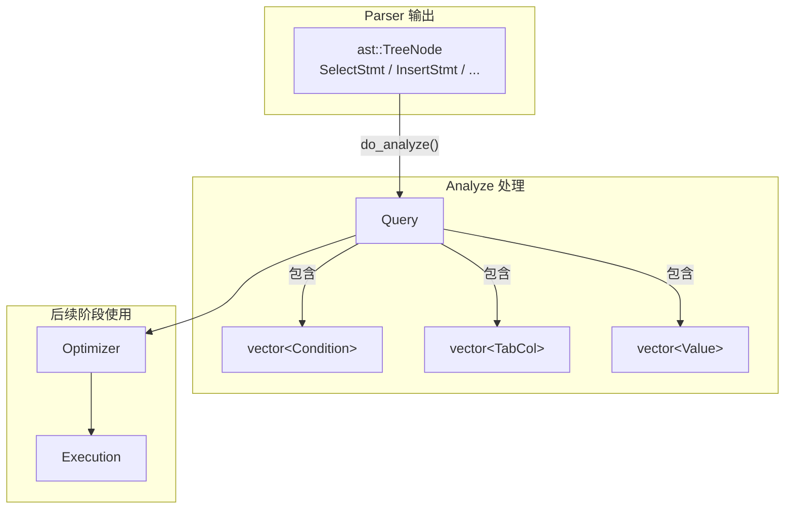

# 分析器 — 数据结构

## Analyze 在流水线中的位置

Analyze 是查询处理流水线的第二阶段，负责对 Parser 输出的 AST 做语义分析。



**含义**：Analyze（分析器）是语义分析阶段——检查 SQL 中引用的表、列、函数是否真实存在，把 AST 中的名字解析为实际的元数据引用。

**作用**：Parser 只管语法（结构对不对），不管语义（内容对不对）。比如 `SELECT abc FROM xyz` 语法上完全正确，但 `xyz` 表可能不存在，`abc` 列也可能不存在。Analyze 负责做这些检查。

**场景**：`rmdb.cpp` 中，`yyparse()` 返回 AST 后，立即调用 `analyze->do_analyze(parse_tree)` 得到 `Query` 对象，再交给 Optimizer。

## 核心数据结构

在深入 `do_analyze()` 之前，先理解 Analyze 用到的关键数据结构。

### 数据流转总览



### Query

**含义**：`Query`（`src/analyze/analyze.h:23-60`）是 Analyze 的输出——一个结构化的查询描述对象。

**作用**：把 AST 中的信息转换为后续阶段（Optimizer、Execution）可以直接使用的格式——列有明确的类型偏移量、条件有明确的比较语义。

```
Query
├── parse: shared_ptr<ast::TreeNode>    -- 保留原始 AST 引用
├── tables: vector<string>              -- FROM 子句中的表名
├── cols: vector<TabCol>                -- 投影列（带表名.列名）
├── agg_types: vector<AggType>          -- 每列的聚合类型
├── alias: vector<string>               -- 每列的别名
├── conds: vector<Condition>            -- WHERE 条件
├── group_bys: vector<TabCol>           -- GROUP BY 列
├── havings: vector<Condition>          -- HAVING 条件
├── sort_bys: TabCol                    -- ORDER BY 列
├── asc: bool                           -- 排序方向
├── limit: int                          -- LIMIT 值
├── set_clauses: vector<SetClause>      -- UPDATE 的 SET 子句
└── values: vector<Value>               -- INSERT 的值列表
```

**示例**：`SELECT name, MAX(score) FROM student WHERE age > 18 GROUP BY name`

```
Query
├── tables: ["student"]
├── cols: [TabCol("student","name"), TabCol("student","score")]
├── agg_types: [AGG_COL, AGG_MAX]
├── alias: ["", "MAX(score)"]
├── conds: [Condition(lhs=age, op=GT, rhs=Int(18))]
├── group_bys: [TabCol("student","name")]
└── havings: []
```

### TabCol

**含义**：`TabCol`（`src/common/common.h:31-43`）表示"哪张表的哪一列"。

```
TabCol
├── tab_name: string  -- 表名（如 "student"）
└── col_name: string  -- 列名（如 "age"）
```

**作用**：在 AST 中，列引用可能没有表名（用户写 `age` 而不是 `student.age`）。Analyze 会把表名补全，让后续阶段明确知道每列来自哪张表。

### Condition

**含义**：`Condition`（`src/common/common.h:168-215`）表示一条比较条件，是 WHERE 和 HAVING 子句的基本组成单元。

```
Condition
├── agg_type: AggType           -- 聚合类型（WHERE 条件为 AGG_COL）
├── lhs_col: TabCol             -- 左侧列
├── op: CompOp                  -- 比较运算符（EQ/NE/LT/GT/LE/GE/IN）
├── is_rhs_val: bool            -- 右侧是值？
├── is_sub_query: bool          -- 右侧是子查询？
├── rhs_col: TabCol             -- 右侧列（如果右侧是列）
├── rhs_val: Value              -- 右侧值（如果右侧是值）
├── rhs_value_list: vector<Value> -- 值列表（用于 IN 子句）
└── sub_query: shared_ptr<Query>  -- 子查询（如果右侧是子查询）
```

**lhs/rhs 术语**：`lhs` 是 left-hand side（左侧），`rhs` 是 right-hand side（右侧）。在一条条件 `age > 18` 中，`lhs` 指向列 `age`，`rhs` 指向值 `18`。所有条件中 `lhs` 永远是列引用，`rhs` 根据条件类型可以是值、列、子查询或值列表。

右侧有四种可能的类型:
- 值（`is_rhs_val = true`）
- 列（`is_rhs_val = false`，通过 `rhs_col` 引用）
- 子查询（`is_sub_query = true`，通过 `sub_query` 引用）
- 值列表（`is_sub_query = true`，通过 `rhs_value_list` 引用）。

**示例**：

| SQL 条件 | Condition 各字段 |
|---------|-----------------|
| `age > 18` | `lhs_col=age`, `op=GT`, `is_rhs_val=true`, `rhs_val=Int(18)` |
| `t1.id = t2.id` | `lhs_col=t1.id`, `op=EQ`, `is_rhs_val=false`, `rhs_col=t2.id` |
| `id IN (1, 2, 3)` | `lhs_col=id`, `op=IN`, `is_sub_query=true`, `rhs_value_list=[1,2,3]` |
| `score > (SELECT AVG(score) FROM student)` | `lhs_col=score`, `op=GT`, `is_sub_query=true`, `sub_query=Query(...)` |

### Value

**含义**：`Value`（`src/common/common.h:45-164`）是 SQL 字面量在程序中的表示——把 `18`、`3.14`、`'Tom'` 这类字面量包装成一个对象，里面既存了"这个值是整数 18"的信息，又存了"整数 18 在计算机里实际长什么样"的信息。

#### 回顾：记录在计算机里是怎么存的

上面讲的 `Condition` 里，`rhs_val` 的值要和表中记录的列值做比较。要理解 `Value` 为什么这样设计，先要回顾记录在计算机里到底长什么样。

在[记录层的讲解](../02-record-layer/02-record-data-structures.md)中学过，一条记录是一个 `RmRecord`：

```cpp
struct RmRecord {
    char* data;   // 一块连续内存
    int size;     // 内存的长度（字节数）
};
```

`data` 是 `char*` 类型，指向一块连续内存。**计算机里的一切数据本质上都是一串数字**——每个字节（byte）就是一个 0 到 255 的数字。`char*` 的意思不是"字符串"，而是"一块内存，按字节解读"。

**示例**：student 表有三列 `id INT, name CHAR(20), age INT`，一条记录长 28 字节。

这 28 个字节在内存里是这样排列的：

```
第 0 字节到第 3 字节（4 字节）: id 的值
第 4 字节到第 23 字节（20 字节）: name 的值
第 24 字节到第 27 字节（4 字节）: age 的值
```

每个列的值按它的类型用特定格式存在对应位置：

| 类型 | 存储方式 | 占多少字节 |
|------|---------|-----------|
| INT | 整数转成二进制存 | 4 字节 |
| FLOAT | 小数转成 IEEE 754 二进制格式存 | 4 字节 |
| STRING | 每个字符的 ASCII 码依次存，不够长的位置填 0 | 由列定义决定 |

**具体例子**：插入一条记录 `id=1, name='Tom', age=18`，这 28 个字节的内容（用十六进制表示，每两位是一个字节）：

```
id (4字节):     01 00 00 00    ← 十进制 1 的二进制（小端序）
name (20字节):  54 6F 6D 00 00 00 00 00 00 00 00 00 00 00 00 00 00 00 00 00
                'T''o''m'        ← 后面 17 个字节全是 00
age (4字节):    12 00 00 00    ← 十进制 18 的二进制 = 十六进制 0x12（小端序）
```

> 注意：`01 00 00 00` 之间加空格只是方便阅读，**实际内存里这些字节是紧挨着排的**，没有任何标点符号。

这个 28 字节的 `RmRecord` 存在磁盘页面的 slot 槽位里（见[记录页面布局](../02-record-layer/03-record-page-layout.md)）。

#### 现在回到 Value

`WHERE age > 18` 要比较两样东西：**记录中 age 列的 4 个字节** 和 **常量 18 的 4 个字节**。

记录的字节已经存在 `RmRecord` 里了。但 18 呢？AST 里的 `IntLit(18)` 只是一个 C++ 整数 `int_val = 18`，不是 4 个排好的字节。

`Value` 的设计就是为了解决这个问题——**同一个值，同时保留两种形态**：
- **"18 是一个整数"**：`int_val = 18`，用于 Analyze 阶段做类型检查
- **"18 转成 4 个字节"**：`raw.data = [12, 00, 00, 00]`，用于执行阶段做字节比较

#### 数据结构

```cpp
// src/common/common.h:45-54
struct Value {
    ColType type;            // 记录这是什么类型：INT / FLOAT / STRING
    union {
        int int_val;         // INT 的值（如 18）
        float float_val;     // FLOAT 的值（如 85.5）
    };
    std::string str_val;     // STRING 的值（如 "Tom"）
    std::shared_ptr<RmRecord> raw;  // 值转成字节后的形态
};
```

**各字段做什么**：

`type` 取值为 `TYPE_INT`、`TYPE_FLOAT`、`TYPE_STRING` 之一（`src/defs.h:44`）。它告诉你"这个值是什么类型"，后面做类型检查时用——比如 `WHERE float_col = 1`，可以判断"左 FLOAT 右 INT，INT 可以自动转 FLOAT，合法"。

`union { int_val; float_val; }` —— union 的意思是这两个字段**共享同一块内存**，同一时刻只有一个有效。因为一个 Value 要么存 INT 要么存 FLOAT，不会同时是两样。

`str_val` —— STRING 类型的值存这里。它没有放在 union 里，因为 C++ 的 `string` 是复杂类型（自带内存管理），不能和 int/float 这种简单类型放同一个 union。

`raw` —— 就是一个指向 `RmRecord` 的指针。`RmRecord` 在记录层已经学过了，就是 `char* data` + `int size`。这个 `raw` 存的是"值转成字节后的样子"，格式和记录中列的存储格式完全一样。

#### init_raw：把值转成字节

Analyze 做完类型检查后，调用 `init_raw()` 把值转成字节形态：

```cpp
// src/common/common.h:133-148
void init_raw(int len) {
    raw = std::make_shared<RmRecord>(len);  // 分配 len 个字节的空间
    if (type == TYPE_INT) {
        *(int*)(raw->data) = int_val;       // 把 int_val 的 4 字节拷到 raw.data
    } else if (type == TYPE_FLOAT) {
        *(float*)(raw->data) = float_val;   // 把 float_val 的 4 字节拷到 raw.data
    } else if (type == TYPE_STRING) {
        memset(raw->data, 0, len);          // 先全填 0
        memcpy(raw->data, str_val.c_str(),  // 把字符串内容拷进去
               str_val.size());
    }
}
```

`len` 是值的长度（字节数），从列元数据获取——列定义为 INT 则 len=4，定义为 CHAR(10) 则 len=10。

#### 具体例子

**INT 示例**：`WHERE age > 18`

```
analyze.do_analyze() 处理：
  1. Parser 产生 IntLit(val=18)，即 AST 节点记录"语法上这是整数 18"
  2. convert_sv_value() 创建 Value：
       type = TYPE_INT
       int_val = 18          ← "18 是一个整数"的形态
       raw = nullptr         ← 字节形态还没生成
  3. check_clause() 验证：age 列是 INT，Value 也是 INT → 类型兼容 ✓
  4. 调用 rhs_val.init_raw(4)：
       分配 4 字节内存
       把 int_val=18 拷进去 → raw.data 指向 [12, 00, 00, 00]
       
raw.data 这 4 个字节（十六进制）：
  字节 0: 0x12    ← 十进制 18 = 十六进制 0x12
  字节 1: 0x00    ← 高位补零（小端序存储）
  字节 2: 0x00
  字节 3: 0x00

执行层比较时：
  从记录第 24 字节（age 列偏移量）取 4 字节
  和 raw.data 的 4 字节逐字节比较
  → memcmp(record_data+24, raw.data, 4)
```

**STRING 示例**：`WHERE name = 'Tom'`，name 列定义为 CHAR(10)

```
处理：
  1. Parser 产生 StringLit("Tom")
  2. convert_sv_value() 创建 Value：
       type = TYPE_STRING
       str_val = "Tom"       ← "Tom 是一个字符串"的形态
       raw = nullptr
  3. check_clause() 验证类型兼容
  4. 调用 init_raw(10)：
       分配 10 字节，全填 0
       把 "Tom" 三个字符的 ASCII 码写到前 3 字节
       → raw.data 指向 [54, 6F, 6D, 00, 00, 00, 00, 00, 00, 00, 00]
         (0x54='T', 0x6F='o', 0x6D='m', 后面全是 0x00)
```

> 注意：54 6F 6D 00 00 这个写法只是为了方便看，**实际 `raw.data` 里就是连续 10 个字节**，没有空格或逗号。和上面记录存储格式中的 name 列字节完全一致。

#### 为什么需要两套信息

Analyze 阶段需要类型信息（"这是 INT 还是 FLOAT"）来做类型兼容性检查，比如判断 INT 能不能赋给 FLOAT 列。

执行层的算子做 `WHERE age > 18` 时，拿到的是记录的一串字节。它不需要知道"age 列是 INT"，只需要把记录中 age 偏移量处的 4 个字节，和 `raw.data` 的 4 个字节，逐字节比较谁大谁小。

`Value` 同时存了两套信息，让每个阶段各取所需。

下一节：[03b-analyze-processing-flow.md](./03b-analyze-processing-flow.md)
