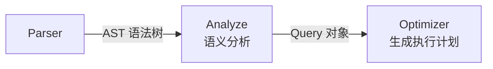
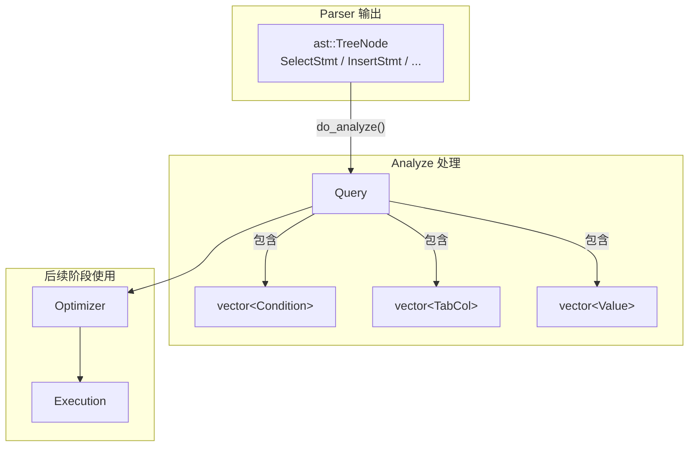

# 分析器 — 数据结构

## Analyze 在流水线中的位置

Analyze 是查询处理流水线的第二阶段，负责对 Parser 输出的 AST 做语义分析。



**含义**：Analyze（分析器）是语义分析阶段——检查 SQL 中引用的表、列、函数是否真实存在，把 AST 中的名字解析为实际的元数据引用。

**作用**：Parser 只管语法（结构对不对），不管语义（内容对不对）。比如 `SELECT abc FROM xyz` 语法上完全正确，但 `xyz` 表可能不存在，`abc` 列也可能不存在。Analyze 负责做这些检查。

**场景**：`rmdb.cpp` 中，`yyparse()` 返回 AST 后，立即调用 `analyze->do_analyze(parse_tree)` 得到 `Query` 对象，再交给 Optimizer。

## 核心数据结构

在深入 `do_analyze()` 之前，先理解 Analyze 用到的关键数据结构。

### 数据流转总览



### Query

**含义**：`Query`（`src/analyze/analyze.h:23-60`）是 Analyze 的输出——一个结构化的查询描述对象。

**作用**：把 AST 中的信息转换为后续阶段（Optimizer、Execution）可以直接使用的格式——列有明确的类型偏移量、条件有明确的比较语义。

```
Query
├── parse: shared_ptr<ast::TreeNode>    -- 保留原始 AST 引用
├── tables: vector<string>              -- FROM 子句中的表名
├── cols: vector<TabCol>                -- 投影列（带表名.列名）
├── agg_types: vector<AggType>          -- 每列的聚合类型
├── alias: vector<string>               -- 每列的别名
├── conds: vector<Condition>            -- WHERE 条件
├── group_bys: vector<TabCol>           -- GROUP BY 列
├── havings: vector<Condition>          -- HAVING 条件
├── sort_bys: TabCol                    -- ORDER BY 列
├── asc: bool                           -- 排序方向
├── limit: int                          -- LIMIT 值
├── set_clauses: vector<SetClause>      -- UPDATE 的 SET 子句
└── values: vector<Value>               -- INSERT 的值列表
```

**示例**：`SELECT name, MAX(score) FROM student WHERE age > 18 GROUP BY name`

```
Query
├── tables: ["student"]
├── cols: [TabCol("student","name"), TabCol("student","score")]
├── agg_types: [AGG_COL, AGG_MAX]
├── alias: ["", "MAX(score)"]
├── conds: [Condition(lhs=age, op=GT, rhs=Int(18))]
├── group_bys: [TabCol("student","name")]
└── havings: []
```

### TabCol

**含义**：`TabCol`（`src/common/common.h:31-43`）表示"哪张表的哪一列"。

```
TabCol
├── tab_name: string  -- 表名（如 "student"）
└── col_name: string  -- 列名（如 "age"）
```

**作用**：在 AST 中，列引用可能没有表名（用户写 `age` 而不是 `student.age`）。Analyze 会把表名补全，让后续阶段明确知道每列来自哪张表。

### Condition

**含义**：`Condition`（`src/common/common.h:168-215`）表示一条比较条件，是 WHERE 和 HAVING 子句的基本组成单元。

```
Condition
├── agg_type: AggType           -- 聚合类型（WHERE 条件为 AGG_COL）
├── lhs_col: TabCol             -- 左侧列
├── op: CompOp                  -- 比较运算符（EQ/NE/LT/GT/LE/GE/IN）
├── is_rhs_val: bool            -- 右侧是值？
├── is_sub_query: bool          -- 右侧是子查询？
├── rhs_col: TabCol             -- 右侧列（如果右侧是列）
├── rhs_val: Value              -- 右侧值（如果右侧是值）
├── rhs_value_list: vector<Value> -- 值列表（用于 IN 子句）
└── sub_query: shared_ptr<Query>  -- 子查询（如果右侧是子查询）
```

**lhs/rhs 术语**：`lhs` 是 left-hand side（左侧），`rhs` 是 right-hand side（右侧）。在一条条件 `age > 18` 中，`lhs` 指向列 `age`，`rhs` 指向值 `18`。所有条件中 `lhs` 永远是列引用，`rhs` 根据条件类型可以是值、列、子查询或值列表。

右侧有四种可能的类型:
- 值（`is_rhs_val = true`）
- 列（`is_rhs_val = false`，通过 `rhs_col` 引用）
- 子查询（`is_sub_query = true`，通过 `sub_query` 引用）
- 值列表（`is_sub_query = true`，通过 `rhs_value_list` 引用）。

**示例**：

| SQL 条件 | Condition 各字段 |
|---------|-----------------|
| `age > 18` | `lhs_col=age`, `op=GT`, `is_rhs_val=true`, `rhs_val=Int(18)` |
| `t1.id = t2.id` | `lhs_col=t1.id`, `op=EQ`, `is_rhs_val=false`, `rhs_col=t2.id` |
| `id IN (1, 2, 3)` | `lhs_col=id`, `op=IN`, `is_sub_query=true`, `rhs_value_list=[1,2,3]` |
| `score > (SELECT AVG(score) FROM student)` | `lhs_col=score`, `op=GT`, `is_sub_query=true`, `sub_query=Query(...)` |

### Value

**含义**：`Value`（`src/common/common.h:45-164`）是 SQL 字面量在程序中的表示——把 `18`、`3.14`、`'Tom'` 这类字面量包装成一个对象。

#### 数据结构

```cpp
// src/common/common.h:45-54
struct Value {
    ColType type;            // 值的类型：TYPE_INT / TYPE_FLOAT / TYPE_STRING
    union {
        int int_val;         // INT 的值（如 18）
        float float_val;     // FLOAT 的值（如 85.5）
    };
    std::string str_val;     // STRING 的值（如 "Tom"）
    std::shared_ptr<RmRecord> raw;  // 值转成字节后的形态
};
```

**各字段做什么**：

`type` 取值为 `TYPE_INT`、`TYPE_FLOAT`、`TYPE_STRING` 之一（`src/defs.h:44`）。在做类型检查时用——比如 `WHERE float_col = 1`，Analyze 判断"左 FLOAT 右 INT，INT 可以自动转 FLOAT，合法"。

`union { int_val; float_val; }` —— union 的意思是两个字段**共享同一块内存**，同一时刻只有一个有效。因为一个 Value 要么存 INT 要么存 FLOAT，不会同时是两样。

`str_val` —— STRING 类型用这个字段存。它单独放在 union 外面，因为 C++ 的 `string` 自带内存管理，不能和 int/float 放同一个 union。

`raw` —— 指向一个 `RmRecord`（`char* data` + `int size`，记录层学过）。**这个字段初看有点奇怪——明明已经有 `int_val` / `str_val` 了，为什么还要一个 `raw`？** 下面详细解释。

#### 为什么需要 raw

`Value` 出现在 `Condition` 的 `rhs_val` 字段里，比如 `WHERE age > 18`，`rhs_val` 存的就是 `18`。

Analyze 阶段用 `int_val = 18` 做类型检查——知道它是 INT，就可以和 age 列的类型比对是否兼容。

但到了执行层，情况变了。执行层的 SeqScanExecutor 扫描 student 表时，读到的每条记录是一串字节（`RmRecord`）。记录中 age 列占 4 个字节，在记录的某个偏移量位置。比较 `age > 18` 时，执行层直接拿记录中 age 位置的 4 个字节，和另一个 4 字节做 `memcmp` 逐字节比较。

问题来了：`int_val = 18` 是一个 C++ 整数变量，它不是"排好的 4 个字节"。执行层没法直接用 `int_val` 和记录中的字节做比较。

`raw` 就是解决这个问题的——`init_raw()` 把 `int_val = 18` 转成和记录中完全一样的 4 字节格式，存在 `raw.data` 里。执行层拿到 `raw.data` 的 4 个字节，直接和记录中 age 列的 4 个字节 `memcmp`。

**简单说**：`int_val` 是给人（Analyze）看的，"这个值是整数 18"。`raw` 是给机器（Executor）看的，"18 在内存里是这 4 个字节"。

> 记录为什么存成字节、`RmRecord` 是什么，在[记录层](../02-record-layer/02-record-data-structures.md)已经学过。这里只需要知道：表中的记录存的就是一串连续字节。

**不能直接拿 int 和记录里的字节比较吗？**

理论上可以。如果执行层知道 age 列是 INT，完全可以这样做：

```cpp
int record_age = *(int*)(record_data + age_offset);  // 从记录字节中读出 int
if (record_age > cond.rhs_val.int_val) { ... }       // 直接拿 C++ int 比较
```

但 RMDB 故意不走这条路。原因是**让执行层完全不关心类型**：

- 记录里有 INT、FLOAT、STRING 各种列，如果每种类型都要写专门的比较逻辑，每个 Executor（SeqScan、IndexScan、Join...）里都会充斥类型判断的 `switch-case`
- 反过来，如果所有值都统一转成字节，执行层就只需要一种操作：`memcmp(字节A, 字节B, 长度)`。不管底层是 INT 还是 STRING，比较方式完全一样

**类型认知被集中到了 Analyze 阶段**。Analyze 通过 `init_raw()` 把 `int_val=18` 转成 4 字节、把 `str_val="Tom"` 转成 10 字节——之后执行层再也不用管"这是什么类型"，它只看到两串字节，`memcmp` 一下就行。

#### init_raw：把值转成字节

Analyze 做完类型检查后，调用 `init_raw()` 填好 `raw`：

```cpp
// src/common/common.h:133-148
void init_raw(int len) {
    raw = std::make_shared<RmRecord>(len);  // 分配 len 个字节的空间
    if (type == TYPE_INT) {
        *(int*)(raw->data) = int_val;       // 把 int_val 的 4 字节拷到 raw.data
    } else if (type == TYPE_FLOAT) {
        *(float*)(raw->data) = float_val;   // 把 float_val 的 4 字节拷到 raw.data
    } else if (type == TYPE_STRING) {
        memset(raw->data, 0, len);          // 先全填 0
        memcpy(raw->data, str_val.c_str(),  // 把字符串内容拷进去
               str_val.size());
    }
}
```

`len` 从列元数据获取——列定义为 INT 则 len=4，定义为 CHAR(10) 则 len=10。

#### 具体例子

**INT**：`WHERE age > 18`

```
1. Parser 产生 IntLit(val=18)
2. convert_sv_value() 创建 Value：
     type = TYPE_INT
     int_val = 18
     raw = nullptr
3. check_clause() 验证类型兼容，调用 rhs_val.init_raw(4)
4. init_raw 分配 4 字节，把 int_val=18 拷进去
     → raw.data = [0x12, 0x00, 0x00, 0x00]（小端序）
5. 执行层：memcmp(record 中 age 偏移量处 4 字节, raw.data, 4)
```

**STRING**：`WHERE name = 'Tom'`，name 列 CHAR(10)

```
1. Parser 产生 StringLit("Tom")
2. convert_sv_value() 创建 Value：
     type = TYPE_STRING
     str_val = "Tom"
     raw = nullptr
3. check_clause() 验证，调用 init_raw(10)
4. init_raw 分配 10 字节，全填 0，把 "Tom" 的 ASCII 码拷到前 3 字节
     → raw.data = [0x54, 0x6F, 0x6D, 0x00, 0x00, 0x00, 0x00, 0x00, 0x00, 0x00]
5. 执行层：memcmp(record 中 name 偏移量处 10 字节, raw.data, 10)
```

下一节：[03b-analyze-processing-flow.md](./03b-analyze-processing-flow.md)
