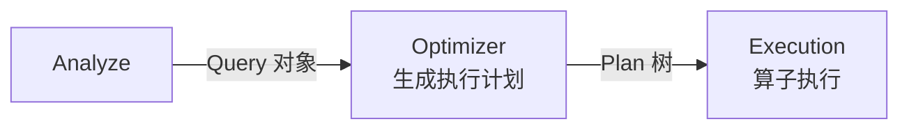
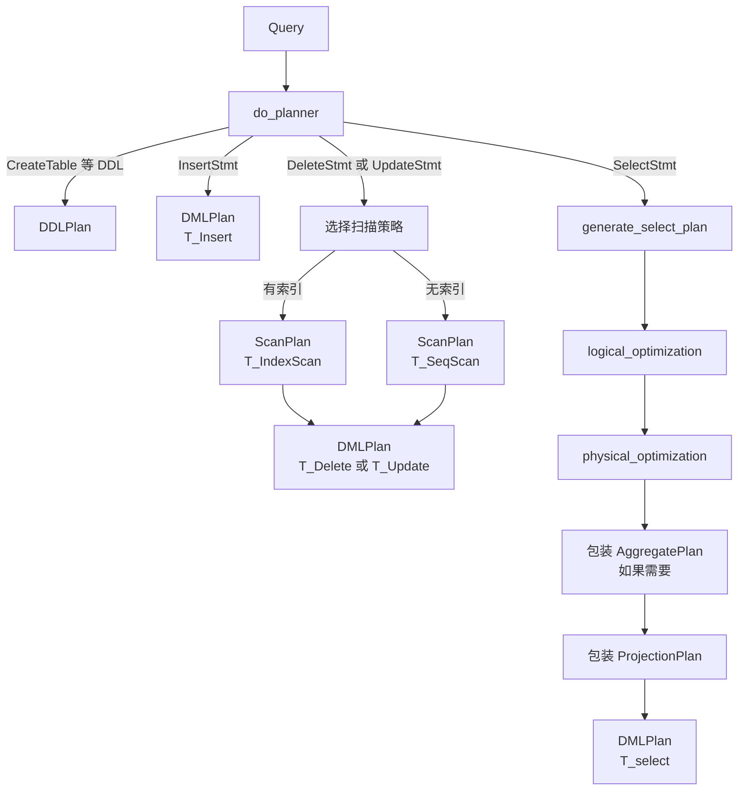

# 优化器

## Optimizer 在流水线中的位置

Optimizer 是查询处理流水线的第三阶段，负责把语义验证后的 Query 对象转换为可执行的 Plan 树。



**含义**：Optimizer（优化器）是查询计划的生成器——把"要什么结果"变成"怎么高效地算出来"。

**作用**：Analyze 只验证了 SQL 的语义是否正确，但没有决定怎么执行。Optimizer 负责决策——用全表扫描还是索引扫描、多表连接的顺序、用什么连接算法。

**场景**：`rmdb.cpp` 中，`analyze->do_analyze()` 返回 Query 后，立即调用 `optimizer->plan_query(query, context)` 得到 Plan 树，再交给 Portal 转成 Executor 树并执行。

Optimizer 内部由两个类协作完成：

```
Optimizer（分发层）
  │
  └── Planner（核心规划）
        ├── logical_optimization()   逻辑优化
        ├── physical_optimization()  物理优化
        │     ├── make_one_rel()     扫描 + 连接
        │     └── generate_sort_plan()  排序
        └── 聚合 + 投影包装
```

## Optimizer 分发层

**含义**：`Optimizer::plan_query()`（`src/optimizer/optimizer.h:33`）是优化器的入口，负责对简单语句直接生成 Plan，复杂语句委托给 Planner。

**作用**：一些 SQL 语句不需要"优化"——比如 `SHOW TABLES`、`BEGIN`、`COMMIT` 等，直接创建对应的 Plan 节点即可，不需要走 Planner 的完整流程。

```cpp
// src/optimizer/optimizer.h:33-72
std::shared_ptr<Plan> plan_query(std::shared_ptr<Query>& query,
                                 Context* context) {
    if (auto x = dynamic_pointer_cast<ast::Help>(query->parse)) {
        return std::make_shared<OtherPlan>(T_Help, std::string());
    }
    if (auto x = dynamic_pointer_cast<ast::ShowTables>(query->parse)) {
        return std::make_shared<OtherPlan>(T_ShowTable, "");
    }
    // ... TxnBegin, TxnCommit, TxnAbort, TxnRollback ...
    if (auto x = dynamic_pointer_cast<ast::SetStmt>(query->parse)) {
        return std::make_shared<SetKnobPlan>(x->set_knob_type_, x->bool_val_);
    }
    // 以上都不是 → 委托给 Planner
    return planner_->do_planner(query, context);
}
```

**含义**：`Optimizer` 自己处理了 `Help`、`ShowTables`、`ShowIndexs`、`DescTable`、事务语句、`SetStmt` 这 8 种简单语句，其他所有语句（SELECT、INSERT、UPDATE、DELETE、DDL）都交给 `Planner::do_planner()`。

## Planner 入口

**含义**：`Planner::do_planner()`（`src/optimizer/planner.cpp:600-718`）是计划生成的核心入口，根据语句类型分发到不同的计划生成逻辑。

**作用**：DDL 生成 `DDLPlan`，INSERT 生成 `DMLPlan(T_Insert)`，DELETE/UPDATE 选择扫描策略后生成 `DMLPlan`，SELECT 走完整的 `generate_select_plan()` 流程。



## SELECT 计划生成

SELECT 是最复杂的路径，由 `generate_select_plan()`（`src/optimizer/planner.cpp:565`）统筹，按以下顺序执行：

```
逻辑优化 → 物理优化 → 包装聚合 → 包装投影
```

### 逻辑优化

**含义**：逻辑优化在不改变查询语义的前提下改写查询条件，让后续的物理优化更有效。

**作用**：RMDB 当前实现了一条规则——**常量传播**。

```cpp
// src/optimizer/planner.cpp:240-266
std::shared_ptr<Query> Planner::logical_optimization(
    std::shared_ptr<Query>& query, Context* context) {
    // 收集 col = 常量 的映射
    std::unordered_map<TabCol, Value> map;
    for (auto& cond : query->conds) {
        if (cond.is_rhs_val) {
            map.emplace(cond.lhs_col, cond.rhs_val);
        }
    }
    // 传播：如果 rhs_col 有对应的常量值，替换之
    for (auto& cond : query->conds) {
        if (!cond.is_rhs_val && !cond.is_sub_query) {
            auto it = map.find(cond.rhs_col);
            if (it != map.end()) {
                cond.is_rhs_val = true;
                cond.rhs_val = std::move(it->second);
            }
        }
    }
    return query;
}
```

**示例**：
```
优化前: WHERE w_id = 5 AND c_w_id = w_id
优化后: WHERE w_id = 5 AND c_w_id = 5
```

**含义**：第一条条件建立了 `w_id → 5` 的映射。第二条条件 `c_w_id = w_id` 的右侧是列 `w_id`，查映射发现它等于 5，于是改写为 `c_w_id = 5`。

**作用**：改写后 `c_w_id = 5` 变成了"列=常量"的形式，可以被索引匹配利用。

### 物理优化

**含义**：物理优化确定具体的执行方式——每张表怎么扫描、多表怎么连接。

**作用**：`physical_optimization()`（`src/optimizer/planner.cpp:268`）调用 `make_one_rel()` 构建扫描和连接计划，再用 `generate_sort_plan()` 处理排序。

```cpp
// src/optimizer/planner.cpp:268-277
std::shared_ptr<Plan> Planner::physical_optimization(
    std::shared_ptr<Query>& query, Context* context) {
    std::shared_ptr<Plan> plan = make_one_rel(query, context);
    plan = generate_sort_plan(query, plan);
    return plan;
}
```

#### make_one_rel：扫描与连接

**含义**：`make_one_rel()`（`src/optimizer/planner.cpp:280`）是物理优化中最核心的函数。它做三件事——为每张表选择扫描方式、决定多表连接顺序、选择连接算法。

**第 1 步：为每张表生成 ScanPlan**

```cpp
// src/optimizer/planner.cpp:283-329（简化）
for (auto& table : query->tables) {
    // 从全局条件中提取只涉及这张表的条件
    std::vector<Condition> curr_conds;
    pop_conds(query->conds, table, curr_conds, context);

    // 尝试匹配索引
    std::vector<std::string> index_col_names;
    if (get_index_cols(table, curr_conds, index_col_names)) {
        // 匹配成功 → 索引扫描
        plan = ScanPlan(T_IndexScan, sm_manager_, table, curr_conds,
                        index_col_names);
    } else {
        // 匹配失败 → 全表扫描
        plan = ScanPlan(T_SeqScan, sm_manager_, table, curr_conds);
    }
}
```

**含义**：`pop_conds()` 从全局条件列表中提取只涉及指定表的条件（`col = value` 形式）。

**作用**：`get_index_cols()` 判断是否有索引能加速这些条件的查找，有就用 IndexScan，没有就用 SeqScan。

**第 2 步：连接排序**

对于多表查询，Planner 采用**贪心策略**构建左深连接树：

1. 找到第一个连接条件（涉及两张不同表的条件），为左右两侧各创建一个 ScanPlan。
2. 检查连接列上是否有可用索引，有的话把 SeqScan 升级为 IndexScan。
3. 尝试"排序吸收"——如果查询有 ORDER BY 且排序列恰好是连接列，在扫描之上提前插入 SortPlan。
4. 选择连接方法——根据 `enable_nestloop_join` / `enable_sortmerge_join` 标志决定用 NestLoop 还是 SortMerge。
5. 剩余条件按出现顺序逐个连接到树上。
6. 没有通过条件关联的表以笛卡尔积方式连接。

**含义**：连接排序是启发式的、没有成本模型的——按照 WHERE 条件出现的顺序贪心构建，不比较不同连接顺序的代价。

#### 索引选择算法

**含义**：`get_index_cols()`（`src/optimizer/planner.cpp:21`）决定了"用哪个索引"。

**作用**：不是简单地看"有没有索引覆盖所有条件"，而是做**最长前缀匹配 + 等号计数决胜**。

```cpp
// src/optimizer/planner.cpp:21-149（算法核心）
bool Planner::get_index_cols(std::string& tab_name,
                             std::vector<Condition>& curr_conds,
                             std::vector<std::string>& index_col_names) {
    // 1. 构建辅助结构：去重的列名集合、列名到条件的映射
    // 2. 遍历表上的所有索引
    for (auto& [index_name, index] : tab.indexes) {
        // 按索引列顺序做最长前缀匹配
        for (auto& [_, col] : index.cols) {
            if (条件集中有这一列) {
                cur_len++;
                if (该列条件是 OP_EQ) cur_equals++;
            } else {
                break;  // 前缀中断，停止
            }
        }
        // 决胜规则
        if (cur_len == curr_conds.size()) {
            // 完全覆盖：选等号条件最多的索引
            if (cur_equals > max_equals) 选择此索引;
        } else if (cur_len > max_len) {
            // 部分覆盖：选前缀最长的索引
            选择此索引;
        }
    }
    // 3. 重排条件：索引列在前，非索引列在后
}
```

**示例**：

| 查询条件 | 可用索引 | 选择结果 | 原因 |
|---------|---------|---------|------|
| `a=1 AND b=1 AND c=1` | `ix(a,b,c)` `ix(a,b)` | `ix(a,b,c)` | 完全覆盖且等号更多 |
| `a=1 AND b>2 AND c=1` | `ix(a,b)` `ix(a,b,c)` | `ix(a,b,c)` | 完全覆盖且等号更多 |
| `a=1 AND b=1 AND d<5` | `ix(a,b,c)` | `ix(a,b,c)` | 前缀匹配 a,b（2 列），比不用索引好 |

#### 连接方法选择

**含义**：Planner 支持两种物理连接算法——NestedLoopJoin（嵌套循环连接）和 SortMergeJoin（排序归并连接），通过运行时 knob 切换。

```cpp
// src/optimizer/planner.cpp:437-468（简化）
if (enable_nestedloop_join && enable_sortmerge_join) {
    join_tag = T_NestLoop;    // 两者都开启，默认 NestLoop
} else if (enable_nestedloop_join) {
    join_tag = T_NestLoop;    // 仅 NestLoop
} else if (enable_sortmerge_join) {
    // 检查两侧是否已排序
    if (left->tag == T_Sort || left->tag == T_IndexScan ||
        right->tag == T_Sort || right->tag == T_IndexScan) {
        join_tag = T_SortMerge;  // 已排序 → SortMerge
    } else {
        join_tag = T_NestLoop;   // 未排序 → 回退 NestLoop
    }
}
```

**含义**：SortMerge 要求两侧输入已排序——如果两侧子节点是 SortExecutor 或 IndexScanExecutor（索引本身有序），则可以用 SortMerge；否则回退到 NestLoop。

**场景**：运行时通过 `SET enable_nestloop` 和 `SET enable_sortmerge` 切换。

#### 排序计划

**含义**：`generate_sort_plan()`（`src/optimizer/planner.cpp:539`）处理 ORDER BY 子句。

```cpp
// src/optimizer/planner.cpp:539-563
std::shared_ptr<Plan> Planner::generate_sort_plan(
    std::shared_ptr<Query>& query, std::shared_ptr<Plan>& plan) {
    if (!x->has_sort) return plan;
    return std::make_shared<SortPlan>(T_Sort, plan, query->sort_bys,
                                       !query->asc);
}
```

**含义**：如果查询没有 ORDER BY，直接返回当前计划。如果有，在计划树顶部包装一个 `SortPlan` 节点。

### 聚合包装

```cpp
// 在 generate_select_plan() 中（src/optimizer/planner.cpp:580-588）
if (!query->group_bys.empty() ||
    存在 agg_type != AGG_COL) {
    plan = std::make_shared<AggregatePlan>(T_Aggregate, plan,
        query->cols, query->agg_types,
        query->group_bys, query->havings);
}
```

**含义**：如果查询有 GROUP BY 或聚合函数，在物理计划之上包装 `AggregatePlan`。

**聚合优化特例**：在 `make_one_rel()` 阶段，如果所有条件都被索引完全覆盖且只有一个 MIN 或 MAX 聚合，Planner 会将其改写为排序 + LIMIT 1：

```
SELECT MIN(score) FROM student WHERE class_id = 1
  ↓ 如果有索引 ix(class_id, score)
SELECT score FROM student WHERE class_id = 1 ORDER BY score ASC LIMIT 1
```

**含义**：利用索引的有序性——既然是 MIN，索引中第一条匹配记录就是最小值，不需要做完整的聚合运算。

### 投影包装

```cpp
// 在 generate_select_plan() 中（src/optimizer/planner.cpp:590-596）
plan = std::make_shared<ProjectionPlan>(T_Projection, plan,
    query->cols, query->alias, query->limit);
```

**含义**：投影始终是最顶层的节点——负责从下层产生的完整记录中选取需要的列、应用别名、限制行数。

## Plan 树结构总览

**含义**：Plan 树是执行计划的树形表示，根节点是语句类型（DMLPlan 或 DDLPlan），内部节点是各种处理操作（投影、聚合、排序、连接），叶子节点是数据来源（表扫描）。

一条 `SELECT name FROM student WHERE age > 18 ORDER BY name` 生成的 Plan 树：

```
DMLPlan(T_select)
  └── ProjectionPlan
      ├── sel_cols: [TabCol("student","name")]
      ├── alias: [""]
      └── subplan: SortPlan
            ├── sel_col: TabCol("student","name")
            └── subplan: ScanPlan(T_SeqScan)
                  ├── tab_name: "student"
                  └── conds: [Condition(lhs=age, op=GT, rhs=18)]
```

**执行时的数据流**（自底向上）：
1. `ScanPlan` → SeqScanExecutor 扫描 student 表，过滤 age > 18
2. `SortPlan` → SortExecutor 对结果按 name 排序
3. `ProjectionPlan` → ProjectionExecutor 只保留 name 列

## Plan 节点速查

所有 Plan 节点类型定义在 `src/optimizer/plan.h:23-51`（`PlanTag` 枚举）和后续的各个子类中。

| Plan 节点 | PlanTag | 用途 |
|----------|---------|------|
| `ScanPlan` | `T_SeqScan` / `T_IndexScan` | 表扫描（叶子节点） |
| `JoinPlan` | `T_NestLoop` / `T_SortMerge` | 两表连接 |
| `SortPlan` | `T_Sort` | 排序 |
| `ProjectionPlan` | `T_Projection` | 列投影 + LIMIT |
| `AggregatePlan` | `T_Aggregate` | 聚合 + GROUP BY |
| `DMLPlan` | `T_Insert` / `T_Update` / `T_Delete` / `T_select` | DML 语句包装 |
| `DDLPlan` | `T_CreateTable` / `T_DropTable` / `T_CreateIndex` / `T_DropIndex` | DDL 语句 |
| `OtherPlan` | `T_Help` / `T_ShowTable` / `T_Transaction_begin` 等 | 工具/事务命令 |
| `SetKnobPlan` | `T_SetKnob` | 运行时开关设置 |
| `LoadPlan` | `T_Load` | 数据加载 |
| `StaticCheckpointPlan` | `T_CreateStaticCheckpoint` | 静态检查点 |

## 框架 TODO 对比

db2026-x 框架中，优化器模块的核心 TODO 集中在 Planner 上。

### TODO 1：逻辑优化为空

**位置**：`db2026-x/src/optimizer/planner.cpp:123`，标注 `//TODO 实现逻辑优化规则`。

**现状**：`logical_optimization()` 方法体是 `return query;`——不做任何优化，直接返回原查询。

**需要实现**：至少实现常量传播规则——将 `col = 常量` 的映射传播到 `col1 = col2` 这类条件中。

**参考实现**：`src/optimizer/planner.cpp:240-266`。

### TODO 2：索引匹配简化

**位置**：`db2026-x/src/optimizer/planner.cpp` 的 `get_index_cols()`。

**现状**：框架的索引匹配只处理"所有条件列都是 `col = value` 形式且完全匹配索引所有列"的情况，不支持最长前缀匹配和等号计数决胜。

**需要实现**：
- 最长前缀匹配（索引列不需要全部被覆盖，只要前缀匹配即可）
- 等号条件优先（多个候选索引时选等号条件最多的）
- 条件重排（将匹配索引的列放在前面）

**参考实现**：`src/optimizer/planner.cpp:21-149`。

### TODO 3：缺少高级优化

框架中缺失的优化能力：

| 优化 | 说明 |
|------|------|
| MIN/MAX 优化 | 用索引顺序 + LIMIT 1 替代聚合 |
| 排序吸收 | 如果排序列有索引，消除显式排序 |
| 连接索引优化 | 连接列上有索引时自动升级扫描方式 |
| 连接方法选择 | NestLoop vs SortMerge 运行时切换 |
| AggregatePlan | 框架中不存在聚合计划节点 |

## 小结

Optimizer 是查询计划的大脑，负责决策"怎么执行"。

**输入**：Analyze 输出的 `Query` 对象。

**输出**：Plan 树——根节点为 `DMLPlan` 或 `DDLPlan`，内部由 `ProjectionPlan`、`AggregatePlan`、`SortPlan`、`JoinPlan`、`ScanPlan` 等节点组成的树。

**核心职责**：
- 逻辑优化（常量传播）
- 为每张表选择扫描方式（SeqScan 还是 IndexScan）
- 决定多表连接顺序和连接算法
- 处理排序、聚合、投影

上一节：[03-analyze-detail.md](./03-analyze-detail.md) | 下一节：[05-execution-detail.md](./05-execution-detail.md)
