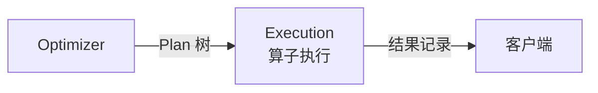
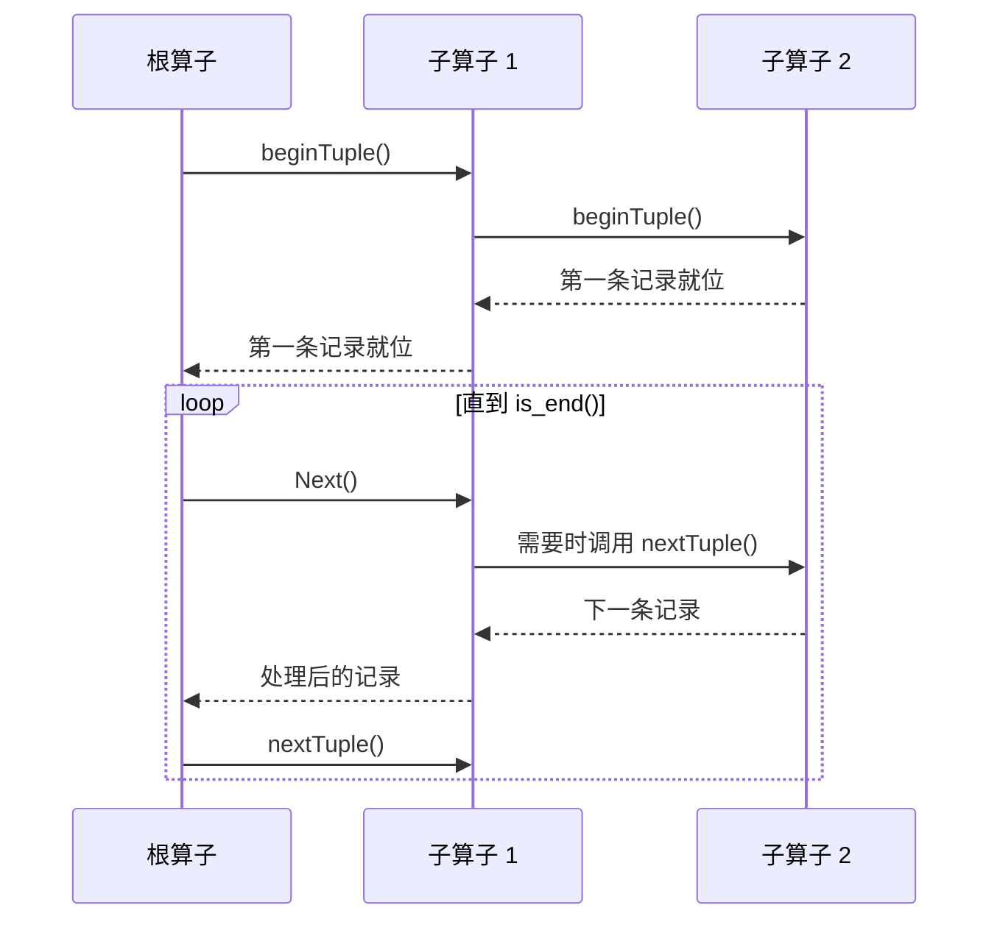

# 执行层

## Execution 在流水线中的位置

Execution 是查询处理流水线的第四阶段，负责执行 Optimizer 生成的 Plan 树，产生查询结果。



**含义**：Execution（执行层）是流水线的终点——Plan 树中描述"做什么操作"，执行层负责"具体怎么做"。

**作用**：Plan 树中的每个节点对应一个 Executor（算子），Executor 封装了该操作的具体算法（全表扫描怎么扫、连接怎么做、排序怎么排）。

**场景**：Portal 将 Plan 树转换为 Executor 树后，由 QlManager 驱动执行。

## Volcano 迭代器模型

**含义**：RMDB 的执行层采用 Volcano 风格的迭代器模型——所有算子统一实现 `beginTuple()` / `nextTuple()` / `Next()` / `is_end()` 四个方法，通过拉取方式形成流水线。

**作用**：统一接口让算子之间可以任意组合——上层算子不关心下层是 SeqScan 还是 IndexScan，只调用 `beginTuple()` / `nextTuple()` / `Next()`。

### AbstractExecutor 接口

**含义**：`AbstractExecutor`（`src/execution/executor_abstract.h:18-59`）是所有算子的基类，定义了 Volcano 迭代器的标准接口。

```cpp
// src/execution/executor_abstract.h:18-43
class AbstractExecutor {
public:
    virtual void beginTuple() {}           // 初始化，定位到第一条结果
    virtual void nextTuple() {}            // 前进到下一条结果
    virtual bool is_end() const { return true; }  // 是否已无更多结果
    virtual std::unique_ptr<RmRecord> Next() = 0; // 返回当前结果记录
    virtual Rid& rid() = 0;                // 返回当前记录的 RID
    virtual size_t tupleLen() const;       // 输出记录的长度
    virtual const std::vector<ColMeta>& cols() const;  // 输出记录的列元数据
};
```

| 方法 | 职责 |
|------|------|
| `beginTuple()` | 初始化算子，定位到第一条符合条件的记录 |
| `nextTuple()` | 向下一条记录移动 |
| `is_end()` | 返回 `true` 表示已无更多记录 |
| `Next()` | 返回**当前**记录（由上次 `beginTuple` 或 `nextTuple` 定位） |
| `rid()` | 返回当前记录的 RID（Record ID，由页号和槽号组成） |

### 拉取式流水线

**含义**：Volcano 模型是**拉取式**的——父算子调用子算子的方法获取数据，数据自底向上流动。



**示例**：`SELECT name FROM student WHERE age > 18` 的算子流水线：

```
ProjectionExecutor（根算子，只保留 name 列）
  │ beginTuple() → nextTuple() → Next()
  ▼
SeqScanExecutor（叶子算子，扫描 student 表，过滤 age > 18）
```

**调用范式**（`src/execution/execution_manager.cpp:260` 附近）：

```cpp
// 标准的 Volcano 驱动循环
for (executorTreeRoot->beginTuple();
     !executorTreeRoot->is_end();
     executorTreeRoot->nextTuple()) {
    auto tuple = executorTreeRoot->Next();
    // 处理当前记录...
}
```

## 执行管理器 QlManager

**含义**：`QlManager`（`src/execution/execution_manager.h:31-54`）是执行层的总控，根据 Plan 类型分发给不同的执行方法。

| 方法 | 处理的语句类型 |
|------|-------------|
| `select_from()` | SELECT 查询——驱动 Executor 树，逐行输出结果 |
| `run_dml()` | INSERT/DELETE/UPDATE——调用 `exec->Next()` 一次执行 |
| `run_mutli_query()` | DDL（CREATE/DROP TABLE/INDEX）——直接调用 SM |
| `run_cmd_utility()` | 工具命令（SHOW/DESC/BEGIN/COMMIT/SET）——直接执行 |

### select_from

**含义**：`select_from()`（`src/execution/execution_manager.cpp:230`）是 SELECT 查询的驱动器。

**作用**：驱动根算子的 Volcano 循环，将每条结果记录格式化为表格输出到客户端和文件。

```
流程：
1. 打印列标题（分隔线 + 列名 + 分隔线）
2. for (beginTuple(); !is_end(); nextTuple()) {
       auto record = Next();
       根据每列的 ColType（INT/FLOAT/STRING）将字节转为字符串
       打印到客户端 buffer 和 output.txt
   }
3. 打印底部分隔线
4. 打印行数统计
```

### run_dml

**含义**：`run_dml()`（`src/execution/execution_manager.cpp`）处理 INSERT/DELETE/UPDATE。

**作用**：DML 算子只需调用一次 `Next()`——所有效果（插入/删除/更新）在这一次调用中完成。

```cpp
// src/execution/execution_manager.cpp
static void run_dml(std::unique_ptr<AbstractExecutor>& exec) {
    exec->Next();  // 一次调用，完成所有修改
}
```

### run_mutli_query 和 run_cmd_utility

**含义**：DDL 和工具命令不需要 Executor——`QlManager` 直接调用 `SmManager` 或 `TransactionManager` 执行。

## Portal：Plan 树到 Executor 树的转换

**含义**：Portal（`db2026-x/src/portal.h`）是 Plan 和 Executor 之间的桥梁——把 Optimizer 输出的逻辑 Plan 树转换为物理 Executor 树。

**作用**：Plan 节点只说"这里需要一个索引扫描"，Portal 决定"用 IndexScanExecutor 来实现"。

`convert_plan_executor()` 的映射规则：

| PlanTag | 创建的 Executor |
|---------|----------------|
| `T_SeqScan` | `SeqScanExecutor` |
| `T_IndexScan` | `IndexScanExecutor` |
| `T_NestLoop` / `T_SortMerge` | `NestedLoopJoinExecutor` |
| `T_Sort` | `SortExecutor` |
| `T_Projection` | `ProjectionExecutor` |
| `T_Aggregate` | `AggregateExecutor` |

### DELETE/UPDATE 的 RID 预收集

**含义**：对于 DELETE 和 UPDATE，Portal 在构造 DML Executor 之前，先执行扫描子计划收集所有符合条件的 RID（Record ID，记录标识符），再把 RID 列表传给 DeleteExecutor 或 UpdateExecutor。

**作用**：将"找到哪些行"和"修改这些行"两个阶段分离——先全查出来，再逐一修改，避免边扫描边修改导致的问题。

## 扫描算子

### SeqScanExecutor

**含义**：`SeqScanExecutor`（`src/execution/executor_seq_scan.h`）实现全表扫描——逐个遍历表中的所有记录，用 WHERE 条件过滤。

**作用**：当没有可用索引时，这是唯一的扫描方式。

```cpp
// src/execution/executor_seq_scan.h:80-112（简化）
void beginTuple() override {
    scan_ = std::make_unique<RmScan>(fh_);       // 初始化文件扫描器
    for (; !scan_->is_end(); scan_->next()) {     // 找到第一条匹配记录
        rid_ = scan_->rid();
        rm_record_ = fh_->get_record(rid_, context_);
        if (cmp_conds(rm_record_.get(), conds_)) break;
    }
}

void nextTuple() override {
    if (scan_->is_end()) return;
    for (scan_->next(); !scan_->is_end(); scan_->next()) {
        rid_ = scan_->rid();
        rm_record_ = fh_->get_record(rid_, context_);
        if (cmp_conds(rm_record_.get(), conds_)) break;
    }
}
```

**含义**：`beginTuple()` 初始化 `RmScan`（记录文件扫描器），然后循环找到第一条满足所有 WHERE 条件的记录。`nextTuple()` 继续往下扫描，找下一条匹配记录。

**作用**：条件过滤由 `cmp_conds()` 函数完成——对每条记录逐列比较（INT/FLOAT/STRING 类型），也支持子查询条件和 IN 列表。

### IndexScanExecutor

**含义**：`IndexScanExecutor`（`src/execution/executor_index_scan.h`）实现索引扫描——利用 B+ 树索引直接定位到符合条件的记录范围。

**作用**：相比全表扫描，索引扫描只需要访问索引指向的页面，大幅减少磁盘 I/O。

**核心机制**：`PredicateManager` 将 WHERE 条件解析为索引上的左/右边界——比如 `age > 18 AND age < 30` 转换成 B+ 树的范围扫描 `[18, 30]`。

**含义**：支持等值、大于、小于、范围查询的谓词下推——把条件直接转换为索引查找的上下界，在 B+ 树上做高效的范围扫描。

## 连接算子

### NestedLoopJoinExecutor

**含义**：`NestedLoopJoinExecutor`（`src/execution/executor_nestedloop_join.h`）实现嵌套循环连接——对左表每条记录，遍历右表全部记录，找出满足连接条件的记录对。

**作用**：最通用的连接算法，不要求输入有序。

```
算法（简化）：
for (左表 beginTuple(); !左表 is_end(); 左表 nextTuple()) {
    for (右表 beginTuple(); !右表 is_end(); 右表 nextTuple()) {
        左记录 = 左表.Next()
        右记录 = 右表.Next()
        if (满足连接条件) {
            拼接(左记录, 右记录) → 输出
        }
    }
}
```

**含义**：时间复杂度为 O(N×M)，在数据量大时较慢，但实现简单且不需要任何预处理。

### SortMergeJoinExecutor

**含义**：`SortMergeJoinExecutor`（`src/execution/executor_sortmerge_join.h`）实现排序归并连接——要求两侧输入已在连接列上排好序，然后像归并两个有序序列一样匹配。

**作用**：时间复杂度 O(N+M)，但要求输入有序。

**场景**：在框架中未连接到 Portal（Portal 只创建 NestedLoopJoinExecutor），是参考实现中的高级算子。

## DML 算子

### InsertExecutor

**含义**：`InsertExecutor`（`src/execution/executor_insert.h`）实现记录插入。

**作用**：这是框架中**唯一已完整实现的算子**——将 value 列表序列化为记录、插入记录文件、更新所有索引。

```
Next() 的执行步骤：
1. 构造 RmRecord（按列偏移量将值写入记录缓冲区）
2. 检查唯一约束（在索引中查重）
3. 加排他间隙锁
4. 调用 fh_->insert_record() 写入记录文件
5. 遍历所有索引，调用 ih_->insert_entry() 插入索引项
6. 写 Insert 日志记录
7. 记录到事务的 write_set（用于回滚）
```

### DeleteExecutor

**含义**：`DeleteExecutor`（`src/execution/executor_delete.h`）实现记录删除。

**作用**：Portal 已经收集了要删除的 RID，DeleteExecutor 只需要遍历这些 RID 执行删除。

```
Next() 的执行步骤：
for (每个 要删除的 RID)：
    1. 获取记录
    2. 从所有索引中删除该记录对应的索引项
    3. 调用 fh_->delete_record() 删除记录
    4. 写 Delete 日志记录
    5. 记录到事务的 write_set
```

### UpdateExecutor

**含义**：`UpdateExecutor`（`src/execution/executor_update.h`）实现记录更新。

**作用**：Portal 已经收集了要更新的 RID，UpdateExecutor 读取每条旧记录、应用 SET 子句的修改、写回。

```
Next() 的执行步骤：
for (每个 要更新的 RID)：
    1. 获取旧记录
    2. 应用 set_clauses（赋值 或 增量 is_incr）
    3. 如果索引列被修改：
       a. 检查唯一约束
       b. 删除旧索引项
       c. 插入新索引项
    4. 写 Update 日志记录
    5. 记录到事务的 write_set
```

**含义**：`is_incr` 字段支持 `SET score = score + 10` 这类增量更新——使用 `add()` 函数做类型感知的加法运算。

## 辅助算子

### ProjectionExecutor

**含义**：`ProjectionExecutor`（`src/execution/executor_projection.h`）实现列投影——从子算子产生的完整记录中只选取需要的列。

**作用**：`SELECT name` 虽然 SeqScan 返回了整行（id + name + age + ...），但 ProjectionExecutor 只把 name 列拷贝到输出记录中。

**含义**：也负责 LIMIT 限制——在 `nextTuple()` 中计数，达到 limit 后设置 `is_end()`。

### SortExecutor

**含义**：`SortExecutor`（`src/execution/executor_sort.h`）实现排序——支持内存排序和外部排序两种模式。

**作用**：`beginTuple()` 阶段把子算子的所有记录拉取出来，排序后缓存，后续 `nextTuple()` 按序输出。

```
beginTuple() 的两种模式：
  内存模式（默认）：
    1. 拉取所有记录到 vector
    2. std::sort 按排序列排序
    3. 记录第一条

  外部排序模式（SORT_EXTERNAL）：
    1. 分批读取 → 排序 → 写入临时文件
    2. 多路归并 → 产生最终有序结果
```

**含义**：当前框架只支持单列排序，注释标注了"需要自行修改数据结构支持多个键排序"。

### AggregateExecutor

**含义**：`AggregateExecutor`（`src/execution/executor_aggregate.h`）实现哈希聚合——用哈希表按 GROUP BY 列分组，计算聚合函数。

**作用**：`SELECT course, AVG(score) FROM grade GROUP BY course` 会创建一个 AggregateExecutor，按 course 列分组求平均分。

```
beginTuple() 的执行步骤：
  1. 拉取所有子算子记录
  2. 每条记录按 GROUP BY 列构造 AggregateKey
  3. 在哈希表中查找/创建该 key 的 AggregateValue
  4. 更新聚合值（COUNT +1, SUM 累加, MAX/MIN 比较）
  5. 定位到第一条满足 HAVING 条件的分组
```

**含义**：空表处理——如果子算子无记录，AggregateExecutor 产生一条 COUNT=0 的结果行。

**场景**：框架中 AggregateExecutor 不存在（需要学生自己创建），且 Portal 中未连接。

## 共享数据结构

**含义**：`execution_defs.h`（`src/execution/execution_defs.h`）定义了执行层通用的数据结构和工具函数。

### CondOp

```cpp
// src/execution/execution_defs.h:18-22
struct CondOp {
    CompOp op = OP_INVALID;  // 比较运算符
    Value rhs_val;           // 右侧常量值
    int offset = 0;          // 列在记录中的字节偏移量
};
```

**含义**：`CondOp` 是执行层的条件表示——把 Analyzer 产生的 `Condition` 进一步加工为带字节偏移量的形式，执行时直接用偏移量访问记录中的字段。

### compare

```cpp
// src/execution/execution_defs.h:62-80
static inline int compare(const char* a, const char* b,
                          int col_len, ColType col_type) {
    switch (col_type) {
        case TYPE_INT:    return (ai > bi) - (ai < bi);
        case TYPE_FLOAT:  return (af > bf) - (af < bf);
        case TYPE_STRING: return memcmp(a, b, col_len);
    }
}
```

**含义**：类型感知的字节比较——根据列的类型（INT/FLOAT/STRING）选择正确的比较方式。

**作用**：返回值 -1/0/1，用于排序和条件判断。

### ix_compare

```cpp
// src/execution/execution_defs.h:82-89
inline int ix_compare(char*& a, char*& b,
                      const IndexMeta& index_meta) {
    for (auto& [index_offset, col_meta] : index_meta.cols) {
        int res = compare(a + index_offset, b + index_offset,
                          col_meta.len, col_meta.type);
        if (res != 0) return res;
    }
    return 0;
}
```

**含义**：多列索引的比较——按索引列顺序逐列比较，遇到第一个不等的列即返回。

### add

```cpp
// src/execution/execution_defs.h:91-111
static inline void add(char* a, const char* b, ColType col_type) {
    // INT: 整数加法
    // FLOAT: 浮点加法
}
```

**含义**：类型感知的加法——用于 UPDATE 的增量操作（`SET score = score + 10`）。

## 框架 TODO 对比

执行层是查询处理中框架 TODO 最多的模块，是学习重点。

### 算子实现状态

| 算子 | 框架状态 | 需实现 |
|------|---------|--------|
| **SeqScanExecutor** | `beginTuple()` / `nextTuple()` 为空，`Next()` 返回 nullptr | 全表扫描 + 条件过滤循环 |
| **IndexScanExecutor** | `beginTuple()` / `nextTuple()` 为空，`Next()` 返回 nullptr | B+ 树范围扫描 + 谓词分析 |
| **NestedLoopJoinExecutor** | `beginTuple()` / `nextTuple()` 为空，`Next()` 返回 nullptr | 嵌套循环连接算法 |
| **ProjectionExecutor** | `beginTuple()` / `nextTuple()` 为空，`Next()` 返回 nullptr | 列投影 + LIMIT |
| **SortExecutor** | `beginTuple()` / `nextTuple()` 为空，`Next()` 返回 nullptr | 排序算法（+ 多列排序扩展） |
| **DeleteExecutor** | `Next()` 方法体为空 | 记录删除 + 索引清理 |
| **UpdateExecutor** | `Next()` 方法体为空 | 记录更新 + SET 子句 + 索引维护 |
| **InsertExecutor** | **已实现** | 无 |
| **AggregateExecutor** | **不存在** | 需创建整个文件 |
| **SortMergeJoinExecutor** | **不存在** | 需创建整个文件 |
| **PredicateManager** | **不存在** | 需创建整个文件 |

### 其他框架缺失

| 文件 | 现状 | 需补充 |
|------|------|--------|
| `execution_defs.h` | 基本为空（只有 includes） | `CondOp`、`compare()`、`ix_compare()`、`add()` |
| `execution_manager.cpp` | 部分实现 | `select_fast_count_star()`、`StaticCheckpointPlan` 处理 |
| `execution_common.h` | 声明存在 | 需创建 `.cpp` 实现 MVCC 元组重建函数 |
| Portal `convert_plan_executor()` | 只处理 `T_NestLoop` | 需增加 `T_SortMerge` 分支 |

### 各算子核心要点

**SeqScanExecutor**（最基础的算子，建议第一个实现）：
- 构造函数中初始化 `RmScan`、获取 `RmFileHandle`
- `beginTuple()` 定位到第一条匹配条件的记录
- `nextTuple()` 前进并过滤
- `Next()` 返回当前记录

**IndexScanExecutor**（最复杂的算子）：
- 需要 `PredicateManager` 解析条件为索引边界
- 使用 `IxScan` 做 B+ 树范围扫描
- 支持升序/降序（用于 MAX/MIN 优化）

**NestedLoopJoinExecutor**：
- 持有左右两个子算子
- 对每条左记录，全量扫描右表
- 拼接左右记录为一条输出

**ProjectionExecutor**（相对简单）：
- 透传子算子的 `beginTuple()` / `nextTuple()`
- `Next()` 中按 `sel_idxs_` 拷贝需要的列

**SortExecutor**：
- `beginTuple()` 阶段全量拉取 → 排序 → 缓存
- 支持单列排序，可选升序/降序
- 外部排序用临时文件

**DeleteExecutor / UpdateExecutor**：
- 只实现 `Next()`（不需要 `beginTuple()` / `nextTuple()`）
- 遍历 Portal 预收集的 RID 列表
- 涉及锁、日志、索引维护

## 小结

Execution 是查询处理的最终阶段，将逻辑计划变为物理操作。

**输入**：Portal 转换后的 Executor 树。

**输出**：查询结果（格式化的记录集合，输出到客户端和文件）。

**核心职责**：通过 Volcano 迭代器模型组织所有算子，逐行拉取、逐行处理、逐行输出。

**框架学习重点**：10 个算子中有 7 个需要实现（SeqScan、IndexScan、NestedLoopJoin、Projection、Sort、Delete、Update），3 个需要从零创建（Aggregate、SortMergeJoin、PredicateManager）。

上一节：[04-optimizer-detail.md](./04-optimizer-detail.md) | 下一节：[06-query-processing-interaction.md](./06-query-processing-interaction.md)
