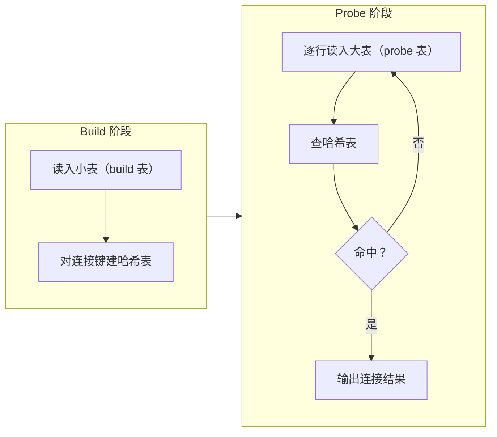

# Hash Join

## 连接算法谱系中的空缺

**含义**：Hash Join（哈希连接）是等值连接中最常用的算法。RMDB 实现了 Nested Loop Join 和 Sort-Merge Join，但没有实现 Hash Join——这是连接算法谱系中最重要的缺失。

**作用**：当两张表在连接键上没有索引、数据未排序时，Hash Join 通常比 Nested Loop Join 快一个数量级。

**场景**：`SELECT * FROM t1 JOIN t2 ON t1.a = t2.b`——t1 和 t2 都很大，且没有合适的索引。

## 三种连接算法对比

| | Nested Loop Join | Sort-Merge Join | Hash Join |
|---|---|---|---|
| 适用条件 | 无要求 | 输入已按连接键排序 | 等值连接 |
| 时间复杂度 | O(M × N) | O(M + N) | O(M + N) |
| 空间复杂度 | O(1) | O(1) 或 O(M+N)（外排） | O(min(M, N)) |
| 内存敏感 | 否 | 否（外排自动处理） | 是（需要 hash table 能装下小表） |
| RMDB 实现 | ✅ | ✅（含外部归并排序） | ❌ |

## 算法原理

Hash Join 分两个阶段：

**Build 阶段**：选择较小的表作为 build 表，对其连接键建哈希表。

```
对 build 表的每一行：
  key = hash(row.join_column) % table_size
  把 row 插入 hash_table[key] 对应的桶中
```

**Probe 阶段**：扫描另一张表（probe 表），对每行的连接键做哈希查找。

```
对 probe 表的每一行：
  key = hash(row.join_column) % table_size
  在 hash_table[key] 中查找匹配的行
  对每个匹配 → 输出连接结果
```



**示例**：`student JOIN score ON student.id = score.sid`。

Build 阶段把 `student`（1000 行）按 `id` 建哈希表。Probe 阶段逐行扫描 `score`（10000 行），对每行的 `sid` 查哈希表——平均 O(1) 命中。总复杂度约 O(10000)，而 Nested Loop Join 是 O(1000 × 10000)。

## 内存不够时：Grace Hash Join

如果 build 表太大，哈希表放不进内存怎么办？标准做法是 Grace Hash Join：

1. **Partition 阶段**：把两张表都按同样的哈希函数分桶，每个桶写入一个临时文件
2. **Join 阶段**：逐对处理对应桶——每对桶中，小桶建哈希表，大桶做 probe

```
假设有 B 个桶，每对桶的大小约为原表的 1/B
只要 B 足够大，每对桶都能装入内存
```

RMDB 的外部归并排序（SortExecutor 的 `SORT_EXTERNAL` 模式）用了类似的"分块处理"思想，Hash Join 的 partition 与之异曲同工。

## 为什么 RMDB 没实现 Hash Join

三个原因：

1. **框架定位**：比赛框架的重点是实现一个功能完整的 DBMS，Hash Join 是"锦上添花"的优化，而非功能必需品（Nested Loop Join 已经能覆盖所有连接场景）。

2. **外部排序的复用**：当数据已排序（通过索引或 ORDER BY），Sort-Merge Join 的 O(M+N) 已经足够高效。RMDB 有外部归并排序支持，Sort-Merge Join 在各种场景下都能工作。

3. **内存管理的复杂度**：Grace Hash Join 需要动态分桶、临时文件管理、溢出处理，实现复杂度接近一个微型的排序子系统。考虑到学习周期，这个投入产出比不高。

## 对框架实现者的意义

如果你在框架上实现 Hash Join：

- **Build 表选择**：选较小的表（可以估算行数 × 行长）
- **哈希函数**：对整数键取模即可，字符串键用 `std::hash`
- **哈希表实现**：用 `std::unordered_multimap`（允许键重复，处理连接键非唯一）
- **如果内存不够**：最简单的做法是报错或回退到 Nested Loop Join。实现完整的 Grace Hash Join 是进阶任务

Hash Join 不在比赛框架的必做范围内，但理解它的存在和适用场景，能帮你做出正确的连接算法选择——当数据未排序且没有索引时，它是最优解。

上一节：[05-execution-detail.md](./05-execution-detail.md) | 下一节：[06-query-processing-interaction.md](./06-query-processing-interaction.md)
